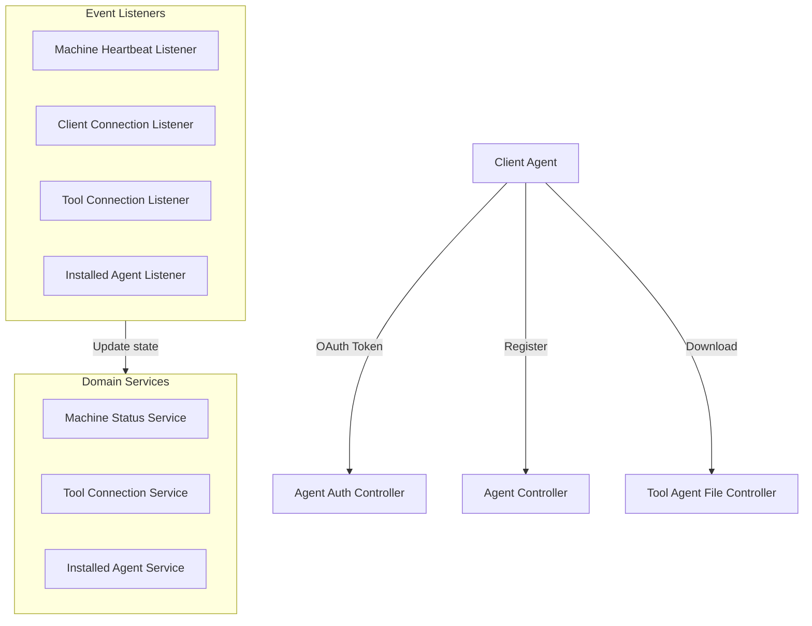

# Client Agent Service Core

## Overview

The **Client Agent Service Core** module is responsible for managing the lifecycle, authentication, registration, and runtime connectivity of client-side agents within the OpenFrame platform. These agents run on managed machines and act as the bridge between endpoints, integrated tools, and the OpenFrame backend services.

At a high level, Client Agent Service Core provides:
- OAuth-style token issuance for agents
- Secure agent registration and identification
- Distribution of tool agent binaries
- Event-driven processing of machine heartbeats, tool connections, and installed agents
- Extension points for custom registration logic and tool-specific identifier transformation

This module is a critical part of the control plane that keeps device state, connectivity, and tool integrations in sync across the platform.

---

## Responsibilities

The Client Agent Service Core focuses on the following responsibilities:

- **Agent authentication**: Issuing and refreshing access tokens used by agents
- **Agent registration**: Creating and updating machine records during first contact
- **Agent artifact delivery**: Serving tool agent binaries during bootstrap
- **Connectivity tracking**: Maintaining online/offline state via heartbeats and connection events
- **Tool integration mapping**: Normalizing external tool agent identifiers into OpenFrame-compatible formats
- **Event consumption**: Processing asynchronous events delivered via NATS and JetStream

---

## High-Level Architecture

The module exposes REST endpoints for synchronous interactions and uses event listeners to react to asynchronous signals coming from the messaging layer.

---

## REST Controllers

### Agent Auth Controller

The Agent Auth Controller provides an OAuth-compatible token endpoint for client agents.

**Key responsibilities:**
- Validate grant type and credentials
- Issue access and refresh tokens
- Return standardized OAuth-style error responses

**Primary endpoint:**
- `POST /oauth/token`

This controller delegates all token issuance logic to the agent authentication service, keeping the controller layer thin and focused on protocol handling.

---

### Agent Controller

The Agent Controller handles initial agent registration.

**Key responsibilities:**
- Accept agent registration payloads
- Validate registration requests
- Forward registration data to the registration service

**Primary endpoint:**
- `POST /api/agents/register`

Registration requires an initial shared key and a structured registration request describing the machine, operating system, and hardware metadata.

---

### Tool Agent File Controller

The Tool Agent File Controller serves tool agent binaries during bootstrap.

**Key responsibilities:**
- Resolve tool agent artifact based on asset identifier and operating system
- Return binary content directly to the agent

> **Note:** This controller currently serves hardcoded resources and is intended to be replaced by a proper artifact repository integration.

---

## Data Transfer Objects

### Agent Registration Request

The Agent Registration Request represents the full machine profile sent during registration.

It includes:
- Core identification (hostname, organization)
- Network information (IP, MAC address)
- Hardware details (manufacturer, model, serial number)
- Operating system metadata (type, version, build)

This rich dataset allows OpenFrame to accurately identify, classify, and manage the registered machine.

---

### Create Client Request

The Create Client Request defines OAuth client capabilities.

It specifies:
- Allowed grant types
- Permitted scopes

This DTO is typically used during client credential provisioning flows.

---

## Event Listeners and Messaging

Client Agent Service Core heavily relies on event-driven processing using NATS and JetStream.

### Machine Heartbeat Listener

- Subscribes to machine heartbeat subjects
- Updates machine liveness timestamps
- Acts as the primary signal for determining online status

Heartbeats are processed with service-side timestamps to ensure consistency.

---

### Client Connection Listener

- Consumes client connection and disconnection events
- Updates machine state to online or offline
- Provides a fallback mechanism when heartbeat signals are unavailable

---

### Tool Connection Listener

- Processes tool connection events delivered via JetStream
- Tracks active tool-to-machine relationships
- Implements retry and redelivery handling using explicit acknowledgements

---

### Installed Agent Listener

- Subscribes to installed agent events
- Records which tool agents are installed on each machine
- Handles redelivery logic and last-attempt semantics

This listener ensures accurate inventory of agent capabilities per device.

---

## Agent Registration Processing

### Default Agent Registration Processor

The Default Agent Registration Processor provides a no-op implementation of post-registration hooks.

**Purpose:**
- Acts as a safe default when no custom processor is defined
- Allows downstream services to override registration behavior without modifying core logic

This design supports extensibility while keeping the default behavior minimal and predictable.

---

## Tool Agent Identifier Transformation

Different integrated tools use different identifiers for agents. Client Agent Service Core normalizes these identifiers using dedicated transformers.

### Fleet MDM Agent ID Transformer

- Resolves Fleet MDM agent UUIDs to internal host identifiers
- Queries Fleet MDM APIs using configured tool credentials
- Applies retry semantics and last-attempt fallbacks

This transformer ensures consistent mapping between Fleet MDM hosts and OpenFrame machines.

---

### MeshCentral Agent ID Transformer

- Prefixes MeshCentral agent identifiers with a standard namespace
- Provides a lightweight, deterministic transformation

This avoids ambiguity and prevents identifier collisions across tools.

---

## Error Handling and Reliability

Across controllers and listeners, the module emphasizes:
- Explicit error responses for authentication failures
- Defensive parsing and validation of incoming messages
- Controlled retries using JetStream delivery counts
- Graceful shutdown of subscriptions and dispatchers

These patterns ensure the service behaves predictably under load and during partial failures.

---

## How This Module Fits Into the Platform

Client Agent Service Core sits at the intersection of:
- Endpoint devices and agents
- Messaging infrastructure
- Tool integration services

It complements API, Gateway, Stream, and Management services by focusing exclusively on agent-facing concerns and real-time device state. Together, these modules form the backbone of OpenFrame’s managed endpoint experience.

---

## Summary

The **Client Agent Service Core** module provides the foundational services required to securely onboard, authenticate, monitor, and integrate client agents. Its combination of REST APIs, event-driven listeners, and extensibility points makes it a central building block for reliable device management across the OpenFrame ecosystem.
