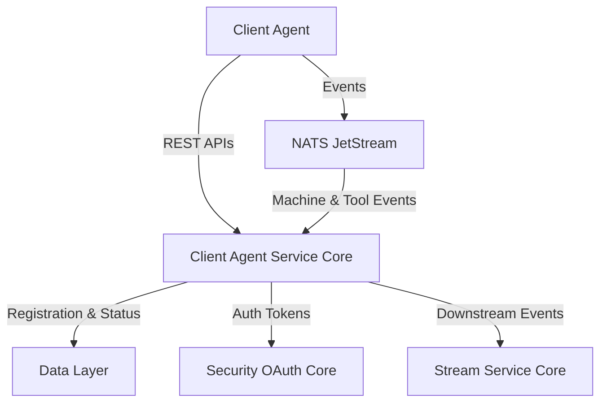
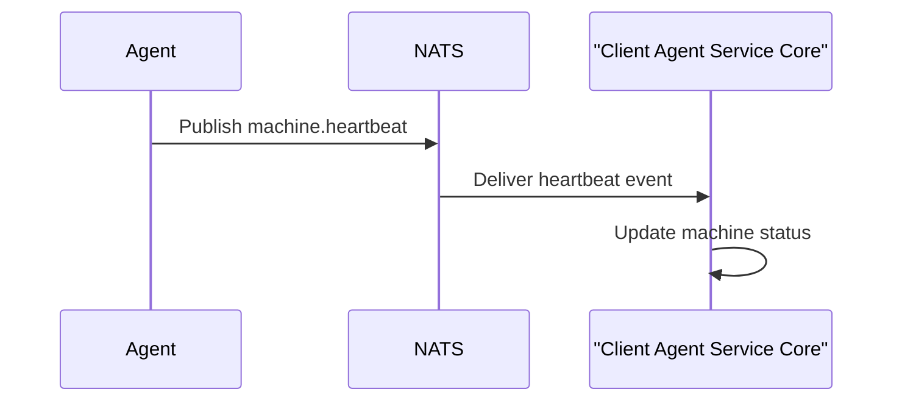

# Client Agent Service Core

## Overview

The **Client Agent Service Core** module is responsible for onboarding, authenticating, and continuously tracking client-side agents (machines and integrated tools) within the OpenFrame platform. It acts as the primary backend service that client agents communicate with during registration, authentication, heartbeat reporting, and tool connectivity events.

This module is a Spring Boot–based service that exposes REST endpoints for agent lifecycle operations and consumes asynchronous events from NATS JetStream to keep machine and tool state synchronized across the platform.

At a high level, Client Agent Service Core:

- Registers new agents and associates them with organizations
- Issues OAuth-compatible tokens for agent authentication
- Tracks machine online/offline status and heartbeats
- Processes installed agent and tool connection events
- Normalizes and transforms external tool agent identifiers

---

## Position in the System Architecture

Client Agent Service Core sits between **client-side agents** (running on customer machines) and the broader OpenFrame backend ecosystem.

- It **exposes APIs** consumed directly by agents
- It **publishes and consumes events** via NATS JetStream
- It **persists and updates state** through shared data-layer services
- It **coordinates with other backend services** such as API Service Core, Stream Service Core, and Data Layer modules

---

## Core Responsibilities

### 1. Agent Authentication

The module exposes OAuth-style endpoints that allow agents to obtain and refresh access tokens. Authentication logic is delegated to a dedicated service layer, while the controller is responsible for request validation and error handling.

**Key component:**
- `AgentAuthController`

**Responsibilities:**
- Accepts token requests using standard OAuth parameters
- Supports multiple grant types (client credentials, refresh tokens)
- Returns structured token responses or standardized error payloads

---

### 2. Agent Registration

Agent registration is the first interaction a new client machine has with the platform. During this process, the agent provides hardware, OS, and network metadata, which is persisted and linked to an organization.

**Key components:**
- `AgentController`
- `AgentRegistrationRequest`
- `DefaultAgentRegistrationProcessor`

**Responsibilities:**
- Validates the initial registration key
- Registers the machine and assigns a unique machine identifier
- Allows post-registration hooks via pluggable processors

The default registration processor is intentionally a no-op, enabling integrators to inject custom behavior without modifying core logic.

---

### 3. Tool Agent File Delivery

The service currently exposes a temporary endpoint for downloading tool agent binaries. This is explicitly marked as transitional and intended to be replaced by artifact-based distribution.

**Key component:**
- `ToolAgentFileController`

**Responsibilities:**
- Serves OS-specific binaries based on request parameters
- Provides minimal validation and error handling
- Acts as a short-term compatibility layer

---

### 4. Machine Connectivity and Heartbeats

Client Agent Service Core continuously tracks machine availability using both explicit connection events and periodic heartbeats.

**Key components:**
- `ClientConnectionListener`
- `MachineHeartbeatListener`

**Responsibilities:**
- Consume connection and disconnection events from NATS
- Update machine online/offline state with timestamps
- Fallback to heartbeat-based liveness when needed

---

### 5. Installed Agent Processing

When agents install or update integrated tools, events are published to NATS JetStream and processed asynchronously.

**Key component:**
- `InstalledAgentListener`

**Responsibilities:**
- Subscribes to the `INSTALLED_AGENTS` stream
- Handles retries and delivery guarantees via JetStream
- Records installed agent type and version per machine
- Applies last-attempt logic for error recovery

This design ensures reliability even under transient failures.

---

### 6. Tool Connection Tracking

Tool-level connectivity (for example, RMM or MDM tools) is tracked independently of machine connectivity.

**Key component:**
- `ToolConnectionListener`

**Responsibilities:**
- Processes tool connection events from NATS
- Associates external tool identifiers with machines
- Ensures idempotent processing with explicit acknowledgements

---

### 7. Agent Identifier Transformation

External tools often use identifiers that are not directly compatible with OpenFrame’s internal model. The module provides a transformation layer to normalize these identifiers.

**Key components:**
- `FleetMdmAgentIdTransformer`
- `MeshCentralAgentIdTransformer`

**Responsibilities:**
- Convert external agent IDs into canonical forms
- Integrate with third-party APIs (for example, Fleet MDM)
- Apply retry-aware logic when external data is temporarily unavailable

---

## Configuration and Security

### Password Encoding

The module defines a dedicated password encoder configuration to ensure consistent hashing across authentication workflows.

**Key component:**
- `PasswordEncoderConfig`

**Details:**
- Uses BCrypt for secure password hashing
- Exposed as a Spring-managed bean for reuse

---

## Error Handling and Reliability

Client Agent Service Core is designed with resilience in mind:

- Explicit acknowledgements for JetStream consumers
- Bounded retry logic with maximum delivery attempts
- Graceful shutdown of NATS dispatchers
- Clear separation between synchronous APIs and asynchronous event processing

This ensures stable operation even under partial outages or downstream failures.

---

## Summary

The **Client Agent Service Core** module is the backbone of agent lifecycle management in OpenFrame. By combining synchronous REST APIs with asynchronous, event-driven processing, it provides a robust and extensible foundation for managing thousands of distributed client agents and their associated tools.

Its pluggable architecture, strong separation of concerns, and deep integration with the OpenFrame messaging and data layers make it a critical component of the overall platform.