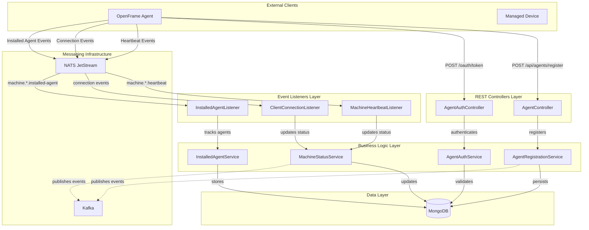
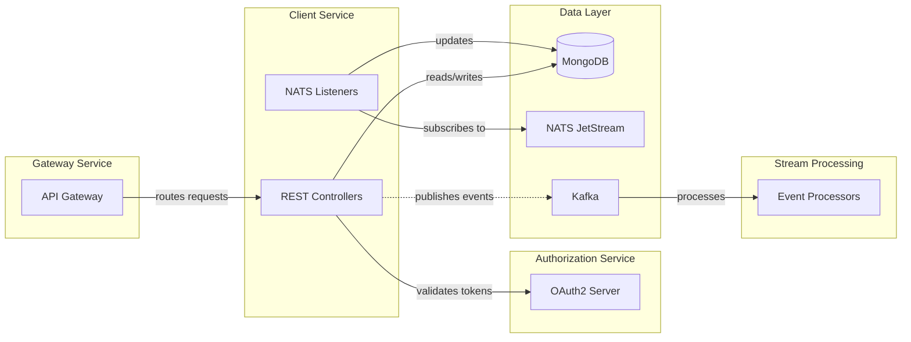
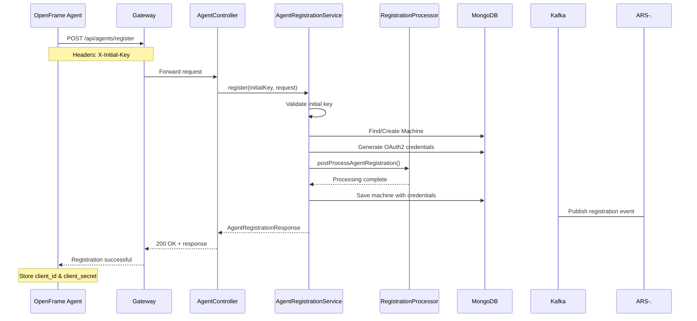
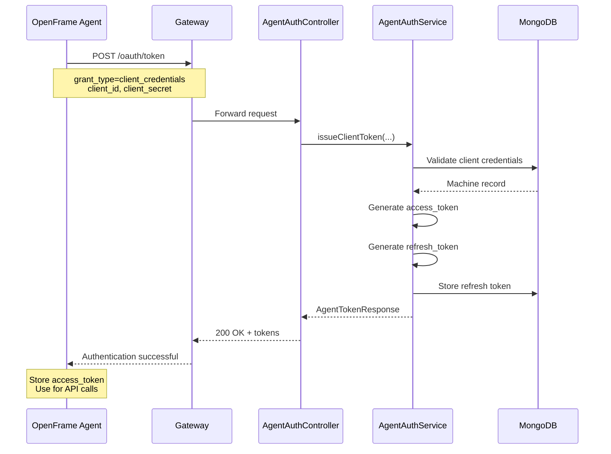
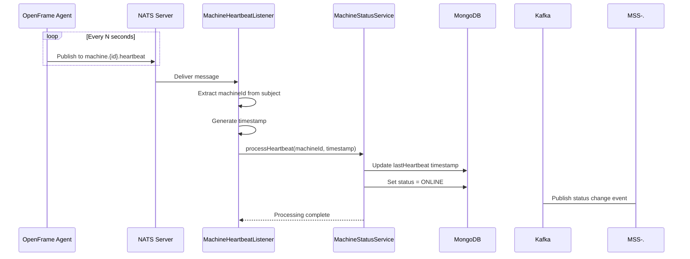
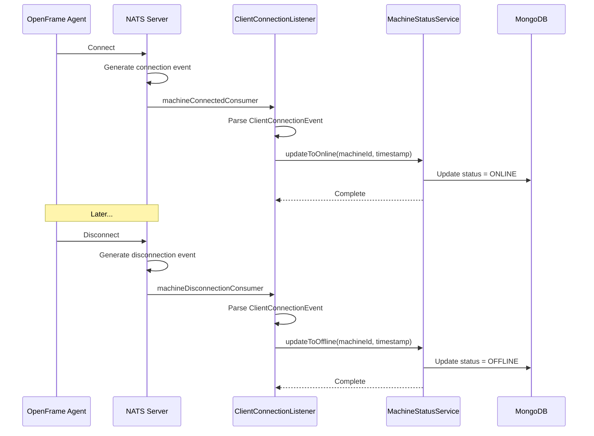
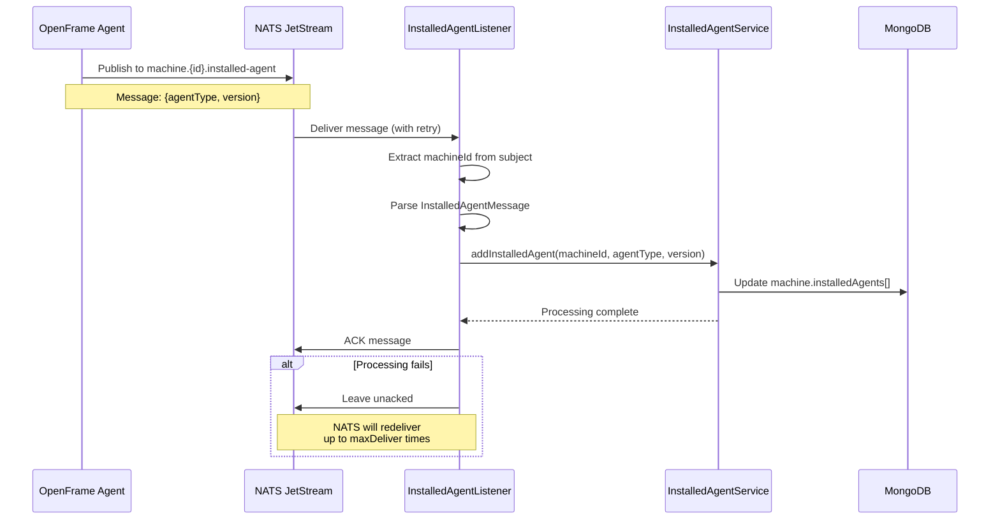

# Client Service

## Overview

The **Client Service** is a critical component of the OpenFrame platform that manages agent-based client connections, device registration, authentication, and real-time status monitoring. It serves as the primary interface between OpenFrame agents installed on managed devices and the OpenFrame backend infrastructure.

This service handles:
- **Agent Registration**: Onboarding new agents and devices into the OpenFrame ecosystem
- **Agent Authentication**: OAuth2-based authentication for agent clients
- **Real-time Monitoring**: Processing heartbeats and connection events via NATS messaging
- **Installed Agent Tracking**: Managing inventory of agents installed on each machine
- **Machine Status Management**: Tracking online/offline status of managed devices

## Architecture Overview

The Client Service follows a layered architecture with clear separation of concerns:



## System Integration

The Client Service integrates with multiple OpenFrame components:



## Core Functionality

### 1. Agent Registration & Onboarding

The service provides a secure registration flow for new agents:

1. Agent sends registration request with initial key
2. Service validates the initial key and organization context
3. Creates or updates machine record in MongoDB
4. Generates OAuth2 credentials for the agent
5. Returns registration response with access tokens

**Key Components:**
- `AgentController` - REST endpoint for registration
- `AgentRegistrationService` - Business logic for registration
- `DefaultAgentRegistrationProcessor` - Extensible post-processing hook

See [Agent Registration & Authentication](./client_service_registration_auth.md) for detailed documentation.

### 2. Agent Authentication

OAuth2-based authentication system for agent clients:

- **Grant Types**: `client_credentials`, `refresh_token`
- **Token Management**: Access tokens and refresh tokens
- **Client Validation**: Client ID and secret verification
- **Token Refresh**: Seamless token renewal without re-registration

**Key Components:**
- `AgentAuthController` - OAuth2 token endpoint
- `AgentAuthService` - Token issuance and validation

See [Agent Registration & Authentication](./client_service_registration_auth.md) for detailed documentation.

### 3. Real-time Event Processing

The service processes real-time events from agents via NATS messaging:

#### Connection Events
- **Connected**: Agent establishes connection to NATS
- **Disconnected**: Agent loses connection to NATS
- **Status Updates**: Machine status updated to online/offline

#### Heartbeat Events
- **Periodic Heartbeats**: Agents send heartbeats every N seconds
- **Liveness Detection**: Service detects unresponsive agents
- **Status Synchronization**: Keeps machine status current

#### Installed Agent Events
- **Agent Installation**: New agent installed on machine
- **Version Tracking**: Tracks agent versions
- **Inventory Management**: Maintains agent inventory per machine

**Key Components:**
- `ClientConnectionListener` - Processes connection/disconnection events
- `MachineHeartbeatListener` - Processes heartbeat events
- `InstalledAgentListener` - Processes installed agent events
- `MachineStatusService` - Manages machine online/offline status
- `InstalledAgentService` - Manages installed agent inventory

See [Event Listeners & Real-time Processing](./client_service_event_listeners.md) for detailed documentation.

### 4. Machine Status Management

Tracks and manages the operational status of all managed devices:

- **Online/Offline Tracking**: Real-time status based on heartbeats and connections
- **Timestamp Management**: Last seen timestamps for each machine
- **Status Transitions**: Handles state changes with proper event ordering
- **Fallback Mechanisms**: Heartbeat-based status when NATS events are unavailable

## Data Flow

### Agent Registration Flow



### Authentication Flow



### Heartbeat Processing Flow



### Connection Event Flow



### Installed Agent Processing Flow



## Technology Stack

### Core Technologies
- **Spring Boot 3.x**: Application framework
- **Spring Web**: REST API controllers
- **Spring Cloud Stream**: Event-driven messaging
- **Jackson**: JSON serialization/deserialization

### Messaging & Events
- **NATS JetStream**: Real-time event streaming with persistence
- **Apache Kafka**: Event publishing for downstream processing
- **Spring Cloud Function**: Functional reactive programming model

### Data Storage
- **MongoDB**: Primary data store for machines, agents, and status
- See [Data Layer - MongoDB](./data_layer_mongo.md) for schema details

### Security
- **OAuth2**: Agent authentication
- **JWT**: Token-based authorization
- See [Security Core](./security_core.md) for security infrastructure

## Configuration

### Application Properties

```yaml
spring:
  application:
    name: openframe-client

  # MongoDB Configuration
  data:
    mongodb:
      uri: ${MONGODB_URI:mongodb://localhost:27017/openframe}

  # NATS Configuration
  cloud:
    stream:
      nats:
        binder:
          servers: ${NATS_SERVERS:nats://localhost:4222}
          jetstream:
            enabled: true

# NATS Connection
nats:
  server: ${NATS_SERVERS:nats://localhost:4222}
  connection-timeout: 5000
  max-reconnect: 10

# Kafka Configuration (for event publishing)
kafka:
  bootstrap-servers: ${KAFKA_BOOTSTRAP_SERVERS:localhost:9092}
  producer:
    key-serializer: org.apache.kafka.common.serialization.StringSerializer
    value-serializer: org.springframework.kafka.support.serializer.JsonSerializer

# Security
security:
  jwt:
    secret: ${JWT_SECRET}
    expiration: 3600000  # 1 hour
```

### Environment Variables

| Variable | Description | Default |
|----------|-------------|---------|
| `MONGODB_URI` | MongoDB connection string | `mongodb://localhost:27017/openframe` |
| `NATS_SERVERS` | NATS server URLs | `nats://localhost:4222` |
| `KAFKA_BOOTSTRAP_SERVERS` | Kafka broker addresses | `localhost:9092` |
| `JWT_SECRET` | Secret key for JWT signing | (required) |

## API Endpoints

### Agent Registration

**Endpoint**: `POST /api/agents/register`

**Headers**:
- `X-Initial-Key`: Initial registration key (required)

**Request Body**:
```json
{
  "hostname": "workstation-001",
  "machineId": "uuid-or-hardware-id",
  "organizationId": "org-123",
  "platform": "linux",
  "architecture": "x86_64",
  "osVersion": "Ubuntu 22.04"
}
```

**Response**:
```json
{
  "machineId": "uuid-or-hardware-id",
  "clientId": "generated-client-id",
  "clientSecret": "generated-client-secret",
  "accessToken": "jwt-access-token",
  "refreshToken": "jwt-refresh-token",
  "expiresIn": 3600
}
```

### Agent Authentication

**Endpoint**: `POST /oauth/token`

**Request Parameters** (form-urlencoded):
- `grant_type`: `client_credentials` or `refresh_token`
- `client_id`: Client identifier (for client_credentials)
- `client_secret`: Client secret (for client_credentials)
- `refresh_token`: Refresh token (for refresh_token grant)

**Response**:
```json
{
  "access_token": "jwt-access-token",
  "refresh_token": "jwt-refresh-token",
  "token_type": "Bearer",
  "expires_in": 3600
}
```

## NATS Event Subjects

### Subscribed Subjects

| Subject Pattern | Description | Listener |
|----------------|-------------|----------|
| `machine.*.heartbeat` | Machine heartbeat events | `MachineHeartbeatListener` |
| `machine.*.installed-agent` | Installed agent notifications | `InstalledAgentListener` |
| Connection events | Machine connect/disconnect | `ClientConnectionListener` |

### JetStream Configuration

**Stream**: `INSTALLED_AGENTS`
- **Subject**: `machine.*.installed-agent`
- **Consumer**: `installed-agent-processor-v1`
- **Delivery Group**: `installed-agent`
- **Ack Policy**: Explicit
- **Max Deliver**: 50 attempts
- **Ack Wait**: 30 seconds

## Error Handling

### Registration Errors

| Error | HTTP Status | Description |
|-------|-------------|-------------|
| Invalid initial key | 401 | Initial key validation failed |
| Missing required fields | 400 | Request validation failed |
| Duplicate machine | 409 | Machine already registered |
| Internal error | 500 | Unexpected server error |

### Authentication Errors

| Error | HTTP Status | Description |
|-------|-------------|-------------|
| Invalid credentials | 401 | Client ID/secret mismatch |
| Invalid grant type | 400 | Unsupported grant_type |
| Expired refresh token | 401 | Refresh token no longer valid |
| Server error | 400 | Unexpected processing error |

### Event Processing Errors

Event processing errors are handled with retry mechanisms:

- **Heartbeat Events**: Logged but not retried (core/fanout pattern)
- **Connection Events**: Logged but not retried (Spring Cloud Function)
- **Installed Agent Events**: Retried up to 50 times with 30s ack wait

## Extensibility

### Custom Registration Processing

The service provides an extensibility point for custom registration logic:

```java
@Component
public class CustomAgentRegistrationProcessor implements AgentRegistrationProcessor {
    
    @Override
    public void postProcessAgentRegistration(Machine machine, AgentRegistrationRequest request) {
        // Custom logic after registration
        // - Send notifications
        // - Trigger provisioning workflows
        // - Update external systems
        // - Apply organization-specific policies
    }
}
```

The `DefaultAgentRegistrationProcessor` is automatically disabled when a custom implementation is provided.

## Monitoring & Observability

### Health Checks

The service exposes Spring Boot Actuator health endpoints:

- `/actuator/health` - Overall service health
- `/actuator/health/mongo` - MongoDB connectivity
- `/actuator/health/nats` - NATS connectivity

### Metrics

Key metrics to monitor:

- **Registration Rate**: Agents registered per minute
- **Authentication Rate**: Token requests per minute
- **Heartbeat Rate**: Heartbeats processed per second
- **Connection Events**: Connect/disconnect events per minute
- **Event Processing Lag**: NATS JetStream consumer lag
- **Error Rates**: Failed registrations, auth failures, event processing errors

### Logging

The service uses SLF4J with structured logging:

```text
INFO  - Processing machine heartbeat: machineId=abc-123 timestamp=2024-01-15T10:30:00Z
INFO  - Installed agent processed successfully and acked
ERROR - Failed to process tool connection event
DEBUG - Default post-processing agent registration for machine: abc-123
```

## Deployment Considerations

### Scaling

- **Horizontal Scaling**: Multiple instances can run concurrently
- **NATS Consumer Groups**: Installed agent processing is load-balanced via delivery groups
- **Heartbeat Processing**: Core/fanout pattern allows all instances to process
- **Stateless Design**: No local state, all data in MongoDB

### High Availability

- **NATS JetStream**: Provides message persistence and redelivery
- **MongoDB Replica Set**: Ensures data durability
- **Graceful Shutdown**: Drains NATS dispatchers on shutdown
- **Health Checks**: Kubernetes liveness/readiness probes

### Resource Requirements

**Minimum**:
- CPU: 1 core
- Memory: 512 MB
- Disk: 1 GB (for logs)

**Recommended**:
- CPU: 2 cores
- Memory: 1 GB
- Disk: 5 GB

## Related Documentation

- [Agent Registration & Authentication](./client_service_registration_auth.md) - Detailed registration and OAuth2 flows
- [Event Listeners & Real-time Processing](./client_service_event_listeners.md) - NATS event processing architecture
- [Data Layer - MongoDB](./data_layer_mongo.md) - Machine and device data models
- [Gateway Service](./gateway_service.md) - API gateway and routing
- [Authorization Service](./authorization_service.md) - OAuth2 authorization server
- [Stream Processing](./stream_processing.md) - Kafka event processing

## Support & Community

For questions, issues, or contributions:

- **Slack Community**: [OpenMSP Slack](https://join.slack.com/t/openmsp/shared_invite/zt-36bl7mx0h-3~U2nFH6nqHqoTPXMaHEHA)
- **Documentation**: [OpenFrame Documentation](https://www.flamingo.run/openframe)
- **Platform**: [Flamingo MSP Platform](https://flamingo.run)

---

**Version**: 1.0  
**Last Updated**: 2024  
**Maintained By**: OpenFrame Team
