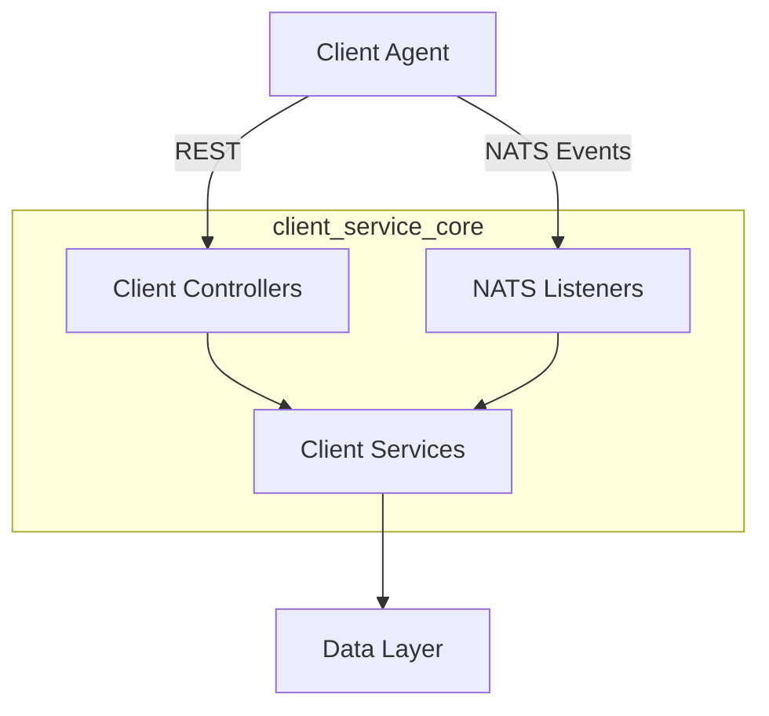

# Client Service Core

The **client_service_core** module provides the backend runtime for managing OpenFrame client agents. It exposes REST endpoints for agent authentication and registration, listens to machine and tool events via NATS/JetStream, and coordinates agent lifecycle state with the rest of the OpenFrame platform.

This module is used by the **service_client_agent** runtime and integrates with gateway, authorization, management, and data-layer services through shared contracts and event streams.

---

## Responsibilities

- Issue OAuth-style tokens for client agents
- Register and bootstrap new agents
- Track machine online/offline state via heartbeats and connection events
- Process tool installation and connection events
- Transform external tool agent identifiers into OpenFrame-compatible identifiers

---

## High-Level Architecture

---

## Main Components Overview

### Controllers

REST-facing entry points used by client agents.

- **AgentAuthController** – Issues access and refresh tokens for agents
- **AgentController** – Handles agent registration
- **ToolAgentFileController** – Temporary endpoint for serving agent binaries

See detailed documentation: [client_service_core_controllers.md](client_service_core_controllers.md)

---

### Event Listeners

NATS and JetStream consumers that react to machine and tool lifecycle events.

- **ClientConnectionListener** – Tracks client connect and disconnect events
- **MachineHeartbeatListener** – Processes heartbeat messages
- **InstalledAgentListener** – Handles installed-agent events
- **ToolConnectionListener** – Handles tool connection events

See detailed documentation: [client_service_core_listeners.md](client_service_core_listeners.md)

---

### Agent Registration Pipeline

Extensible pipeline for processing agent registrations and normalizing tool agent identifiers.

- **DefaultAgentRegistrationProcessor** – Optional post-registration hook
- **FleetMdmAgentIdTransformer** – Resolves Fleet MDM UUIDs to host IDs
- **MeshCentralAgentIdTransformer** – Normalizes MeshCentral agent IDs

See detailed documentation: [client_service_core_agent_registration.md](client_service_core_agent_registration.md)

---

## Integration in the Platform

- **Authorization**: Token issuance aligns with the authorization server and security modules
- **Gateway**: Requests typically pass through the OpenFrame gateway
- **Management & Stream Services**: Events processed here feed downstream analytics and management workflows

This module focuses on *client-side lifecycle orchestration*, while persistence and cross-service concerns are handled by shared data and service-core modules.
