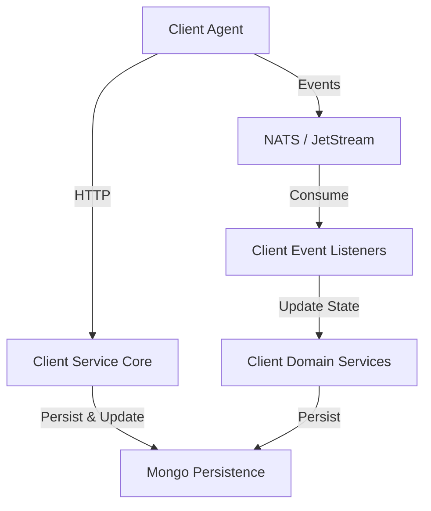
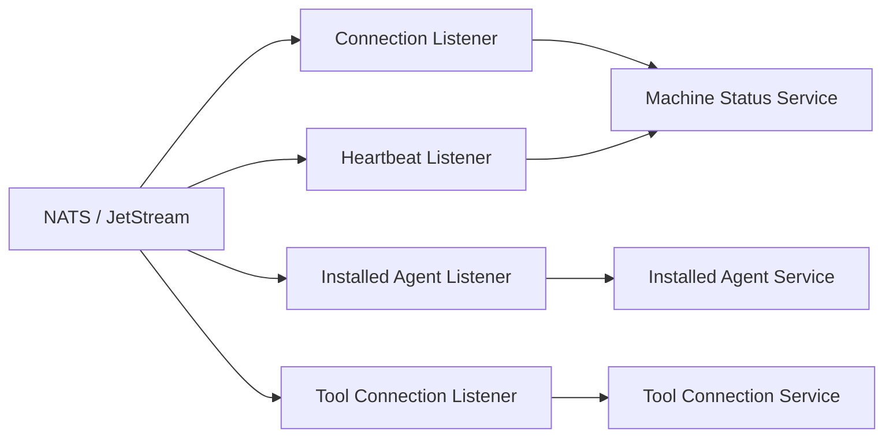
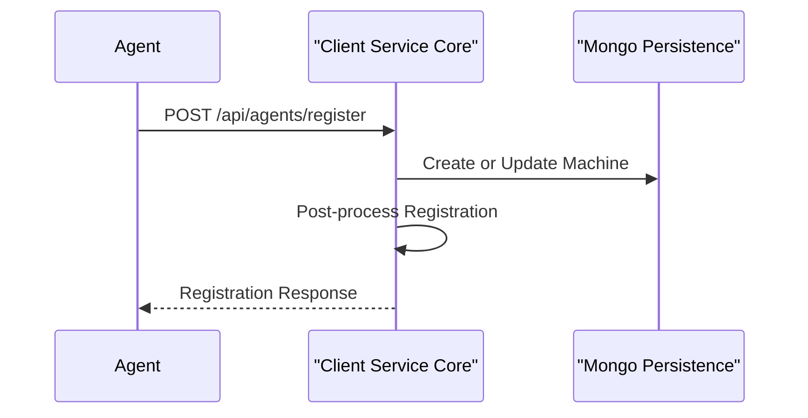

# Client Service Core

## Overview

The **Client Service Core** module is responsible for managing client-side agents and their lifecycle within the OpenFrame platform. It acts as the primary backend service that:

- Authenticates and issues tokens for client agents
- Registers machines and agents into the platform
- Distributes tool agent binaries
- Processes real-time connectivity, heartbeat, and installation events
- Integrates external tool identities into OpenFrame’s internal model

This module is a critical bridge between **on-device agents**, **message streaming infrastructure**, and **persistent device state** used by the rest of the platform.

---

## Responsibilities at a Glance

- **Agent Authentication**: OAuth-style token issuance for agents
- **Agent Registration**: Secure onboarding of machines and tools
- **Binary Distribution**: Temporary delivery of tool agent files
- **Event Processing**: NATS-based listeners for connectivity, heartbeats, and installations
- **Tool Identity Normalization**: Transforming external tool identifiers into consistent internal identifiers

---

## High-Level Architecture

The Client Service Core exposes HTTP endpoints for agents while simultaneously consuming asynchronous events from NATS to maintain accurate machine and tool state.

---

## Component Groups

### Configuration

- **Password Encoder Configuration**
  - Provides a BCrypt-based `PasswordEncoder` bean
  - Used for securely handling secrets related to client authentication

---

### Controllers

#### Agent Authentication Controller

- Issues access tokens for client agents
- Supports multiple grant types including refresh token flows
- Delegates token logic to a dedicated authentication service

Key characteristics:
- OAuth-compatible endpoint structure
- Explicit handling of authentication and server errors

#### Agent Controller

- Handles agent registration requests
- Requires an initial registration key via request headers
- Accepts detailed machine and OS metadata

This endpoint is the **entry point for new machines** joining the platform.

#### Tool Agent File Controller

- Temporary mechanism to serve tool agent binaries
- Selects binaries based on operating system and asset identifier
- Intended to be replaced by artifact-based distribution

> Note: This controller currently returns hardcoded resources for testing purposes.

---

### Data Transfer Objects

- **Agent Registration Request**
  - Contains hostname, organization, hardware, OS, and network metadata
  - Used during initial machine onboarding

- **Create Client Request**
  - Defines OAuth grant types and scopes for client creation

These DTOs form the contract between client agents and the platform.

---

### Event Listeners (NATS Integration)

The Client Service Core consumes multiple event streams to keep machine and tool state synchronized.

#### Client Connection Listener

- Consumes client connection and disconnection events
- Updates machine online or offline state
- Acts as a fallback mechanism when heartbeat signals are unavailable

#### Machine Heartbeat Listener

- Subscribes to periodic heartbeat messages
- Updates machine liveness timestamps
- Uses server-side timestamps to ensure consistency

#### Installed Agent Listener

- JetStream-based consumer with explicit acknowledgment
- Processes installation events for agents on machines
- Retries processing with bounded redelivery attempts

#### Tool Connection Listener

- Tracks tool-to-machine associations
- Normalizes tool connection events into persistent records
- Uses delivery groups to support horizontal scaling

---

### Agent Registration Processing

#### Default Agent Registration Processor

- Provides a no-op default implementation
- Designed for extension and customization
- Invoked after a machine is registered

This design allows platform-specific behavior without modifying core logic.

---

### Tool Agent ID Transformers

Tool agents often use identifiers that are incompatible with OpenFrame’s internal model. Transformers normalize these identifiers.

#### Fleet MDM Agent ID Transformer

- Integrates with Fleet MDM APIs
- Resolves agent UUIDs to Fleet host IDs
- Validates host availability and OS metadata
- Supports retry semantics with a last-attempt fallback

#### MeshCentral Agent ID Transformer

- Prefixes MeshCentral agent IDs into a canonical format
- Stateless and deterministic transformation
n---

## Interaction Flow: Agent Registration

---

## How This Module Fits in the Platform

- Works closely with **Gateway Service Core** for request routing and security enforcement
- Relies on **Data Persistence Mongo** for storing machines, agents, and tool state
- Consumes events produced by **Streaming and Tool Integrations**
- Supplies accurate machine state to API, Management, and External API services

The Client Service Core ensures that everything happening on endpoints is reliably reflected inside OpenFrame.

---

## Extension Points

- Custom `AgentRegistrationProcessor` implementations
- Additional `ToolAgentIdTransformer` implementations for new tools
- Alternative artifact delivery mechanisms for tool agents

---

## Summary

The **Client Service Core** is the backbone of agent lifecycle management in OpenFrame. By combining synchronous APIs with asynchronous event processing, it provides a resilient and extensible foundation for managing machines, agents, and external tools across diverse environments.