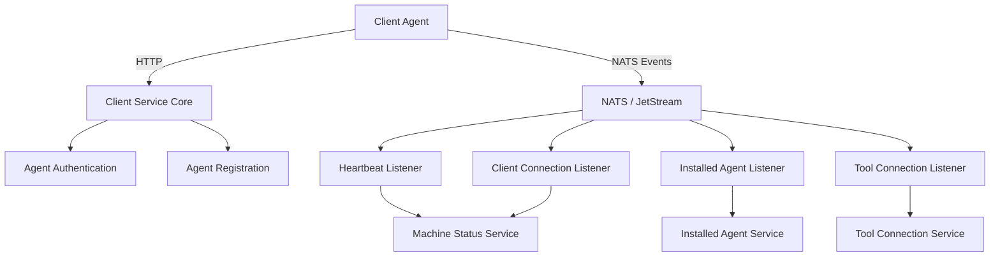

# Client Service Core

## Overview

The **Client Service Core** module is responsible for managing client-side lifecycle operations within the OpenFrame platform. It acts as the primary backend entry point for:

- Agent authentication and OAuth-style token issuance
- Agent registration and identity normalization
- Machine lifecycle tracking (online/offline/heartbeat)
- Tool and agent connectivity events
- Secure distribution of tool agent binaries (temporary implementation)

This module is a Spring Boot service designed to operate in an event-driven architecture, heavily integrated with **NATS JetStream**, shared data services, and the platform security stack.

Client Service Core sits between deployed agents (on customer machines) and the broader OpenFrame backend, ensuring that machine state, installed agents, and tool connections are consistently synchronized.

---

## Responsibilities at a Glance

- **Authentication**: Issue access tokens for agents using OAuth-compatible flows
- **Registration**: Register machines and agents with normalized identifiers
- **Event Consumption**: Consume NATS events for heartbeats, connections, and installations
- **State Management**: Update machine and tool connection state via domain services
- **Extensibility**: Provide pluggable hooks for agent registration processing

---

## High-Level Architecture

**Key points:**
- HTTP APIs are used for authentication and initial registration
- Continuous state updates are handled asynchronously via NATS
- Business logic is delegated to shared domain services

---

## Application Bootstrap

The module is started via a standard Spring Boot entry point:

- **ClientApplication** initializes component scanning across:
  - Client Service Core
  - Shared data layer
  - Security and Kafka producer utilities

Cassandra health checks are explicitly excluded to keep the service lightweight and focused.

---

## Configuration Components

### Password Encoder Configuration

**PasswordEncoderConfig** provides a centralized password encoder bean:

- Uses **BCrypt** for hashing
- Shared across authentication-related services
- Ensures consistent password handling across the platform

This configuration aligns Client Service Core with the broader OpenFrame security model.

---

## HTTP Controllers

### Agent Authentication Controller

**AgentAuthController** exposes OAuth-style token issuance endpoints:

- Endpoint: `/oauth/token`
- Supported grant types include client credentials and refresh tokens
- Delegates token creation to an authentication service

**Responsibilities:**
- Validate token requests
- Return structured error responses for invalid credentials
- Log authentication attempts for observability

---

### Agent Registration Controller

**AgentController** handles initial agent registration:

- Endpoint: `/api/agents/register`
- Requires an `X-Initial-Key` header for bootstrap authentication
- Accepts a validated registration payload describing the machine

**Registration data includes:**
- Machine identity (hostname, organization)
- Network attributes
- Hardware metadata
- Operating system details

The controller delegates all logic to the agent registration service layer.

---

### Tool Agent File Controller

**ToolAgentFileController** temporarily serves tool agent binaries:

- Endpoint: `/tool-agent/{assetId}`
- Returns platform-specific binaries based on OS
- Uses classpath resources for delivery

⚠️ **Note:**
This controller is explicitly marked as temporary and intended to be removed once artifact-based distribution is implemented.

---

## Data Transfer Objects

### Agent Registration Request

**AgentRegistrationRequest** represents the full machine profile during onboarding:

- Identification: hostname, organization ID
- Network: IP, MAC address, UUID
- Hardware: serial number, model, manufacturer
- OS: type, version, build, timezone

This DTO is central to machine creation and normalization workflows.

---

### Metrics Message

**MetricsMessage** captures lightweight telemetry:

- CPU usage
- Memory usage
- Timestamped per machine

These messages are typically produced by agents and consumed downstream for monitoring and analytics.

---

## Event-Driven Listeners (NATS)

Client Service Core relies heavily on asynchronous event processing using **NATS** and **JetStream**.

### Client Connection Listener

**ClientConnectionListener** reacts to client connection and disconnection events:

- Consumes serialized connection events
- Updates machine state to online or offline
- Uses service-side timestamps for consistency

This listener ensures accurate presence tracking even in unstable network conditions.

---

### Machine Heartbeat Listener

**MachineHeartbeatListener** processes periodic heartbeat signals:

- Subject pattern: `machine.*.heartbeat`
- Generates timestamps server-side
- Extends machine liveness beyond connection events

This provides resilience when other event streams are unavailable.

---

### Installed Agent Listener

**InstalledAgentListener** consumes JetStream events for agent installations:

- Durable consumer with explicit acknowledgements
- Retries processing up to a fixed delivery limit
- Marks final delivery attempts for compensating logic

Used to maintain an accurate inventory of installed agents per machine.

---

### Tool Connection Listener

**ToolConnectionListener** tracks integrations between machines and tools:

- Processes tool connection events
- Normalizes agent tool identifiers
- Ensures idempotent handling with delivery tracking

This listener is critical for correlating machines with external management tools.

---

## Agent Registration Processing

### Default Agent Registration Processor

**DefaultAgentRegistrationProcessor** provides a safe extension point:

- Executes post-registration hooks
- No-op by default
- Can be overridden by custom implementations

This design allows tenants or extensions to inject custom logic without modifying core flows.

---

## Agent ID Transformation

During registration and tool connection, agent identifiers often require normalization.

### Fleet MDM Agent ID Transformer

**FleetMdmAgentIdTransformer**:

- Resolves Fleet MDM UUIDs to internal host IDs
- Communicates with Fleet MDM APIs using stored credentials
- Supports retry semantics with last-attempt fallback

This transformer ensures consistency between OpenFrame and Fleet-managed devices.

---

### MeshCentral Agent ID Transformer

**MeshCentralAgentIdTransformer**:

- Prefixes agent IDs with a MeshCentral-specific namespace
- Stateless and deterministic
- Designed for fast, reliable normalization

---

## Extensibility and Integration

Client Service Core integrates closely with:

- Shared data repositories and domain services
- Security and OAuth infrastructure
- Streaming and messaging layers

Rather than duplicating logic, it delegates persistence, policy enforcement, and analytics to other platform modules.

---

## Summary

The **Client Service Core** module is a foundational backend service that:

- Anchors agent identity and authentication
- Maintains real-time machine and tool state
- Bridges HTTP-based onboarding with event-driven operations

Its clean separation of concerns, strong reliance on messaging, and extensible design make it a critical component for scalable client and agent management across the OpenFrame ecosystem.
