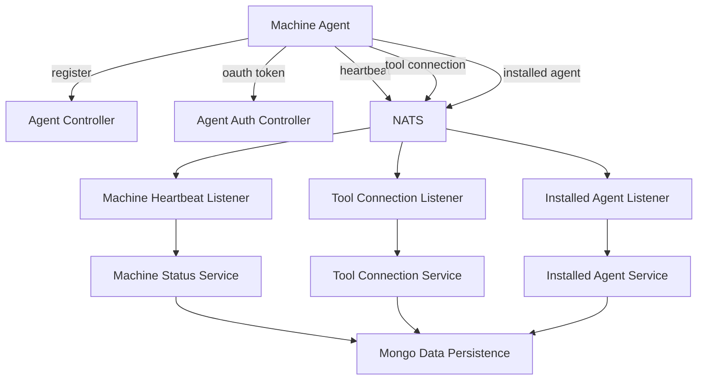

# Client Service Core

## Overview

The **Client Service Core** module is responsible for managing machine agents and client-side integrations within the OpenFrame platform. It acts as the primary entry point for agent authentication, agent registration, lifecycle event processing, and tool connectivity originating from managed machines.

This module bridges **machine-level activity** (agents, heartbeats, tool connections) with the broader OpenFrame ecosystem, including:
- Authorization and token issuance
- Device and agent persistence
- Stream processing via NATS and JetStream
- Downstream services such as API, Management, and Stream Processing cores

Client Service Core is a Spring Boot–based service and is typically deployed as the **openframe-client** application.

---

## Responsibilities

Client Service Core focuses on the following responsibilities:

- **Agent Authentication**: OAuth-style token issuance for machine agents
- **Agent Registration**: Secure onboarding of machines into an organization
- **Agent Lifecycle Management**: Tracking online/offline state and heartbeats
- **Tool Connectivity**: Processing tool-agent installation and connection events
- **Event Consumption**: Reliable consumption of NATS and JetStream events

---

## High-Level Architecture

---

## Controllers

### Agent Auth Controller

**Component**: `AgentAuthController`

- Exposes `/oauth/token`
- Issues access tokens for agents
- Supports multiple grant types, including refresh tokens
- Delegates token issuance logic to `AgentAuthService`

This controller is designed specifically for **non-human clients** (machine agents) and aligns with the broader OAuth and security infrastructure provided by the Authorization Server Core.

---

### Agent Controller

**Component**: `AgentController`

- Endpoint: `/api/agents/register`
- Requires an `X-Initial-Key` header for bootstrap security
- Accepts detailed machine metadata via `AgentRegistrationRequest`
- Delegates to `AgentRegistrationService`

The registration flow establishes the machine identity, associates it with an organization, and initializes device state in persistence.

---

### Tool Agent File Controller

**Component**: `ToolAgentFileController`

- Temporary endpoint for downloading tool agent binaries
- OS-specific resolution logic (macOS, Windows)
- Intended to be replaced by a proper artifact distribution mechanism

---

## Data Transfer Objects

### Agent Registration Request

**Component**: `AgentRegistrationRequest`

Captures comprehensive machine information:

- Identification: hostname, organization ID
- Network: IP, MAC address
- Hardware: serial number, model, manufacturer
- OS: type, version, build, timezone
- Agent metadata: version and status

This DTO ensures that downstream services have sufficient context to manage and inventory devices.

---

### Metrics Message

**Component**: `MetricsMessage`

Represents time-series telemetry emitted by agents:

- CPU usage
- Memory usage
- Timestamp

Typically forwarded to stream processing services for aggregation and analysis.

---

## Event Listeners and Messaging

Client Service Core consumes machine events using **NATS** and **JetStream**, ensuring durability and retry semantics.

### Machine Heartbeat Listener

**Component**: `MachineHeartbeatListener`

- Subscribes to `machine.*.heartbeat`
- Updates machine liveness timestamps
- Drives online/offline status transitions

---

### Client Connection Listener

**Component**: `ClientConnectionListener`

- Processes machine connection and disconnection events
- Uses functional consumers for integration with messaging infrastructure
- Updates machine status accordingly

---

### Tool Connection Listener

**Component**: `ToolConnectionListener`

- JetStream-based consumer for `machine.*.tool-connection`
- Handles retries with explicit acknowledgements
- Registers tool-to-machine associations

---

### Installed Agent Listener

**Component**: `InstalledAgentListener`

- Consumes `machine.*.installed-agent` events
- Tracks agent installations and versions
- Uses delivery groups and max-delivery safeguards

---

## Agent Registration Processing

### Default Agent Registration Processor

**Component**: `DefaultAgentRegistrationProcessor`

- Provides a no-op, extensible hook after agent registration
- Can be overridden to implement custom post-processing logic
- Enabled only when no other processor bean is present

This design allows platform operators to inject tenant- or environment-specific behavior without modifying core logic.

---

## Tool Agent ID Transformation

Different tools emit agent identifiers in incompatible formats. Client Service Core normalizes them using transformers.

### Fleet MDM Agent ID Transformer

**Component**: `FleetMdmAgentIdTransformer`

- Resolves Fleet MDM UUIDs to internal host IDs
- Calls Fleet MDM APIs using integrated tool credentials
- Supports retry semantics and last-attempt fallbacks

---

### MeshCentral Agent ID Transformer

**Component**: `MeshCentralAgentIdTransformer`

- Prepends required node prefix
- Stateless and deterministic transformation

---

## Security and Configuration

### Password Encoder Configuration

**Component**: `PasswordEncoderConfig`

- Provides a `BCryptPasswordEncoder` bean
- Used for secure credential handling
- Aligns with Spring Security best practices

---

## Position in the Platform

Client Service Core integrates tightly with:

- **Authorization Server Core** for OAuth flows and identity
- **Data Persistence (Mongo)** for device, agent, and tool state
- **Stream Processing Service Core** for downstream analytics
- **Gateway Service Core** as the primary ingress point

It is a foundational service enabling reliable, secure, and observable machine management across the OpenFrame platform.

---

## Summary

The **Client Service Core** module provides the backbone for machine and agent interactions in OpenFrame. By combining secure APIs, resilient event processing, and extensible processing hooks, it ensures that every managed device is properly authenticated, registered, monitored, and integrated into the broader MSP automation ecosystem.
