# Client Service Event Listeners

## Overview

The **Client Service Event Listeners** module is a critical component of the OpenFrame Client Service that provides real-time event processing for machine connectivity, heartbeat monitoring, and agent installation tracking. This module implements event-driven architecture using NATS messaging system to maintain accurate device state and agent inventory across the OpenFrame platform.

This module acts as the nervous system of the client service, continuously monitoring and reacting to three key event streams:
- **Connection Events**: Machine connect/disconnect lifecycle
- **Heartbeat Events**: Continuous health monitoring signals
- **Agent Installation Events**: Software agent deployment tracking

---

## Architecture

### High-Level Component Architecture

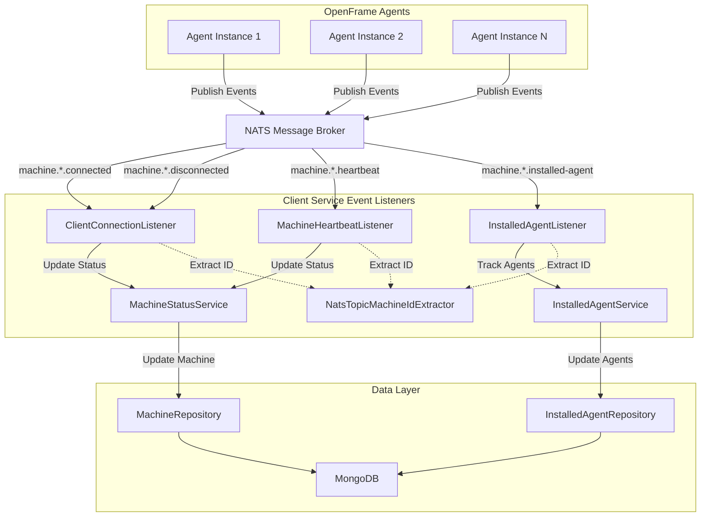
```mermaid
flowchart TD
    NATS["NATS Message Broker"]
    
    subgraph ClientService["Client Service Event Listeners"]
        CCL["ClientConnectionListener"]
        MHL["MachineHeartbeatListener"]
        IAL["InstalledAgentListener"]
        
        MSS["MachineStatusService"]
        IAS["InstalledAgentService"]
        NTME["NatsTopicMachineIdExtractor"]
    end
    
    subgraph DataLayer["Data Layer"]
        MachineRepo["MachineRepository"]
        AgentRepo["InstalledAgentRepository"]
        MongoDB["MongoDB"]
    end
    
    subgraph Agents["OpenFrame Agents"]
        Agent1["Agent Instance 1"]
        Agent2["Agent Instance 2"]
        AgentN["Agent Instance N"]
    end
    
    Agent1 -->|"Publish Events"| NATS
    Agent2 -->|"Publish Events"| NATS
    AgentN -->|"Publish Events"| NATS
    
    NATS -->|"machine.*.connected"| CCL
    NATS -->|"machine.*.disconnected"| CCL
    NATS -->|"machine.*.heartbeat"| MHL
    NATS -->|"machine.*.installed-agent"| IAL
    
    CCL -->|"Update Status"| MSS
    MHL -->|"Update Status"| MSS
    IAL -->|"Track Agents"| IAS
    
    CCL -.->|"Extract ID"| NTME
    MHL -.->|"Extract ID"| NTME
    IAL -.->|"Extract ID"| NTME
    
    MSS -->|"Update Machine"| MachineRepo
    IAS -->|"Update Agents"| AgentRepo
    
    MachineRepo --> MongoDB
    AgentRepo --> MongoDB
```

### Event Flow Architecture

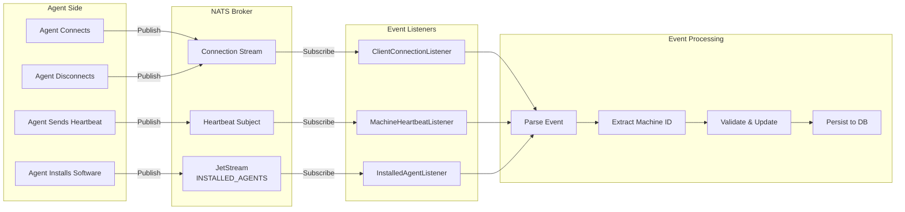
```mermaid
flowchart LR
    subgraph AgentSide["Agent Side"]
        A1["Agent Connects"]
        A2["Agent Sends Heartbeat"]
        A3["Agent Installs Software"]
        A4["Agent Disconnects"]
    end
    
    subgraph NATSBroker["NATS Broker"]
        N1["Connection Stream"]
        N2["Heartbeat Subject"]
        N3["JetStream<br/>INSTALLED_AGENTS"]
    end
    
    subgraph Listeners["Event Listeners"]
        L1["ClientConnectionListener"]
        L2["MachineHeartbeatListener"]
        L3["InstalledAgentListener"]
    end
    
    subgraph Processing["Event Processing"]
        P1["Parse Event"]
        P2["Extract Machine ID"]
        P3["Validate & Update"]
        P4["Persist to DB"]
    end
    
    A1 -->|"Publish"| N1
    A2 -->|"Publish"| N2
    A3 -->|"Publish"| N3
    A4 -->|"Publish"| N1
    
    N1 -->|"Subscribe"| L1
    N2 -->|"Subscribe"| L2
    N3 -->|"Subscribe"| L3
    
    L1 --> P1
    L2 --> P1
    L3 --> P1
    
    P1 --> P2
    P2 --> P3
    P3 --> P4
```

---

## Core Components

### 1. ClientConnectionListener

**Purpose**: Monitors machine connection and disconnection events to maintain accurate online/offline status.

**Key Responsibilities**:
- Listen to NATS connection events (`machine.*.connected`, `machine.*.disconnected`)
- Parse connection event payloads
- Update machine status in real-time
- Handle event timestamp ordering

**Event Processing Flow**:

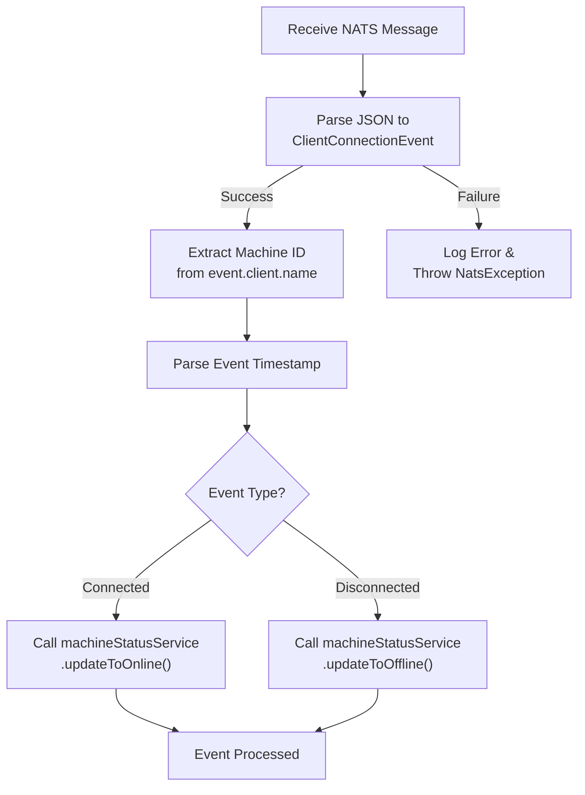
```mermaid
flowchart TD
    Start["Receive NATS Message"]
    Parse["Parse JSON to<br/>ClientConnectionEvent"]
    Extract["Extract Machine ID<br/>from event.client.name"]
    Timestamp["Parse Event Timestamp"]
    
    Decision{"Event Type?"}
    
    Online["Call machineStatusService<br/>.updateToOnline()"]
    Offline["Call machineStatusService<br/>.updateToOffline()"]
    
    Error["Log Error &<br/>Throw NatsException"]
    End["Event Processed"]
    
    Start --> Parse
    Parse -->|"Success"| Extract
    Parse -->|"Failure"| Error
    
    Extract --> Timestamp
    Timestamp --> Decision
    
    Decision -->|"Connected"| Online
    Decision -->|"Disconnected"| Offline
    
    Online --> End
    Offline --> End
```

**Code Structure**:

```java
@Component
@RequiredArgsConstructor
@Slf4j
public class ClientConnectionListener {
    private final ObjectMapper objectMapper;
    private final MachineStatusService machineStatusService;

    @Bean
    public Consumer<String> machineConnectedConsumer() {
        // Processes connection events
    }

    @Bean
    public Consumer<String> machineDisconnectionConsumer() {
        // Processes disconnection events
    }
}
```

**Event Model**:

```json
{
  "timestamp": "2024-01-15T10:30:00Z",
  "client": {
    "name": "machine-uuid-12345"
  }
}
```

**Integration Points**:
- **Input**: NATS Spring Cloud Stream bindings
- **Output**: [MachineStatusService](#machinestatus-service)
- **Data Model**: `ClientConnectionEvent`

---

### 2. MachineHeartbeatListener

**Purpose**: Continuously monitors machine health through periodic heartbeat signals to detect unresponsive devices.

**Key Responsibilities**:
- Subscribe to heartbeat subject pattern (`machine.*.heartbeat`)
- Process heartbeat signals in real-time
- Generate server-side timestamps for heartbeat events
- Maintain machine online status through continuous signals

**Heartbeat Processing Flow**:

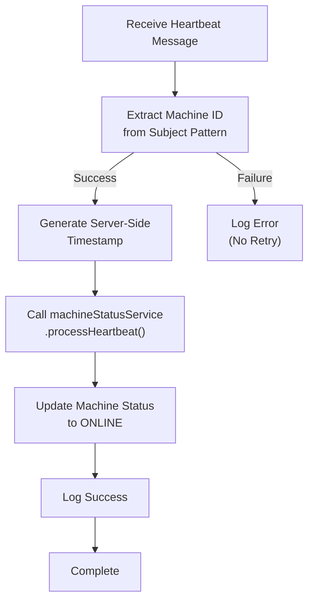
```mermaid
flowchart TD
    Start["Receive Heartbeat Message"]
    Extract["Extract Machine ID<br/>from Subject Pattern"]
    Generate["Generate Server-Side<br/>Timestamp"]
    Process["Call machineStatusService<br/>.processHeartbeat()"]
    Update["Update Machine Status<br/>to ONLINE"]
    Log["Log Success"]
    End["Complete"]
    
    Error["Log Error<br/>(No Retry)"]
    
    Start --> Extract
    Extract -->|"Success"| Generate
    Extract -->|"Failure"| Error
    
    Generate --> Process
    Process --> Update
    Update --> Log
    Log --> End
```

**Subscription Architecture**:

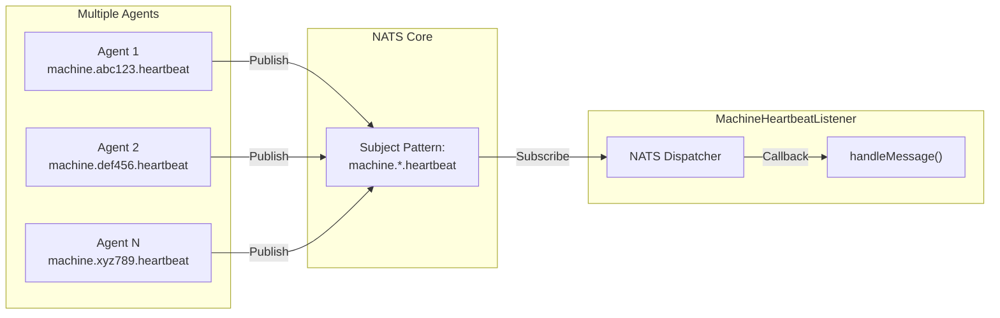
```mermaid
flowchart LR
    subgraph Agents["Multiple Agents"]
        A1["Agent 1<br/>machine.abc123.heartbeat"]
        A2["Agent 2<br/>machine.def456.heartbeat"]
        A3["Agent N<br/>machine.xyz789.heartbeat"]
    end
    
    subgraph NATS["NATS Core"]
        Subject["Subject Pattern:<br/>machine.*.heartbeat"]
    end
    
    subgraph Listener["MachineHeartbeatListener"]
        Dispatcher["NATS Dispatcher"]
        Handler["handleMessage()"]
    end
    
    A1 -->|"Publish"| Subject
    A2 -->|"Publish"| Subject
    A3 -->|"Publish"| Subject
    
    Subject -->|"Subscribe"| Dispatcher
    Dispatcher -->|"Callback"| Handler
```

**Code Structure**:

```java
@Component
@RequiredArgsConstructor
@Slf4j
public class MachineHeartbeatListener {
    private final Connection natsConnection;
    private final MachineStatusService machineStatusService;
    private final NatsTopicMachineIdExtractor machineIdExtractor;

    @EventListener(ApplicationReadyEvent.class)
    public void subscribeToMachineHeartbeats() {
        // Initialize NATS dispatcher and subscribe
    }

    private void handleMessage(Message message) {
        // Process heartbeat and update status
    }

    @PreDestroy
    public void cleanup() {
        // Graceful shutdown
    }
}
```

**Key Features**:
- **Lightweight**: No payload parsing required (subject contains machine ID)
- **Server-Side Timestamps**: Eliminates clock skew issues
- **Non-Blocking**: Uses NATS dispatcher for async processing
- **Graceful Shutdown**: Drains dispatcher on application shutdown

**Integration Points**:
- **Input**: NATS Core subscription (not JetStream)
- **Output**: [MachineStatusService](#machinestatus-service)
- **Utility**: [NatsTopicMachineIdExtractor](#natstopicmachineidextractor)

---

### 3. InstalledAgentListener

**Purpose**: Tracks software agent installations and version updates across all managed machines using durable JetStream consumers.

**Key Responsibilities**:
- Subscribe to JetStream `INSTALLED_AGENTS` stream
- Process agent installation messages with retry logic
- Track agent versions and update history
- Ensure exactly-once processing with explicit acknowledgments

**JetStream Consumer Architecture**:

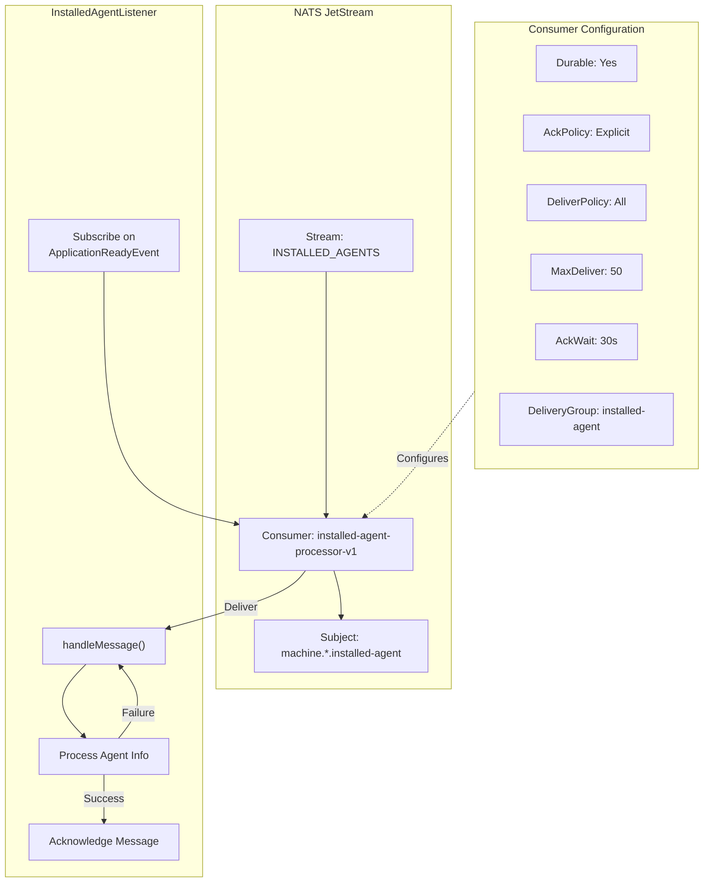
```mermaid
flowchart TD
    subgraph JetStream["NATS JetStream"]
        Stream["Stream: INSTALLED_AGENTS"]
        Consumer["Consumer: installed-agent-processor-v1"]
        Subject["Subject: machine.*.installed-agent"]
    end
    
    subgraph Configuration["Consumer Configuration"]
        Durable["Durable: Yes"]
        AckPolicy["AckPolicy: Explicit"]
        DeliverPolicy["DeliverPolicy: All"]
        MaxDeliver["MaxDeliver: 50"]
        AckWait["AckWait: 30s"]
        DeliveryGroup["DeliveryGroup: installed-agent"]
    end
    
    subgraph Listener["InstalledAgentListener"]
        Subscribe["Subscribe on<br/>ApplicationReadyEvent"]
        Handler["handleMessage()"]
        Process["Process Agent Info"]
        Ack["Acknowledge Message"]
    end
    
    Stream --> Consumer
    Consumer --> Subject
    Configuration -.->|"Configures"| Consumer
    
    Subscribe --> Consumer
    Consumer -->|"Deliver"| Handler
    Handler --> Process
    Process -->|"Success"| Ack
    Process -->|"Failure"| Handler
```

**Message Processing Flow**:

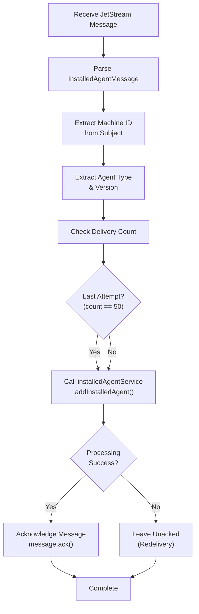
```mermaid
flowchart TD
    Start["Receive JetStream Message"]
    Parse["Parse InstalledAgentMessage"]
    ExtractID["Extract Machine ID<br/>from Subject"]
    ExtractData["Extract Agent Type<br/>& Version"]
    CheckDelivery["Check Delivery Count"]
    
    LastAttempt{"Last Attempt?<br/>(count == 50)"}
    
    Process["Call installedAgentService<br/>.addInstalledAgent()"]
    
    Success{"Processing<br/>Success?"}
    
    Ack["Acknowledge Message<br/>message.ack()"]
    NoAck["Leave Unacked<br/>(Redelivery)"]
    
    End["Complete"]
    
    Start --> Parse
    Parse --> ExtractID
    ExtractID --> ExtractData
    ExtractData --> CheckDelivery
    CheckDelivery --> LastAttempt
    
    LastAttempt -->|"Yes"| Process
    LastAttempt -->|"No"| Process
    
    Process --> Success
    
    Success -->|"Yes"| Ack
    Success -->|"No"| NoAck
    
    Ack --> End
    NoAck --> End
```

**Consumer Configuration Management**:

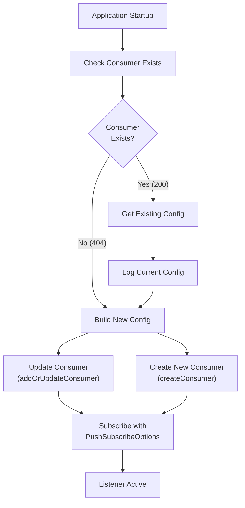
```mermaid
flowchart TD
    Start["Application Startup"]
    Check["Check Consumer Exists"]
    
    Exists{"Consumer<br/>Exists?"}
    
    GetConfig["Get Existing Config"]
    LogConfig["Log Current Config"]
    BuildNew["Build New Config"]
    Update["Update Consumer<br/>(addOrUpdateConsumer)"]
    
    Create["Create New Consumer<br/>(createConsumer)"]
    
    Subscribe["Subscribe with<br/>PushSubscribeOptions"]
    
    End["Listener Active"]
    
    Start --> Check
    Check --> Exists
    
    Exists -->|"Yes (200)"| GetConfig
    Exists -->|"No (404)"| BuildNew
    
    GetConfig --> LogConfig
    LogConfig --> BuildNew
    BuildNew --> Update
    Update --> Subscribe
    
    BuildNew --> Create
    Create --> Subscribe
    
    Subscribe --> End
```

**Code Structure**:

```java
@Component
@RequiredArgsConstructor
@Slf4j
public class InstalledAgentListener {
    private final Connection natsConnection;
    private final ObjectMapper objectMapper;
    private final InstalledAgentService installedAgentService;
    private final NatsTopicMachineIdExtractor machineIdExtractor;

    @EventListener(ApplicationReadyEvent.class)
    public void subscribeToInstalledAgents() {
        // Initialize JetStream consumer
    }

    private ConsumerConfiguration buildConsumerConfig() {
        // Create or update consumer configuration
    }

    private void handleMessage(Message message) {
        // Process agent installation
    }

    @PreDestroy
    public void cleanup() {
        // Unsubscribe and drain
    }
}
```

**Consumer Configuration**:

| Parameter | Value | Purpose |
|-----------|-------|---------|
| **Stream** | `INSTALLED_AGENTS` | JetStream stream name |
| **Consumer** | `installed-agent-processor-v1` | Durable consumer name |
| **Subject** | `machine.*.installed-agent` | Subject filter pattern |
| **Ack Policy** | `Explicit` | Manual acknowledgment required |
| **Deliver Policy** | `All` | Process all messages from start |
| **Max Deliver** | `50` | Maximum redelivery attempts |
| **Ack Wait** | `30s` | Timeout before redelivery |
| **Delivery Group** | `installed-agent` | Load balancing group |
| **Delivery Subject** | `machine.installed-agent.delivery` | Push delivery subject |

**Message Model**:

```json
{
  "machineId": "machine-uuid-12345",
  "agentType": "tactical-rmm",
  "version": "2.5.0"
}
```

**Integration Points**:
- **Input**: NATS JetStream with durable consumer
- **Output**: [InstalledAgentService](#installedagent-service)
- **Utility**: [NatsTopicMachineIdExtractor](#natstopicmachineidextractor)

---

## Supporting Services

### MachineStatusService

**Purpose**: Centralized service for managing machine online/offline status with timestamp-based conflict resolution.

**Key Operations**:

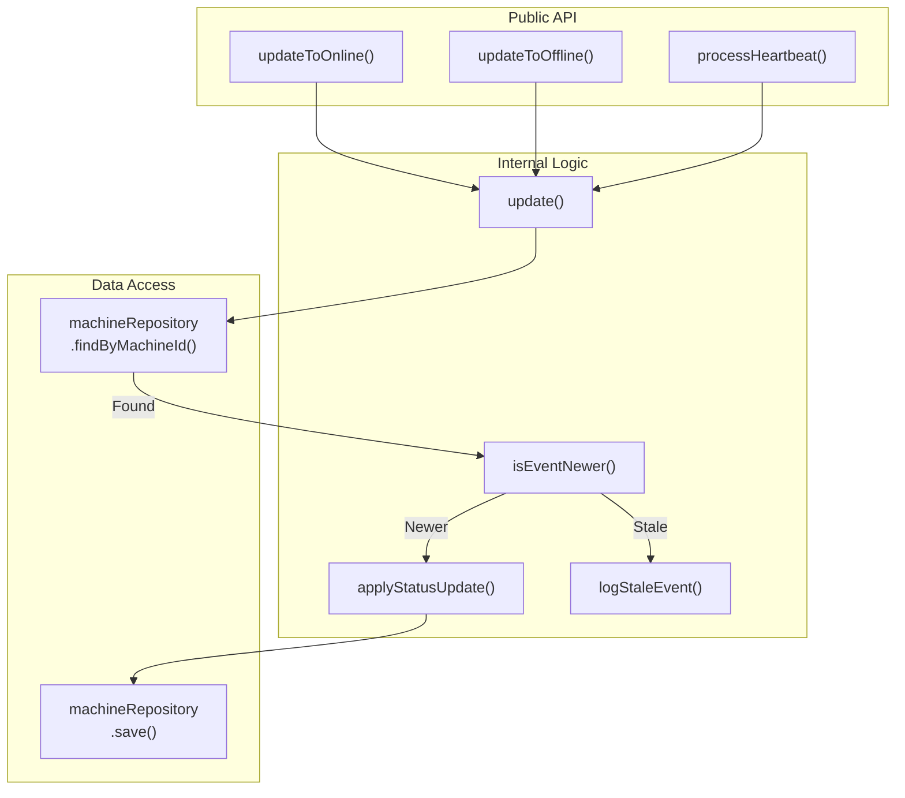
```mermaid
flowchart TD
    subgraph API["Public API"]
        Online["updateToOnline()"]
        Offline["updateToOffline()"]
        Heartbeat["processHeartbeat()"]
    end
    
    subgraph Internal["Internal Logic"]
        Update["update()"]
        IsNewer["isEventNewer()"]
        Apply["applyStatusUpdate()"]
        LogStale["logStaleEvent()"]
    end
    
    subgraph Data["Data Access"]
        Find["machineRepository<br/>.findByMachineId()"]
        Save["machineRepository<br/>.save()"]
    end
    
    Online --> Update
    Offline --> Update
    Heartbeat --> Update
    
    Update --> Find
    Find -->|"Found"| IsNewer
    
    IsNewer -->|"Newer"| Apply
    IsNewer -->|"Stale"| LogStale
    
    Apply --> Save
```

**Timestamp Conflict Resolution**:

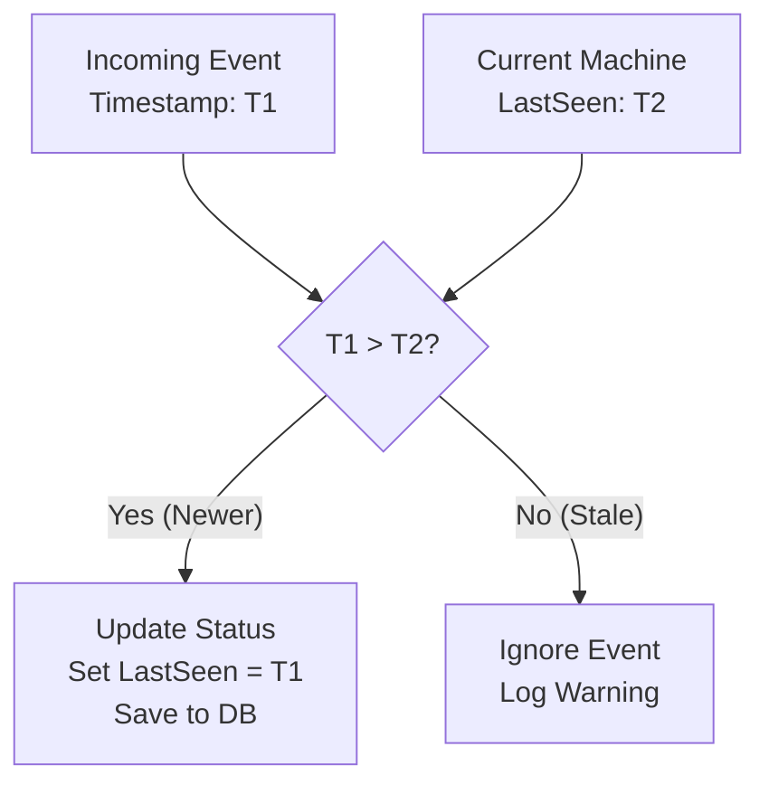
```mermaid
flowchart TD
    Event["Incoming Event<br/>Timestamp: T1"]
    Machine["Current Machine<br/>LastSeen: T2"]
    
    Compare{"T1 > T2?"}
    
    Update["Update Status<br/>Set LastSeen = T1<br/>Save to DB"]
    
    Ignore["Ignore Event<br/>Log Warning"]
    
    Event --> Compare
    Machine --> Compare
    
    Compare -->|"Yes (Newer)"| Update
    Compare -->|"No (Stale)"| Ignore
```

**Code Structure**:

```java
@Service
@RequiredArgsConstructor
@Slf4j
public class MachineStatusService {
    private final MachineRepository machineRepository;

    public void updateToOnline(String machineId, Instant eventTimestamp) {
        update(machineId, DeviceStatus.ONLINE, eventTimestamp);
    }

    public void updateToOffline(String machineId, Instant eventTimestamp) {
        update(machineId, DeviceStatus.OFFLINE, eventTimestamp);
    }

    public void processHeartbeat(String machineId, Instant eventTimestamp) {
        update(machineId, DeviceStatus.ONLINE, eventTimestamp);
    }

    private void update(String machineId, DeviceStatus newStatus, Instant eventTimestamp) {
        // Timestamp-based update logic
    }
}
```

**Status Transitions**:

| From Status | Event | To Status | Notes |
|-------------|-------|-----------|-------|
| `OFFLINE` | Connected | `ONLINE` | Initial connection |
| `OFFLINE` | Heartbeat | `ONLINE` | Recovery from offline |
| `ONLINE` | Heartbeat | `ONLINE` | Status refresh |
| `ONLINE` | Disconnected | `OFFLINE` | Clean disconnect |
| Any | Stale Event | No Change | Event older than `lastSeen` |

**Integration Points**:
- **Used By**: All three event listeners
- **Data Access**: `MachineRepository` (MongoDB)
- **Data Model**: [Machine Document](data_layer_mongo.md#machine-document)

---

### InstalledAgentService

**Purpose**: Manages the inventory of installed agents on machines, tracking versions and installation history.

**Agent Management Flow**:

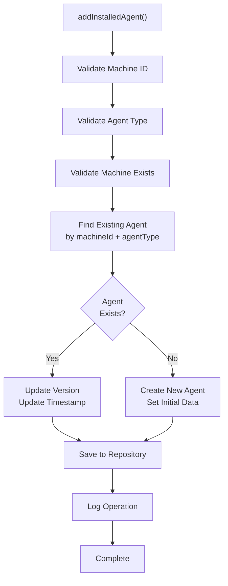
```mermaid
flowchart TD
    Start["addInstalledAgent()"]
    
    Validate1["Validate Machine ID"]
    Validate2["Validate Agent Type"]
    Validate3["Validate Machine Exists"]
    
    Find["Find Existing Agent<br/>by machineId + agentType"]
    
    Exists{"Agent<br/>Exists?"}
    
    Update["Update Version<br/>Update Timestamp"]
    Create["Create New Agent<br/>Set Initial Data"]
    
    Save["Save to Repository"]
    Log["Log Operation"]
    End["Complete"]
    
    Start --> Validate1
    Validate1 --> Validate2
    Validate2 --> Validate3
    Validate3 --> Find
    
    Find --> Exists
    
    Exists -->|"Yes"| Update
    Exists -->|"No"| Create
    
    Update --> Save
    Create --> Save
    
    Save --> Log
    Log --> End
```

**Code Structure**:

```java
@Service
@RequiredArgsConstructor
@Slf4j
public class InstalledAgentService {
    private final InstalledAgentRepository installedAgentRepository;
    private final MachineRepository machineRepository;

    @Transactional
    public void addInstalledAgent(String machineId, String agentType, 
                                   String version, boolean lastAttempt) {
        // Validation and upsert logic
    }

    private void updateExistingInstalledAgent(...) {
        // Update version and timestamp
    }

    private void addNewInstalledAgent(...) {
        // Create new agent record
    }
}
```

**Agent Record Structure**:

```json
{
  "id": "generated-id",
  "machineId": "machine-uuid-12345",
  "agentType": "tactical-rmm",
  "version": "2.5.0",
  "createdAt": "2024-01-15T10:00:00Z",
  "updatedAt": "2024-01-15T10:30:00Z"
}
```

**Supported Agent Types**:
- `tactical-rmm`: Tactical RMM agent
- `fleet-mdm`: Fleet MDM agent
- `meshcentral`: MeshCentral agent
- Custom agent types as configured

**Integration Points**:
- **Used By**: `InstalledAgentListener`
- **Data Access**: `InstalledAgentRepository`, `MachineRepository`
- **Transaction**: `@Transactional` for data consistency

---

### NatsTopicMachineIdExtractor

**Purpose**: Utility service for extracting machine IDs from NATS subject patterns with validation.

**Extraction Logic**:

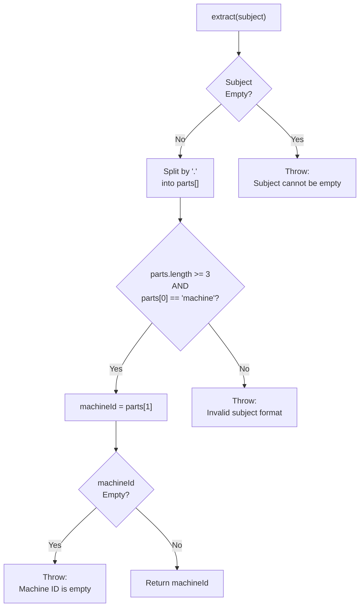
```mermaid
flowchart TD
    Start["extract(subject)"]
    
    CheckEmpty{"Subject<br/>Empty?"}
    
    Split["Split by '.'<br/>into parts[]"]
    
    Validate{"parts.length >= 3<br/>AND<br/>parts[0] == 'machine'?"}
    
    ExtractID["machineId = parts[1]"]
    
    CheckID{"machineId<br/>Empty?"}
    
    Return["Return machineId"]
    
    Error1["Throw:<br/>Subject cannot be empty"]
    Error2["Throw:<br/>Invalid subject format"]
    Error3["Throw:<br/>Machine ID is empty"]
    
    Start --> CheckEmpty
    
    CheckEmpty -->|"Yes"| Error1
    CheckEmpty -->|"No"| Split
    
    Split --> Validate
    
    Validate -->|"No"| Error2
    Validate -->|"Yes"| ExtractID
    
    ExtractID --> CheckID
    
    CheckID -->|"Yes"| Error3
    CheckID -->|"No"| Return
```

**Subject Pattern Examples**:

| Subject | Extracted Machine ID | Valid? |
|---------|---------------------|--------|
| `machine.abc123.heartbeat` | `abc123` | ✅ Yes |
| `machine.def456.connected` | `def456` | ✅ Yes |
| `machine.xyz789.installed-agent` | `xyz789` | ✅ Yes |
| `device.abc123.heartbeat` | - | ❌ No (wrong prefix) |
| `machine..heartbeat` | - | ❌ No (empty ID) |
| `machine.abc123` | - | ❌ No (too few parts) |

**Code Structure**:

```java
@Component
@Slf4j
public class NatsTopicMachineIdExtractor {
    
    public String extract(String subject) {
        // Validation and extraction logic
        // Expected format: machine.{machineId}.{suffix}
    }
}
```

**Integration Points**:
- **Used By**: `MachineHeartbeatListener`, `InstalledAgentListener`
- **Purpose**: Centralized subject parsing logic
- **Error Handling**: Throws `IllegalArgumentException` on invalid format

---

## Event Processing Patterns

### 1. Connection Event Processing

**Pattern**: Fire-and-Forget with Error Handling

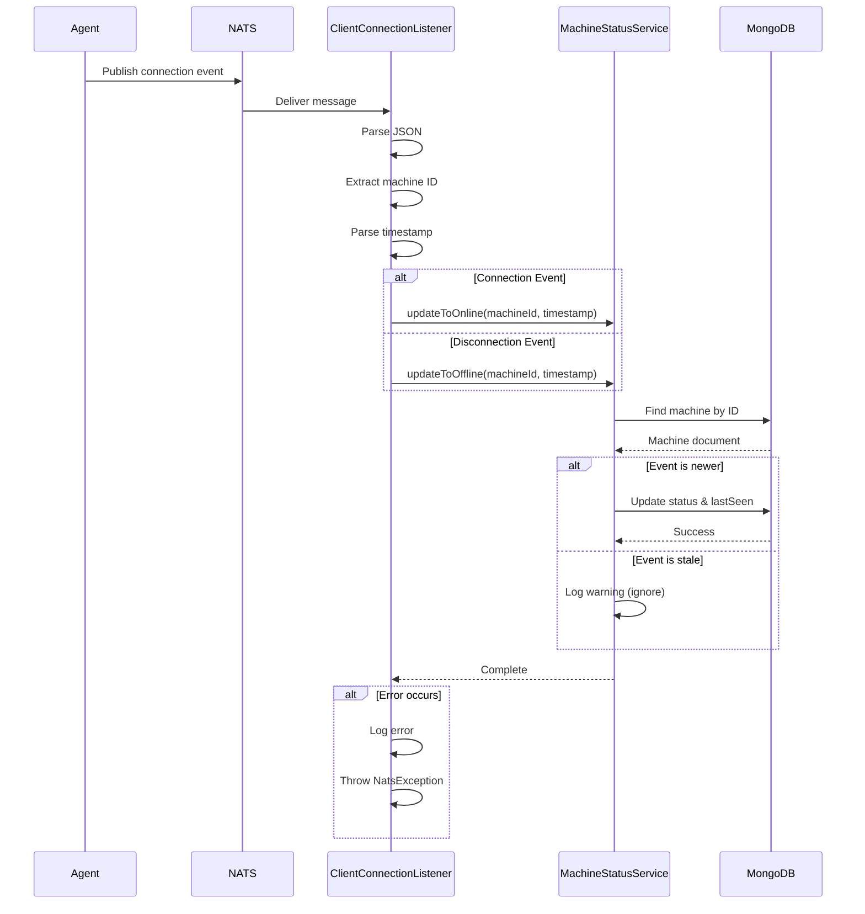
```mermaid
sequenceDiagram
    participant Agent
    participant NATS
    participant Listener as ClientConnectionListener
    participant Service as MachineStatusService
    participant DB as MongoDB
    
    Agent->>NATS: Publish connection event
    NATS->>Listener: Deliver message
    
    Listener->>Listener: Parse JSON
    Listener->>Listener: Extract machine ID
    Listener->>Listener: Parse timestamp
    
    alt Connection Event
        Listener->>Service: updateToOnline(machineId, timestamp)
    else Disconnection Event
        Listener->>Service: updateToOffline(machineId, timestamp)
    end
    
    Service->>DB: Find machine by ID
    DB-->>Service: Machine document
    
    alt Event is newer
        Service->>DB: Update status & lastSeen
        DB-->>Service: Success
    else Event is stale
        Service->>Service: Log warning (ignore)
    end
    
    Service-->>Listener: Complete
    
    alt Error occurs
        Listener->>Listener: Log error
        Listener->>Listener: Throw NatsException
    end
```

**Characteristics**:
- **Delivery**: At-most-once (no retry)
- **Acknowledgment**: Implicit (Spring Cloud Stream)
- **Error Handling**: Log and throw exception
- **Idempotency**: Timestamp-based conflict resolution

---

### 2. Heartbeat Event Processing

**Pattern**: Continuous Monitoring with Server-Side Timestamps

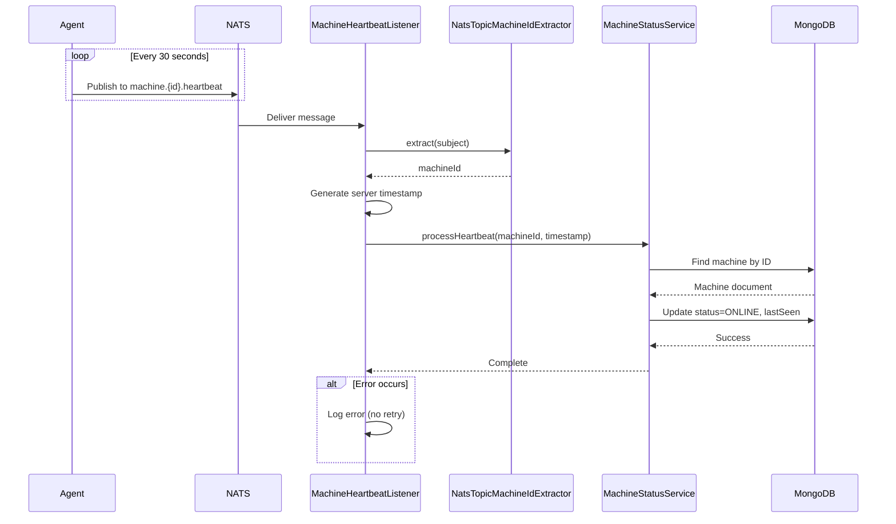
```mermaid
sequenceDiagram
    participant Agent
    participant NATS
    participant Listener as MachineHeartbeatListener
    participant Extractor as NatsTopicMachineIdExtractor
    participant Service as MachineStatusService
    participant DB as MongoDB
    
    loop Every 30 seconds
        Agent->>NATS: Publish to machine.{id}.heartbeat
    end
    
    NATS->>Listener: Deliver message
    
    Listener->>Extractor: extract(subject)
    Extractor-->>Listener: machineId
    
    Listener->>Listener: Generate server timestamp
    
    Listener->>Service: processHeartbeat(machineId, timestamp)
    
    Service->>DB: Find machine by ID
    DB-->>Service: Machine document
    
    Service->>DB: Update status=ONLINE, lastSeen
    DB-->>Service: Success
    
    Service-->>Listener: Complete
    
    alt Error occurs
        Listener->>Listener: Log error (no retry)
    end
```

**Characteristics**:
- **Delivery**: At-most-once (lightweight)
- **Acknowledgment**: None (fire-and-forget)
- **Timestamp**: Server-generated (eliminates clock skew)
- **Error Handling**: Log only (next heartbeat will recover)

---

### 3. Agent Installation Event Processing

**Pattern**: Guaranteed Delivery with Retry and Acknowledgment

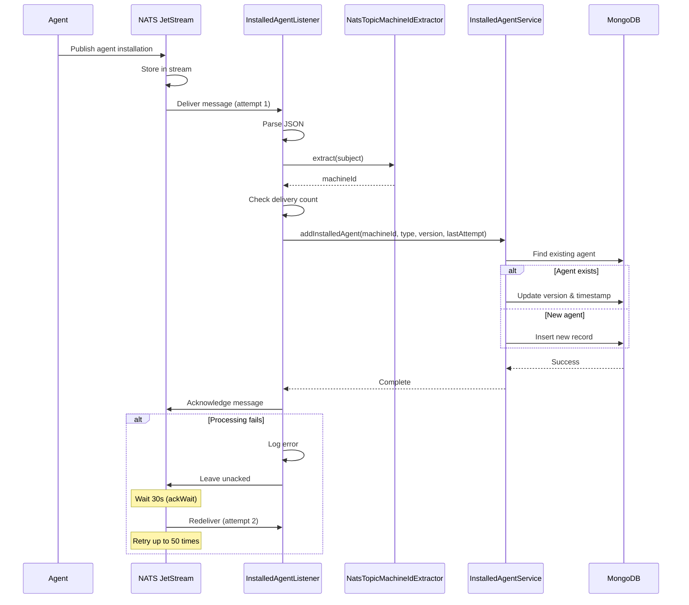
```mermaid
sequenceDiagram
    participant Agent
    participant JetStream as NATS JetStream
    participant Listener as InstalledAgentListener
    participant Extractor as NatsTopicMachineIdExtractor
    participant Service as InstalledAgentService
    participant DB as MongoDB
    
    Agent->>JetStream: Publish agent installation
    JetStream->>JetStream: Store in stream
    
    JetStream->>Listener: Deliver message (attempt 1)
    
    Listener->>Listener: Parse JSON
    Listener->>Extractor: extract(subject)
    Extractor-->>Listener: machineId
    
    Listener->>Listener: Check delivery count
    
    Listener->>Service: addInstalledAgent(machineId, type, version, lastAttempt)
    
    Service->>DB: Find existing agent
    
    alt Agent exists
        Service->>DB: Update version & timestamp
    else New agent
        Service->>DB: Insert new record
    end
    
    DB-->>Service: Success
    Service-->>Listener: Complete
    
    Listener->>JetStream: Acknowledge message
    
    alt Processing fails
        Listener->>Listener: Log error
        Listener->>JetStream: Leave unacked
        
        Note over JetStream: Wait 30s (ackWait)
        
        JetStream->>Listener: Redeliver (attempt 2)
        
        Note over JetStream: Retry up to 50 times
    end
```

**Characteristics**:
- **Delivery**: At-least-once (with retries)
- **Acknowledgment**: Explicit (`message.ack()`)
- **Retry**: Up to 50 attempts with 30s wait
- **Idempotency**: Upsert logic (safe for retries)

---

## Data Flow

### Complete Event Processing Pipeline

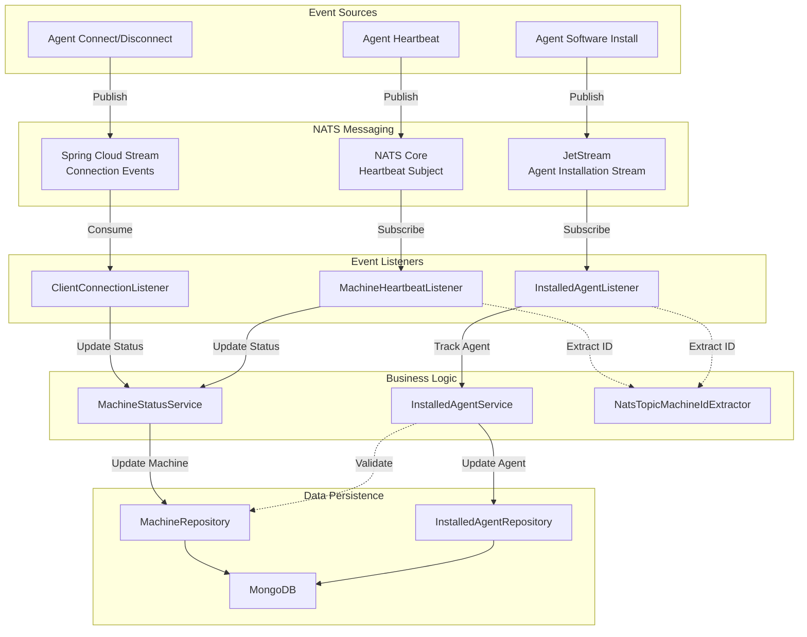
```mermaid
flowchart TD
    subgraph Sources["Event Sources"]
        A1["Agent Connect/Disconnect"]
        A2["Agent Heartbeat"]
        A3["Agent Software Install"]
    end
    
    subgraph Messaging["NATS Messaging"]
        N1["Spring Cloud Stream<br/>Connection Events"]
        N2["NATS Core<br/>Heartbeat Subject"]
        N3["JetStream<br/>Agent Installation Stream"]
    end
    
    subgraph Listeners["Event Listeners"]
        L1["ClientConnectionListener"]
        L2["MachineHeartbeatListener"]
        L3["InstalledAgentListener"]
    end
    
    subgraph Services["Business Logic"]
        S1["MachineStatusService"]
        S2["InstalledAgentService"]
        U1["NatsTopicMachineIdExtractor"]
    end
    
    subgraph Persistence["Data Persistence"]
        R1["MachineRepository"]
        R2["InstalledAgentRepository"]
        DB["MongoDB"]
    end
    
    A1 -->|"Publish"| N1
    A2 -->|"Publish"| N2
    A3 -->|"Publish"| N3
    
    N1 -->|"Consume"| L1
    N2 -->|"Subscribe"| L2
    N3 -->|"Subscribe"| L3
    
    L1 -->|"Update Status"| S1
    L2 -->|"Update Status"| S1
    L3 -->|"Track Agent"| S2
    
    L2 -.->|"Extract ID"| U1
    L3 -.->|"Extract ID"| U1
    
    S1 -->|"Update Machine"| R1
    S2 -->|"Update Agent"| R2
    S2 -.->|"Validate"| R1
    
    R1 --> DB
    R2 --> DB
```

### State Transitions

**Machine Status State Machine**:

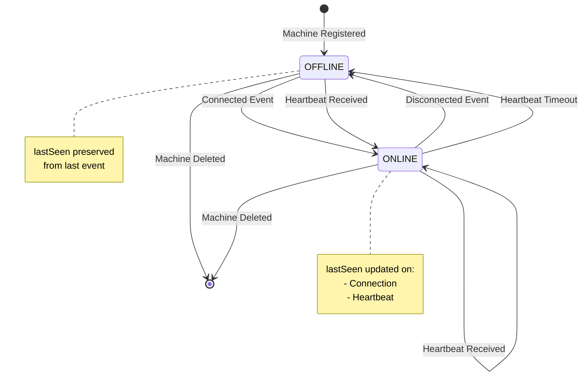
```mermaid
stateDiagram-v2
    [*] --> OFFLINE: Machine Registered
    
    OFFLINE --> ONLINE: Connected Event
    OFFLINE --> ONLINE: Heartbeat Received
    
    ONLINE --> ONLINE: Heartbeat Received
    ONLINE --> OFFLINE: Disconnected Event
    ONLINE --> OFFLINE: Heartbeat Timeout
    
    OFFLINE --> [*]: Machine Deleted
    ONLINE --> [*]: Machine Deleted
    
    note right of ONLINE
        lastSeen updated on:
        - Connection
        - Heartbeat
    end note
    
    note right of OFFLINE
        lastSeen preserved
        from last event
    end note
```

---

## Configuration

### NATS Connection Configuration

The listeners rely on NATS connection configuration provided by the application:

```yaml
# application.yml
spring:
  cloud:
    stream:
      bindings:
        machineConnectedConsumer-in-0:
          destination: machine-connected
          group: client-service
        machineDisconnectionConsumer-in-0:
          destination: machine-disconnected
          group: client-service

nats:
  url: nats://localhost:4222
  connection:
    name: client-service
    max-reconnect: 10
    reconnect-wait: 2s
```

### JetStream Configuration

**Stream Configuration** (created externally):

```bash
# Create INSTALLED_AGENTS stream
nats stream add INSTALLED_AGENTS \
  --subjects "machine.*.installed-agent" \
  --storage file \
  --retention limits \
  --max-age 7d \
  --max-msgs 1000000
```

**Consumer Configuration** (managed by listener):

| Parameter | Value | Rationale |
|-----------|-------|-----------|
| `durable` | `installed-agent-processor-v1` | Survives restarts |
| `ackPolicy` | `Explicit` | Manual control over acknowledgment |
| `deliverPolicy` | `All` | Process all messages from stream start |
| `maxDeliver` | `50` | Sufficient retries for transient failures |
| `ackWait` | `30s` | Balance between retry speed and processing time |
| `deliverGroup` | `installed-agent` | Load balancing across instances |

---

## Error Handling

### Error Handling Strategies by Listener

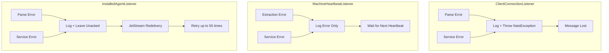
```mermaid
flowchart TD
    subgraph CCL["ClientConnectionListener"]
        CCL1["Parse Error"]
        CCL2["Service Error"]
        CCL3["Log + Throw NatsException"]
        CCL4["Message Lost"]
        
        CCL1 --> CCL3
        CCL2 --> CCL3
        CCL3 --> CCL4
    end
    
    subgraph MHL["MachineHeartbeatListener"]
        MHL1["Extraction Error"]
        MHL2["Service Error"]
        MHL3["Log Error Only"]
        MHL4["Wait for Next Heartbeat"]
        
        MHL1 --> MHL3
        MHL2 --> MHL3
        MHL3 --> MHL4
    end
    
    subgraph IAL["InstalledAgentListener"]
        IAL1["Parse Error"]
        IAL2["Service Error"]
        IAL3["Log + Leave Unacked"]
        IAL4["JetStream Redelivery"]
        IAL5["Retry up to 50 times"]
        
        IAL1 --> IAL3
        IAL2 --> IAL3
        IAL3 --> IAL4
        IAL4 --> IAL5
    end
```

### Error Scenarios and Recovery

| Scenario | Listener | Strategy | Recovery |
|----------|----------|----------|----------|
| **JSON Parse Failure** | Connection | Throw exception, message lost | Manual intervention required |
| **JSON Parse Failure** | Heartbeat | Log error, continue | Next heartbeat recovers |
| **JSON Parse Failure** | Agent Install | Leave unacked, retry | Automatic retry up to 50x |
| **Machine Not Found** | Connection | Throw exception | Machine must be registered first |
| **Machine Not Found** | Heartbeat | Log error | Machine must be registered first |
| **Machine Not Found** | Agent Install | Throw exception, retry | Machine must be registered first |
| **Database Timeout** | Connection | Throw exception | Message lost |
| **Database Timeout** | Heartbeat | Log error | Next heartbeat recovers |
| **Database Timeout** | Agent Install | Leave unacked, retry | Automatic retry |
| **Stale Event** | Connection | Log warning, ignore | No action needed |
| **Stale Event** | Heartbeat | Update anyway | Always accept heartbeats |
| **Invalid Subject** | Heartbeat | Throw exception | Fix agent configuration |
| **Invalid Subject** | Agent Install | Throw exception, retry | Fix agent configuration |

### Retry Configuration

**InstalledAgentListener Retry Behavior**:

```text
Attempt 1: Immediate delivery
Attempt 2: After 30s (ackWait)
Attempt 3: After 30s
...
Attempt 50: After 30s (final attempt)

Total retry window: ~25 minutes
```

**Exponential Backoff** (not implemented, but recommended for future):

```text
Attempt 1: Immediate
Attempt 2: After 1s
Attempt 3: After 2s
Attempt 4: After 4s
Attempt 5: After 8s
...
Max backoff: 60s
```

---

## Monitoring and Observability

### Key Metrics to Monitor

**Connection Events**:
- `client.connection.events.received` - Total connection events processed
- `client.connection.events.failed` - Failed connection event processing
- `client.connection.parse.errors` - JSON parsing failures
- `client.connection.stale.events` - Stale events ignored

**Heartbeat Events**:
- `client.heartbeat.events.received` - Total heartbeats processed
- `client.heartbeat.events.failed` - Failed heartbeat processing
- `client.heartbeat.extraction.errors` - Subject parsing failures
- `client.heartbeat.processing.time` - Heartbeat processing latency

**Agent Installation Events**:
- `client.agent.install.events.received` - Total agent install events
- `client.agent.install.events.acked` - Successfully acknowledged events
- `client.agent.install.events.redelivered` - Redelivered events
- `client.agent.install.delivery.count` - Distribution of delivery attempts
- `client.agent.install.processing.time` - Processing latency

### Logging Patterns

**Connection Events**:

```text
INFO  - Received status update event to ONLINE for machineId=abc123 eventTimestamp=2024-01-15T10:30:00Z
INFO  - Updated machineId=abc123 to status=ONLINE at 2024-01-15T10:30:00Z
WARN  - Ignored stale event for machineId=abc123 eventTimestamp=2024-01-15T10:29:00Z lastSeen=2024-01-15T10:30:00Z
ERROR - Failed to process tool connection event
```

**Heartbeat Events**:

```text
INFO  - Processing machine heartbeat: machineId=abc123 timestamp=2024-01-15T10:30:15Z
INFO  - Machine heartbeat processed successfully
ERROR - Unexpected error processing heartbeat for machine abc123
```

**Agent Installation Events**:

```text
INFO  - Processing installed agent: machineId=abc123 agentType=tactical-rmm version=2.5.0 (delivery=1)
INFO  - Installed agent processing: machineId=abc123, agentType=tactical-rmm, version=2.5.0
INFO  - Updated existing installed agent: machineId=abc123 agentType=tactical-rmm version=2.5.0
INFO  - Installed agent processed successfully and acked
ERROR - Unexpected error processing installed agent: {...}
INFO  - Leaving message unacked for potential redelivery: installed agent
```

### Health Checks

**Recommended Health Indicators**:

```java
@Component
public class EventListenerHealthIndicator implements HealthIndicator {
    
    @Override
    public Health health() {
        // Check NATS connection status
        // Check JetStream consumer status
        // Check last event processing time
        // Check error rate
        
        return Health.up()
            .withDetail("nats.connected", true)
            .withDetail("jetstream.consumer.active", true)
            .withDetail("last.heartbeat.processed", "2s ago")
            .withDetail("error.rate", "0.01%")
            .build();
    }
}
```

---

## Integration with Other Modules

### Upstream Dependencies

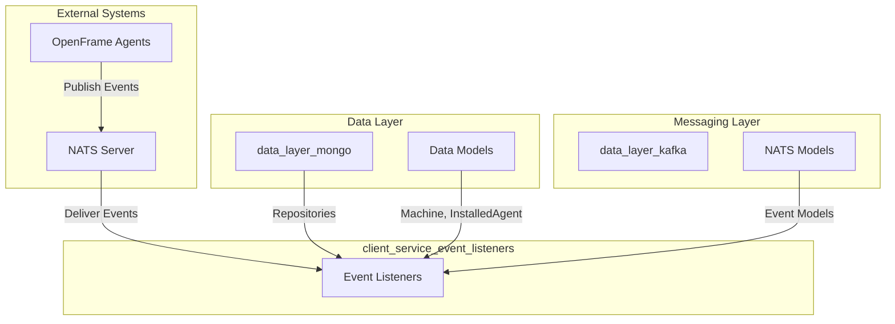
```mermaid
flowchart TD
    subgraph External["External Systems"]
        Agents["OpenFrame Agents"]
        NATS["NATS Server"]
    end
    
    subgraph DataLayer["Data Layer"]
        Mongo["data_layer_mongo"]
        Models["Data Models"]
    end
    
    subgraph Messaging["Messaging Layer"]
        Kafka["data_layer_kafka"]
        NatsModels["NATS Models"]
    end
    
    subgraph CurrentModule["client_service_event_listeners"]
        Listeners["Event Listeners"]
    end
    
    Agents -->|"Publish Events"| NATS
    NATS -->|"Deliver Events"| Listeners
    
    Mongo -->|"Repositories"| Listeners
    Models -->|"Machine, InstalledAgent"| Listeners
    
    NatsModels -->|"Event Models"| Listeners
```

**Key Dependencies**:
- **[data_layer_mongo](data_layer_mongo.md)**: Machine and InstalledAgent repositories
- **NATS Client**: Connection, JetStream, Dispatcher
- **Spring Cloud Stream**: Connection event bindings
- **Jackson**: JSON parsing

### Downstream Consumers

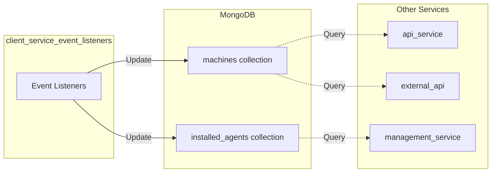
```mermaid
flowchart LR
    subgraph CurrentModule["client_service_event_listeners"]
        Listeners["Event Listeners"]
    end
    
    subgraph Database["MongoDB"]
        Machines["machines collection"]
        Agents["installed_agents collection"]
    end
    
    subgraph Services["Other Services"]
        API["api_service"]
        External["external_api"]
        Management["management_service"]
    end
    
    Listeners -->|"Update"| Machines
    Listeners -->|"Update"| Agents
    
    Machines -.->|"Query"| API
    Machines -.->|"Query"| External
    Agents -.->|"Query"| Management
```

**Data Consumers**:
- **[api_service](api_service.md)**: Queries machine status for UI
- **[external_api](external_api.md)**: Exposes machine data via REST API
- **[management_service](management_service.md)**: Monitors agent installations

---

## Deployment Considerations

### Scaling Strategy

**Horizontal Scaling**:

```mermaid
flowchart TD
    subgraph NATS["NATS Cluster"]
        Stream["JetStream Stream"]
        Consumer["Durable Consumer"]
    end
    
    subgraph Instance1["Client Service Instance 1"]
        L1["InstalledAgentListener"]
    end
    
    subgraph Instance2["Client Service Instance 2"]
        L2["InstalledAgentListener"]
    end
    
    subgraph Instance3["Client Service Instance 3"]
        L3["InstalledAgentListener"]
    end
    
    Stream --> Consumer
    
    Consumer -->|"Load Balanced"| L1
    Consumer -->|"Load Balanced"| L2
    Consumer -->|"Load Balanced"| L3
    
    Note1["Delivery Group:<br/>installed-agent"]
    
    Consumer -.-> Note1
```

**Scaling Characteristics**:

| Listener | Scaling | Load Balancing | Notes |
|----------|---------|----------------|-------|
| **ClientConnectionListener** | Horizontal | Spring Cloud Stream | Automatic via consumer group |
| **MachineHeartbeatListener** | Horizontal | NATS Queue Groups | All instances receive all messages |
| **InstalledAgentListener** | Horizontal | JetStream Delivery Group | Messages distributed across instances |

### Resource Requirements

**Memory**:
- Base: 256MB per instance
- Per 1000 machines: +50MB
- JetStream buffer: +100MB

**CPU**:
- Idle: 0.1 cores
- Per 1000 heartbeats/sec: +0.5 cores
- Per 100 agent installs/sec: +0.2 cores

**Network**:
- Heartbeat traffic: ~1KB per heartbeat
- Connection events: ~500 bytes per event
- Agent install events: ~1KB per event

### High Availability

**Failure Scenarios**:

```mermaid
flowchart TD
    subgraph Scenario1["Instance Failure"]
        S1A["Instance Crashes"]
        S1B["NATS Redelivers<br/>Unacked Messages"]
        S1C["Other Instances<br/>Process Messages"]
    end
    
    subgraph Scenario2["NATS Failure"]
        S2A["NATS Connection Lost"]
        S2B["Listeners Attempt<br/>Reconnection"]
        S2C["Messages Buffered<br/>in JetStream"]
        S2D["Resume on Reconnect"]
    end
    
    subgraph Scenario3["Database Failure"]
        S3A["MongoDB Unavailable"]
        S3B["Connection Events Lost"]
        S3C["Heartbeats Lost"]
        S3D["Agent Installs Retried"]
    end
    
    S1A --> S1B
    S1B --> S1C
    
    S2A --> S2B
    S2B --> S2C
    S2C --> S2D
    
    S3A --> S3B
    S3A --> S3C
    S3A --> S3D
```

**Recommendations**:
- Run at least 2 instances for HA
- Configure NATS reconnection with exponential backoff
- Monitor JetStream consumer lag
- Set up alerts for processing delays

---

## Performance Optimization

### Throughput Optimization

**Heartbeat Processing**:

```java
// Current: Synchronous processing
private void handleMessage(Message message) {
    String machineId = machineIdExtractor.extract(subject);
    machineStatusService.processHeartbeat(machineId, Instant.now());
}

// Optimized: Batch processing (future enhancement)
private void handleMessages(List<Message> messages) {
    Map<String, Instant> updates = messages.stream()
        .collect(Collectors.toMap(
            msg -> machineIdExtractor.extract(msg.getSubject()),
            msg -> Instant.now(),
            (t1, t2) -> t2.isAfter(t1) ? t2 : t1  // Keep latest
        ));
    
    machineStatusService.batchUpdate(updates);
}
```

**Database Optimization**:

```javascript
// MongoDB indexes for optimal query performance
db.machines.createIndex({ "machineId": 1 }, { unique: true })
db.machines.createIndex({ "status": 1, "lastSeen": -1 })
db.machines.createIndex({ "organizationId": 1, "status": 1 })

db.installed_agents.createIndex({ "machineId": 1, "agentType": 1 }, { unique: true })
db.installed_agents.createIndex({ "machineId": 1 })
```

### Latency Optimization

**Processing Pipeline**:

```mermaid
flowchart LR
    subgraph Current["Current (Synchronous)"]
        C1["Receive"] --> C2["Parse"]
        C2 --> C3["Extract"]
        C3 --> C4["DB Query"]
        C4 --> C5["DB Update"]
        C5 --> C6["Ack"]
    end
    
    subgraph Optimized["Optimized (Async)"]
        O1["Receive"] --> O2["Parse<br/>(Async)"]
        O2 --> O3["Extract<br/>(Cached)"]
        O3 --> O4["DB Update<br/>(Batched)"]
        O4 --> O5["Ack<br/>(Async)"]
    end
```

**Caching Strategy** (future enhancement):

```java
@Service
public class MachineStatusService {
    
    @Cacheable(value = "machines", key = "#machineId")
    public Machine findMachine(String machineId) {
        return machineRepository.findByMachineId(machineId)
            .orElseThrow(() -> new MachineNotFoundException(machineId));
    }
    
    @CacheEvict(value = "machines", key = "#machineId")
    public void updateStatus(String machineId, DeviceStatus status) {
        // Update logic
    }
}
```

---

## Testing

### Unit Testing

**Example: ClientConnectionListener Test**

```java
@ExtendWith(MockitoExtension.class)
class ClientConnectionListenerTest {
    
    @Mock
    private ObjectMapper objectMapper;
    
    @Mock
    private MachineStatusService machineStatusService;
    
    @InjectMocks
    private ClientConnectionListener listener;
    
    @Test
    void shouldProcessConnectedEvent() throws Exception {
        // Given
        String message = """
            {
                "timestamp": "2024-01-15T10:30:00Z",
                "client": {
                    "name": "machine-123"
                }
            }
            """;
        
        ClientConnectionEvent event = new ClientConnectionEvent();
        event.setTimestamp("2024-01-15T10:30:00Z");
        ClientConnectionEvent.Client client = new ClientConnectionEvent.Client();
        client.setName("machine-123");
        event.setClient(client);
        
        when(objectMapper.readValue(message, ClientConnectionEvent.class))
            .thenReturn(event);
        
        // When
        Consumer<String> consumer = listener.machineConnectedConsumer();
        consumer.accept(message);
        
        // Then
        verify(machineStatusService).updateToOnline(
            eq("machine-123"),
            eq(Instant.parse("2024-01-15T10:30:00Z"))
        );
    }
    
    @Test
    void shouldThrowExceptionOnParseError() throws Exception {
        // Given
        String invalidMessage = "invalid json";
        when(objectMapper.readValue(invalidMessage, ClientConnectionEvent.class))
            .thenThrow(new JsonProcessingException("Parse error") {});
        
        // When/Then
        Consumer<String> consumer = listener.machineConnectedConsumer();
        assertThrows(NatsException.class, () -> consumer.accept(invalidMessage));
    }
}
```

### Integration Testing

**Example: InstalledAgentListener Integration Test**

```java
@SpringBootTest
@Testcontainers
class InstalledAgentListenerIntegrationTest {
    
    @Container
    static NatsContainer natsContainer = new NatsContainer();
    
    @Container
    static MongoDBContainer mongoContainer = new MongoDBContainer("mongo:6.0");
    
    @Autowired
    private Connection natsConnection;
    
    @Autowired
    private InstalledAgentRepository installedAgentRepository;
    
    @Test
    void shouldProcessAgentInstallationEvent() throws Exception {
        // Given
        String machineId = "test-machine-123";
        String agentType = "tactical-rmm";
        String version = "2.5.0";
        
        InstalledAgentMessage message = new InstalledAgentMessage();
        message.setMachineId(machineId);
        message.setAgentType(agentType);
        message.setVersion(version);
        
        // When
        JetStream js = natsConnection.jetStream();
        js.publish("machine." + machineId + ".installed-agent",
            objectMapper.writeValueAsBytes(message));
        
        // Then
        await().atMost(5, TimeUnit.SECONDS).untilAsserted(() -> {
            Optional<InstalledAgent> agent = installedAgentRepository
                .findByMachineIdAndAgentType(machineId, agentType);
            
            assertThat(agent).isPresent();
            assertThat(agent.get().getVersion()).isEqualTo(version);
        });
    }
}
```

### Load Testing

**Heartbeat Load Test**:

```bash
# Simulate 1000 machines sending heartbeats every 30 seconds
for i in {1..1000}; do
  (
    while true; do
      nats pub "machine.machine-$i.heartbeat" ""
      sleep 30
    done
  ) &
done

# Monitor processing
watch -n 1 'curl -s http://localhost:8080/actuator/metrics/client.heartbeat.events.received'
```

**Agent Installation Load Test**:

```bash
# Simulate 100 concurrent agent installations
for i in {1..100}; do
  nats pub "machine.machine-$i.installed-agent" \
    '{"machineId":"machine-'$i'","agentType":"tactical-rmm","version":"2.5.0"}' &
done

# Monitor JetStream consumer
nats consumer info INSTALLED_AGENTS installed-agent-processor-v1
```

---

## Troubleshooting

### Common Issues

#### Issue 1: Messages Not Being Processed

**Symptoms**:
- No log entries for event processing
- Machine status not updating
- Agent installations not recorded

**Diagnosis**:

```bash
# Check NATS connection
nats account info

# Check JetStream consumer
nats consumer info INSTALLED_AGENTS installed-agent-processor-v1

# Check Spring Cloud Stream bindings
curl http://localhost:8080/actuator/bindings
```

**Solutions**:
- Verify NATS connection configuration
- Check consumer group configuration
- Verify subject/topic names match
- Check application logs for connection errors

#### Issue 2: High Message Redelivery Rate

**Symptoms**:
- `deliveredCount` consistently high
- Same messages processed multiple times
- JetStream consumer lag increasing

**Diagnosis**:

```bash
# Check consumer metrics
nats consumer report INSTALLED_AGENTS

# Check redelivery rate
nats consumer info INSTALLED_AGENTS installed-agent-processor-v1 | grep -A 5 "Redelivered"
```

**Solutions**:
- Increase `ackWait` timeout
- Fix database connection issues
- Add retry logic with exponential backoff
- Check for deadlocks in processing logic

#### Issue 3: Stale Events Being Processed

**Symptoms**:
- Warning logs about stale events
- Machine status flickering between online/offline
- Incorrect `lastSeen` timestamps

**Diagnosis**:

```bash
# Check event timestamps
nats sub "machine.*.connected" --raw

# Check machine lastSeen in database
mongo openframe --eval 'db.machines.find({machineId: "machine-123"}, {lastSeen: 1, status: 1})'
```

**Solutions**:
- Verify agent clock synchronization (NTP)
- Check for message replay in NATS
- Verify timestamp parsing logic
- Consider using server-side timestamps

#### Issue 4: Memory Leak in Listeners

**Symptoms**:
- Increasing memory usage over time
- OutOfMemoryError after extended runtime
- Slow garbage collection

**Diagnosis**:

```bash
# Heap dump analysis
jmap -dump:live,format=b,file=heap.bin <pid>

# Check for dispatcher leaks
jstack <pid> | grep -A 10 "nats"
```

**Solutions**:
- Ensure proper cleanup in `@PreDestroy` methods
- Verify dispatcher draining
- Check for unclosed resources
- Monitor thread pool sizes

---

## Future Enhancements

### Planned Improvements

1. **Batch Processing**
   - Aggregate multiple heartbeats before database update
   - Reduce database write load
   - Improve throughput for high-volume scenarios

2. **Event Sourcing**
   - Store all events in event log
   - Enable event replay for debugging
   - Support temporal queries (machine status at time T)

3. **Dead Letter Queue**
   - Move failed messages to DLQ after max retries
   - Enable manual inspection and reprocessing
   - Prevent message loss

4. **Metrics and Tracing**
   - Add Micrometer metrics for all listeners
   - Implement distributed tracing with OpenTelemetry
   - Create Grafana dashboards

5. **Circuit Breaker**
   - Implement circuit breaker for database calls
   - Prevent cascading failures
   - Graceful degradation

6. **Caching Layer**
   - Cache machine lookups
   - Reduce database load
   - Improve response times

---

## Related Documentation

- **[client_service_registration_auth](client_service_registration_auth.md)**: Agent registration and authentication
- **[data_layer_mongo](data_layer_mongo.md)**: MongoDB data models and repositories
- **[stream_processing](stream_processing.md)**: Kafka-based event streaming
- **[gateway_service](gateway_service.md)**: API gateway and routing

---

## References

### External Documentation

- **NATS JetStream**: https://docs.nats.io/nats-concepts/jetstream
- **Spring Cloud Stream**: https://spring.io/projects/spring-cloud-stream
- **MongoDB Indexes**: https://www.mongodb.com/docs/manual/indexes/

### Internal Resources

- **NATS Configuration**: See `application.yml` in client service
- **JetStream Setup**: See deployment documentation
- **Monitoring Dashboards**: See Grafana dashboard repository

---

## Changelog

| Version | Date | Changes |
|---------|------|---------|
| 1.0.0 | 2024-01-15 | Initial documentation |
| 1.1.0 | 2024-01-20 | Added InstalledAgentListener details |
| 1.2.0 | 2024-01-25 | Added troubleshooting section |

---

**For questions or issues, please contact the OpenFrame development team or join the [OpenMSP Slack community](https://join.slack.com/t/openmsp/shared_invite/zt-36bl7mx0h-3~U2nFH6nqHqoTPXMaHEHA).**
