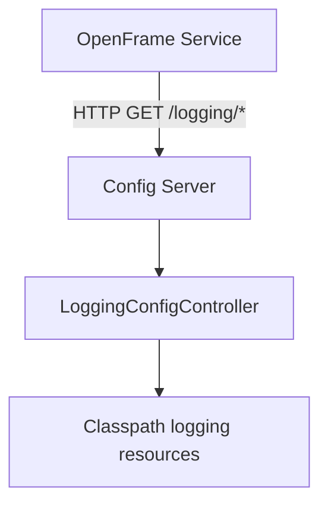
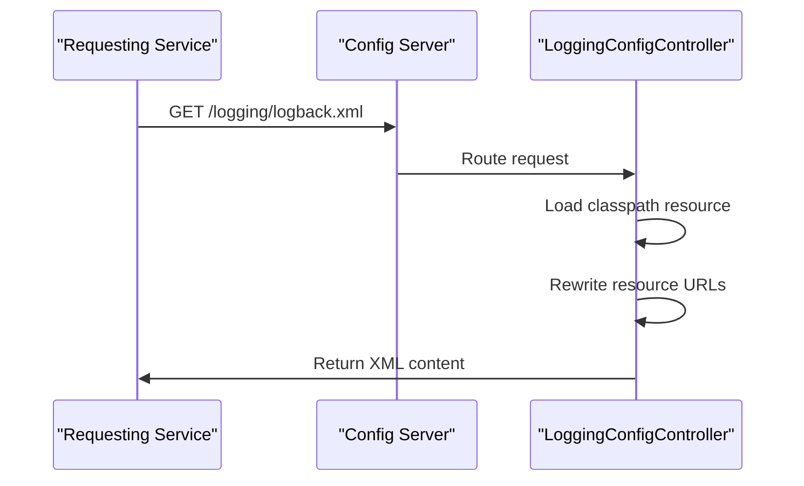

# Config Server Core

The **Config Server Core** module provides centralized configuration and logging configuration distribution for the OpenFrame platform. It is built on **Spring Cloud Config Server** and is responsible for serving configuration artifacts (such as logging XML files) to other OpenFrame services in a consistent, environment-aware way.

This module is deployed as part of the **Config Server service** and is consumed indirectly by nearly all backend services through HTTP-based configuration access.

---

## Purpose and Responsibilities

The Config Server Core module is responsible for:

- Enabling **Spring Cloud Config Server** capabilities for OpenFrame
- Exposing REST endpoints to serve **logging configuration files**
- Dynamically adapting logging configuration URLs based on the requesting server context
- Acting as a shared configuration backbone for microservices across the platform

It does **not** contain business logic or persistence; instead, it focuses purely on configuration delivery.

---

## Core Components Overview

| Component | Type | Responsibility |
|---------|------|----------------|
| `ConfigServerConfiguration` | Spring Configuration | Enables Spring Cloud Config Server functionality |
| `LoggingConfigController` | REST Controller | Serves logging configuration files over HTTP |

---

## Architecture Overview

The Config Server Core sits alongside other platform services and is accessed at runtime by services that need configuration or logging setup.

---

## Component Details

### ConfigServerConfiguration

**Location**
- `com.openframe.config.core.ConfigServerConfiguration`

**Responsibility**
- Activates Spring Cloud Config Server using the `@EnableConfigServer` annotation
- Allows the service to expose configuration repositories (classpath, Git, or other backends depending on deployment configuration)

**Key Characteristics**
- No custom logic
- Relies on Spring Boot auto-configuration
- Acts as a foundational bootstrap component for the Config Server service

---

### LoggingConfigController

**Location**
- `com.openframe.config.controller.LoggingConfigController`

**Endpoint**
- `GET /logging/{filename}`

**Produced Content Type**
- `application/xml`

**Responsibility**
- Serves logging configuration files stored under the classpath `logging/` directory
- Dynamically rewrites logging resource references to absolute URLs based on the incoming request
- Ensures logging frameworks (for example, Logback) can retrieve dependent resources via HTTP

**High-Level Flow**

**Key Implementation Notes**
- Uses `ClassPathResource` to load files from `logging/`
- Validates resource existence and returns `404` if missing
- Builds the server base URL from the incoming HTTP request
- Rewrites relative logging resource paths into absolute URLs

This behavior is critical for distributed deployments where logging appenders or includes must be resolvable over the network.

---

## How This Module Fits into the OpenFrame Platform

The Config Server Core module is a **cross-cutting infrastructure component**. While it has minimal internal logic, it plays an essential role in system stability and operability.

### Upstream Consumers

- API services
- Authorization server
- Gateway service
- Management service
- Stream processing services

These services retrieve logging and configuration data either at startup or runtime.

### Related Modules

- Config Server Service (runtime application wrapper)
- Security and OAuth modules (for secured config access in production)
- Gateway service (may proxy configuration access)

> For details on how configuration is consumed by individual services, refer to their respective service documentation.

---

## Operational Considerations

- **Classpath Resources**: Logging files must be packaged correctly under `logging/` in the classpath
- **Port Awareness**: The controller includes server port handling to correctly generate absolute URLs
- **Security**: In production environments, access to config endpoints is typically restricted via gateway or security filters

---

## Summary

The Config Server Core module provides the foundational configuration delivery mechanism for OpenFrame. By combining Spring Cloud Config Server with a purpose-built logging configuration controller, it ensures that all platform services can reliably retrieve and apply consistent configuration across environments.

Despite its small code footprint, this module is a critical dependency for observability, maintainability, and operational consistency across the OpenFrame ecosystem.
