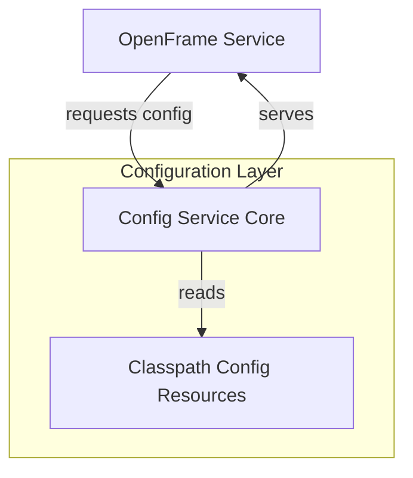
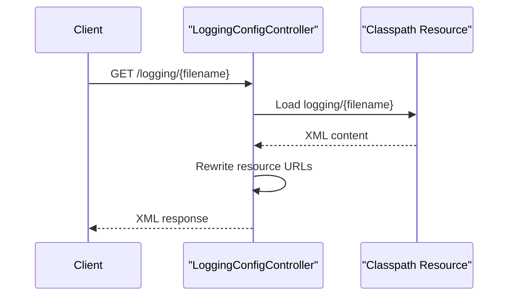

# Config Service Core

## Overview

The **Config Service Core** module provides centralized configuration management capabilities for the OpenFrame platform. It is built on top of **Spring Cloud Config Server** and is responsible for serving configuration artifacts (such as application configuration files and logging configurations) to other OpenFrame services at runtime.

This module enables:

- Centralized and consistent configuration distribution across services
- Dynamic retrieval of logging configuration files
- Environment-aware configuration serving through Spring Cloud Config

Within the overall Flamingo / OpenFrame architecture, Config Service Core acts as a foundational infrastructure service that other backend services depend on during startup and runtime.

---

## Core Responsibilities

The Config Service Core focuses on two primary responsibilities:

1. **Configuration Server Enablement**  
   Activating and exposing Spring Cloud Config Server capabilities.

2. **Logging Configuration Distribution**  
   Serving logging configuration files with runtime-aware URL rewriting so that clients can dynamically reference the correct endpoints.

---

## High-Level Architecture

The diagram below illustrates how Config Service Core fits into the OpenFrame service ecosystem.



---

## Core Components

### Config Server Configuration

**Component:** `ConfigServerConfiguration`

This component enables Spring Cloud Config Server functionality.

**Key Characteristics:**

- Uses the `@EnableConfigServer` annotation
- Activates Config Server endpoints for configuration retrieval
- Integrates seamlessly with Spring Boot auto-configuration

**Role in the System:**

- Acts as the backbone for centralized configuration management
- Allows other OpenFrame services to externalize configuration
- Supports multiple environments and profiles through Spring Cloud Config

---

### Logging Configuration Controller

**Component:** `LoggingConfigController`

This REST controller is responsible for serving logging configuration files (such as XML-based logging definitions) from the application classpath.

**Endpoint Overview:**

- **Base path:** `/logging`
- **Method:** `GET /logging/{filename}`
- **Response type:** `application/xml`

**Key Behaviors:**

- Loads logging configuration files from the `logging/` directory on the classpath
- Validates file existence and returns `404` if not found
- Dynamically rewrites internal resource references to absolute URLs based on the incoming request
- Ensures logging frameworks can correctly resolve referenced logging resources

---

## Logging Configuration Request Flow

The following diagram shows the request lifecycle when a client retrieves a logging configuration file.



---

## Runtime URL Rewriting Logic

When serving logging configuration files, the controller adjusts embedded resource paths so that they point back to the Config Service Core instance.

**Example Behavior:**

```text
Original reference:
resource="logging/logback.xml"

Rewritten reference:
url="https://config-service-host:port/logging/logback.xml"
```

This ensures:

- Logging frameworks can fetch referenced files over HTTP
- Configurations remain portable across environments
- No hard-coded hostnames are required in configuration files

---

## How This Module Fits Into the System

Config Service Core is typically started early in the platform lifecycle and is consumed by:

- API Service Core
- Gateway Service Core
- Authorization Service Core
- Management and Stream Processing services

Rather than duplicating configuration logic across services, OpenFrame relies on this module to act as the **single source of truth** for configuration data.

---

## Operational Considerations

- Configuration files are expected to be packaged within the service classpath or made available through configured backends supported by Spring Cloud Config.
- Logging configuration files should be placed under the `logging/` directory to be accessible via the logging endpoint.
- Proper access controls should be enforced at the platform level to restrict configuration exposure in production environments.

---

## Summary

The **Config Service Core** module provides essential configuration infrastructure for OpenFrame by:

- Enabling Spring Cloud Config Server
- Serving logging configuration files dynamically
- Ensuring consistent, environment-aware configuration delivery

It is a low-level but critical component that underpins the stability, observability, and manageability of the entire OpenFrame platform.
