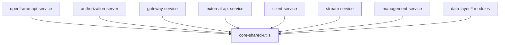
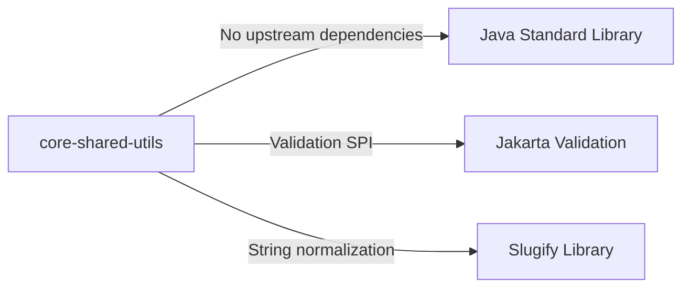

# Core Shared Utils

## Overview

The **core-shared-utils** module provides foundational, reusable utilities and DTOs that are shared across the OpenFrame backend ecosystem. These components are intentionally small, dependency-light, and framework-agnostic so they can be safely reused by API services, authorization services, gateway services, data layers, and supporting libraries without creating tight coupling.

This module currently focuses on:
- **Pagination DTOs** used consistently across REST and GraphQL APIs
- **String normalization utilities** for generating URL- and identifier-safe slugs
- **Validation helpers** that integrate with Jakarta Bean Validation

Because these utilities sit at the very bottom of the dependency graph, they do **not** depend on any higher-level OpenFrame modules.

---

## Position in the OpenFrame Architecture

The diagram below shows where `core-shared-utils` fits relative to other modules.



**Key architectural rule:**
- `core-shared-utils` may be depended on by *any* module
- `core-shared-utils` must **never** depend on service, data, or security modules

---

## Core Components

### 1. PageResponse

**Package:** `com.openframe.core.dto`

`PageResponse<T>` is a generic Data Transfer Object used to standardize paginated responses across OpenFrame services.

```java
public class PageResponse<T> {
    private List<T> items;
    private int page;
    private int size;
    private long totalElements;
    private int totalPages;
    private boolean hasNext;
}
```

#### Responsibilities
- Encapsulates paginated result sets
- Provides metadata required by frontend clients (page index, size, totals)
- Avoids leaking persistence-layer pagination objects into API contracts

#### Usage Across the Platform
`PageResponse` is commonly returned by:
- API controllers in **openframe-api-service**
- External-facing endpoints in **external-api-service**
- Admin and management endpoints in **management-service**

It pairs naturally with filter and criteria DTOs defined in `api-lib-dtos`.

---

### 2. SlugUtil

**Package:** `com.openframe.core.util`

`SlugUtil` provides a centralized way to generate URL-safe, human-readable slugs from arbitrary input strings.

```java
public final class SlugUtil {
    public static String toSlug(String input) {
        String base = (input == null ? "org" : input);
        return SLUGIFY.slugify(base);
    }
}
```

#### Responsibilities
- Normalizes names into lowercase, URL-safe slugs
- Enforces consistent slug formatting across services
- Provides a safe fallback value when input is null

#### Typical Use Cases
- Organization identifiers
- Tenant subdomains
- Human-readable resource identifiers

#### Design Notes
- Uses a preconfigured `Slugify` instance
- Stateless and thread-safe
- Private constructor enforces static-only usage

---

### 3. ValidEmailValidator

**Package:** `com.openframe.core.validation`

`ValidEmailValidator` integrates with **Jakarta Bean Validation** to validate email fields using a configurable regular expression.

```java
public class ValidEmailValidator
        implements ConstraintValidator<ValidEmail, String> {

    @Override
    public boolean isValid(String value, ConstraintValidatorContext context) {
        if (value == null) {
            return false;
        }
        return pattern.matcher(value).matches();
    }
}
```

#### Responsibilities
- Validates email addresses against a regex defined on the `@ValidEmail` annotation
- Centralizes email validation logic
- Ensures consistent behavior across services

#### Usage Across the Platform
This validator is typically used in:
- User registration and invitation flows
- Authorization and authentication services
- API request DTO validation

It is especially relevant in:
- **openframe-api-service** (user and invitation APIs)
- **authorization-server** (registration and password reset flows)

---

## Dependency Characteristics



**Characteristics:**
- No Spring dependencies
- No persistence dependencies
- Safe to reuse in synchronous and reactive contexts

---

## Design Principles

The module follows a strict set of principles:

1. **Low-level only** – no business logic
2. **Stateless utilities** – safe for concurrent use
3. **Minimal dependencies** – easy to embed everywhere
4. **Consistency enforcers** – pagination, slugs, validation behave the same everywhere

---

## When to Extend core-shared-utils

Add new utilities here **only if**:
- They are truly cross-cutting
- They do not depend on Spring, security, or persistence
- They would otherwise be duplicated across multiple modules

Examples of good candidates:
- Generic DTO helpers
- Cross-service validation utilities
- Identifier or formatting helpers

Examples of bad candidates:
- API-specific DTOs
- Service-layer helpers
- Database-aware utilities

---

## Summary

`core-shared-utils` is a small but critical foundation of the OpenFrame platform. By centralizing pagination models, string normalization, and validation logic, it ensures consistency and reduces duplication across the entire system while remaining easy to reason about and safe to depend on from anywhere in the stack.
