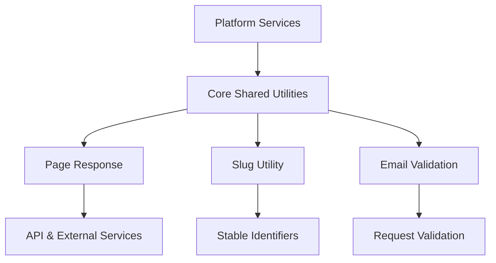
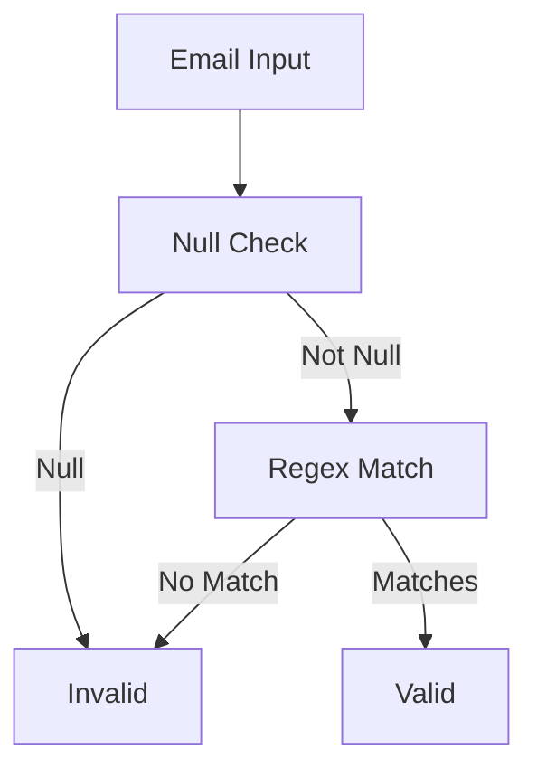

# Core Shared Utilities

## Overview

The **Core Shared Utilities** module provides a small but critical set of foundational building blocks that are reused across the OpenFrame and Flamingo backend ecosystem. These utilities are intentionally framework-agnostic and lightweight, enabling consistent behavior across API services, authorization flows, management services, and external integrations.

Rather than implementing business logic, Core Shared Utilities focuses on **cross-cutting concerns** such as:

- Standardized pagination responses
- Deterministic slug generation
- Centralized validation primitives

Because of this role, the module is a transitive dependency for many other service cores and libraries.

---

## Design Goals

The Core Shared Utilities module is designed with the following principles:

- **Reusability** – Components are generic and usable across services and domains
- **Stability** – APIs are simple and rarely change
- **Low coupling** – No direct dependency on service-specific logic
- **Consistency** – Shared conventions for pagination, identifiers, and validation

---

## High-Level Architecture



At runtime, Core Shared Utilities does not operate independently. Instead, it is embedded into:

- API Service Core
- External API Service Core
- Management Service Core
- Authorization and Security modules

---

## Core Components

### Page Response

**Component:** `PageResponse<T>`

The Page Response component provides a standardized data transfer object for paginated responses across REST and GraphQL APIs.

#### Responsibilities

- Encapsulate a page of items
- Provide pagination metadata in a consistent format
- Reduce duplication of pagination models across services

#### Structure

```java
public class PageResponse<T> {
    private List<T> items;
    private int page;
    private int size;
    private long totalElements;
    private int totalPages;
    private boolean hasNext;
}
```

#### Usage Context

Page Response is commonly used by:

- API controllers returning paginated datasets
- External API endpoints
- Service-to-service contracts

It ensures that clients (UI, SDKs, or integrations) can rely on a uniform pagination schema regardless of the underlying service.

---

### Slug Utility

**Component:** `SlugUtil`

The Slug Utility provides deterministic and normalized slug generation for identifiers derived from user-provided or system-provided strings.

#### Responsibilities

- Convert arbitrary strings into URL-safe slugs
- Enforce lowercase formatting
- Ensure predictable fallback behavior

#### Behavior

- Converts input text to a lowercase slug
- Uses hyphens as separators
- Falls back to a default value when input is null

```java
public static String toSlug(String input) {
    String base = (input == null ? "org" : input);
    return SLUGIFY.slugify(base);
}
```

#### Usage Context

Slug Utility is typically used for:

- Organization identifiers
- Tenant or workspace keys
- URL-friendly resource names

This ensures consistent identifier generation across services and environments.

---

### Valid Email Validator

**Component:** `ValidEmailValidator`

The Valid Email Validator is a Jakarta Bean Validation constraint validator used to enforce email format validation in request DTOs.

#### Responsibilities

- Validate email strings using a configurable regular expression
- Integrate seamlessly with Jakarta Validation annotations
- Centralize email validation logic

#### Validation Flow



#### Usage Context

This validator is applied in:

- API request DTOs
- Registration and invitation flows
- User management endpoints

By centralizing email validation, services avoid diverging validation rules and reduce duplicated regex logic.

---

## How This Module Fits Into the System

Core Shared Utilities sits at the **lowest shared layer** of the OpenFrame platform:

- It has **no dependency on service cores**
- It is imported by multiple libraries and services
- Changes should be backward-compatible whenever possible

Because of its foundational role, even small changes can have wide-reaching effects. As a result:

- New utilities should be added sparingly
- Existing utilities should remain stable
- Business logic must not be introduced here

---

## When to Use Core Shared Utilities

Use this module when you need:

- A standard pagination response type
- Consistent slug generation logic
- Reusable validation primitives

Avoid using this module for:

- Service-specific logic
- Domain-specific models
- Infrastructure or persistence concerns

---

## Summary

The **Core Shared Utilities** module provides essential, reusable primitives that promote consistency and stability across the OpenFrame ecosystem. While small in scope, it plays a critical role in unifying how services paginate data, generate identifiers, and validate inputs.

Its simplicity is intentional—making it one of the most widely depended-on modules in the platform.