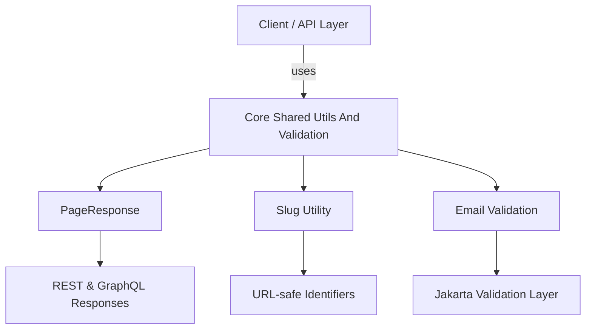

# Core Shared Utils And Validation

## Overview

The **Core Shared Utils And Validation** module provides foundational, cross-cutting utilities and data structures used consistently across the OpenFrame and Flamingo backend ecosystem. It is intentionally small, stable, and dependency-light, acting as a **shared contract layer** for pagination, identifier normalization, and input validation.

This module is consumed by a wide range of services, including API services, authorization servers, management services, gateway components, and frontend-facing APIs. By centralizing these concerns, the platform ensures:

- Consistent pagination semantics across REST, GraphQL, and internal APIs
- Deterministic and URL-safe slug generation
- Unified validation rules for common data types such as email addresses

---

## Responsibilities

The Core Shared Utils And Validation module focuses on three primary responsibilities:

1. **Pagination DTOs** – Standardized response models for paginated data
2. **Utility Functions** – Reusable helpers for string normalization and identifiers
3. **Validation Primitives** – Jakarta Validation-compatible validators for shared constraints

This module deliberately avoids business logic and persistence concerns, making it safe to reuse across bounded contexts.

---

## Architecture Overview

**Key architectural traits:**
- No runtime coupling to persistence or transport layers
- Safe to use in synchronous and reactive services
- Designed for long-term API stability

---

## Core Components

### PageResponse

**Component:** `PageResponse<T>`

`PageResponse` is a generic Data Transfer Object used to represent paginated results in a consistent way across services.

**Primary use cases:**
- REST controllers returning paginated collections
- GraphQL resolvers exposing list queries
- Internal service-to-service APIs

**Fields and semantics:**

| Field | Type | Description |
|------|------|-------------|
| `items` | `List<T>` | The current page of items |
| `page` | `int` | Zero- or one-based page index (defined by caller) |
| `size` | `int` | Page size requested |
| `totalElements` | `long` | Total number of elements across all pages |
| `totalPages` | `int` | Total number of pages available |
| `hasNext` | `boolean` | Whether a subsequent page exists |

**Design notes:**
- Uses Lombok to reduce boilerplate
- Builder-friendly via `@SuperBuilder`
- Transport-agnostic (not tied to Spring or GraphQL types)

This DTO is widely reused in API, management, and external service layers to guarantee consistent pagination behavior.

---

### SlugUtil

**Component:** `SlugUtil`

`SlugUtil` provides a centralized mechanism for generating **URL-safe, human-readable slugs** from arbitrary input strings.

**Behavior:**
- Converts input to lowercase
- Replaces spaces and special characters with hyphenated equivalents
- Ensures deterministic output for the same input
- Falls back to a default base value when input is null

**Key characteristics:**
- Built on top of a preconfigured `Slugify` instance
- Thread-safe due to immutable configuration
- Prevents underscore-based slugs to maintain URL consistency

**Typical usage scenarios:**
- Organization identifiers
- Tenant or domain slugs
- Public-facing resource URLs

By centralizing slug generation, the platform avoids subtle inconsistencies between services.

---

### ValidEmailValidator

**Component:** `ValidEmailValidator`

`ValidEmailValidator` is a Jakarta Validation `ConstraintValidator` implementation used to enforce email format constraints across DTOs and request models.

**How it works:**
- Reads a regular expression from the associated `@ValidEmail` annotation
- Compiles the pattern during initialization
- Validates input values at runtime using the compiled pattern

**Validation rules:**
- `null` values are considered invalid
- Matching behavior is entirely driven by the annotation configuration

**Integration points:**
- REST request DTO validation
- Authorization and registration flows
- User and invitation management APIs

This validator ensures that email validation logic remains consistent and configurable across the entire system.

---

## Interaction With Other Modules

Although small, Core Shared Utils And Validation is a **transversal dependency** used by many higher-level modules:

- **API and External API services** rely on `PageResponse` for consistent list responses
- **Authorization and Security services** use shared validation for user-facing inputs
- **Management and Gateway services** reuse slug generation for identifiers and routing
- **Frontend-facing APIs** indirectly benefit from stable pagination and validation contracts

To avoid tight coupling, this module does not reference those services directly. Instead, it provides primitives that other modules build upon.

---

## Design Principles

- **Minimal surface area** – Only broadly useful, stable utilities belong here
- **No business logic** – Domain rules live in higher-level modules
- **Backward compatibility** – Changes are rare and carefully considered
- **Framework-friendly** – Compatible with Spring, Jakarta Validation, and GraphQL

---

## When To Extend This Module

Consider adding functionality to Core Shared Utils And Validation only if:

- The utility or DTO is required by multiple independent modules
- The logic is not domain-specific
- The API is unlikely to change frequently

Otherwise, prefer placing logic closer to the consuming module.

---

## Summary

The **Core Shared Utils And Validation** module is a foundational building block of the OpenFrame platform. By standardizing pagination, identifier normalization, and validation primitives, it enables consistency, reliability, and reuse across the entire service ecosystem while remaining simple, stable, and easy to maintain.