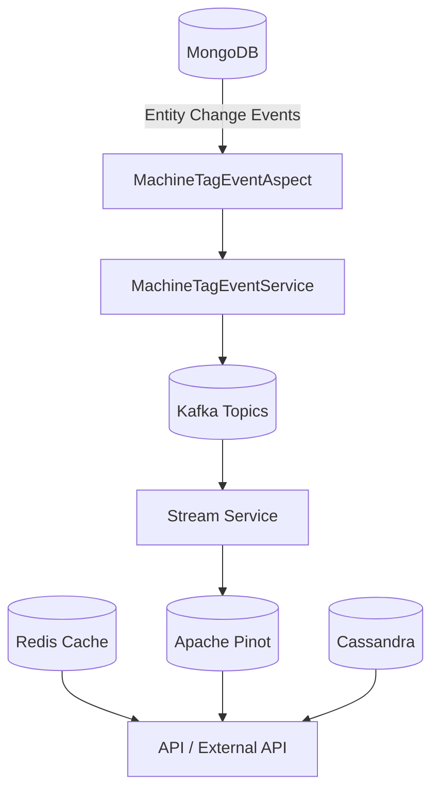

# Data Layer: Kafka, Redis, Cassandra, Pinot

## Overview
This module provides the **event-driven, cached, and analytical data layer** for OpenFrame. It integrates **Kafka** for streaming events, **Redis** for low-latency caching, **Cassandra** for scalable persistence, and **Apache Pinot** for real-time analytics and filtering.

It acts as the backbone between:
- transactional data changes (MongoDB repositories)
- streaming pipelines (Kafka, Debezium)
- analytical queries (Pinot-backed filters, logs, devices)
- runtime performance optimization (Redis cache)

## High-Level Architecture

## Core Responsibilities

| Technology | Responsibility |
|-----------|----------------|
| Kafka | Event streaming, device & tag change propagation |
| Redis | Tenant-aware caching, Spring Cache abstraction |
| Cassandra | Scalable persistent storage (time-series / wide rows) |
| Pinot | Real-time analytics, filtering, and aggregation |

## Sub-Modules

- [Kafka Integration](data-layer-kafka.md)
- [Redis Cache Layer](data-layer-redis.md)
- [Cassandra Configuration](data-layer-cassandra.md)
- [Pinot Analytics](data-layer-pinot.md)

## Data Flow Summary
1. MongoDB repository saves trigger AOP aspects
2. Domain events are transformed into Kafka messages
3. Stream services enrich and persist into Pinot
4. APIs query Pinot for fast filters and logs
5. Redis accelerates hot-path queries

## Key Design Principles
- **Tenant Isolation** (Kafka topics, Redis keys, Cassandra keyspaces)
- **Event-Driven Architecture**
- **Read/Write Separation** (Mongo vs Pinot)
- **Horizontal Scalability**

This module is consumed heavily by:
- stream-service
- api-service
- external-api-service
