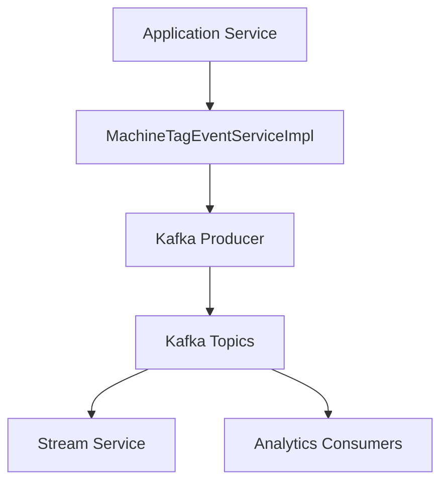
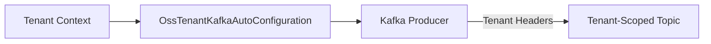
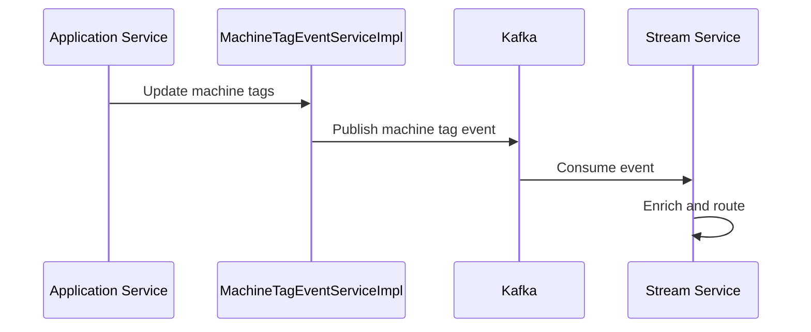

# data-layer-kafka Module

## Overview

The **data-layer-kafka** module is the Kafka-centric data infrastructure layer within the OpenFrame platform. It provides standardized configuration, topic management, message models, and recovery mechanisms for producing and consuming Kafka events across services.

This module acts as the backbone for **event-driven communication**, enabling reliable propagation of domain events such as device state changes, machine tag updates, Debezium CDC events, and analytics-bound messages (for Pinot) across the OpenFrame ecosystem.

It is used primarily by:
- Stream processing services
- Management and ingestion pipelines
- Data enrichment and analytics layers

---

## Core Responsibilities

- Centralized Kafka configuration (bootstrap servers, serializers, retries)
- Tenant-aware Kafka auto-configuration
- Topic definition and lifecycle abstraction
- Standardized Kafka message models
- Retry and recovery handling for failed producers
- Emission of domain events related to machine tags and device state

---

## Key Components

### Configuration Components

#### KafkaTopicProperties
Defines Kafka topic metadata and per-topic configuration such as:
- Topic names
- Partition counts
- Replication factors
- Retention policies

This allows topics to be managed declaratively and reused consistently across services.

#### OssKafkaConfig
Provides the base Kafka client configuration, including:
- Bootstrap server resolution
- Producer and consumer defaults
- Serialization and deserialization strategy

It acts as the foundation for all Kafka producers and consumers in the platform.

#### OssTenantKafkaAutoConfiguration
Enables **tenant-aware Kafka setup**. This component ensures:
- Kafka clients are initialized per tenant context
- Topic naming and headers are tenant-safe
- Multi-tenant isolation is preserved at the messaging layer

---

### Message Models

#### DebeziumMessage
A normalized representation of Debezium Change Data Capture (CDC) events. It encapsulates:
- Operation type (create, update, delete)
- Before and after state
- Source metadata

These messages are typically produced by Debezium connectors and consumed by the stream-service for downstream processing.

#### MachinePinotMessage
Represents analytics-ready machine events destined for Apache Pinot. It contains:
- Device and tenant identifiers
- Timestamped event data
- Pre-aggregated or flattened fields optimized for OLAP queries

---

### Reliability and Recovery

#### KafkaRecoveryHandlerImpl
Implements producer-side recovery logic, handling:
- Retry exhaustion
- Dead-letter publishing (where configured)
- Error logging and observability hooks

This ensures transient Kafka failures do not result in silent data loss.

---

### Domain Event Integration

#### MachineTagEventServiceImpl
Bridges domain-level machine tag changes to Kafka events. It:
- Listens to machine tag mutations (often via aspects)
- Constructs standardized Kafka messages
- Publishes events for downstream consumers such as stream processing or analytics

---

## Architecture Overview

---

## Tenant-Aware Kafka Flow

This flow ensures that all produced messages carry sufficient context for isolation and routing in multi-tenant deployments.

---

## Data Flow Example: Machine Tag Update

---

## Interaction With Other Modules

The data-layer-kafka module is tightly integrated with:

- **stream-service**: Consumes Kafka events for enrichment, transformation, and routing
- **management-service**: Initializes and monitors Kafka-related infrastructure
- **data-layer-pinot**: Consumes analytics-bound messages for OLAP storage
- **data-layer-cassandra** and **data-layer-mongo**: Act as sources of state changes that emit Kafka events

These interactions are event-driven and loosely coupled, allowing services to evolve independently.

---

## Operational Considerations

- Ensure Kafka topics defined in `KafkaTopicProperties` are provisioned before production traffic
- Monitor producer retry and recovery metrics exposed by `KafkaRecoveryHandlerImpl`
- Validate tenant headers and topic naming conventions in multi-tenant deployments
- Coordinate schema evolution carefully for shared message models such as `DebeziumMessage`

---

## Summary

The **data-layer-kafka** module provides the foundational Kafka abstractions required for reliable, tenant-aware, and scalable event-driven architecture in OpenFrame. By centralizing configuration, standardizing message models, and enforcing recovery patterns, it enables consistent and safe use of Kafka across the entire platform.
