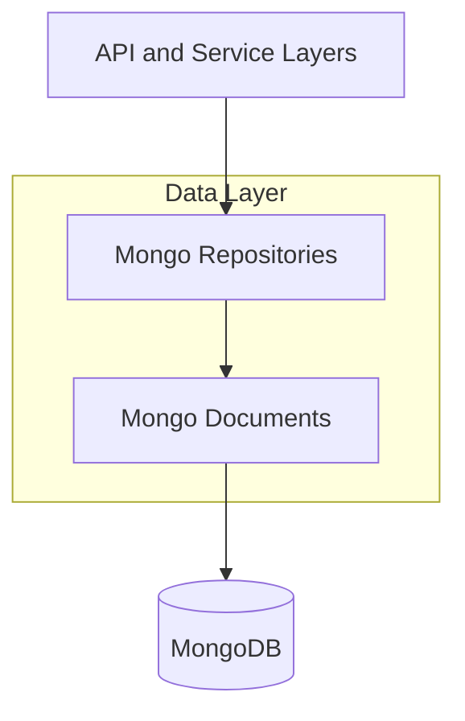
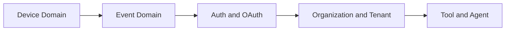
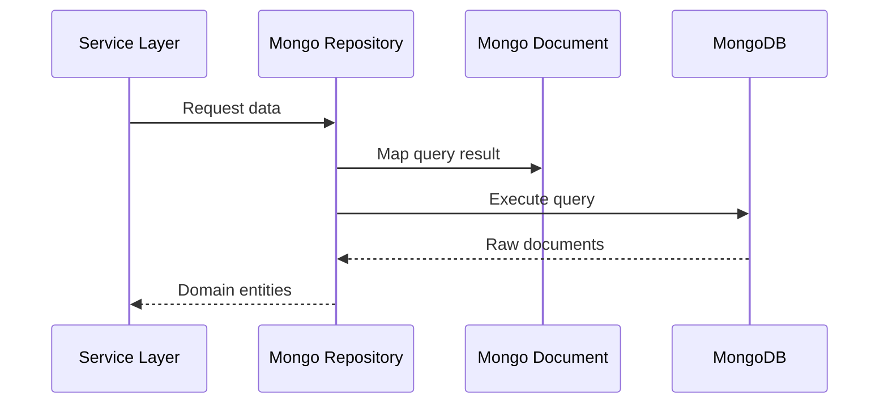

# data-layer-mongo-documents

## Overview

The **data-layer-mongo-documents** module defines the **MongoDB document models** used across the OpenFrame platform. These documents represent the persistent domain entities stored in MongoDB and form the foundation for higher-level repositories, services, and APIs.

This module is intentionally **schema-focused**:
- It contains **MongoDB document definitions only** (no business logic).
- It is consumed by **data-layer-mongo-repositories**, which provide query and persistence behavior.
- It is indirectly used by API, authorization, management, stream, and client services through repositories and DTO mappers.

In short, this module answers the question:
> *What data is stored in MongoDB, and how is it structured?*

---

## Responsibilities

- Define MongoDB collections and their schemas
- Model tenant-scoped and global entities
- Provide a stable contract for repositories and query filters
- Enable consistent indexing and querying strategies

**Non-goals:**
- No REST, GraphQL, or service-layer logic
- No repository implementations
- No cross-database integrations

---

## Position in the Architecture

- This module sits at the **lowest level of the Mongo data stack**
- All Mongo persistence flows depend on these document definitions

For repository behavior, see **data-layer-mongo-repositories.md**.

---

## Document Categories

The documents in this module are grouped by **domain responsibility**.

---

## Device Domain Documents

These documents describe managed devices, their state, and security posture.

### Alert

Represents a **device-level alert**, typically generated from monitoring, compliance, or security events.

**Key concepts:**
- Severity and classification
- Device association
- Time-based lifecycle (created, resolved)

Used by:
- API services for alert visibility
- Stream services for alert generation

---

### ComplianceRequirement

Defines a **compliance rule or requirement** applied to devices.

**Key concepts:**
- Compliance standard mapping
- Pass/fail evaluation
- Device applicability

---

### MachineTag

Represents **tags applied to devices** for grouping, filtering, and automation.

**Key concepts:**
- Key/value semantics
- Tenant-scoped
- Used heavily for filtering in APIs and UI

---

### SecurityAlert

Specialized alert focused on **security-related events**.

**Key concepts:**
- Threat classification
- Source identification
- Correlation with external security tools

---

## Event Domain Documents

Event documents capture **time-series and audit-style data**.

### CoreEvent

The base representation for **internal platform events**.

**Key concepts:**
- Event type and source
- Timestamped payload
- Tenant and device context

Used by:
- Stream processing
- Audit and activity feeds
- External API queries

---

### ExternalApplicationEvent

Represents events ingested from **external integrated tools**.

**Key concepts:**
- External source identification
- Normalized event structure
- Mapping to internal event taxonomy

Often populated by:
- Stream service handlers
- Debezium and Kafka pipelines

---

## Authentication and OAuth Documents

These documents support OAuth2, OIDC, and SSO flows.

### MongoRegisteredClient

MongoDB-backed representation of an **OAuth2 client registration**.

**Key concepts:**
- Client credentials
- Grant types
- Redirect URIs
- Tenant association

Used by:
- authorization-server
- security-oauth-bff

---

### OAuthToken

Stores issued **OAuth access and refresh tokens**.

**Key concepts:**
- Token value and expiry
- Subject and client mapping
- Revocation support

---

## Organization and Tenant Documents

These documents model multi-tenancy and organizational structure.

### ContactPerson

Represents a **contact person associated with an organization**.

**Key concepts:**
- Identity and contact details
- Organizational role

---

### SSOPerTenantConfig

Defines **SSO configuration at the tenant level**.

**Key concepts:**
- Identity provider metadata
- Enablement flags
- Tenant isolation

Used by:
- authorization-server
- API services during login and discovery

---

## Tool and Agent Documents

These documents support integrated tools and deployed agents.

### IntegratedToolAgent

Represents an **agent instance linked to an integrated tool**.

**Key concepts:**
- Tool association
- Agent lifecycle
- Connectivity state

---

### ToolAgentAsset

Represents a **binary or resource asset** associated with a tool agent.

**Key concepts:**
- Asset metadata
- Versioning
- Distribution references

---

### LocalFilenameConfiguration

Defines **local filename mapping rules** for tool agents.

**Key concepts:**
- Platform-specific file naming
- Download and storage consistency

---

## Document Interaction Flow

The following illustrates how documents are typically used at runtime.

---

## Design Principles

- **Tenant-first modeling**: Most documents include tenant identifiers
- **Explicit schemas**: Avoid dynamic or loosely typed fields
- **Separation of concerns**: Documents are persistence-only
- **Index-aware design**: Optimized for repository query patterns

---

## Related Modules

- **data-layer-mongo-config.md** – MongoDB configuration and indexing
- **data-layer-mongo-repositories.md** – Repository interfaces and custom queries
- **authorization-server.md** – OAuth and SSO flows using Mongo documents
- **stream-service.md** – Event ingestion and enrichment

---

## Summary

The **data-layer-mongo-documents** module is the **schema backbone** of OpenFrame’s MongoDB persistence layer. By clearly defining domain-specific documents and keeping them free of business logic, it enables:

- Consistent data modeling
- Reusable repository logic
- Scalable multi-tenant storage

Any change to these documents has **platform-wide impact**, making this module one of the most critical building blocks in the OpenFrame architecture.
