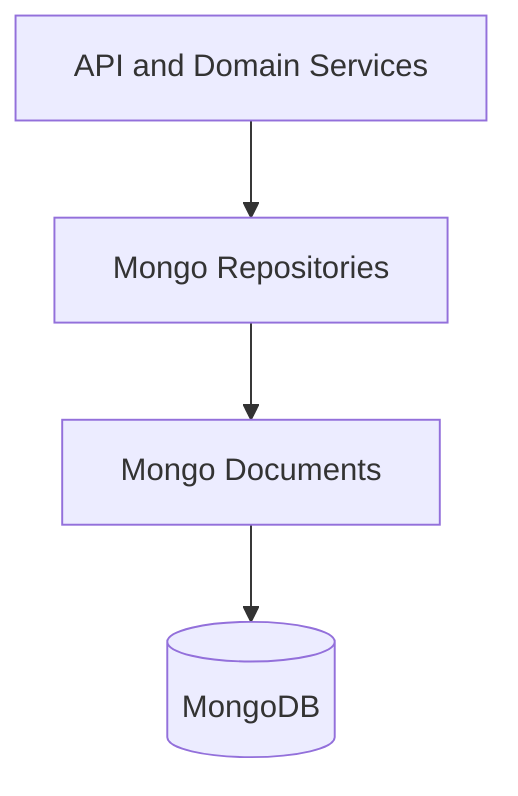
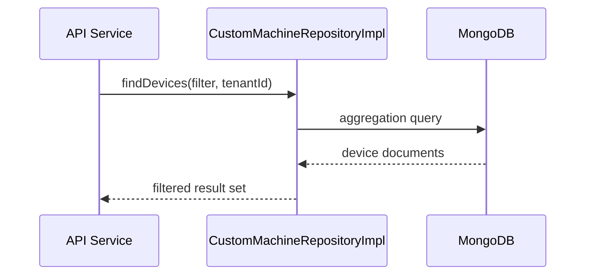

# data-layer-mongo-repositories

## Overview

The **data-layer-mongo-repositories** module provides the persistence abstraction for OpenFrame services backed by MongoDB. It contains a mix of **Spring Data MongoDB repositories**, **reactive repositories**, and **custom repository implementations** that encapsulate complex query logic, tenant scoping, filtering, and aggregation use cases.

This module sits directly on top of the MongoDB document model defined in **data-layer-mongo-documents** and is consumed by higher-level services such as:

- `openframe-api-service`
- `authorization-server`
- `management-service`
- `external-api-service`

The repositories in this module are responsible for:

- Tenant-aware data access
- Advanced filtering (devices, events, organizations, tools)
- Reactive access for OAuth and user flows
- Custom Mongo queries and aggregations not expressible via derived query methods

---

## Position in the Architecture

- **API and Domain Services** live in modules like `openframe-api-service` and `authorization-server`
- **Mongo Repositories** are defined in this module
- **Mongo Documents** come from `data-layer-mongo-documents.md`
- **MongoDB** is the backing datastore

---

## Repository Categories

The module contains three main repository styles:

1. **Reactive repositories** – used for OAuth and authentication flows
2. **Base repositories** – shared CRUD and tenant-aware functionality
3. **Custom repository implementations** – complex queries, filtering, and aggregations

---

## Reactive Repositories

### ReactiveOAuthClientRepository

**Purpose**:

Provides reactive access to OAuth client registrations stored in MongoDB. This repository is primarily used by the **authorization-server** during OAuth2 and OIDC flows.

**Key characteristics**:

- Reactive (Project Reactor based)
- Non-blocking I/O
- Optimized for high-concurrency authentication traffic

**Consumed by**:

- Authorization server OAuth flows
- Client registration and token issuance logic

---

### ReactiveUserRepository

**Purpose**:

Provides reactive access to user documents for authentication, registration, and identity resolution.

**Responsibilities**:

- Lookup users by email, ID, or external identity
- Support reactive login and registration pipelines

**Consumed by**:

- Authorization server
- User-related security processors

---

## Base Repositories

Base repositories define shared behavior and are commonly extended or composed by custom implementations.

### BaseUserRepository

**Purpose**:

Provides common user persistence operations with tenant-awareness.

**Typical responsibilities**:

- Tenant-scoped user queries
- Common CRUD helpers
- Shared query fragments

---

### BaseApiKeyRepository

**Purpose**:

Manages API keys associated with tenants, users, or services.

**Responsibilities**:

- Store and retrieve API keys
- Enforce tenant boundaries
- Support usage tracking and statistics

**Consumed by**:

- API gateway
- Management service schedulers

---

### BaseTenantRepository

**Purpose**:

Encapsulates tenant-level persistence concerns.

**Notable feature**:

- `DomainView`: a projection used to efficiently resolve tenant domain metadata without loading full tenant documents

**Consumed by**:

- Authorization server tenant discovery
- API service tenant resolution

---

## Custom Repository Implementations

Custom repositories implement advanced MongoDB queries using `MongoTemplate` or aggregation pipelines.

### CustomMachineRepositoryImpl

**Purpose**:

Handles advanced device and machine queries beyond simple CRUD.

**Common use cases**:

- Device filtering by tags, status, compliance, or security alerts
- Aggregated device counts per tenant
- Cross-collection joins (logical) using aggregation pipelines

**Consumed by**:

- Device services in `openframe-api-service`
- External API device endpoints

---

### CustomEventRepositoryImpl

**Purpose**:

Provides advanced querying for event data stored in MongoDB.

**Responsibilities**:

- Apply `EventQueryFilter`
- Time-range filtering
- Pagination and sorting
- Aggregation for analytics-style queries

**Consumed by**:

- EventDataFetcher
- External API event endpoints

---

### ExternalApplicationEventRepository

**Purpose**:

Manages events originating from external applications and integrations.

**Responsibilities**:

- Persist externally sourced events
- Support integration-specific lookups

**Consumed by**:

- Integration services
- Stream processing backfills

---

### CustomOrganizationRepositoryImpl

**Purpose**:

Implements organization-specific query logic.

**Common use cases**:

- Organization filtering using `OrganizationQueryFilter`
- Pagination and sorting for organization listings
- Tenant-aware organization lookups

**Consumed by**:

- Organization controllers
- External API organization endpoints

---

### CustomIntegratedToolRepositoryImpl

**Purpose**:

Handles advanced queries for integrated tools and tool agents.

**Responsibilities**:

- Filter tools using `ToolQueryFilter`
- Resolve tool-agent relationships
- Support management and provisioning workflows

**Consumed by**:

- Management service
- Tool-related API endpoints

---

### OAuthTokenRepository

**Purpose**:

Manages OAuth tokens stored in MongoDB.

**Responsibilities**:

- Persist access and refresh tokens
- Token revocation and lookup
- Support OAuth lifecycle operations

**Consumed by**:

- Authorization server

---

## Data Flow Example

The following illustrates a typical data access flow for a filtered device query.

---

## Tenant Awareness

A core design principle of this module is **strict tenant isolation**:

- Tenant identifiers are mandatory in queries
- Base repositories enforce tenant scoping
- Custom implementations embed tenant filters at the query level

This ensures:

- No cross-tenant data leakage
- Predictable query performance
- Simplified security auditing

---

## Related Documentation

- See **data-layer-mongo-documents.md** for MongoDB document definitions
- See **data-layer-mongo-config.md** for MongoDB and index configuration
- Refer to platform documentation for service-level usage patterns

---

## Summary

The **data-layer-mongo-repositories** module is the backbone of MongoDB persistence in OpenFrame. By combining Spring Data repositories, reactive access patterns, and carefully designed custom implementations, it enables:

- Scalable tenant-aware data access
- Rich filtering and aggregation
- Clean separation between domain logic and persistence

This module allows higher-level services to remain focused on business logic while relying on a consistent, well-defined data access layer.