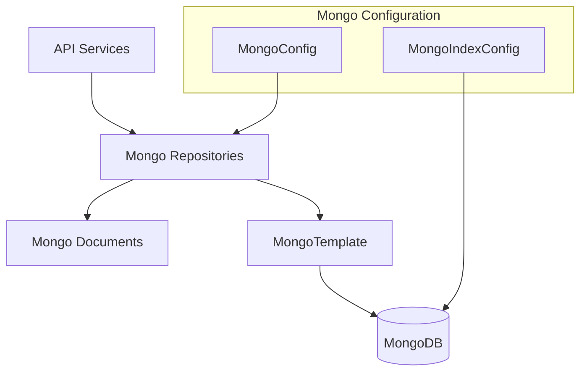

# Data Layer Mongo

## Overview

The **data-layer-mongo** module provides the MongoDB-backed persistence layer for the OpenFrame platform. It defines:

- MongoDB configuration (blocking and reactive)
- Core domain documents stored in MongoDB
- Repository abstractions and custom query implementations
- Index management and query optimization

This module is consumed by multiple services such as **openframe-api-service**, **authorization-server**, **management-service**, and **external-api-service** to provide a consistent data access layer.

---

## Architecture Overview

---

## Key Responsibilities

- Provide a **single source of truth** for MongoDB schemas
- Support **blocking (Servlet)** and **reactive (WebFlux)** execution models
- Encapsulate complex filtering, cursor-based pagination, and sorting logic
- Ensure performance via indexes and optimized queries

---

## Sub-modules

The module is organized conceptually into the following sub-modules:

- [Mongo Configuration](data-layer-mongo-config.md)
- [Domain Documents](data-layer-mongo-documents.md)
- [Repositories & Queries](data-layer-mongo-repositories.md)

Each sub-module is documented separately to avoid duplication and improve clarity.

---

## Usage in the Platform

- **API Service**: Reads and writes users, devices, organizations, tools, and events
- **Authorization Server**: Stores OAuth clients, tokens, and tenant SSO configuration
- **Management Service**: Manages integrated tools, agents, and tenant metadata
- **External API Service**: Executes filtered read-only queries for logs, events, devices, and organizations

MongoDB is used as the **system of record** for transactional and configuration data, while analytical workloads are offloaded to Pinot and other data stores.
