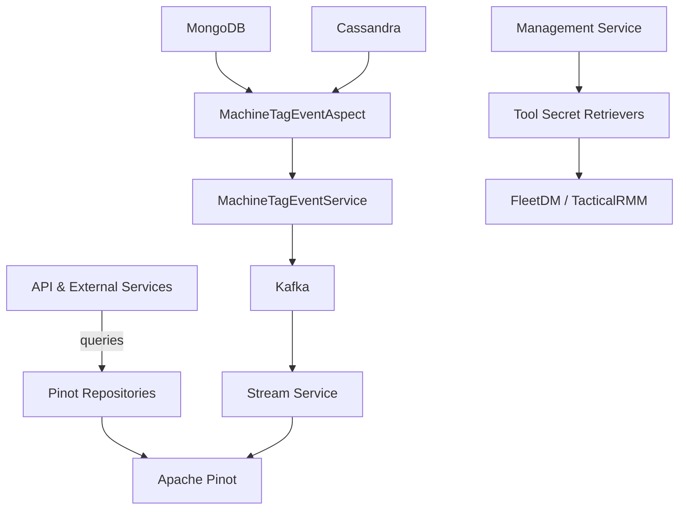
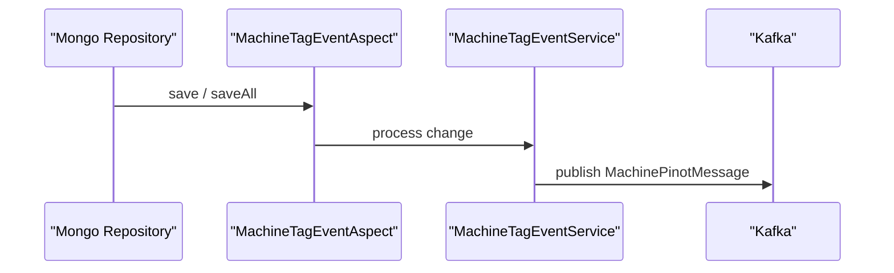

# data_core_and_pinot

## Overview

The **data_core_and_pinot** module provides the foundational data-layer building blocks for OpenFrame services that rely on:

- **Operational persistence** (Cassandra)
- **Analytical querying** (Apache Pinot)
- **Event propagation** (Kafka)
- **Tool integrations** (FleetDM, TacticalRMM)

It acts as the bridge between transactional data changes (machines, tags, tools) and the analytics/search layer consumed by API, external API, and frontend services.

This module is heavily used by:
- API service core (device and log queries)
- Stream service core (event ingestion)
- Management and external API services

---

## Responsibilities

- Configure and validate **Cassandra** and **Pinot** connections
- Normalize multi-tenant Cassandra keyspaces
- Emit **machine and tag change events** to Kafka for Pinot ingestion
- Provide **Pinot repositories** for devices and logs
- Define shared **data models** for Kafka/NATS-based messaging
- Retrieve **agent registration secrets** from integrated tools

---

## High-Level Architecture



---

## Configuration Components

### Cassandra

**Key classes:**
- `CassandraConfig`
- `CassandraKeyspaceNormalizer`
- `CassandraHealthIndicator`

Responsibilities:
- Creates keyspaces automatically if missing
- Normalizes tenant keyspaces (dashes → underscores)
- Exposes a health indicator for readiness checks

Cassandra is conditionally enabled via:

```text
spring.data.cassandra.enabled=true
```

---

### Pinot

**Key class:** `PinotConfig`

Responsibilities:
- Creates broker and controller connections
- Supplies shared Pinot client connections to repositories

Required properties:

```text
pinot.broker.url
pinot.controller.url
```

---

### Tool SDK Configuration

**Key class:** `ToolSdkConfig`

Provides SDK clients required by integration services, such as TacticalRMM.

---

## Event Propagation (Machine & Tag Changes)

### MachineTagEventAspect

An AOP-based interceptor that listens to repository save operations for:
- Machines
- MachineTags
- Tags

It delegates all processing to `MachineTagEventService`.



---

### MachineTagEventServiceImpl

Responsibilities:
- Collect full machine + tag context
- Build `MachinePinotMessage`
- Publish events to tenant-scoped Kafka topics

Key behaviors:
- De-duplicates machine processing on bulk tag updates
- Re-emits machine events when tag names change

This service is enabled when:

```text
openframe.device.aspect.enabled=true
```

---

## Pinot Repositories

### PinotClientDeviceRepository

Provides **aggregated device analytics**, including:
- Status filter counts
- Device type, OS, organization, and tag filters
- Filtered device counts

Queries are dynamically generated and always exclude deleted devices.

---

### PinotClientLogRepository

Provides **log search and filtering**:
- Time-range queries
- Cursor-based pagination
- Full-text relevance search
- Sort validation and defaults

Also exposes metadata queries such as:
- Available severities
- Event types
- Tool types
- Organizations

---

## Messaging Models

### Kafka / NATS Models

The module defines lightweight DTOs used for streaming and messaging:

- `ClientConnectionEvent`
- `InstalledAgentMessage`
- `ToolConnectionMessage`
- `ToolInstallationMessage`

These models are shared across stream, client-agent, and management services.

---

## Tool Integration & Secrets

### ToolCredentials

A generic credentials container supporting:
- Username/password
- API keys
- OAuth client credentials

---

### Agent Registration Secret Retrievers

**Implementations:**
- `FleetMdmAgentRegistrationSecretRetriever`
- `TacticalRmmAgentRegistrationSecretRetriever`

Responsibilities:
- Resolve integrated tool configuration
- Call external tool APIs
- Retrieve enrollment / installation secrets securely

Enabled via:

```text
openframe.integration.tool.enabled=true
```

---

## Related Modules

This module is commonly used alongside:

- Data persistence (Mongo, Redis, Kafka)
- Stream service core (event ingestion)
- API and External API service cores (query consumers)

Refer to platform documentation for service-specific usage details.

---

## Summary

The **data_core_and_pinot** module is the analytical backbone of OpenFrame:

- Ensures data consistency between Mongo/Cassandra and Pinot
- Converts operational changes into analytics-ready events
- Provides high-performance query access for devices and logs

It is critical for observability, filtering, and large-scale analytics across the platform.
