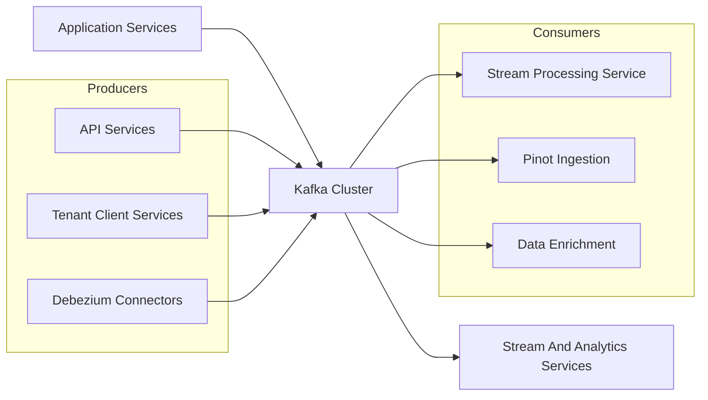
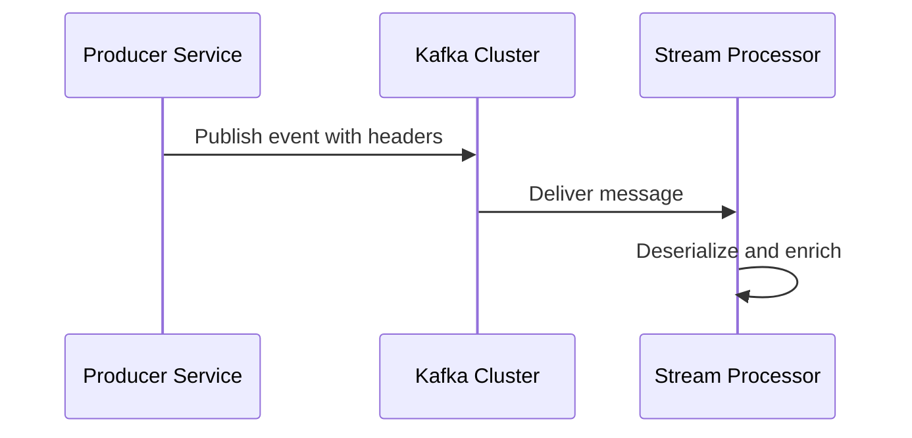

# Data Infra Kafka And Topics

## Overview

The **Data Infra Kafka And Topics** module provides the shared Kafka infrastructure layer for the OpenFrame and Flamingo platform. It standardizes how services:

- Configure Kafka producers, consumers, and listeners
- Define and auto-create Kafka topics
- Exchange strongly typed event messages
- Handle Kafka producer failures and recovery
- Propagate metadata through Kafka headers

This module is intentionally **infrastructure-focused**. It does not contain business logic or stream processing rules. Instead, it enables other services—such as stream processing, management, tenant clients, and data platforms—to reliably publish and consume events across the platform.

At runtime, this module acts as the **Kafka backbone** connecting data producers (API services, tenant clients, Debezium connectors) with downstream consumers (stream processing, Pinot ingestion, analytics, and enrichment pipelines).

---

## Position in the Platform Architecture

Data Infra Kafka And Topics sits between application services and stream processing layers:



This module ensures all producers and consumers use consistent:

- Topic naming and lifecycle rules
- Serialization and deserialization strategies
- Kafka client configuration
- Error handling and observability

---

## Core Responsibilities

The Data Infra Kafka And Topics module is responsible for:

1. **Kafka Cluster Configuration**
   - Enabling and disabling Kafka support per service
   - Overriding default Spring Kafka auto-configuration

2. **Topic Definition and Auto-Creation**
   - Declarative topic configuration via application properties
   - Automatic topic provisioning at startup

3. **Producer and Consumer Infrastructure**
   - Standard Kafka templates and factories
   - Consistent listener container behavior

4. **Shared Message Contracts**
   - Common event payload models
   - Debezium change-event abstraction

5. **Failure Handling and Recovery Hooks**
   - Centralized Kafka producer recovery handling

---

## Configuration Architecture

### Kafka Enablement Strategy

Kafka support is **opt-in per service** using configuration properties. Services that do not require Kafka incur no Kafka-related overhead.

Key characteristics:

- Kafka auto-configuration is explicitly controlled
- Multiple Kafka clusters can be supported (this module defines the OSS tenant cluster)
- All configuration is externalized through Spring Boot properties

---

## Core Components

### Kafka Topic Properties

**Component:** KafkaTopicProperties

This component defines how Kafka topics are declared and managed.

**Key concepts:**

- Topics are declared declaratively in configuration
- Topics can be auto-created at application startup
- Each topic defines partitions and replication factor

**Conceptual structure:**

```text
openframe.oss-tenant.kafka.topics
├── autoCreate
└── inbound
    ├── topic_key
    │   ├── name
    │   ├── partitions
    │   └── replicationFactor
```

This approach ensures:

- Topics are version-controlled via configuration
- Environments remain consistent
- Topic creation is auditable and repeatable

---

### OSS Kafka Configuration

**Component:** OssKafkaConfig

This configuration:

- Enables Kafka support explicitly
- Disables Spring’s default Kafka auto-configuration
- Guarantees that only OpenFrame-defined Kafka beans are used

This avoids configuration drift and unintended defaults across services.

---

### Tenant Kafka Auto-Configuration

**Component:** OssTenantKafkaAutoConfiguration

This is the **central auto-configuration class** for Kafka usage across the platform.

It conditionally provisions Kafka infrastructure when enabled via configuration.

#### Beans Provided

- Kafka producer factory
- Kafka consumer factory
- Kafka template
- Kafka listener container factory
- Kafka admin client
- Kafka producer abstraction

#### Auto-Creation of Topics

At startup, the module:

1. Reads declared topic configurations
2. Builds Kafka topic definitions
3. Registers them via Kafka Admin
4. Logs all created or validated topics

This guarantees topic availability before any producer or consumer starts operating.

---

### Kafka Properties Wrapper

**Component:** OssTenantKafkaProperties

This component wraps Spring’s standard KafkaProperties while:

- Adding enable/disable semantics
- Namespacing all configuration under a tenant-specific prefix

This ensures:

- Full compatibility with Spring Kafka
- Clear separation from other Kafka clusters
- Predictable configuration resolution

---

### Kafka Headers

**Component:** KafkaHeader

Defines shared Kafka header keys used across producers and consumers.

Currently standardized headers include:

- `message-type`

This enables downstream consumers to:

- Route messages dynamically
- Apply type-specific deserialization
- Perform selective processing

---

## Message Models

### Machine Pinot Message

**Component:** MachinePinotMessage

Represents machine-related state changes published to Kafka.

**Usage scenarios:**

- Device lifecycle updates
- Tag and compliance changes
- Status and operating system updates

**Key fields:**

- Machine identifier
- Organization identifier
- Device and OS metadata
- Tag associations

This message is commonly consumed by:

- Stream processing services
- Pinot ingestion pipelines
- Analytics and reporting layers

---

### Debezium Message Wrapper

**Component:** DebeziumMessage

A generic abstraction over Debezium change data capture events.

**Encapsulates:**

- Before and after entity state
- Source metadata (database, table, connector)
- Operation type (create, update, delete)
- Event timestamp

This abstraction allows downstream services to:

- Remain independent of Debezium internals
- Process CDC events uniformly
- Apply enrichment and routing logic consistently

---

## Producer Failure and Recovery Handling

### Kafka Recovery Handler

**Component:** KafkaRecoveryHandlerImpl

Provides a centralized hook for Kafka producer recovery scenarios.

When a message fails to publish after retries:

- The failure is captured
- A structured error log is emitted
- Contextual metadata is preserved

This design ensures:

- Failures are observable
- Payloads can be inspected
- Recovery strategies can evolve without changing producers

---

## Runtime Flow Example

The following illustrates a typical Kafka publishing flow:



All Kafka interactions in this flow rely on the infrastructure provided by Data Infra Kafka And Topics.

---

## Relationship to Other Modules

This module is a foundational dependency for:

- Stream Processing Service Core (Kafka listeners and deserializers)
- Management Service Core (Debezium and connector orchestration)
- Tenant Client Service Core (agent and heartbeat events)
- Data Platform Services And Pinot (analytics ingestion)

Rather than duplicating Kafka setup logic, these modules consume the standardized configuration and models defined here.

---

## Design Principles

- **Infrastructure First**: No business logic, only Kafka enablement
- **Declarative Configuration**: Topics and behavior defined via properties
- **Consistency**: One Kafka configuration model across services
- **Extensibility**: New topics and message types added without code changes
- **Observability**: Failures are explicit and structured

---

## Summary

The **Data Infra Kafka And Topics** module is the backbone of event-driven communication in the OpenFrame platform. It abstracts Kafka complexity behind consistent configuration, standardized message contracts, and reliable infrastructure patterns—allowing application and stream services to focus on delivering business value rather than managing Kafka internals.