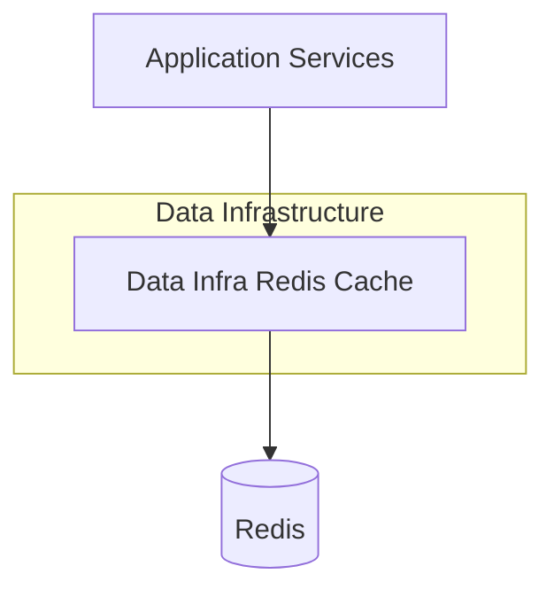
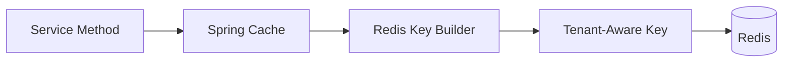

# Data Infra Redis Cache

## Overview

The **Data Infra Redis Cache** module provides a centralized Redis-based caching and key-management layer for the OpenFrame platform. It integrates Redis with Spring’s caching abstraction and reactive data access, enabling consistent, tenant-aware caching across services while supporting both blocking and reactive execution models.

This module is intentionally lightweight and infrastructure-focused. It does not define business caches itself; instead, it supplies the foundational configuration that other modules (API services, authorization, management, stream processing, etc.) rely on when enabling Redis-backed caching.

Key responsibilities include:
- Enabling Spring Cache with Redis as the backing store
- Providing a default `CacheManager` with sensible serialization and TTL settings
- Ensuring **tenant-aware cache key prefixes** across the platform
- Exposing both synchronous and reactive Redis templates
- Centralizing Redis key construction conventions

---

## Position in the Platform Architecture

The Data Infra Redis Cache module sits in the **data infrastructure layer**, alongside MongoDB, Kafka, and Pinot integrations. It is consumed by higher-level service cores but does not depend on them directly.



**Typical consumers** include:
- API Service Core (request-level and query caching)
- Authorization Service Core (token, client, or tenant metadata caching)
- Management and Stream Processing services (temporary state, deduplication, or enrichment lookups)

---

## Core Components

The module is composed of three primary configuration classes, each addressing a distinct concern.

### CacheConfig

**Component:** `CacheConfig`

**Purpose:**
Configures Spring’s caching abstraction to use Redis as the backing store.

**Key behaviors:**
- Enables Spring Cache via `@EnableCaching`
- Activates only when Redis is enabled (`spring.redis.enabled=true`)
- Defines a default `CacheManager` if none is already present
- Applies a **global time-to-live (TTL) of 6 hours** to cache entries
- Disables caching of null values
- Uses:
  - String serialization for keys
  - JSON serialization for values
- Enforces tenant-aware cache key prefixes through the Redis key builder

**Conceptual cache key structure:**

```text
<prefix>:<cacheName>::<key>
```

This ensures cache isolation between tenants while preserving compatibility with Spring Cache naming conventions.

---

### RedisConfig

**Component:** `RedisConfig`

**Purpose:**
Provides low-level Redis templates for direct Redis access, supporting both blocking and reactive use cases.

**Key behaviors:**
- Activated only when Redis is explicitly enabled
- Enables Redis repositories under the Redis data package
- Defines default beans when not already present:
  - `RedisTemplate<String, String>` for synchronous access
  - `ReactiveStringRedisTemplate` for reactive string-based access
  - `ReactiveRedisTemplate<String, String>` with explicit serialization context

**Design intent:**
This configuration allows services to bypass Spring Cache when necessary and interact with Redis directly for:
- Counters
- Locks
- Ephemeral state
- Reactive pipelines

---

### Openframe Redis Key Configuration

**Component:** `OpenframeRedisKeyConfiguration`

**Purpose:**
Centralizes the creation and configuration of the Redis key builder used across the platform.

**Key behaviors:**
- Registers configuration properties for Redis key behavior
- Provides a default `OpenframeRedisKeyBuilder` bean if none exists
- Ensures consistent key naming and prefixing rules across all Redis usage

**Why this matters:**
By standardizing key construction in one place, the platform avoids:
- Key collisions between services
- Inconsistent tenant scoping
- Ad-hoc key formats that are hard to migrate or debug

---

## Cache Key Strategy and Tenant Isolation

A core design goal of the Data Infra Redis Cache module is **tenant safety**.

All cache keys generated through the Spring Cache integration are automatically prefixed using the Redis key builder. This means:
- Each tenant’s data is logically isolated
- Cache flushes can be scoped by prefix
- Multi-tenant deployments can safely share a Redis cluster



---

## Configuration and Enablement

Redis caching is **opt-in** and controlled entirely through configuration.

**High-level behavior:**
- If Redis is disabled, none of the beans in this module are created
- If Redis is enabled, caching and Redis templates become available automatically

**Typical configuration flags:**
- Enable or disable Redis globally
- Configure Redis connection details externally
- Override cache manager or templates in consuming services if needed

This approach allows the same codebase to run:
- With Redis in production
- Without Redis in local development or lightweight deployments

---

## Interaction With Other Data Infrastructure Modules

The Data Infra Redis Cache module complements, rather than replaces, other persistence layers:

- **MongoDB persistence** remains the system of record
- **Kafka and stream processing** handle event-driven flows
- **Redis caching** accelerates read paths and reduces load on primary stores

Redis is treated as a **derived and disposable** data store. All cached data must be reproducible from upstream sources.

---

## Design Principles

- **Infrastructure-first**: No business logic, only reusable configuration
- **Safe defaults**: TTLs, serializers, and null-handling are predefined
- **Tenant awareness by default**: No opt-out required for isolation
- **Extensibility**: Services can override beans when specialized behavior is required
- **Reactive-ready**: First-class support for reactive Redis access

---

## Summary

The **Data Infra Redis Cache** module provides the Redis foundation for the OpenFrame platform. By standardizing cache configuration, Redis access patterns, and tenant-aware key construction, it enables consistent, safe, and scalable caching across all services without duplicating infrastructure logic.

It is a critical building block for performance optimization and multi-tenant correctness, while remaining intentionally simple and easy to override where necessary.