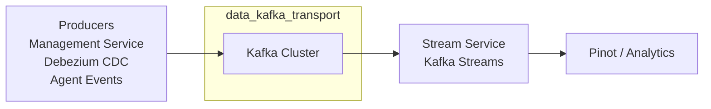
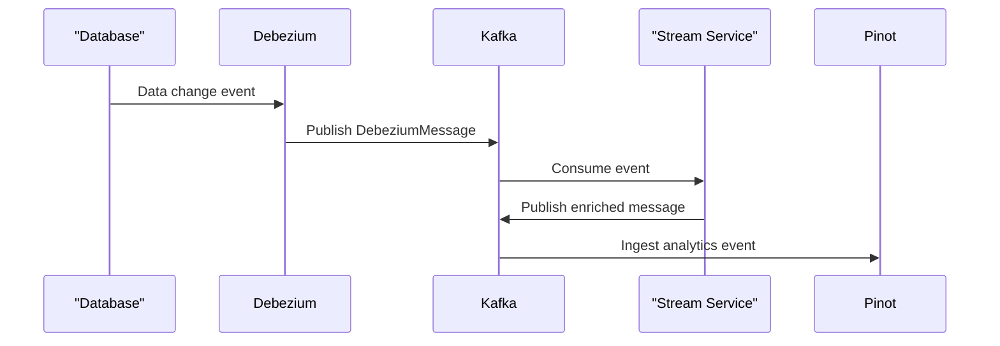

# data_kafka_transport

## Overview

The **data_kafka_transport** module provides the shared Kafka infrastructure used across the OpenFrame / Flamingo platform. It standardizes how services:

- Configure Kafka producers, consumers, and listeners
- Manage tenant-aware Kafka properties
- Auto-create and manage Kafka topics
- Exchange strongly typed Kafka messages (Debezium CDC, Pinot ingestion)
- Handle producer-side failures and recovery logging

This module does **not** implement business logic itself. Instead, it acts as a foundational transport layer that is consumed by higher-level services such as:

- Stream processing (`stream_service_core`)
- Management and initialization workflows (`management_service_core`)
- Data ingestion pipelines for Pinot and analytics

---

## Position in the System

Within the overall OpenFrame architecture, `data_kafka_transport` sits between:

- **Upstream data producers** (MongoDB/Debezium, management services, agent events)
- **Downstream stream processors** (Kafka Streams, Pinot ingestion, enrichment services)

---

## Core Responsibilities

The module focuses on four key responsibilities:

1. **Kafka Auto-Configuration**  
   Custom Spring Boot auto-configuration for tenant-aware Kafka usage.

2. **Topic Management**  
   Declarative configuration and optional auto-creation of Kafka topics.

3. **Message Contracts**  
   Shared, versioned message models for Kafka payloads.

4. **Failure Handling**  
   Centralized recovery and structured logging for producer failures.

---

## Sub-modules

The module is intentionally small and is split into the following sub-modules:

### Configuration

Responsible for Kafka setup, properties, topic definitions, and Spring integration.

- Tenant-scoped Kafka properties
- Producer / consumer / listener factories
- KafkaAdmin and topic auto-creation

➡️ See: [Configuration](configuration.md)

---

### Models

Defines shared Kafka message schemas and headers used across services.

- Pinot ingestion messages
- Debezium CDC envelope models
- Shared Kafka headers

➡️ See: [Models](models.md)

---

### Producer and Retry

Handles producer-side error recovery and logging.

- Centralized Kafka recovery handler
- Structured error output for observability

➡️ See: [Producer and Retry](producer_and_retry.md)

---

## Interaction With Other Modules

This module is consumed by, but does not directly depend on, higher-level services:

- **stream_service_core** uses the configured consumers and message models to process Kafka events
- **management_service_core** relies on topic auto-creation during initialization
- **data_core_and_pinot** consumes Kafka messages downstream for analytics ingestion

To avoid duplication, implementation details of stream processing, Pinot schemas, and Debezium connectors are documented in their respective modules.

---

## Data Flow Example

A typical CDC-driven data flow looks like this:

---

## Design Principles

- **Convention over configuration**: sensible Kafka defaults with override support
- **Tenant isolation**: explicit tenant-scoped configuration
- **Strong typing**: shared message contracts across services
- **Observability-first**: structured logging for Kafka failures

---

## When to Change This Module

You should modify `data_kafka_transport` when:

- Introducing new shared Kafka message types
- Adding new tenant-level Kafka configuration capabilities
- Changing topic creation or naming conventions
- Improving producer failure handling or observability

You should **not** add business-specific Kafka logic here. That belongs in service-level modules.

---

## Summary

`data_kafka_transport` is the backbone Kafka integration layer for OpenFrame. By centralizing configuration, topic management, and message contracts, it ensures that all services interact with Kafka in a consistent, observable, and maintainable way.
