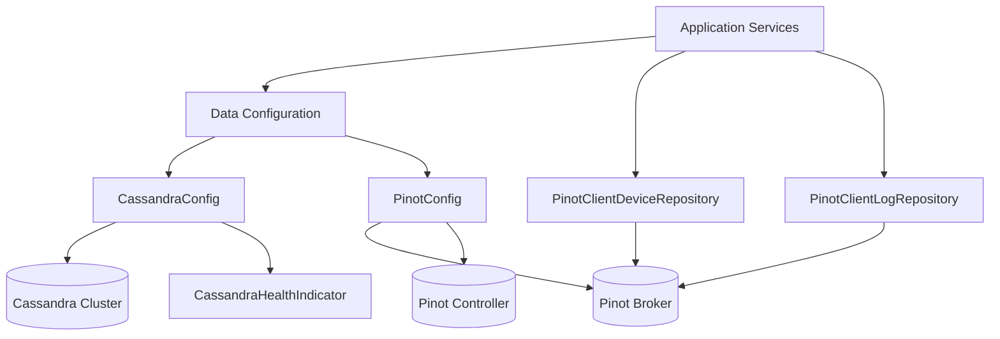
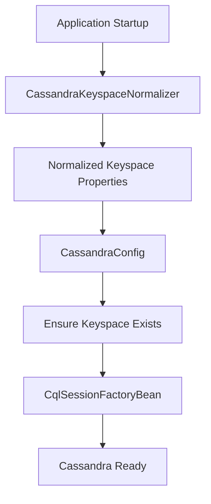
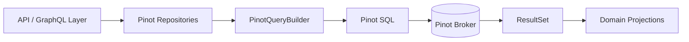
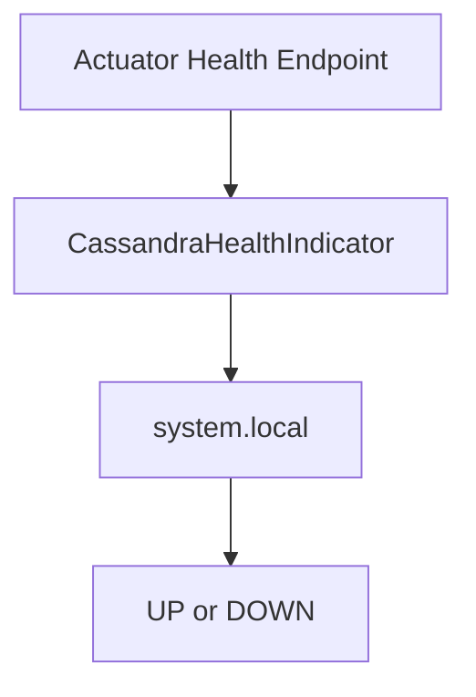

# data_layer_cassandra_pinot

This module provides the **Cassandra and Apache Pinot data layer integration** for the OpenFrame platform. It is responsible for:

- Configuring and initializing Cassandra keyspaces and sessions
- Normalizing tenant-aware Cassandra keyspace names
- Providing health checks for Cassandra connectivity
- Configuring Apache Pinot broker and controller connections
- Executing analytical queries against Pinot for devices and logs

The module is a foundational part of the OpenFrame data stack and is consumed by API, GraphQL, management, and stream-processing services.

---

## High-Level Architecture

---

## Module Responsibilities

### Cassandra Integration

The Cassandra portion of this module is responsible for **schema-aware, tenant-safe persistence**:

- Automatic keyspace creation if it does not exist
- Runtime normalization of tenant keyspace names
- Spring Data Cassandra repository enablement
- Health monitoring via Spring Boot Actuator

Key components:

- `CassandraConfig`
- `CassandraKeyspaceNormalizer`
- `DataConfiguration.CassandraConfiguration`
- `CassandraHealthIndicator`

### Pinot Integration

The Pinot portion of this module provides **high-performance analytical queries** used by dashboards, filters, and search APIs:

- Broker and controller connection management
- Device analytics and filter aggregation queries
- Log search, pagination, and faceted filtering

Key components:

- `PinotConfig`
- `PinotClientDeviceRepository`
- `PinotClientLogRepository`

---

## Cassandra Configuration Flow

### Key Behaviors

- **Keyspace normalization** replaces dashes with underscores to support tenant IDs
- **Keyspace creation** runs before session initialization
- **Schema action** is set to `CREATE_IF_NOT_EXISTS`
- **Conditional loading** via `spring.data.cassandra.enabled`

---

## Pinot Query Architecture

### PinotClientDeviceRepository

Responsibilities:

- Aggregate device counts by:
  - Status
  - Device type
  - OS type
  - Organization
  - Tags
- Exclude logically deleted devices
- Build dynamic `WHERE` clauses based on filters

Typical usage:

- Power device filter dropdowns
- Provide total device counts for dashboards

### PinotClientLogRepository

Responsibilities:

- Full log search with:
  - Date range filtering
  - Faceted filters (tool, severity, event type)
  - Cursor-based pagination
  - Sort validation and defaults
- Projection mapping into `LogProjection`
- Organization option aggregation

Key features:

- Validated sortable columns
- Stable pagination using a primary key
- Distinct-value queries for UI filters

---

## Health Monitoring

The health indicator executes a lightweight query against Cassandra to validate availability and reports status via Spring Boot Actuator.

---

## How This Module Fits Into the Platform

- **API & GraphQL services** consume Pinot repositories for analytics-heavy endpoints
- **Stream services** populate Cassandra and Pinot via Debezium and Kafka pipelines
- **Management services** rely on Cassandra for tenant-scoped persistence
- **External and frontend APIs** indirectly depend on this module for fast filtering and log exploration

This module complements:

- `data_layer_mongo` for transactional and identity data
- `data_layer_kafka` for streaming and change data capture
- `data_layer_redis` for caching and ephemeral state

---

## Configuration Summary

| Property | Purpose |
|--------|--------|
| `spring.data.cassandra.enabled` | Enable Cassandra integration |
| `spring.data.cassandra.keyspace-name` | Tenant-aware keyspace |
| `spring.data.cassandra.contact-points` | Cassandra hosts |
| `pinot.broker.url` | Pinot broker endpoint |
| `pinot.controller.url` | Pinot controller endpoint |

---

## Summary

The `data_layer_cassandra_pinot` module provides a **robust, tenant-aware persistence and analytics foundation** for OpenFrame:

- Cassandra ensures reliable, scalable storage
- Pinot enables fast analytical queries at scale
- Clear separation of transactional vs analytical workloads
- Designed for multi-tenant, cloud-native deployments

This makes it a critical building block for observability, device management, and operational intelligence across the platform.
