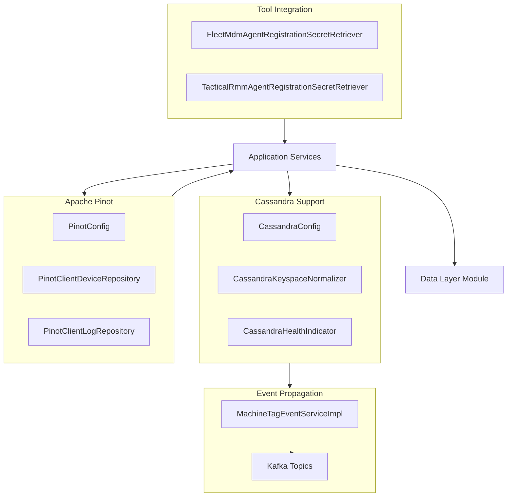
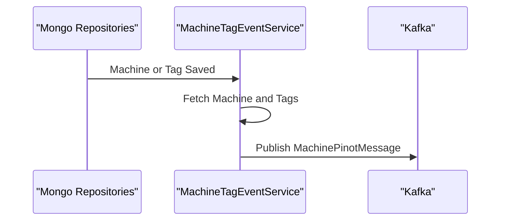

# Data Layer – Cassandra, Pinot, and Shared Models

This module provides the **core data infrastructure layer** for OpenFrame, covering:

- **Cassandra** configuration, lifecycle, and health checks
- **Apache Pinot** configuration and high‑performance analytical repositories
- **Shared data models** used across services (tools, credentials, Pinot projections)
- **Event propagation** from transactional stores to Kafka/Pinot
- **Tool agent registration secret retrieval** for integrated platforms

It is a foundational module consumed by multiple higher‑level services such as the API service, stream service, management service, and external APIs.

---

## Responsibilities

- Bootstrap and normalize multi‑tenant Cassandra keyspaces
- Provide safe, observable configuration for data backends
- Expose Pinot repositories optimized for filtering, aggregation, and pagination
- Translate domain events into Kafka messages for analytical indexing
- Supply shared models used consistently across services

---

## High‑Level Architecture

---

## Configuration Subsystem

### Cassandra Configuration

The Cassandra setup is designed for **multi‑tenant environments** and is fully property‑driven.

Key components:

- **CassandraConfig**
  - Extends Spring’s `AbstractCassandraConfiguration`
  - Creates keyspaces automatically if missing
  - Configures contact points, datacenter, and replication

- **CassandraKeyspaceNormalizer**
  - Ensures keyspace names are Cassandra‑safe
  - Converts dashes to underscores (for tenant IDs)
  - Runs early via `ApplicationContextInitializer`

- **CassandraHealthIndicator**
  - Integrates with Spring Boot Actuator
  - Executes lightweight system queries to validate connectivity

- **DataConfiguration.CassandraConfiguration**
  - Conditionally enables Cassandra repositories

**Why this matters:**
- Tenants can use friendly IDs without breaking Cassandra constraints
- Services fail fast if Cassandra is misconfigured
- Health endpoints accurately reflect datastore availability

---

### Pinot Configuration

Pinot is used for **analytical and time‑series queries** (devices, logs, events).

- **PinotConfig**
  - Exposes separate broker and controller connections
  - Uses Apache Pinot Java client

These connections are reused by all Pinot repositories to avoid duplicated configuration.

---

### Configuration Logging

- **ConfigurationLogger**
  - Logs resolved datastore endpoints at startup
  - Covers MongoDB, Cassandra, Redis, and Pinot

This improves observability in containerized and multi‑environment deployments.

---

## Pinot Repositories

### Device Analytics – `PinotClientDeviceRepository`

Purpose:
- Provide fast aggregation and filtering over device data

Capabilities:
- Filter option counts (status, device type, OS, organization, tags)
- Filtered device counts
- Excludes logically deleted devices by default

Key design points:
- Dynamic WHERE clause construction
- Defensive filtering of invalid inputs
- Results ordered by relevance (count)

Used by:
- API services powering dashboards and filters
- External APIs requiring aggregated device insights

---

### Log Analytics – `PinotClientLogRepository`

Purpose:
- Query and search high‑volume log data efficiently

Capabilities:
- Time‑range queries with cursor‑based pagination
- Full‑text relevance search
- Dynamic sorting with validation
- Retrieval of filter options (event types, severities, tool types)
- Organization option discovery

Key design points:
- Centralized query builder abstraction
- Strict sortable column allow‑list
- Strong mapping layer from Pinot rows to projections

---

## Event Propagation to Kafka

### Machine and Tag Events – `MachineTagEventServiceImpl`

This service bridges **transactional data changes** to **analytical pipelines**.

Responsibilities:
- React to machine, tag, and machine‑tag persistence events
- Assemble complete device context (machine + tags)
- Publish `MachinePinotMessage` events to Kafka

Flow overview:

Why this matters:
- Pinot indexes stay eventually consistent with MongoDB
- Tag renames propagate to all affected devices
- Bulk operations avoid duplicate processing

---

## Tool Integration and Secrets

### Shared Tool Models

- **IntegratedToolTypes**
  - Central registry of supported infrastructure and SaaS tools

- **ToolCredentials**
  - Generic credential container (API keys, tokens, secrets)
  - Used by multiple services and SDKs

These models prevent tool‑specific coupling in higher layers.

---

### Agent Registration Secret Retrieval

These components dynamically retrieve **agent enrollment secrets** from integrated tools.

#### Fleet MDM
- **FleetMdmAgentRegistrationSecretRetriever**
- Uses Fleet MDM SDK
- Retrieves enrollment secrets via Fleet API

#### Tactical RMM
- **TacticalRmmAgentRegistrationSecretRetriever**
- Uses Tactical RMM SDK
- Builds registration requests dynamically

Common characteristics:
- Conditional activation via configuration
- Centralized error handling
- No secrets stored persistently

---

## Shared Pinot Models

- **OrganizationOption**
  - Lightweight projection for organization filters

- **PinotEventEntity**
  - Marker/base type for Pinot event representations

These models are reused across API, external API, and UI layers.

---

## How This Module Fits in the Platform

- **API Service**: Consumes Pinot repositories for GraphQL and REST queries
- **Stream Service**: Produces events that ultimately populate Pinot tables
- **Management Service**: Initializes Pinot and manages tool metadata
- **External API**: Exposes analytical data backed by Pinot

This module acts as the **data backbone**, ensuring consistency, performance, and scalability across OpenFrame.

---

## Summary

The `data_layer_cassandra_pinot_and_shared_models` module:

- Abstracts complex datastore configuration
- Enables high‑performance analytics with Pinot
- Provides robust event propagation to Kafka
- Centralizes shared data models and tool integrations

It is critical infrastructure that underpins nearly every service in the OpenFrame ecosystem.
