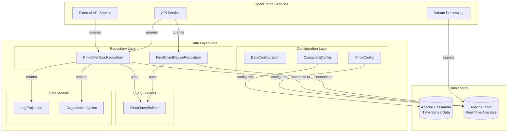
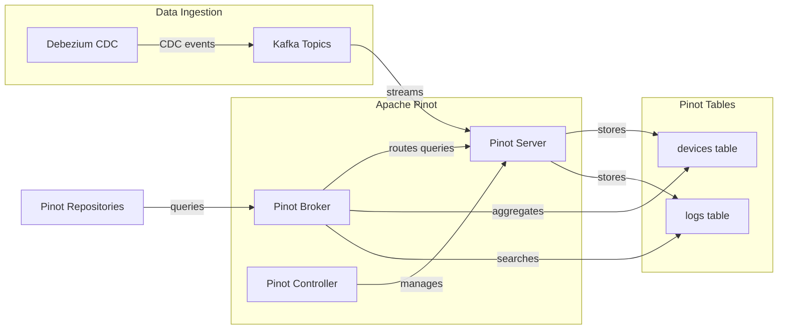
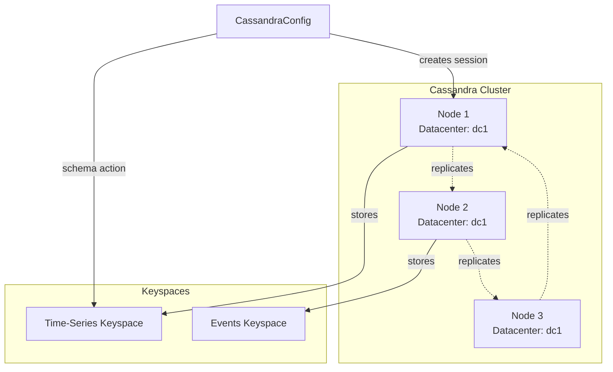
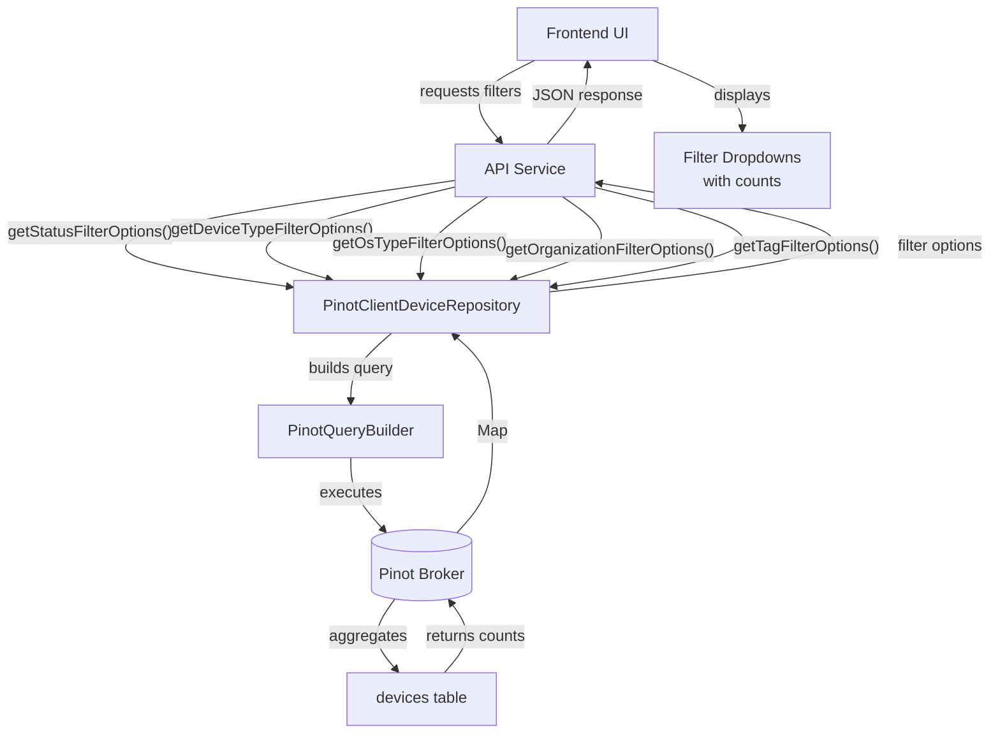
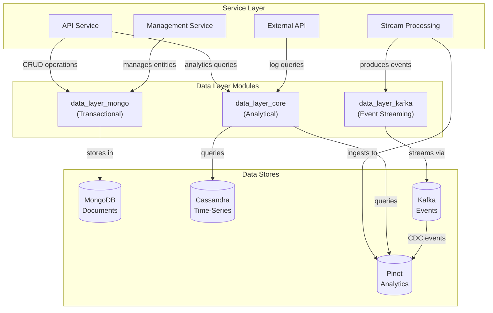
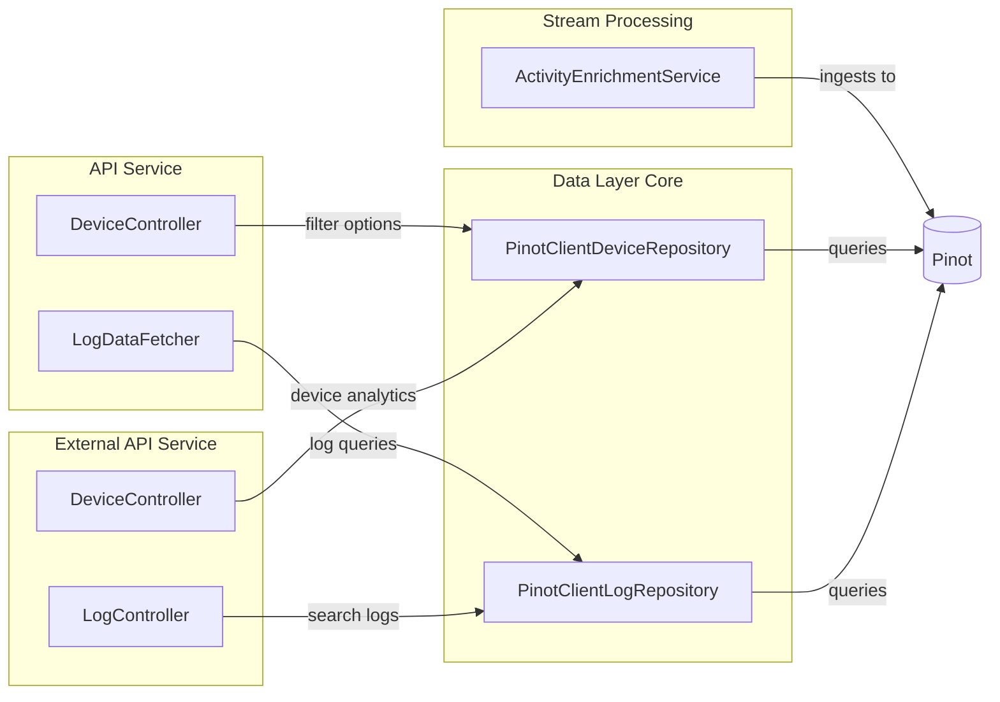
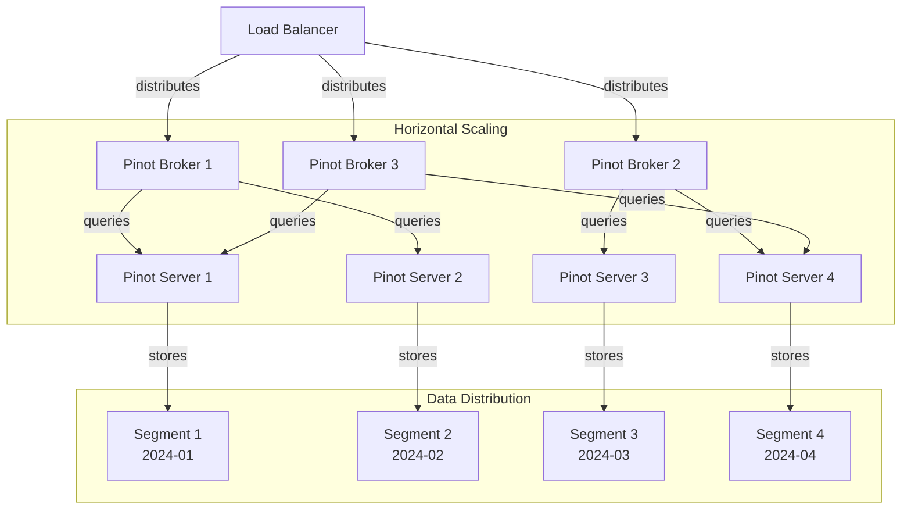

# Data Layer Core Module

## Overview

The **data_layer_core** module provides high-performance analytical data access capabilities for the OpenFrame platform through integration with Apache Cassandra and Apache Pinot. This module complements the [data_layer_mongo](./data_layer_mongo.md) transactional data layer by offering specialized repositories for real-time analytics, time-series data, and OLAP (Online Analytical Processing) queries.

As part of the OpenFrame unified MSP platform, this module enables:
- **Real-time Analytics**: Sub-second query performance on large datasets using Apache Pinot
- **Time-Series Storage**: Efficient storage and retrieval of device logs and events using Cassandra
- **Dynamic Filtering**: Advanced filter options for devices and logs with multi-dimensional queries
- **Scalable Architecture**: Horizontally scalable data stores for growing MSP operations
- **Analytical Workloads**: Separation of analytical queries from transactional operations

## Purpose

The data_layer_core module provides:

1. **Analytical Data Access**: High-performance repositories for querying large volumes of device and log data
2. **Multi-Database Configuration**: Auto-configuration for both Cassandra and Pinot databases
3. **Query Optimization**: Specialized query builders and projections for analytical workloads
4. **Filter Management**: Dynamic filter options for UI components with real-time aggregations
5. **Data Separation**: Clear separation between transactional (MongoDB) and analytical (Cassandra/Pinot) data

## Architecture Overview

The module follows a layered architecture with specialized data stores for different workload types:



## Module Structure

The data_layer_core module is organized into the following sub-modules:

### 1. [Configuration Layer](./data_layer_core_configuration.md)
**Components**: `DataConfiguration`, `CassandraConfig`, `PinotConfig`

Provides Spring Boot auto-configuration for analytical data stores:
- Conditional Cassandra repository enablement
- Cassandra session factory with custom driver configuration
- Pinot broker and controller connection management
- Schema action configuration for Cassandra tables

### 2. [Pinot Repositories](./data_layer_core_pinot_repositories.md)
**Components**: `PinotClientDeviceRepository`, `PinotClientLogRepository`

Implements high-performance analytical repositories:
- Device filter options with multi-dimensional aggregations
- Log search and retrieval with pagination and cursors
- Dynamic filter option generation for UI components
- Organization-aware queries with tenant isolation

### 3. [Query Builders](./data_layer_core_query_builders.md)
**Components**: `PinotQueryBuilder`

Provides type-safe SQL query construction for Pinot:
- Fluent API for building complex analytical queries
- SQL injection prevention with parameter escaping
- Date range queries with timezone support
- Full-text search with relevance scoring
- Cursor-based pagination for large result sets

## Key Features

### Real-Time Analytics with Apache Pinot

Apache Pinot provides sub-second query latency on large datasets:



**Key Capabilities**:
- ✅ **Sub-second Queries**: OLAP queries on millions of records in milliseconds
- ✅ **Real-Time Ingestion**: Stream data from Kafka with minimal latency
- ✅ **Columnar Storage**: Optimized for analytical workloads
- ✅ **Distributed Architecture**: Horizontal scaling for growing data volumes

### Time-Series Storage with Apache Cassandra

Cassandra provides scalable time-series data storage:



**Key Capabilities**:
- ✅ **High Write Throughput**: Optimized for time-series data ingestion
- ✅ **Tunable Consistency**: Balance between consistency and availability
- ✅ **Automatic Partitioning**: Time-based partitioning for efficient queries
- ✅ **Multi-Datacenter Replication**: Geographic distribution for resilience

### Dynamic Filter Options

The module provides dynamic filter generation for UI components:



**Example Filter Response**:
```json
{
  "status": {
    "ONLINE": 1250,
    "OFFLINE": 340,
    "MAINTENANCE": 45
  },
  "deviceType": {
    "WORKSTATION": 890,
    "SERVER": 420,
    "LAPTOP": 325
  },
  "osType": {
    "WINDOWS": 1100,
    "LINUX": 380,
    "MACOS": 155
  }
}
```

## Integration with Other Modules

### Data Layer Ecosystem

The data_layer_core module is part of a comprehensive data layer ecosystem:



**Module Relationships**:
- **[data_layer_mongo](./data_layer_mongo.md)**: Transactional data storage for entities (Users, Organizations, Devices)
- **[data_layer_kafka](./data_layer_kafka.md)**: Event streaming and CDC integration
- **data_layer_core**: Analytical queries and time-series data (current module)

### Service Integration



## Configuration

### Application Properties

**Cassandra Configuration** (Conditional):
```yaml
spring:
  data:
    cassandra:
      enabled: true  # Enable Cassandra repositories
      keyspace-name: openframe_timeseries
      contact-points: localhost
      port: 9042
      local-datacenter: datacenter1
```

**Pinot Configuration**:
```yaml
pinot:
  broker:
    url: localhost:8099
  controller:
    url: localhost:9000
  tables:
    devices:
      name: devices
    logs:
      name: logs
```

### Conditional Repository Enablement

The module uses `@ConditionalOnProperty` to enable Cassandra repositories only when configured:

```java
@Configuration
@ConditionalOnProperty(
    name = "spring.data.cassandra.enabled", 
    havingValue = "true", 
    matchIfMissing = false
)
@EnableCassandraRepositories(basePackages = "com.openframe.data.repository.cassandra")
public class CassandraConfiguration {}
```

This allows services to use only Pinot without requiring Cassandra infrastructure.

## Usage Examples

### Device Filter Options

Retrieve dynamic filter options for device management UI:

```java
@Service
public class DeviceFilterService {
    
    private final PinotClientDeviceRepository deviceRepository;
    
    public DeviceFilterOptions getFilterOptions(DeviceFilterRequest request) {
        // Get status options with counts
        Map<String, Integer> statusOptions = deviceRepository.getStatusFilterOptions(
            request.getStatuses(),
            request.getDeviceTypes(),
            request.getOsTypes(),
            request.getOrganizationIds(),
            request.getTagNames()
        );
        
        // Get device type options
        Map<String, Integer> deviceTypeOptions = deviceRepository.getDeviceTypeFilterOptions(
            request.getStatuses(),
            request.getDeviceTypes(),
            request.getOsTypes(),
            request.getOrganizationIds(),
            request.getTagNames()
        );
        
        // Get total count
        int totalCount = deviceRepository.getFilteredDeviceCount(
            request.getStatuses(),
            request.getDeviceTypes(),
            request.getOsTypes(),
            request.getOrganizationIds(),
            request.getTagNames()
        );
        
        return DeviceFilterOptions.builder()
            .statusOptions(statusOptions)
            .deviceTypeOptions(deviceTypeOptions)
            .totalCount(totalCount)
            .build();
    }
}
```

### Log Search with Pagination

Search logs with full-text search and cursor-based pagination:

```java
@Service
public class LogSearchService {
    
    private final PinotClientLogRepository logRepository;
    
    public LogSearchResponse searchLogs(LogSearchRequest request) {
        List<LogProjection> logs = logRepository.searchLogs(
            request.getStartDate(),
            request.getEndDate(),
            request.getToolTypes(),
            request.getEventTypes(),
            request.getSeverities(),
            request.getOrganizationIds(),
            request.getDeviceId(),
            request.getSearchTerm(),
            request.getCursor(),
            request.getLimit()
        );
        
        // Generate next cursor from last log
        String nextCursor = null;
        if (!logs.isEmpty() && logs.size() == request.getLimit()) {
            LogProjection lastLog = logs.get(logs.size() - 1);
            nextCursor = lastLog.eventTimestamp.toEpochMilli() + "_" + lastLog.toolEventId;
        }
        
        return LogSearchResponse.builder()
            .logs(logs)
            .nextCursor(nextCursor)
            .hasMore(nextCursor != null)
            .build();
    }
}
```

### Dynamic Filter Options for Logs

Retrieve filter options based on current selections:

```java
@Service
public class LogFilterService {
    
    private final PinotClientLogRepository logRepository;
    
    public LogFilterOptions getFilterOptions(LogFilterRequest request) {
        // Get available event types
        List<String> eventTypes = logRepository.getEventTypeOptions(
            request.getStartDate(),
            request.getEndDate(),
            request.getToolTypes(),
            null, // Don't filter by eventTypes when getting eventType options
            request.getSeverities(),
            request.getOrganizationIds()
        );
        
        // Get available severities
        List<String> severities = logRepository.getSeverityOptions(
            request.getStartDate(),
            request.getEndDate(),
            request.getToolTypes(),
            request.getEventTypes(),
            null, // Don't filter by severities when getting severity options
            request.getOrganizationIds()
        );
        
        // Get organization options with names
        List<OrganizationOption> organizations = logRepository.getOrganizationOptions(
            request.getStartDate(),
            request.getEndDate(),
            request.getToolTypes(),
            request.getEventTypes(),
            request.getSeverities()
        );
        
        return LogFilterOptions.builder()
            .eventTypes(eventTypes)
            .severities(severities)
            .organizations(organizations)
            .build();
    }
}
```

## Performance Considerations

### Query Optimization

The module implements several performance optimizations:

1. **Columnar Storage**: Pinot's columnar format optimizes analytical queries
2. **Inverted Indexes**: Full-text search uses inverted indexes for fast lookups
3. **Query Pruning**: Date range filters enable partition pruning
4. **Cursor Pagination**: Efficient pagination without offset/limit overhead
5. **Connection Pooling**: Reusable connections to Pinot brokers

### Scaling Strategies



**Scaling Recommendations**:
- Add Pinot servers to increase query throughput
- Add Pinot brokers to handle more concurrent queries
- Partition tables by time for efficient pruning
- Use replica groups for high availability

## Error Handling

The module provides custom exceptions for query failures:

```java
public class PinotQueryException extends RuntimeException {
    public PinotQueryException(String message) {
        super(message);
    }
    
    public PinotQueryException(String message, Throwable cause) {
        super(message, cause);
    }
}
```

**Common Error Scenarios**:
- Invalid query syntax (caught by `PinotQueryBuilder` validation)
- Connection failures to Pinot broker
- Timeout on long-running queries
- Invalid cursor format in pagination

## Testing

### Unit Testing with Mocked Connections

```java
@ExtendWith(MockitoExtension.class)
class PinotClientLogRepositoryTest {
    
    @Mock
    private Connection pinotConnection;
    
    @InjectMocks
    private PinotClientLogRepository repository;
    
    @Test
    void testFindLogs() {
        // Mock ResultSetGroup and ResultSet
        ResultSetGroup resultSetGroup = mock(ResultSetGroup.class);
        ResultSet resultSet = mock(ResultSet.class);
        
        when(pinotConnection.execute(anyString())).thenReturn(resultSetGroup);
        when(resultSetGroup.getResultSet(0)).thenReturn(resultSet);
        when(resultSet.getRowCount()).thenReturn(1);
        
        // Execute query
        List<LogProjection> logs = repository.findLogs(
            LocalDate.now().minusDays(7),
            LocalDate.now(),
            null, null, null, null, null, null, 10
        );
        
        assertNotNull(logs);
    }
}
```

### Integration Testing with Testcontainers

```java
@SpringBootTest
@Testcontainers
class PinotIntegrationTest {
    
    @Container
    static PinotContainer pinot = new PinotContainer("apachepinot/pinot:latest")
        .withExposedPorts(8099, 9000);
    
    @DynamicPropertySource
    static void configurePinot(DynamicPropertyRegistry registry) {
        registry.add("pinot.broker.url", 
            () -> pinot.getHost() + ":" + pinot.getMappedPort(8099));
        registry.add("pinot.controller.url", 
            () -> pinot.getHost() + ":" + pinot.getMappedPort(9000));
    }
    
    @Autowired
    private PinotClientLogRepository logRepository;
    
    @Test
    void testLogSearch() {
        // Test with real Pinot instance
        List<LogProjection> logs = logRepository.searchLogs(
            LocalDate.now().minusDays(1),
            LocalDate.now(),
            null, null, null, null, null, "error", null, 10
        );
        
        assertNotNull(logs);
    }
}
```

## Best Practices

### Query Design

1. **Use Date Range Filters**: Always include date ranges to enable partition pruning
2. **Limit Result Sets**: Use pagination with reasonable limits (default: 100, max: 10000)
3. **Avoid SELECT ***: Select only required columns for better performance
4. **Use Cursor Pagination**: Prefer cursor-based pagination over offset/limit
5. **Filter Early**: Apply filters in WHERE clause rather than in application code

### Connection Management

1. **Reuse Connections**: Use Spring-managed beans for connection pooling
2. **Configure Timeouts**: Set appropriate query timeouts for long-running queries
3. **Monitor Broker Health**: Implement health checks for Pinot brokers
4. **Handle Failures Gracefully**: Implement retry logic with exponential backoff

### Data Modeling

1. **Denormalize for Queries**: Duplicate data to avoid joins in Pinot
2. **Use Appropriate Data Types**: Choose optimal data types for storage efficiency
3. **Partition by Time**: Use time-based partitioning for efficient pruning
4. **Create Inverted Indexes**: Add indexes for frequently searched columns

## Troubleshooting

### Common Issues

**Issue**: Queries timing out on large datasets
```text
Solution: 
1. Add date range filters to enable partition pruning
2. Reduce result set size with LIMIT clause
3. Increase query timeout in Pinot broker configuration
4. Consider adding indexes on frequently queried columns
```

**Issue**: Connection refused to Pinot broker
```text
Solution:
1. Verify Pinot broker is running: curl http://localhost:8099/health
2. Check broker URL in application.properties
3. Verify network connectivity and firewall rules
4. Check Pinot broker logs for startup errors
```

**Issue**: Empty results despite data in Pinot
```text
Solution:
1. Verify table name matches configuration
2. Check date range filters (timezone issues)
3. Verify data ingestion completed successfully
4. Query Pinot directly to confirm data exists
```

**Issue**: Cassandra connection failures
```text
Solution:
1. Verify Cassandra is running and accessible
2. Check datacenter name matches configuration
3. Verify keyspace exists or enable schema creation
4. Check Cassandra logs for authentication errors
```

## Related Documentation

- **[Data Layer MongoDB](./data_layer_mongo.md)**: Transactional data storage
- **[Data Layer Kafka](./data_layer_kafka.md)**: Event streaming and CDC
- **[Stream Processing](./stream_processing.md)**: Data ingestion to Pinot
- **[API Service](./api_service.md)**: REST and GraphQL API consumers
- **[External API Service](./external_api.md)**: External API consumers

## Additional Resources

- **Apache Pinot Documentation**: https://docs.pinot.apache.org/
- **Apache Cassandra Documentation**: https://cassandra.apache.org/doc/latest/
- **Spring Data Cassandra**: https://spring.io/projects/spring-data-cassandra
- **OpenFrame Community**: https://www.openmsp.ai/

---

**Questions or Issues?**  
Join our OpenMSP Slack community for support: https://join.slack.com/t/openmsp/shared_invite/zt-36bl7mx0h-3~U2nFH6nqHqoTPXMaHEHA
