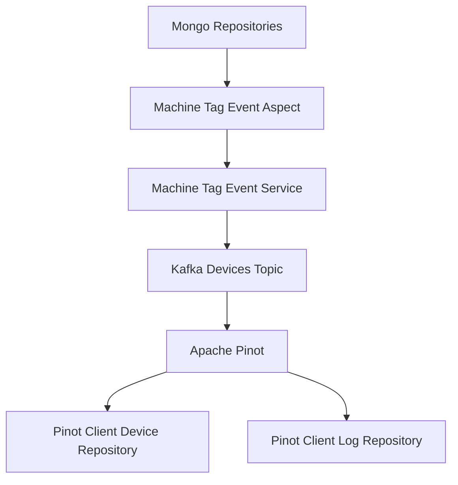
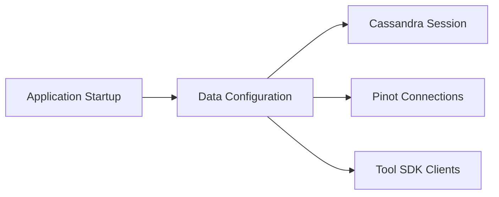
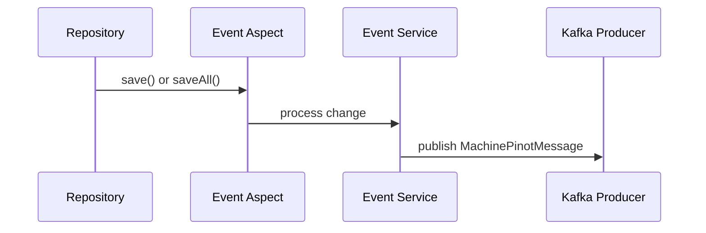
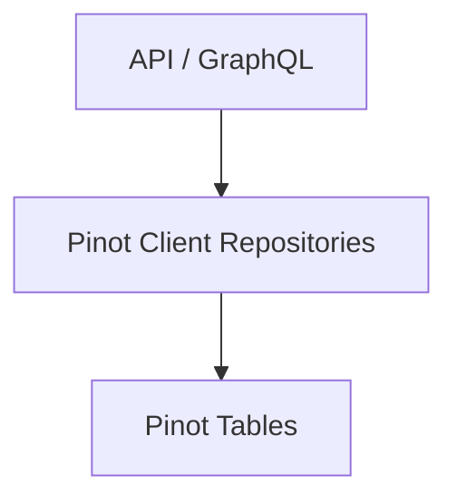

# Data Layer Core And Pinot

## Overview

The **Data Layer Core And Pinot** module is a foundational backend module in the Flamingo / OpenFrame platform responsible for:

- Configuring and wiring **multi-database persistence layers** (Cassandra, Pinot)
- Providing **analytical query access** via Apache Pinot for devices and logs
- Emitting **device and tag change events** to Kafka for downstream analytics ingestion
- Defining **shared data models** used across NATS, Kafka, and analytics pipelines
- Integrating with external tools to securely retrieve **agent registration secrets**

This module sits at the intersection of **operational data** (MongoDB, Cassandra), **streaming infrastructure** (Kafka, NATS), and **analytical storage** (Pinot), acting as the bridge that turns state changes into queryable insights.

---

## Architectural Role

At a high level, Data Layer Core And Pinot:

1. Observes changes to core domain entities (devices, tags)
2. Translates those changes into normalized analytics events
3. Publishes events to Kafka for ingestion into Pinot
4. Exposes read-optimized repositories for querying Pinot directly

---

## Core Responsibilities

### 1. Data Source Configuration

The module provides Spring Boot configuration for multiple backend systems:

- **Cassandra** for time-series and scalable structured data
- **Pinot** for low-latency analytical queries
- **Tool SDKs** for interacting with integrated external systems

Key configuration components:

- CassandraConfig – session setup, keyspace creation, replication
- CassandraKeyspaceNormalizer – ensures tenant-safe keyspace names
- PinotConfig – broker and controller connections
- ToolSdkConfig – SDK client beans for integrated tools
- ConfigurationLogger – logs resolved infrastructure endpoints at startup

---

### 2. Cassandra Enablement And Health

Cassandra support is **feature-flag driven** and can be enabled per deployment using configuration.

Capabilities include:

- Automatic keyspace creation if missing
- Schema creation using CREATE_IF_NOT_EXISTS
- Health checks exposed through Spring Actuator

The CassandraHealthIndicator actively verifies cluster availability by querying system metadata.

---

### 3. Event Driven Analytics Pipeline

One of the most critical roles of this module is converting **state changes** into **analytics events**.

#### Machine And Tag Event Flow

- Repository save operations are intercepted using Spring AOP
- Events are delegated to a dedicated domain service
- Enriched messages are published to Kafka

#### MachineTagEventAspect

- Intercepts saves for Machine, MachineTag, and Tag entities
- Uses @AfterReturning and @Around advice
- Ensures failures never block persistence

#### MachineTagEventServiceImpl

- Fetches full machine context and associated tags
- Builds normalized MachinePinotMessage payloads
- Publishes tenant-aware Kafka messages

This design guarantees that **analytics state remains eventually consistent** with operational data.

---

### 4. Pinot Analytics Repositories

The module exposes specialized repositories optimized for querying Apache Pinot.

#### Device Analytics

PinotClientDeviceRepository provides:

- Filter option aggregation (status, OS, device type, tags)
- Fast COUNT queries for pagination
- Dynamic WHERE clause construction

Typical use cases include device dashboards and fleet summaries.

#### Log Analytics

PinotClientLogRepository supports:

- Cursor-based pagination
- Full-text log search
- Multi-dimensional filtering (time, severity, tool, org)
- Dynamic sorting with safe column validation

---

### 5. Shared Messaging Models

The module defines strongly typed models for inter-service communication over NATS and Kafka.

Examples include:

- ClientConnectionEvent
- InstalledAgentMessage
- ToolConnectionMessage
- ToolInstallationMessage

These models act as a **contract** between stream producers and consumers, ensuring schema stability.

---

### 6. Integrated Tool Secrets Retrieval

For agent onboarding, the module securely retrieves **registration secrets** from external tools.

Supported integrations include:

- Fleet MDM
- Tactical RMM

Each integration:

- Resolves tool configuration from the database
- Locates the correct API endpoint
- Uses the official SDK to retrieve secrets

This approach avoids hard-coded credentials and keeps sensitive operations centralized.

---

## How This Module Fits In The Platform

Data Layer Core And Pinot is consumed by multiple higher-level services:

- API services for analytics queries
- Stream services for ingestion pipelines
- Management services for tool lifecycle operations

It depends on:

- Kafka infrastructure for event delivery
- Pinot for analytical storage
- Cassandra for scalable persistence

Together, this module enables **real-time observability**, **fleet analytics**, and **historical insights** across the OpenFrame ecosystem.

---

## Summary

The Data Layer Core And Pinot module:

- Bridges operational data with analytical systems
- Enforces clean separation between writes and reads
- Uses event-driven patterns for scalability
- Centralizes configuration for critical data infrastructure

It is a cornerstone of Flamingo’s ability to provide fast, reliable, and deeply integrated analytics across the MSP stack.
