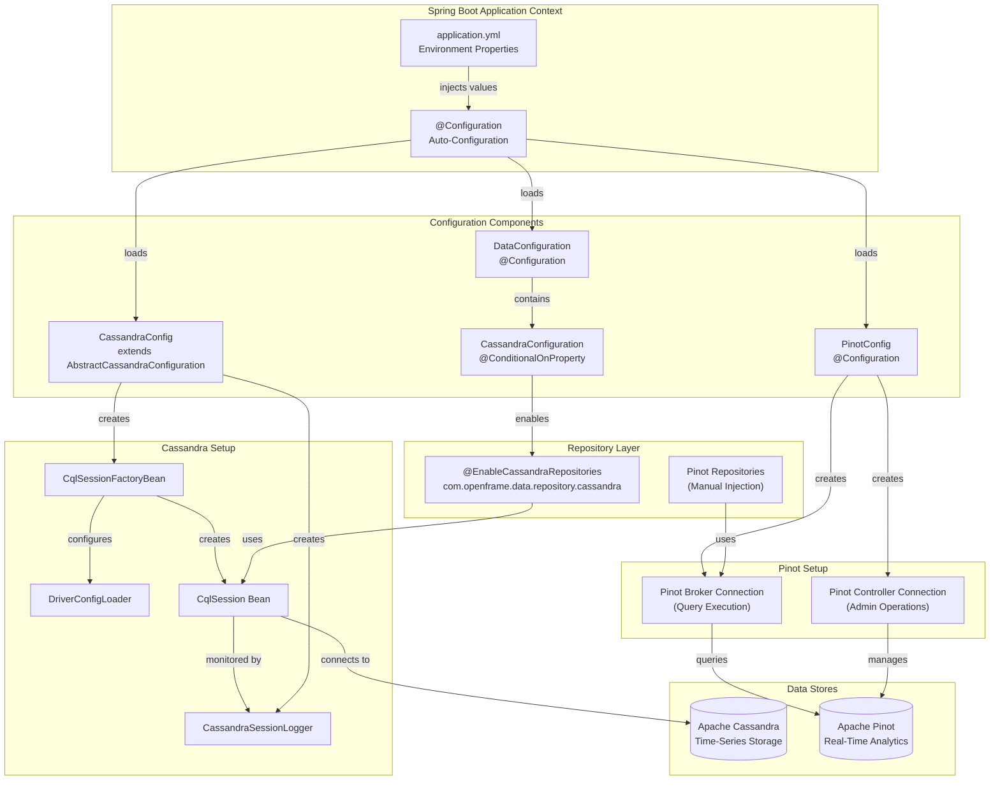
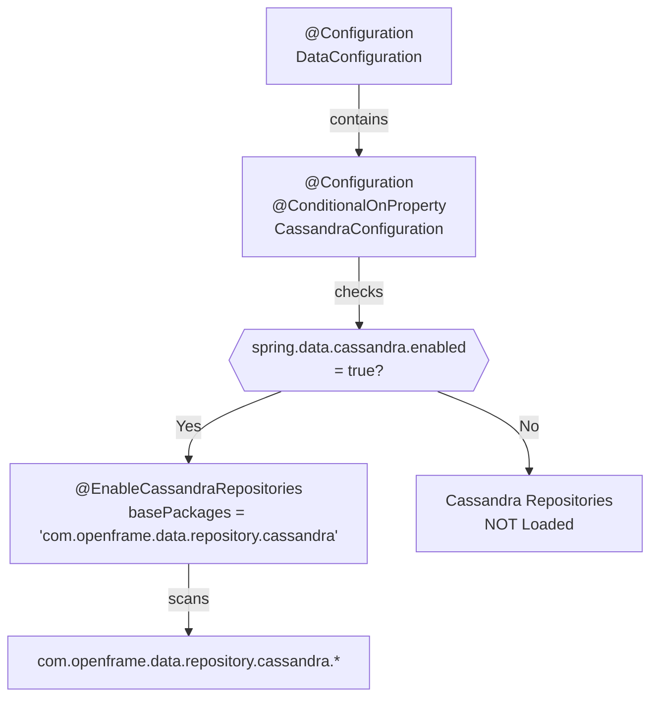
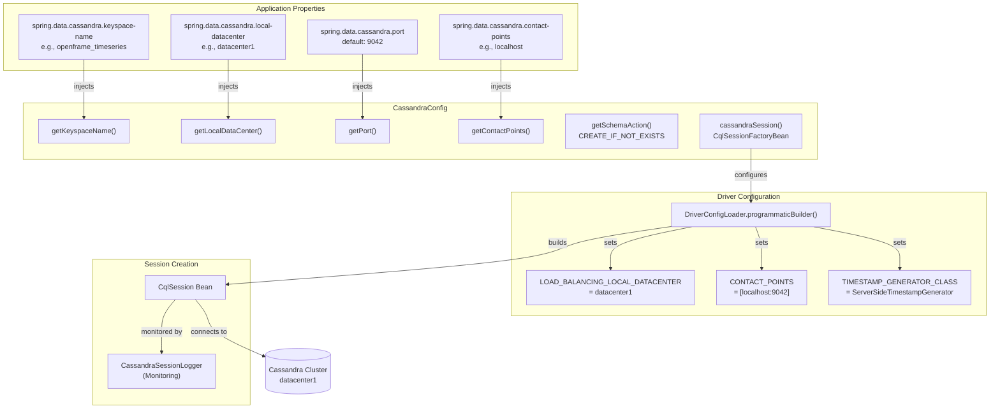
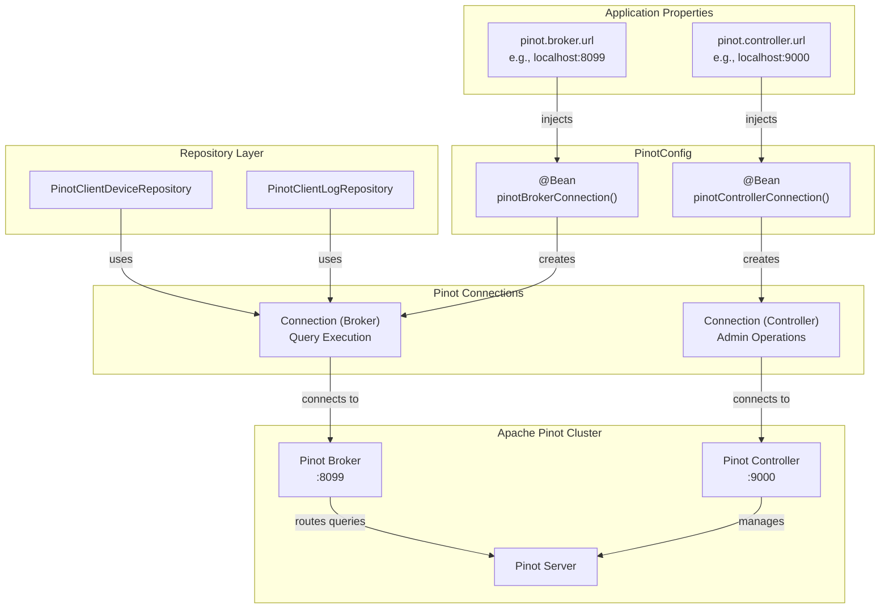
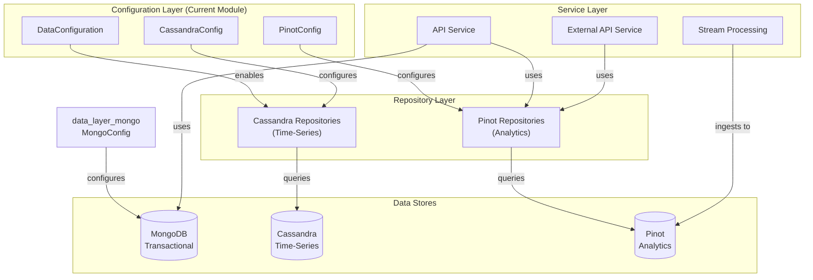
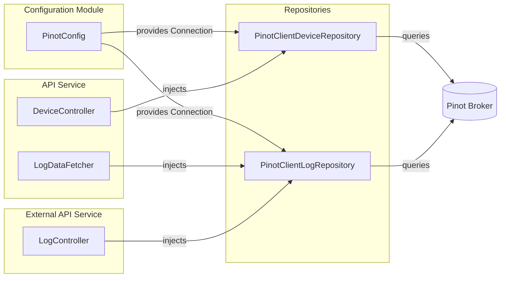

# Data Layer Core Configuration Module

## Overview

The **data_layer_core_configuration** module provides Spring Boot auto-configuration for analytical data stores in the OpenFrame platform. This module configures connections to **Apache Cassandra** (time-series storage) and **Apache Pinot** (real-time analytics), enabling high-performance analytical workloads separate from transactional operations.

As part of the [data_layer_core](./data_layer_core.md) module, this configuration layer enables:
- **Conditional Database Enablement**: Cassandra repositories can be enabled/disabled via configuration
- **Multi-Datacenter Support**: Cassandra configuration with datacenter-aware load balancing
- **Dual Connection Management**: Separate Pinot broker (queries) and controller (admin) connections
- **Schema Management**: Automatic Cassandra schema creation and migration
- **Production-Ready Defaults**: Optimized driver configurations for enterprise deployments

## Purpose

The configuration module provides:

1. **Cassandra Auto-Configuration**: Session factory, driver configuration, and repository enablement
2. **Pinot Connection Management**: Broker and controller connection beans for query execution
3. **Conditional Repository Activation**: Enable analytical data stores only when needed
4. **Driver Optimization**: Custom Cassandra driver settings for performance and reliability
5. **Environment-Specific Configuration**: Support for development, staging, and production environments

---

## Architecture Overview

The configuration module establishes connections to analytical data stores and enables Spring Data repositories:



---

## Core Components

### 1. DataConfiguration

**Location**: `com.openframe.data.config.DataConfiguration`

**Purpose**: Top-level configuration class that conditionally enables Cassandra repositories based on application properties.

**Key Features**:
- ✅ **Conditional Activation**: Uses `@ConditionalOnProperty` to enable Cassandra only when configured
- ✅ **Repository Scanning**: Enables Spring Data Cassandra repositories in specific package
- ✅ **Modular Design**: Allows services to use Pinot without Cassandra infrastructure

**Configuration Structure**:



**Code Implementation**:

```java
@Configuration
public class DataConfiguration {
    @Configuration
    @ConditionalOnProperty(
        name = "spring.data.cassandra.enabled", 
        havingValue = "true", 
        matchIfMissing = false
    )
    @EnableCassandraRepositories(
        basePackages = "com.openframe.data.repository.cassandra"
    )
    public static class CassandraConfiguration {}
}
```

**Conditional Logic**:
- **Property**: `spring.data.cassandra.enabled`
- **Required Value**: `true`
- **Default Behavior**: Disabled if property is missing (`matchIfMissing = false`)
- **Effect**: Cassandra repositories are only loaded when explicitly enabled

---

### 2. CassandraConfig

**Location**: `com.openframe.data.config.CassandraConfig`

**Purpose**: Configures Apache Cassandra session factory, driver settings, and connection parameters for time-series data storage.

**Key Features**:
- ✅ **Datacenter-Aware Load Balancing**: Routes queries to local datacenter for low latency
- ✅ **Custom Driver Configuration**: Programmatic driver settings for production optimization
- ✅ **Schema Management**: Automatic table creation with `CREATE_IF_NOT_EXISTS`
- ✅ **Session Monitoring**: Logs session initialization for debugging
- ✅ **Server-Side Timestamps**: Uses Cassandra server time for consistency

**Configuration Flow**:



**Driver Configuration Details**:

| Configuration Option | Value | Purpose |
|---------------------|-------|---------|
| **LOAD_BALANCING_LOCAL_DATACENTER** | `datacenter1` (from properties) | Routes queries to local datacenter for low latency |
| **CONTACT_POINTS** | `["localhost:9042"]` (from properties) | Initial cluster contact points |
| **TIMESTAMP_GENERATOR_CLASS** | `ServerSideTimestampGenerator` | Uses Cassandra server time for consistency across clients |

**Schema Action**:
- **CREATE_IF_NOT_EXISTS**: Automatically creates tables and keyspace if they don't exist
- **Safe for Production**: Idempotent operation that won't overwrite existing data
- **Development Friendly**: No manual schema setup required

**Session Logging**:

```java
@Bean
public CassandraSessionLogger cassandraSessionLogger(CqlSession session) {
    return new CassandraSessionLogger(session);
}
```

The `CassandraSessionLogger` bean monitors session initialization and logs connection details for debugging.

**Example Configuration**:

```yaml
spring:
  data:
    cassandra:
      enabled: true
      keyspace-name: openframe_timeseries
      contact-points: cassandra-node1.example.com
      port: 9042
      local-datacenter: us-east-1
```

---

### 3. PinotConfig

**Location**: `com.openframe.data.config.PinotConfig`

**Purpose**: Configures Apache Pinot connections for real-time analytical queries and administrative operations.

**Key Features**:
- ✅ **Dual Connection Management**: Separate broker (queries) and controller (admin) connections
- ✅ **Properties-Based Configuration**: Externalized URLs for environment-specific deployments
- ✅ **Connection Pooling**: Efficient connection reuse via Apache Pinot client
- ✅ **Simple Bean Injection**: Direct injection into repositories and services

**Connection Architecture**:



**Connection Types**:

#### Broker Connection (Query Execution)

**Purpose**: Execute SQL queries against Pinot tables for analytical workloads.

**Configuration**:
```java
@Bean
public Connection pinotBrokerConnection() {
    Properties properties = new Properties();
    properties.setProperty("brokerList", brokerUrl);
    return ConnectionFactory.fromProperties(properties);
}
```

**Usage**:
- Used by `PinotClientDeviceRepository` for device analytics
- Used by `PinotClientLogRepository` for log search and aggregation
- Supports SQL queries with sub-second latency
- Automatically load-balances across broker nodes

**Example Query**:
```sql
SELECT deviceId, hostname, status, lastSeen 
FROM devices 
WHERE organizationId = 'org123' 
  AND status = 'ONLINE'
LIMIT 100
```

#### Controller Connection (Admin Operations)

**Purpose**: Perform administrative operations like table management and schema updates.

**Configuration**:
```java
@Bean
public Connection pinotControllerConnection() {
    return ConnectionFactory.fromHostList(controllerUrl);
}
```

**Usage**:
- Table creation and schema management
- Segment management and rebalancing
- Cluster health checks
- Typically used by management services, not repositories

**Example Configuration**:

```yaml
pinot:
  broker:
    url: pinot-broker.example.com:8099
  controller:
    url: pinot-controller.example.com:9000
  tables:
    devices:
      name: devices
      realtime: true
    logs:
      name: logs
      realtime: true
```

---

## Configuration Properties Reference

### Cassandra Properties

| Property | Type | Default | Description |
|----------|------|---------|-------------|
| `spring.data.cassandra.enabled` | Boolean | `false` | Enable Cassandra repositories |
| `spring.data.cassandra.keyspace-name` | String | Required | Cassandra keyspace name |
| `spring.data.cassandra.contact-points` | String | Required | Comma-separated list of contact points |
| `spring.data.cassandra.port` | Integer | `9042` | Cassandra native transport port |
| `spring.data.cassandra.local-datacenter` | String | Required | Local datacenter name for load balancing |

### Pinot Properties

| Property | Type | Default | Description |
|----------|------|---------|-------------|
| `pinot.broker.url` | String | Required | Pinot broker URL (host:port) |
| `pinot.controller.url` | String | Required | Pinot controller URL (host:port) |
| `pinot.tables.devices.name` | String | `devices` | Device analytics table name |
| `pinot.tables.logs.name` | String | `logs` | Log analytics table name |

---

## Environment-Specific Configurations

### Development Environment

**Minimal setup for local development**:

```yaml
# application-dev.yml
spring:
  data:
    cassandra:
      enabled: false  # Disable Cassandra for simpler local setup

pinot:
  broker:
    url: localhost:8099
  controller:
    url: localhost:9000
```

**Docker Compose Setup**:
```yaml
services:
  pinot-controller:
    image: apachepinot/pinot:latest
    ports:
      - "9000:9000"
    command: StartController -zkAddress zookeeper:2181

  pinot-broker:
    image: apachepinot/pinot:latest
    ports:
      - "8099:8099"
    command: StartBroker -zkAddress zookeeper:2181
```

### Staging Environment

**Multi-node setup with Cassandra**:

```yaml
# application-staging.yml
spring:
  data:
    cassandra:
      enabled: true
      keyspace-name: openframe_staging
      contact-points: cassandra-staging-1.internal,cassandra-staging-2.internal
      port: 9042
      local-datacenter: us-east-1

pinot:
  broker:
    url: pinot-broker-staging.internal:8099
  controller:
    url: pinot-controller-staging.internal:9000
```

### Production Environment

**High-availability configuration**:

```yaml
# application-prod.yml
spring:
  data:
    cassandra:
      enabled: true
      keyspace-name: openframe_production
      contact-points: cassandra-prod-1.internal,cassandra-prod-2.internal,cassandra-prod-3.internal
      port: 9042
      local-datacenter: us-east-1
      # Additional production settings via driver config

pinot:
  broker:
    url: pinot-broker-prod.internal:8099
  controller:
    url: pinot-controller-prod.internal:9000
  connection:
    timeout: 30000
    max-connections: 100
```

**Production Considerations**:
- ✅ **Multiple Contact Points**: List all Cassandra nodes for failover
- ✅ **Datacenter Awareness**: Set correct local datacenter for query routing
- ✅ **Connection Pooling**: Configure appropriate connection limits
- ✅ **Monitoring**: Enable session logging and metrics
- ✅ **Security**: Use SSL/TLS for production clusters (configured via driver)

---

## Integration with Other Modules

### Data Layer Ecosystem



**Related Modules**:
- **[data_layer_core](./data_layer_core.md)**: Parent module containing repositories and query builders
- **[data_layer_core_pinot_repositories](./data_layer_core_pinot_repositories.md)**: Repositories using Pinot connections
- **[data_layer_mongo_configuration](./data_layer_mongo_configuration.md)**: Transactional database configuration
- **[stream_processing_configuration](./stream_processing_configuration.md)**: Kafka configuration for data ingestion

### Service Dependencies



---

## Troubleshooting

### Common Configuration Issues

#### Issue 1: Cassandra Repositories Not Loading

**Symptom**: `NoSuchBeanDefinitionException` for Cassandra repositories.

**Cause**: `spring.data.cassandra.enabled` is not set to `true`.

**Solution**:
```yaml
spring:
  data:
    cassandra:
      enabled: true  # Must be explicitly enabled
```

#### Issue 2: Cassandra Connection Timeout

**Symptom**: `AllNodesFailedException` or connection timeout errors.

**Cause**: Incorrect contact points or datacenter configuration.

**Solution**:
```yaml
spring:
  data:
    cassandra:
      contact-points: correct-hostname.internal  # Verify hostname
      local-datacenter: datacenter1  # Must match actual datacenter name
```

**Verification**:
```bash
# Check datacenter name in Cassandra
cqlsh -e "SELECT data_center FROM system.local;"
```

#### Issue 3: Pinot Connection Refused

**Symptom**: `Connection refused` when querying Pinot.

**Cause**: Incorrect broker URL or Pinot not running.

**Solution**:
```yaml
pinot:
  broker:
    url: localhost:8099  # Verify port and hostname
```

**Verification**:
```bash
# Test Pinot broker connectivity
curl http://localhost:8099/health

# Check Pinot tables
curl http://localhost:9000/tables
```

#### Issue 4: Schema Creation Failures

**Symptom**: `InvalidQueryException` during startup.

**Cause**: Insufficient permissions or keyspace doesn't exist.

**Solution**:
```sql
-- Create keyspace manually with appropriate replication
CREATE KEYSPACE IF NOT EXISTS openframe_timeseries
WITH replication = {
  'class': 'NetworkTopologyStrategy',
  'datacenter1': 3
};
```

**Grant Permissions**:
```sql
GRANT ALL PERMISSIONS ON KEYSPACE openframe_timeseries TO openframe_user;
```

---

## Performance Optimization

### Cassandra Driver Tuning

**Connection Pooling**:
```java
@Override
public CqlSessionFactoryBean cassandraSession() {
    CqlSessionFactoryBean bean = super.cassandraSession();
    bean.setSessionBuilderConfigurer(builder -> {
        return builder.withConfigLoader(DriverConfigLoader.programmaticBuilder()
            // ... existing config ...
            .withInt(DefaultDriverOption.CONNECTION_POOL_LOCAL_SIZE, 4)
            .withInt(DefaultDriverOption.CONNECTION_POOL_REMOTE_SIZE, 2)
            .withDuration(DefaultDriverOption.REQUEST_TIMEOUT, Duration.ofSeconds(10))
            .build());
    });
    return bean;
}
```

**Recommended Settings**:
| Setting | Development | Production | Purpose |
|---------|-------------|------------|---------|
| `CONNECTION_POOL_LOCAL_SIZE` | 1 | 4-8 | Connections per local node |
| `CONNECTION_POOL_REMOTE_SIZE` | 1 | 2-4 | Connections per remote node |
| `REQUEST_TIMEOUT` | 5s | 10s | Query timeout |
| `HEARTBEAT_INTERVAL` | 30s | 30s | Connection health check |

### Pinot Query Optimization

**Connection Properties**:
```java
@Bean
public Connection pinotBrokerConnection() {
    Properties properties = new Properties();
    properties.setProperty("brokerList", brokerUrl);
    properties.setProperty("queryTimeout", "30000");  // 30 seconds
    properties.setProperty("maxConnectionsPerServer", "20");
    return ConnectionFactory.fromProperties(properties);
}
```

---

## Security Considerations

### Cassandra Authentication

**Enable Authentication**:
```yaml
spring:
  data:
    cassandra:
      username: ${CASSANDRA_USERNAME}
      password: ${CASSANDRA_PASSWORD}
      ssl:
        enabled: true
```

**Driver Configuration**:
```java
bean.setSessionBuilderConfigurer(builder -> {
    return builder
        .withAuthCredentials(username, password)
        .withSslContext(sslContext)
        .withConfigLoader(/* ... */);
});
```

### Pinot Security

**API Key Authentication** (if enabled):
```yaml
pinot:
  broker:
    url: https://pinot-broker.example.com:8099
    auth:
      enabled: true
      api-key: ${PINOT_API_KEY}
```

---

## Monitoring and Observability

### Cassandra Session Logging

The `CassandraSessionLogger` bean provides startup diagnostics:

```text
INFO  CassandraConfig - Initializing Cassandra session with contact points: cassandra-prod-1.internal, port: 9042, datacenter: us-east-1, keyspace: openframe_production
DEBUG CassandraConfig - Configuring Cassandra session builder with load balancing DC: us-east-1
INFO  CassandraSessionLogger - Cassandra session initialized successfully
```

### Health Checks

**Spring Boot Actuator Integration**:
```yaml
management:
  health:
    cassandra:
      enabled: true
    pinot:
      enabled: true
```

**Custom Health Indicators**:
```java
@Component
public class PinotHealthIndicator implements HealthIndicator {
    
    private final Connection pinotBrokerConnection;
    
    @Override
    public Health health() {
        try {
            // Execute simple query to verify connectivity
            pinotBrokerConnection.execute("SELECT 1");
            return Health.up().withDetail("broker", "connected").build();
        } catch (Exception e) {
            return Health.down().withException(e).build();
        }
    }
}
```

---

## Best Practices

### Configuration Management

✅ **DO**:
- Use environment variables for sensitive credentials
- Enable Cassandra only when needed (`enabled: false` for services that don't use it)
- Configure appropriate datacenter names for multi-region deployments
- Use separate Pinot connections for queries (broker) and admin (controller)
- Set realistic timeouts based on query complexity

❌ **DON'T**:
- Hardcode credentials in configuration files
- Enable Cassandra globally if only some services need it
- Use default datacenter names in production
- Share single Pinot connection for all operations
- Set infinite timeouts

### Connection Lifecycle

✅ **DO**:
- Let Spring manage connection lifecycle (singleton beans)
- Reuse connections across repository calls
- Configure connection pooling for high-throughput scenarios
- Monitor connection health with actuator endpoints

❌ **DON'T**:
- Create new connections per query
- Close connections manually (Spring handles this)
- Ignore connection pool exhaustion warnings

### Schema Management

✅ **DO**:
- Use `CREATE_IF_NOT_EXISTS` for development environments
- Manage production schemas with migration tools (Liquibase, Flyway)
- Version control your Cassandra CQL scripts
- Test schema changes in staging before production

❌ **DON'T**:
- Use `RECREATE` or `DROP_AND_CREATE` in production
- Rely solely on auto-schema generation for production
- Make schema changes without backups

---

## Testing

### Integration Tests

**Testcontainers Setup**:
```java
@SpringBootTest
@Testcontainers
public class CassandraConfigIntegrationTest {
    
    @Container
    static CassandraContainer<?> cassandra = new CassandraContainer<>("cassandra:4.1")
        .withExposedPorts(9042);
    
    @DynamicPropertySource
    static void cassandraProperties(DynamicPropertyRegistry registry) {
        registry.add("spring.data.cassandra.enabled", () -> true);
        registry.add("spring.data.cassandra.contact-points", cassandra::getHost);
        registry.add("spring.data.cassandra.port", cassandra::getFirstMappedPort);
        registry.add("spring.data.cassandra.local-datacenter", () -> "datacenter1");
        registry.add("spring.data.cassandra.keyspace-name", () -> "test_keyspace");
    }
    
    @Autowired
    private CqlSession session;
    
    @Test
    void testCassandraConnection() {
        assertThat(session).isNotNull();
        assertThat(session.isClosed()).isFalse();
    }
}
```

**Pinot Mock Configuration**:
```java
@TestConfiguration
public class PinotTestConfig {
    
    @Bean
    @Primary
    public Connection pinotBrokerConnection() {
        // Return mock connection for unit tests
        return mock(Connection.class);
    }
}
```

---

## Migration Guide

### From Embedded Configuration to External

**Before** (Embedded in service):
```java
@Configuration
public class MyServiceConfig {
    @Bean
    public CqlSession cassandraSession() {
        return CqlSession.builder()
            .addContactPoint(new InetSocketAddress("localhost", 9042))
            .withLocalDatacenter("datacenter1")
            .build();
    }
}
```

**After** (Using data_layer_core_configuration):
```yaml
# application.yml
spring:
  data:
    cassandra:
      enabled: true
      contact-points: localhost
      port: 9042
      local-datacenter: datacenter1
      keyspace-name: my_keyspace
```

**Benefits**:
- ✅ Centralized configuration management
- ✅ Environment-specific property files
- ✅ Conditional repository enablement
- ✅ Consistent driver settings across services

---

## Related Documentation

- **[data_layer_core](./data_layer_core.md)**: Parent module overview
- **[data_layer_core_pinot_repositories](./data_layer_core_pinot_repositories.md)**: Repositories using these connections
- **[data_layer_core_query_builders](./data_layer_core_query_builders.md)**: Query construction utilities
- **[data_layer_mongo_configuration](./data_layer_mongo_configuration.md)**: Transactional database configuration
- **[stream_processing_configuration](./stream_processing_configuration.md)**: Kafka configuration for data ingestion

---

## Additional Resources

### Apache Cassandra
- **Official Documentation**: https://cassandra.apache.org/doc/latest/
- **DataStax Java Driver**: https://docs.datastax.com/en/developer/java-driver/4.15/
- **Spring Data Cassandra**: https://spring.io/projects/spring-data-cassandra

### Apache Pinot
- **Official Documentation**: https://docs.pinot.apache.org/
- **Java Client**: https://docs.pinot.apache.org/users/clients/java
- **Query Language**: https://docs.pinot.apache.org/users/user-guide-query/querying-pinot

### OpenFrame Platform
- **OpenFrame Website**: https://openframe.ai
- **Flamingo Platform**: https://flamingo.run
- **OpenMSP Community**: https://www.openmsp.ai/

---

**Questions or Issues?**  
Join the OpenMSP Slack community for support: https://join.slack.com/t/openmsp/shared_invite/zt-36bl7mx0h-3~U2nFH6nqHqoTPXMaHEHA
