# Data Layer Core - Pinot Repositories

## Overview

The **Pinot Repositories** module provides high-performance, real-time analytical query capabilities for OpenFrame's device and log data using Apache Pinot as the underlying OLAP datastore. This module implements repository patterns for querying large-scale time-series data with sub-second latency, enabling dynamic filtering, aggregations, and full-text search across millions of records.

**Key Capabilities:**
- **Real-time Analytics**: Sub-second query performance on large datasets
- **Dynamic Filtering**: Multi-dimensional filtering with faceted search support
- **Full-Text Search**: Text matching across log summaries and user identifiers
- **Cursor-Based Pagination**: Efficient pagination for large result sets
- **Type-Safe Query Building**: Fluent API for constructing complex Pinot queries
- **Filter Option Discovery**: Dynamic filter options based on current query context

---

## Architecture

### Component Overview

```mermaid
flowchart TD
    subgraph API["API Layer"]
        DeviceDataFetcher["DeviceDataFetcher"]
        LogDataFetcher["LogDataFetcher"]
    end
    
    subgraph Repositories["Pinot Repository Layer"]
        PinotDeviceRepo["PinotClientDeviceRepository"]
        PinotLogRepo["PinotClientLogRepository"]
        PinotDeviceInterface["PinotDeviceRepository"]
        PinotLogInterface["PinotLogRepository"]
    end
    
    subgraph QueryBuilder["Query Construction"]
        QueryBuilder["PinotQueryBuilder"]
    end
    
    subgraph Connection["Pinot Connection"]
        PinotConnection["Pinot Broker Connection"]
        PinotConfig["PinotConfig"]
    end
    
    subgraph Models["Data Models"]
        LogProjection["LogProjection"]
        OrgOption["OrganizationOption"]
    end
    
    subgraph Pinot["Apache Pinot"]
        DevicesTable["devices Table"]
        LogsTable["logs Table"]
    end
    
    DeviceDataFetcher -->|"uses"| PinotDeviceInterface
    LogDataFetcher -->|"uses"| PinotLogInterface
    
    PinotDeviceRepo -.->|"implements"| PinotDeviceInterface
    PinotLogRepo -.->|"implements"| PinotLogInterface
    
    PinotDeviceRepo -->|"builds queries"| QueryBuilder
    PinotLogRepo -->|"builds queries"| QueryBuilder
    
    PinotDeviceRepo -->|"executes"| PinotConnection
    PinotLogRepo -->|"executes"| PinotConnection
    
    PinotConnection -->|"configured by"| PinotConfig
    
    PinotConnection -->|"queries"| DevicesTable
    PinotConnection -->|"queries"| LogsTable
    
    PinotLogRepo -->|"returns"| LogProjection
    PinotLogRepo -->|"returns"| OrgOption
    
    style PinotDeviceRepo fill:#4A90E2
    style PinotLogRepo fill:#4A90E2
    style QueryBuilder fill:#50C878
    style PinotConnection fill:#F39C12
```

### Repository Pattern

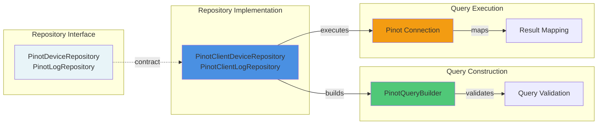

---

## Core Components

### 1. PinotClientDeviceRepository

**Purpose**: Provides analytical queries for device data with dynamic filtering and aggregation capabilities.

**Key Responsibilities:**
- Query device filter options (status, type, OS, organization, tags)
- Calculate filtered device counts
- Build dynamic WHERE clauses based on multiple filter dimensions
- Exclude specific filters when calculating filter options

**Interface Contract:**

```java
public interface PinotDeviceRepository {
    Map<String, Integer> getStatusFilterOptions(...);
    Map<String, Integer> getDeviceTypeFilterOptions(...);
    Map<String, Integer> getOsTypeFilterOptions(...);
    Map<String, Integer> getOrganizationFilterOptions(...);
    Map<String, Integer> getTagFilterOptions(...);
    int getFilteredDeviceCount(...);
}
```

**Implementation Highlights:**

```java
@Repository
public class PinotClientDeviceRepository implements PinotDeviceRepository {
    
    private final Connection pinotConnection;
    
    @Value("${pinot.tables.devices.name:devices}")
    private String devicesTable;
    
    @Override
    public Map<String, Integer> getStatusFilterOptions(
            List<String> statuses,
            List<String> deviceTypes,
            List<String> osTypes,
            List<String> organizationIds,
            List<String> tagNames) {
        // Exclude 'status' from WHERE clause to get all status options
        String whereClause = buildWhereClauseExcluding(
            statuses, deviceTypes, osTypes, organizationIds, tagNames, "status"
        );
        
        return queryPinotForFilterOptions(
            "SELECT status, COUNT(*) as count FROM \"" + devicesTable + "\"" +
            (whereClause.isEmpty() ? "" : " WHERE " + whereClause) +
            " GROUP BY status ORDER BY count DESC"
        );
    }
}
```

**Query Pattern:**

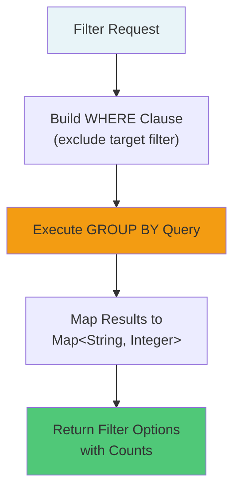

**Configuration:**

```yaml
pinot:
  tables:
    devices:
      name: devices  # Pinot table name for device data
```

---

### 2. PinotClientLogRepository

**Purpose**: Provides high-performance log querying with full-text search, cursor-based pagination, and dynamic filter discovery.

**Key Responsibilities:**
- Query logs with multi-dimensional filtering
- Full-text search across log summaries and user IDs
- Cursor-based pagination for efficient result streaming
- Dynamic filter option discovery (tool types, event types, severities, organizations)
- Date range filtering with timezone support

**Interface Contract:**

```java
public interface PinotLogRepository {
    List<LogProjection> findLogs(...);
    List<LogProjection> searchLogs(...);
    List<String> getToolTypeOptions(...);
    List<String> getEventTypeOptions(...);
    List<String> getSeverityOptions(...);
    List<String> getAvailableDateRanges(...);
    List<OrganizationOption> getOrganizationOptions(...);
}
```

**Implementation Highlights:**

```java
@Repository
public class PinotClientLogRepository implements PinotLogRepository {
    
    private final Connection pinotConnection;
    
    @Value("${pinot.tables.logs.name:logs}")
    private String logsTable;
    
    @Override
    public List<LogProjection> searchLogs(
            LocalDate startDate, LocalDate endDate,
            List<String> toolTypes, List<String> eventTypes,
            List<String> severities, List<String> organizationIds,
            String deviceId, String searchTerm, String cursor, int limit) {
        
        PinotQueryBuilder queryBuilder = new PinotQueryBuilder(logsTable)
            .select("toolEventId", "ingestDay", "toolType", "eventType", 
                    "severity", "userId", "deviceId", "hostname", 
                    "organizationId", "organizationName", "summary", "eventTimestamp")
            .whereDateRange("eventTimestamp", startDate, endDate)
            .whereIn("toolType", toolTypes)
            .whereIn("eventType", eventTypes)
            .whereIn("severity", severities)
            .whereIn("organizationId", organizationIds)
            .whereEquals("deviceId", deviceId)
            .whereRelevanceLogSearch(searchTerm)  // Full-text search
            .whereCursor(cursor)                   // Pagination
            .orderByTimestampDesc()
            .limit(limit);
        
        return executeLogQuery(queryBuilder.build());
    }
}
```

**Query Execution Flow:**

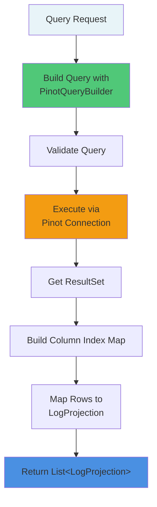

**Configuration:**

```yaml
pinot:
  tables:
    logs:
      name: logs  # Pinot table name for log data
```

---

### 3. PinotQueryBuilder

**Purpose**: Fluent API for constructing type-safe, validated Pinot SQL queries with advanced features like full-text search, cursor pagination, and date range filtering.

**Key Features:**
- **Fluent Interface**: Chainable method calls for query construction
- **SQL Injection Prevention**: Automatic escaping of user input
- **Validation**: Compile-time and runtime validation of query components
- **Advanced Search**: TEXT_MATCH function support for full-text search
- **Cursor Pagination**: Efficient pagination using timestamp + ID cursors
- **Date Range Handling**: Timezone-aware date range queries

**Core API:**

```java
public class PinotQueryBuilder {
    
    // Selection
    public PinotQueryBuilder select(String... columns);
    public PinotQueryBuilder distinct();
    public PinotQueryBuilder selectCount();
    
    // Filtering
    public PinotQueryBuilder whereEquals(String field, String value);
    public PinotQueryBuilder whereIn(String field, List<String> values);
    public PinotQueryBuilder whereDateRange(String field, LocalDate start, LocalDate end);
    public PinotQueryBuilder whereTextSearch(String searchTerm, String... columns);
    public PinotQueryBuilder whereCursor(String cursor);
    
    // Ordering & Limiting
    public PinotQueryBuilder orderBy(String... columns);
    public PinotQueryBuilder orderByTimestampDesc();
    public PinotQueryBuilder limit(int limit);
    
    // Grouping
    public PinotQueryBuilder groupBy(String... columns);
    
    // Build
    public String build();
}
```

**Usage Examples:**

```java
// Simple device count query
String query = new PinotQueryBuilder("devices")
    .selectCount()
    .whereEquals("status", "ACTIVE")
    .whereIn("deviceType", List.of("LAPTOP", "DESKTOP"))
    .build();
// Result: SELECT COUNT(*) FROM "devices" WHERE status = 'ACTIVE' AND deviceType IN ('LAPTOP', 'DESKTOP')

// Log search with pagination
String query = new PinotQueryBuilder("logs")
    .select("toolEventId", "summary", "eventTimestamp")
    .whereDateRange("eventTimestamp", startDate, endDate)
    .whereRelevanceLogSearch("error authentication")
    .whereCursor("1704067200000_evt123")
    .orderByTimestampDesc()
    .limit(50)
    .build();

// Filter options with grouping
String query = new PinotQueryBuilder("devices")
    .select("status", "COUNT(*) as count")
    .whereIn("organizationId", List.of("org1", "org2"))
    .groupBy("status")
    .orderByCountDesc()
    .build();
```

**Query Construction Flow:**

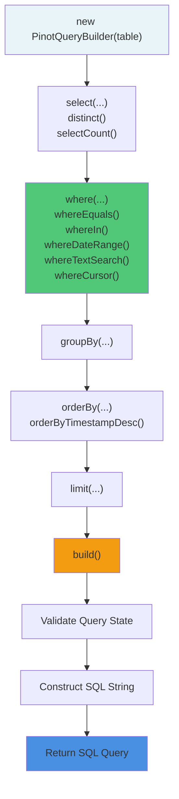

**SQL Injection Prevention:**

```java
private String escapeSqlValue(String value) {
    if (value == null) {
        return "";
    }
    // Escape single quotes and backslashes
    return value.replace("'", "''").replace("\\", "\\\\");
}

public PinotQueryBuilder whereEquals(String field, String value) {
    validateFieldName(field);
    if (value != null && !value.trim().isEmpty()) {
        whereConditions.add(field + " = '" + escapeSqlValue(value.trim()) + "'");
    }
    return this;
}
```

**Cursor Pagination:**

The builder supports efficient cursor-based pagination using a composite cursor format: `{timestamp}_{toolEventId}`

```java
public PinotQueryBuilder whereCursor(String cursor) {
    if (cursor != null && !cursor.trim().isEmpty()) {
        String[] cursorParts = cursor.split("_", 2);
        if (cursorParts.length == 2) {
            long timestamp = Long.parseLong(cursorParts[0]);
            String toolEventId = cursorParts[1];
            
            // (eventTimestamp < timestamp) OR 
            // (eventTimestamp = timestamp AND toolEventId < 'evt123')
            String cursorCondition = 
                "(eventTimestamp < " + timestamp + ") OR " +
                "(eventTimestamp = " + timestamp + 
                " AND toolEventId < '" + escapeSqlValue(toolEventId) + "')";
            
            whereConditions.add(cursorCondition);
        }
    }
    return this;
}
```

**Validation:**

```java
private void validateQueryState() {
    if (selectColumns.isEmpty()) {
        throw new PinotQueryException("No columns selected. Use select() method first.");
    }
}

private void validateLimit(int limit) {
    if (limit < 1 || limit > 10000) {
        throw new PinotQueryException("Limit must be between 1 and 10000, got: " + limit);
    }
}
```

---

## Data Models

### LogProjection

**Purpose**: Lightweight projection of log data optimized for API responses.

```java
@Data
@Builder
@AllArgsConstructor
@NoArgsConstructor
public class LogProjection {
    public String toolEventId;      // Unique event identifier
    public String ingestDay;        // Partition key (YYYY-MM-DD)
    public String toolType;         // Source tool (e.g., "FLEET_MDM")
    public String eventType;        // Event classification
    public String severity;         // Log severity level
    public String userId;           // Associated user ID
    public String deviceId;         // Associated device ID
    public String hostname;         // Device hostname
    public String organizationId;   // Organization identifier
    public String organizationName; // Organization display name
    public String summary;          // Log message summary
    public Instant eventTimestamp;  // Event occurrence time
}
```

**Usage:**

```java
List<LogProjection> logs = pinotLogRepository.searchLogs(
    startDate, endDate, toolTypes, eventTypes, 
    severities, organizationIds, deviceId, searchTerm, cursor, limit
);

logs.forEach(log -> {
    System.out.println(log.getEventTimestamp() + ": " + log.getSummary());
});
```

---

### OrganizationOption

**Purpose**: Represents an organization filter option with ID and display name.

```java
@Data
@Builder
@AllArgsConstructor
@NoArgsConstructor
public class OrganizationOption {
    public String id;    // Organization ID
    public String name;  // Organization display name
}
```

**Usage:**

```java
List<OrganizationOption> orgs = pinotLogRepository.getOrganizationOptions(
    startDate, endDate, toolTypes, eventTypes, severities
);

// Returns: [
//   OrganizationOption(id="org1", name="Acme Corp"),
//   OrganizationOption(id="org2", name="TechStart Inc")
// ]
```

---

## Query Patterns

### 1. Dynamic Filter Options

**Problem**: Users need to see available filter options based on their current filter selections.

**Solution**: Exclude the target filter from the WHERE clause when calculating its options.

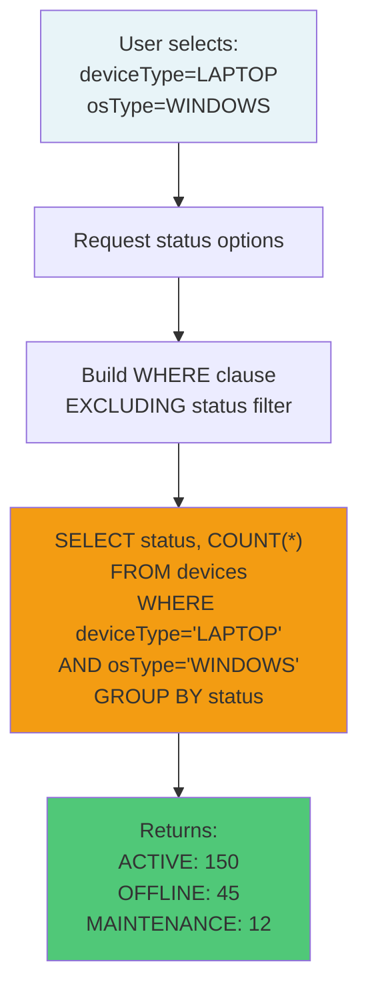

**Implementation:**

```java
private String buildWhereClauseExcluding(
        List<String> statuses, List<String> deviceTypes,
        List<String> osTypes, List<String> organizationIds,
        List<String> tagNames, String excludeField) {
    
    List<String> conditions = new ArrayList<>();
    conditions.add("status != 'DELETED'");  // Always exclude deleted
    
    // Include status filter only if not excluded
    if (statuses != null && !statuses.isEmpty() && !"status".equals(excludeField)) {
        String statusCondition = statuses.stream()
            .map(status -> "status = '" + status + "'")
            .collect(Collectors.joining(" OR "));
        conditions.add("(" + statusCondition + ")");
    }
    
    // Repeat for other filters...
    
    return String.join(" AND ", conditions);
}
```

---

### 2. Full-Text Search with Relevance

**Problem**: Users need to search across log summaries and user IDs with relevance ranking.

**Solution**: Use Pinot's TEXT_MATCH function with OR conditions across multiple fields.

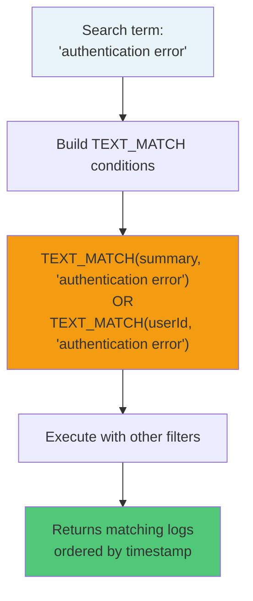

**Implementation:**

```java
public PinotQueryBuilder whereRelevanceLogSearch(String searchTerm) {
    if (searchTerm != null && !searchTerm.trim().isEmpty()) {
        String processedSearchTerm = escapeSqlValue(searchTerm.trim());
        
        List<String> relevanceConditions = new ArrayList<>();
        relevanceConditions.add(
            "TEXT_MATCH(summary, '" + processedSearchTerm + "')"
        );
        relevanceConditions.add(
            "TEXT_MATCH(userId, '" + processedSearchTerm + "')"
        );
        
        String relevanceCondition = "(" + String.join(" OR ", relevanceConditions) + ")";
        whereConditions.add(relevanceCondition);
    }
    return this;
}
```

---

### 3. Cursor-Based Pagination

**Problem**: Traditional OFFSET pagination is inefficient for large datasets and doesn't handle real-time data well.

**Solution**: Use composite cursor (timestamp + ID) for consistent, efficient pagination.

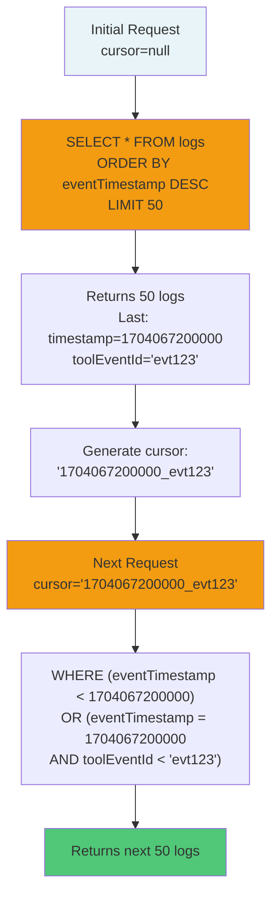

**Cursor Format:**

```text
{timestamp}_{toolEventId}

Examples:
- 1704067200000_evt123
- 1704067199500_evt456
```

**Benefits:**
- **Consistent Results**: Handles real-time data insertion
- **Efficient**: Uses indexed columns (timestamp + ID)
- **Stateless**: No server-side state required
- **Deterministic**: Same cursor always returns same results

---

### 4. Date Range Filtering with Timezones

**Problem**: Date ranges need to respect user timezones for accurate filtering.

**Solution**: Convert LocalDate to epoch milliseconds using user's timezone.

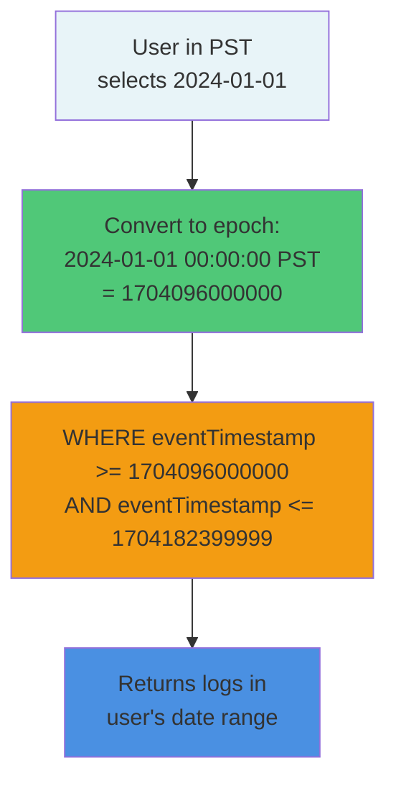

**Implementation:**

```java
private String buildDateRangeConditionWithTimezone(
        String field, LocalDate startDate, LocalDate endDate, ZoneId userZone) {
    
    if (startDate != null && endDate != null) {
        if ("eventTimestamp".equals(field)) {
            ZoneId targetZone = userZone != null ? userZone : ZoneId.systemDefault();
            
            // Start of day in user's timezone
            long startEpoch = startDate.atTime(LocalTime.MIN)
                .atZone(targetZone).toInstant().toEpochMilli();
            
            // End of day in user's timezone
            long endEpoch = endDate.atTime(LocalTime.MAX)
                .atZone(targetZone).toInstant().toEpochMilli();
            
            return field + " >= " + startEpoch + " AND " + field + " <= " + endEpoch;
        }
    }
    return "";
}
```

---

## Integration with Other Modules

### API Service Integration

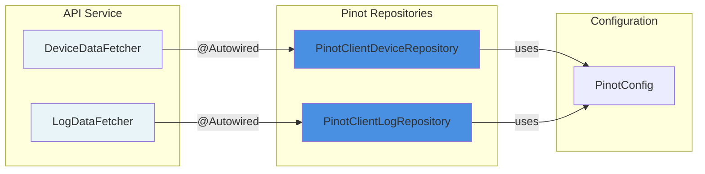

**Reference**: See [api_service_graphql_datafetchers.md](api_service_graphql_datafetchers.md) for GraphQL integration details.

---

### Stream Processing Integration

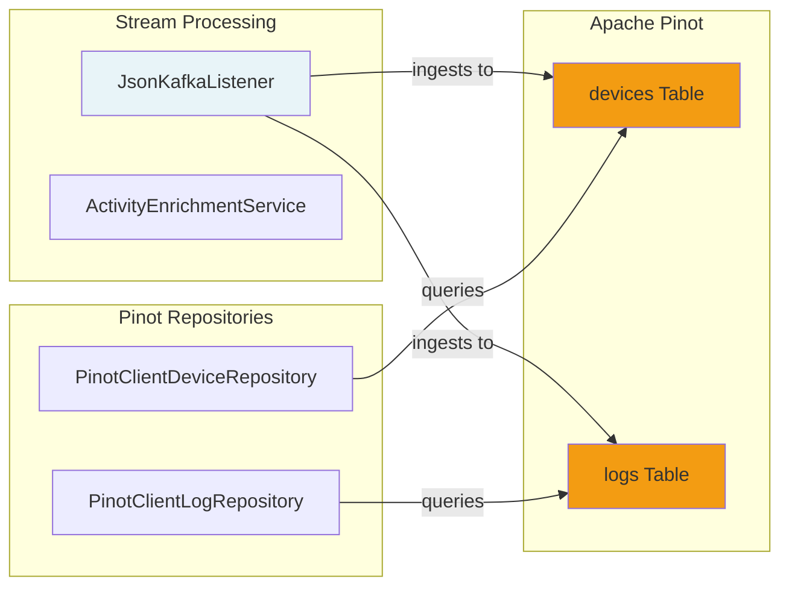

**Reference**: See [stream_processing.md](stream_processing.md) for data ingestion pipeline details.

---

### Configuration Module Integration

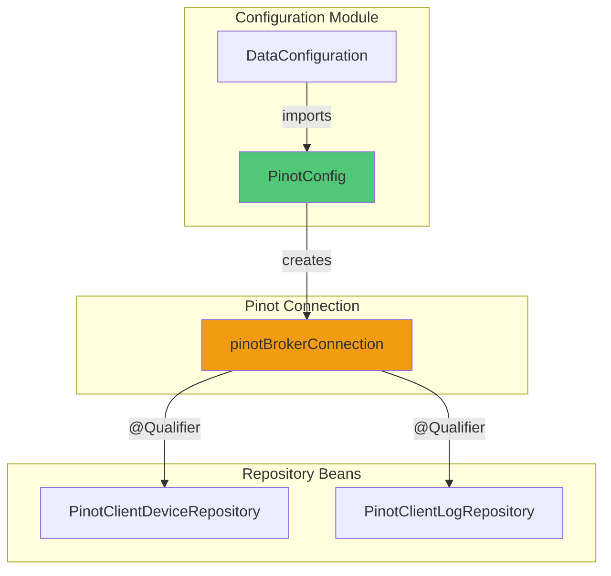

**Reference**: See [data_layer_core_configuration.md](data_layer_core_configuration.md) for Pinot connection setup.

---

## Configuration

### Application Properties

```yaml
# Pinot Configuration
pinot:
  broker:
    url: ${PINOT_BROKER_URL:http://localhost:8099}
  
  tables:
    devices:
      name: ${PINOT_DEVICES_TABLE:devices}
    logs:
      name: ${PINOT_LOGS_TABLE:logs}
```

### Environment Variables

| Variable | Description | Default | Required |
|----------|-------------|---------|----------|
| `PINOT_BROKER_URL` | Pinot broker endpoint | `http://localhost:8099` | Yes |
| `PINOT_DEVICES_TABLE` | Devices table name | `devices` | No |
| `PINOT_LOGS_TABLE` | Logs table name | `logs` | No |

---

## Performance Considerations

### Query Optimization

**1. Use Indexed Columns in WHERE Clauses**

```java
// ✅ Good - uses indexed timestamp column
.whereDateRange("eventTimestamp", startDate, endDate)

// ❌ Bad - full table scan
.whereLike("summary", "error")
```

**2. Limit Result Sets**

```java
// ✅ Good - bounded result set
.limit(50)

// ❌ Bad - unbounded query
.build()  // No limit
```

**3. Use Cursor Pagination for Large Datasets**

```java
// ✅ Good - efficient pagination
.whereCursor("1704067200000_evt123")
.orderByTimestampDesc()
.limit(50)

// ❌ Bad - OFFSET pagination (not supported in builder)
```

**4. Leverage Pinot's Aggregation Capabilities**

```java
// ✅ Good - aggregation in Pinot
.select("status", "COUNT(*) as count")
.groupBy("status")

// ❌ Bad - fetch all rows and aggregate in application
.select("*")
```

---

### Caching Strategies

**Filter Options Caching:**

```java
@Cacheable(value = "deviceFilterOptions", key = "#root.methodName + #statuses + #deviceTypes")
public Map<String, Integer> getStatusFilterOptions(
        List<String> statuses,
        List<String> deviceTypes,
        List<String> osTypes,
        List<String> organizationIds,
        List<String> tagNames) {
    // Implementation
}
```

**Cache Invalidation:**

```java
@CacheEvict(value = "deviceFilterOptions", allEntries = true)
public void invalidateDeviceFilterCache() {
    // Called when device data changes
}
```

---

### Connection Pooling

The Pinot connection is managed by `PinotConfig` and reused across all repository instances:

```java
@Configuration
public class PinotConfig {
    
    @Bean(name = "pinotBrokerConnection")
    public Connection pinotBrokerConnection(
            @Value("${pinot.broker.url}") String brokerUrl) {
        return ConnectionFactory.fromHostList(brokerUrl);
    }
}
```

**Benefits:**
- **Connection Reuse**: Single connection shared across repositories
- **Thread-Safe**: Pinot Java client handles concurrent requests
- **Automatic Reconnection**: Client handles broker failures

---

## Error Handling

### PinotQueryException

**Purpose**: Wraps all Pinot query errors with context.

```java
public class PinotQueryException extends RuntimeException {
    public PinotQueryException(String message) {
        super(message);
    }
    
    public PinotQueryException(String message, Throwable cause) {
        super(message, cause);
    }
}
```

**Usage:**

```java
try {
    ResultSetGroup resultSetGroup = pinotConnection.execute(query);
    // Process results
} catch (Exception e) {
    log.error("Unexpected error executing Pinot query: {}", query, e);
    throw new PinotQueryException("Failed to execute Pinot query: " + e.getMessage(), e);
}
```

**Common Error Scenarios:**

| Error | Cause | Solution |
|-------|-------|----------|
| `PinotQueryException: No columns selected` | `build()` called without `select()` | Call `select()` before `build()` |
| `PinotQueryException: Invalid cursor format` | Malformed cursor string | Validate cursor format: `{timestamp}_{id}` |
| `PinotQueryException: Limit must be between 1 and 10000` | Invalid limit value | Use limit between 1-10000 |
| `Connection timeout` | Pinot broker unreachable | Check `PINOT_BROKER_URL` configuration |
| `Table not found` | Table doesn't exist in Pinot | Verify table name in configuration |

---

## Testing

### Unit Testing Repositories

```java
@ExtendWith(MockitoExtension.class)
class PinotClientLogRepositoryTest {
    
    @Mock
    private Connection pinotConnection;
    
    @InjectMocks
    private PinotClientLogRepository repository;
    
    @Test
    void testFindLogs_WithFilters_ReturnsFilteredLogs() {
        // Arrange
        ResultSetGroup mockResultSetGroup = mock(ResultSetGroup.class);
        ResultSet mockResultSet = mock(ResultSet.class);
        
        when(pinotConnection.execute(anyString())).thenReturn(mockResultSetGroup);
        when(mockResultSetGroup.getResultSet(0)).thenReturn(mockResultSet);
        when(mockResultSet.getRowCount()).thenReturn(2);
        
        // Act
        List<LogProjection> logs = repository.findLogs(
            LocalDate.of(2024, 1, 1),
            LocalDate.of(2024, 1, 31),
            List.of("FLEET_MDM"),
            List.of("LOGIN"),
            List.of("INFO"),
            List.of("org1"),
            null, null, 50
        );
        
        // Assert
        assertNotNull(logs);
        verify(pinotConnection).execute(contains("WHERE"));
        verify(pinotConnection).execute(contains("toolType IN ('FLEET_MDM')"));
    }
}
```

---

### Integration Testing with Testcontainers

```java
@SpringBootTest
@Testcontainers
class PinotRepositoryIntegrationTest {
    
    @Container
    static PinotContainer pinotContainer = new PinotContainer()
        .withExposedPorts(8099);
    
    @DynamicPropertySource
    static void configurePinot(DynamicPropertyRegistry registry) {
        registry.add("pinot.broker.url", 
            () -> "http://localhost:" + pinotContainer.getMappedPort(8099));
    }
    
    @Autowired
    private PinotClientLogRepository logRepository;
    
    @Test
    void testSearchLogs_WithRealPinot_ReturnsResults() {
        // Test with real Pinot instance
        List<LogProjection> logs = logRepository.searchLogs(
            LocalDate.now().minusDays(7),
            LocalDate.now(),
            null, null, null, null, null, "error", null, 10
        );
        
        assertNotNull(logs);
    }
}
```

---

## Best Practices

### 1. Always Use Query Builder

**✅ Good:**

```java
String query = new PinotQueryBuilder("logs")
    .select("toolEventId", "summary")
    .whereEquals("deviceId", deviceId)
    .orderByTimestampDesc()
    .limit(50)
    .build();
```

**❌ Bad:**

```java
String query = "SELECT toolEventId, summary FROM logs WHERE deviceId = '" + deviceId + "'";
// SQL injection risk, no validation
```

---

### 2. Validate Input Parameters

```java
public List<LogProjection> findLogs(..., int limit) {
    if (limit < 1 || limit > 10000) {
        throw new IllegalArgumentException("Limit must be between 1 and 10000");
    }
    // Build query
}
```

---

### 3. Use Appropriate Projections

```java
// ✅ Good - select only needed columns
.select("toolEventId", "summary", "eventTimestamp")

// ❌ Bad - select all columns
.select("*")
```

---

### 4. Handle Null Filters Gracefully

```java
public PinotQueryBuilder whereIn(String field, List<String> values) {
    validateFieldName(field);
    if (values != null && !values.isEmpty()) {  // ✅ Null check
        // Add condition
    }
    return this;  // ✅ Return this for chaining
}
```

---

### 5. Log Queries for Debugging

```java
private List<LogProjection> executeLogQuery(String query) {
    try {
        log.debug("Executing Pinot query: {}", query);  // ✅ Log query
        ResultSetGroup resultSetGroup = pinotConnection.execute(query);
        // Process results
    } catch (Exception e) {
        log.error("Error executing query: {}", query, e);  // ✅ Log error with query
        throw new PinotQueryException("Failed to execute query: " + e.getMessage(), e);
    }
}
```

---

## Troubleshooting

### Query Performance Issues

**Symptom**: Queries taking longer than expected (> 1 second)

**Diagnosis:**

```bash
# Check Pinot broker logs
kubectl logs -n openframe deployment/pinot-broker

# Check query execution time
curl "http://localhost:8099/query/sql" \
  -d '{"sql":"SELECT COUNT(*) FROM logs WHERE eventTimestamp > 1704067200000"}'
```

**Solutions:**
1. Add indexes to frequently queried columns
2. Reduce date range in queries
3. Use more specific filters to reduce result set
4. Check Pinot cluster health and resource allocation

---

### Connection Failures

**Symptom**: `Connection timeout` or `Unable to connect to Pinot broker`

**Diagnosis:**

```bash
# Test broker connectivity
curl http://localhost:8099/health

# Check broker URL configuration
echo $PINOT_BROKER_URL
```

**Solutions:**
1. Verify `PINOT_BROKER_URL` is correct
2. Check network connectivity to Pinot cluster
3. Verify Pinot broker is running and healthy
4. Check firewall rules

---

### Invalid Query Errors

**Symptom**: `PinotQueryException: Invalid query syntax`

**Diagnosis:**

```java
// Enable debug logging
logging.level.com.openframe.data.repository.pinot=DEBUG
```

**Solutions:**
1. Review generated SQL query in logs
2. Validate field names match Pinot schema
3. Check for SQL injection characters in input
4. Verify table name configuration

---

## Future Enhancements

### Planned Features

1. **Query Result Caching**
   - Redis-based caching for frequently accessed filter options
   - TTL-based cache invalidation

2. **Advanced Text Search**
   - Fuzzy matching support
   - Phrase search with quotes
   - Boolean operators (AND, OR, NOT)

3. **Query Performance Metrics**
   - Execution time tracking
   - Slow query logging
   - Query optimization suggestions

4. **Batch Query Support**
   - Execute multiple queries in parallel
   - Aggregate results from multiple tables

5. **Dynamic Schema Discovery**
   - Auto-detect available columns
   - Generate filter options based on schema

---

## Related Documentation

- **[data_layer_core_configuration.md](data_layer_core_configuration.md)** - Pinot connection configuration
- **[data_layer_core_query_builders.md](data_layer_core_query_builders.md)** - Detailed query builder documentation
- **[api_service_graphql_datafetchers.md](api_service_graphql_datafetchers.md)** - GraphQL integration
- **[stream_processing.md](stream_processing.md)** - Data ingestion pipeline
- **[data_layer_mongo.md](data_layer_mongo.md)** - MongoDB repositories for transactional data

---

## Additional Resources

- **Apache Pinot Documentation**: https://docs.pinot.apache.org/
- **Pinot Query Language**: https://docs.pinot.apache.org/users/user-guide-query/querying-pinot
- **TEXT_MATCH Function**: https://docs.pinot.apache.org/users/user-guide-query/supported-transformations#text-match

---

**Questions or Issues?**  
Join the OpenMSP Slack community for support: https://www.openmsp.ai/
