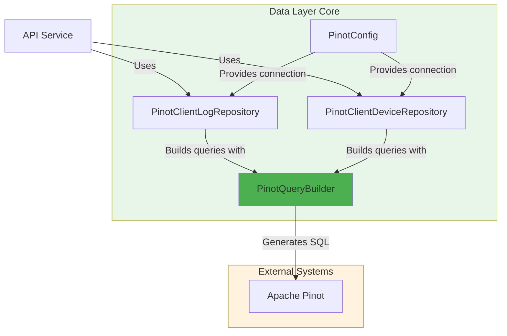
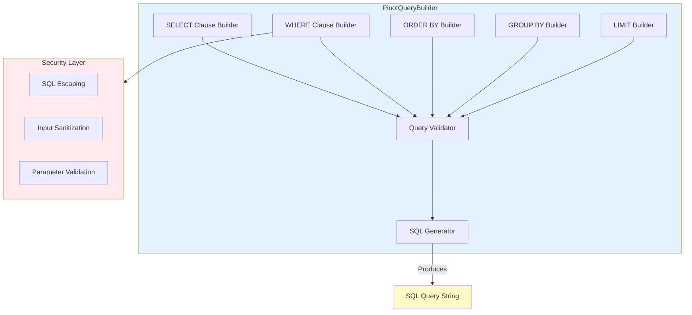
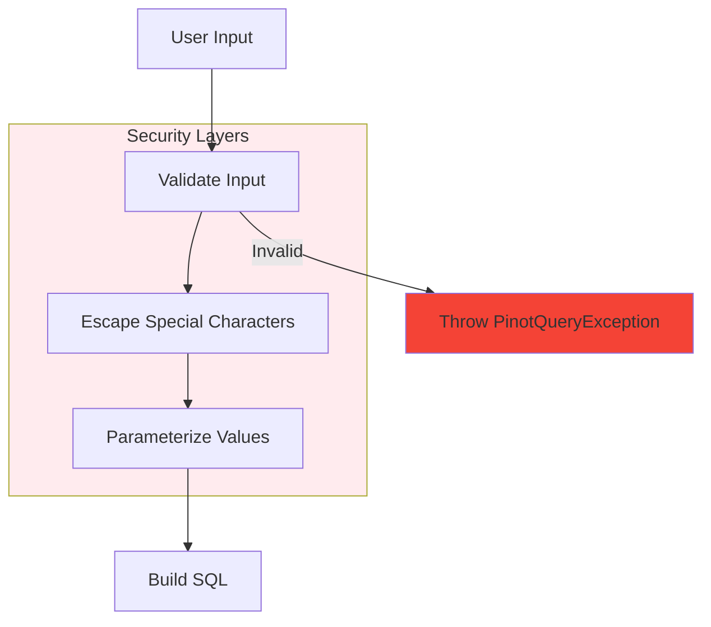
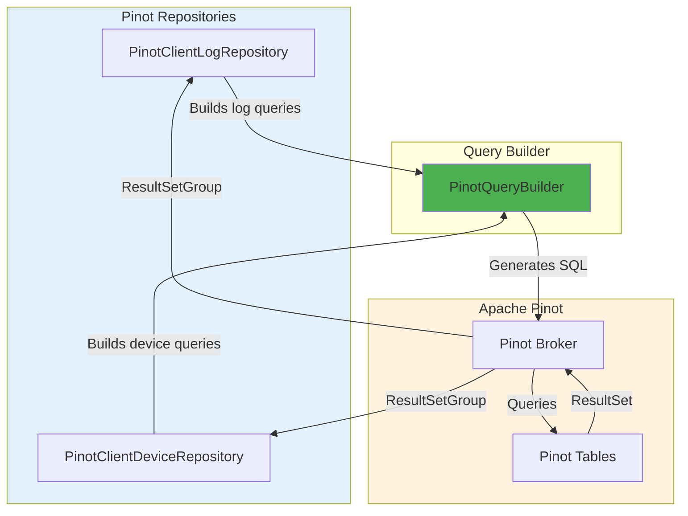
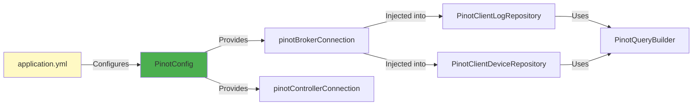
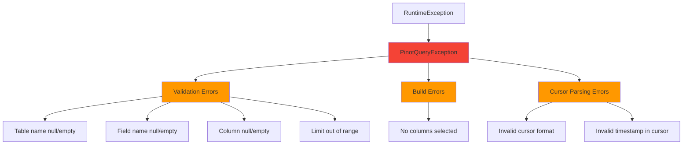

# Data Layer Core Query Builders

## Overview

The **Data Layer Core Query Builders** module provides a fluent, type-safe SQL query builder specifically designed for Apache Pinot real-time analytics database queries. This module is part of OpenFrame's data access layer and serves as the foundation for constructing complex, parameterized SQL queries with built-in validation, SQL injection protection, and cursor-based pagination support.

**Key Responsibilities:**
- Fluent API for building Pinot SQL queries programmatically
- SQL injection prevention through parameterization and escaping
- Support for complex filtering, searching, and aggregation operations
- Cursor-based pagination for efficient result set traversal
- Date range queries with timezone support
- Full-text search capabilities using Pinot's TEXT_MATCH function
- Dynamic filter construction for multi-dimensional data exploration

**Primary Component:**
- `PinotQueryBuilder` - Fluent query builder with method chaining

---

## Table of Contents

1. [Architecture](#architecture)
2. [Core Components](#core-components)
3. [Query Building Patterns](#query-building-patterns)
4. [Security Features](#security-features)
5. [Integration Points](#integration-points)
6. [Usage Examples](#usage-examples)
7. [Best Practices](#best-practices)
8. [Error Handling](#error-handling)

---

## Architecture

### System Context



### Component Architecture



### Query Construction Flow


---

## Core Components

### PinotQueryBuilder

The central component providing a fluent API for constructing Apache Pinot SQL queries.

**Location:** `deps-openframe-oss-lib/openframe-data/src/main/java/com/openframe/data/repository/pinot/PinotQueryBuilder.java`

**Key Features:**

1. **Fluent Method Chaining**
   - All builder methods return `this` for chainable calls
   - Intuitive, readable query construction
   - Type-safe parameter handling

2. **SQL Clause Support**
   - SELECT with column specification and DISTINCT
   - WHERE with multiple condition types
   - ORDER BY with custom and predefined orderings
   - GROUP BY with aggregation support
   - LIMIT with validation

3. **Advanced Filtering**
   - Equality, inequality, range comparisons
   - IN and OR conditions
   - LIKE pattern matching
   - Full-text search via TEXT_MATCH
   - Date range queries with timezone support
   - Cursor-based pagination

4. **Security Features**
   - SQL injection prevention through escaping
   - Input validation on all parameters
   - Parameterized value handling
   - Reserved keyword protection

**Constructor:**

```java
public PinotQueryBuilder(String tableName)
```

**Core Methods:**

| Method Category | Methods | Description |
|----------------|---------|-------------|
| **SELECT** | `select(String...)`, `distinct()`, `selectCount()`, `selectCountAll()` | Define columns to retrieve |
| **WHERE - Basic** | `where(String)`, `whereEquals()`, `whereNotEquals()`, `whereGreaterThan()`, `whereGreaterThanOrEqual()`, `whereLessThanOrEqual()` | Basic filtering conditions |
| **WHERE - Collections** | `whereIn(String, List)`, `whereOr(String, List)` | Multi-value filtering |
| **WHERE - Search** | `whereTextSearch()`, `whereLike()`, `whereRelevanceLogSearch()` | Text-based searching |
| **WHERE - Date** | `whereDateRange(String, LocalDate, LocalDate)`, `whereDateRange(..., ZoneId)` | Date range filtering with timezone support |
| **WHERE - Pagination** | `whereCursor(String)` | Cursor-based pagination |
| **WHERE - Advanced** | `whereFilterOptionsExcluding()` | Dynamic filter construction |
| **ORDER BY** | `orderBy(String...)`, `orderByTimestampDesc()`, `orderByTimestampAsc()`, `orderByCountDesc()` | Result ordering |
| **GROUP BY** | `groupBy(String...)`, `groupByWithCount()` | Aggregation grouping |
| **LIMIT** | `limit(int)` | Result set size control |
| **BUILD** | `build()` | Generate final SQL query |

---

## Query Building Patterns

### Basic Query Pattern

```java
// Simple SELECT with filtering
String query = new PinotQueryBuilder("logs")
    .select("toolEventId", "eventType", "severity", "summary")
    .whereEquals("deviceId", "device-123")
    .whereIn("severity", List.of("ERROR", "CRITICAL"))
    .orderByTimestampDesc()
    .limit(100)
    .build();
```

**Generated SQL:**
```sql
SELECT toolEventId, eventType, severity, summary 
FROM "logs" 
WHERE deviceId = 'device-123' AND severity IN ('ERROR', 'CRITICAL') 
ORDER BY eventTimestamp DESC, toolEventId DESC 
LIMIT 100
```

### Aggregation Pattern

```java
// COUNT with GROUP BY
String query = new PinotQueryBuilder("devices")
    .select("status")
    .selectCount()
    .whereNotEquals("status", "DELETED")
    .groupBy("status")
    .orderByCountDesc()
    .build();
```

**Generated SQL:**
```sql
SELECT status, COUNT(*) as count 
FROM "devices" 
WHERE status != 'DELETED' 
GROUP BY status 
ORDER BY count DESC
```

### Full-Text Search Pattern

```java
// TEXT_MATCH search across multiple columns
String query = new PinotQueryBuilder("logs")
    .select("toolEventId", "summary", "userId")
    .whereTextSearch("authentication failed", "summary", "userId")
    .whereDateRange("eventTimestamp", startDate, endDate)
    .orderByTimestampDesc()
    .limit(50)
    .build();
```

**Generated SQL:**
```sql
SELECT toolEventId, summary, userId 
FROM "logs" 
WHERE (TEXT_MATCH(summary, 'authentication failed') OR TEXT_MATCH(userId, 'authentication failed')) 
  AND eventTimestamp >= 1704067200000 AND eventTimestamp <= 1704153599999 
ORDER BY eventTimestamp DESC, toolEventId DESC 
LIMIT 50
```

### Cursor-Based Pagination Pattern

```java
// First page
String query = new PinotQueryBuilder("logs")
    .select("toolEventId", "eventTimestamp", "summary")
    .whereDateRange("eventTimestamp", startDate, endDate)
    .orderByTimestampDesc()
    .limit(100)
    .build();

// Subsequent page with cursor
String cursor = "1704123456789_event-id-123"; // timestamp_toolEventId
String nextPageQuery = new PinotQueryBuilder("logs")
    .select("toolEventId", "eventTimestamp", "summary")
    .whereDateRange("eventTimestamp", startDate, endDate)
    .whereCursor(cursor)
    .orderByTimestampDesc()
    .limit(100)
    .build();
```

**Generated SQL (with cursor):**
```sql
SELECT toolEventId, eventTimestamp, summary 
FROM "logs" 
WHERE eventTimestamp >= 1704067200000 AND eventTimestamp <= 1704153599999 
  AND ((eventTimestamp < 1704123456789) OR (eventTimestamp = 1704123456789 AND toolEventId < 'event-id-123'))
ORDER BY eventTimestamp DESC, toolEventId DESC 
LIMIT 100
```

### Dynamic Filter Pattern

```java
// Filter options excluding one dimension
String query = new PinotQueryBuilder("devices")
    .select("deviceType")
    .selectCount()
    .whereFilterOptionsExcluding(
        "status", 
        List.of("ONLINE", "OFFLINE"),  // statuses
        "deviceType",                   // exclude this field
        Map.of(
            "osType", List.of("Windows", "Linux"),
            "organizationId", List.of("org-1", "org-2")
        )
    )
    .groupBy("deviceType")
    .orderByCountDesc()
    .build();
```

---

## Security Features

### SQL Injection Prevention



**Escaping Mechanism:**

```java
private String escapeSqlValue(String value) {
    if (value == null) {
        return "";
    }
    // Escape single quotes: ' -> ''
    // Escape backslashes: \ -> \\
    return value.replace("'", "''").replace("\\", "\\\\");
}
```

**Protected Methods:**

| Method | Protection | Example |
|--------|-----------|---------|
| `whereEquals()` | Automatic escaping | `whereEquals("name", "O'Brien")` → `name = 'O''Brien'` |
| `whereIn()` | List value escaping | `whereIn("id", List.of("a'b", "c"))` → `id IN ('a''b', 'c')` |
| `whereLike()` | Pattern escaping | `whereLike("text", "50%")` → `text LIKE '%50%%'` |
| `whereTextSearch()` | Search term escaping | `whereTextSearch("user's query")` → `TEXT_MATCH(field, 'user''s query')` |

### Input Validation

**Field Name Validation:**
```java
private void validateFieldName(String field) {
    if (field == null || field.trim().isEmpty()) {
        throw new PinotQueryException("Field name must not be null or empty");
    }
}
```

**Column Validation:**
```java
private void validateColumns(String[] columns) {
    if (columns == null || columns.length == 0) {
        throw new PinotQueryException("Columns array must not be null or empty");
    }
    for (int i = 0; i < columns.length; i++) {
        if (columns[i] == null || columns[i].trim().isEmpty()) {
            throw new PinotQueryException("Column name at index " + i + " must not be null or empty");
        }
    }
}
```

**Limit Validation:**
```java
private void validateLimit(int limit) {
    if (limit < 1 || limit > 10000) {
        throw new PinotQueryException("Limit must be between 1 and 10000, got: " + limit);
    }
}
```

---

## Integration Points

### Repository Integration

The `PinotQueryBuilder` is primarily used by Pinot repository implementations:



**PinotClientLogRepository Integration:**

```java
@Override
public List<LogProjection> findLogs(LocalDate startDate, LocalDate endDate, 
                                    List<String> toolTypes, List<String> eventTypes,
                                    List<String> severities, List<String> organizationIds, 
                                    String deviceId, String cursor, int limit) {
    PinotQueryBuilder queryBuilder = new PinotQueryBuilder(logsTable)
        .select("toolEventId", "ingestDay", "toolType", "eventType", "severity", 
                "userId", "deviceId", "hostname", "organizationId", "organizationName", 
                "summary", "eventTimestamp")
        .whereDateRange("eventTimestamp", startDate, endDate)
        .whereIn("toolType", toolTypes)
        .whereIn("eventType", eventTypes)
        .whereIn("severity", severities)
        .whereIn("organizationId", organizationIds)
        .whereEquals("deviceId", deviceId)
        .whereCursor(cursor)
        .orderByTimestampDesc()
        .limit(limit);

    return executeLogQuery(queryBuilder.build());
}
```

**PinotClientDeviceRepository Integration:**

```java
@Override
public Map<String, Integer> getStatusFilterOptions(
        List<String> statuses, List<String> deviceTypes, List<String> osTypes,
        List<String> organizationIds, List<String> tagNames) {
    
    // Note: Current implementation uses manual SQL construction
    // Future enhancement: Migrate to PinotQueryBuilder
    String whereClause = buildWhereClauseExcluding(statuses, deviceTypes, osTypes, 
                                                   organizationIds, tagNames, "status");
    return queryPinotForFilterOptions(
        "SELECT status, COUNT(*) as count FROM \"" + devicesTable + "\"" +
        (whereClause.isEmpty() ? "" : " WHERE " + whereClause) +
        " GROUP BY status ORDER BY count DESC"
    );
}
```

### Configuration Dependencies



**Configuration Properties:**

```yaml
pinot:
  broker:
    url: localhost:8099
  controller:
    url: localhost:9000
  tables:
    logs:
      name: logs
    devices:
      name: devices
```

### Related Modules

| Module | Relationship | Description |
|--------|-------------|-------------|
| [data_layer_core_configuration](data_layer_core_configuration.md) | **Configuration Provider** | Provides Pinot connection beans and table configuration |
| [data_layer_core_pinot_repositories](data_layer_core_pinot_repositories.md) | **Primary Consumer** | Uses PinotQueryBuilder to construct queries for log and device data |
| [api_service_graphql_datafetchers](api_service_graphql_datafetchers.md) | **Indirect Consumer** | Consumes query results through repository layer |
| [external_api](external_api.md) | **Indirect Consumer** | Exposes queried data through REST endpoints |

---

## Usage Examples

### Example 1: Log Search with Multiple Filters

```java
public List<LogProjection> searchLogs(
        LocalDate startDate, 
        LocalDate endDate,
        List<String> toolTypes,
        List<String> severities,
        String searchTerm,
        String cursor,
        int limit) {
    
    PinotQueryBuilder queryBuilder = new PinotQueryBuilder("logs")
        .select("toolEventId", "eventType", "severity", "summary", 
                "eventTimestamp", "deviceId", "organizationId")
        .whereDateRange("eventTimestamp", startDate, endDate)
        .whereIn("toolType", toolTypes)
        .whereIn("severity", severities)
        .whereRelevanceLogSearch(searchTerm)  // Searches summary and userId
        .whereCursor(cursor)
        .orderByTimestampDesc()
        .limit(limit);
    
    String sql = queryBuilder.build();
    return executeQuery(sql);
}
```

### Example 2: Device Filter Options

```java
public Map<String, Integer> getDeviceTypeOptions(
        List<String> statuses,
        List<String> osTypes,
        List<String> organizationIds) {
    
    PinotQueryBuilder queryBuilder = new PinotQueryBuilder("devices")
        .select("deviceType")
        .selectCount()
        .whereNotEquals("status", "DELETED")
        .whereIn("status", statuses)
        .whereIn("osType", osTypes)
        .whereIn("organizationId", organizationIds)
        .groupBy("deviceType")
        .orderByCountDesc();
    
    String sql = queryBuilder.build();
    return executeAggregationQuery(sql);
}
```

### Example 3: Time-Series Event Count

```java
public Map<String, Long> getEventCountsByDay(
        LocalDate startDate,
        LocalDate endDate,
        List<String> eventTypes) {
    
    PinotQueryBuilder queryBuilder = new PinotQueryBuilder("logs")
        .select("ingestDay")
        .selectCount()
        .whereDateRange("eventTimestamp", startDate, endDate)
        .whereIn("eventType", eventTypes)
        .groupBy("ingestDay")
        .orderBy("ingestDay ASC");
    
    String sql = queryBuilder.build();
    return executeTimeSeriesQuery(sql);
}
```

### Example 4: Organization Filter with Timezone

```java
public List<LogProjection> getOrganizationLogs(
        String organizationId,
        LocalDate startDate,
        LocalDate endDate,
        ZoneId userTimezone,
        int limit) {
    
    PinotQueryBuilder queryBuilder = new PinotQueryBuilder("logs")
        .select("toolEventId", "eventType", "summary", "eventTimestamp")
        .whereEquals("organizationId", organizationId)
        .whereDateRange("eventTimestamp", startDate, endDate, userTimezone)
        .orderByTimestampDesc()
        .limit(limit);
    
    String sql = queryBuilder.build();
    return executeQuery(sql);
}
```

### Example 5: DISTINCT Value Retrieval

```java
public List<String> getAvailableEventTypes(
        LocalDate startDate,
        LocalDate endDate,
        List<String> organizationIds) {
    
    PinotQueryBuilder queryBuilder = new PinotQueryBuilder("logs")
        .select("eventType")
        .distinct()
        .whereDateRange("eventTimestamp", startDate, endDate)
        .whereIn("organizationId", organizationIds)
        .orderBy("eventType");
    
    String sql = queryBuilder.build();
    return executeDistinctQuery(sql);
}
```

---

## Best Practices

### 1. Always Use the Builder for Dynamic Queries

✅ **DO:**
```java
PinotQueryBuilder queryBuilder = new PinotQueryBuilder("logs")
    .select("toolEventId", "summary")
    .whereEquals("deviceId", userInput)  // Automatically escaped
    .limit(100);
```

❌ **DON'T:**
```java
String sql = "SELECT toolEventId, summary FROM logs WHERE deviceId = '" + userInput + "'";
// Vulnerable to SQL injection!
```

### 2. Validate Inputs Before Building

✅ **DO:**
```java
public List<LogProjection> findLogs(String deviceId, int limit) {
    if (deviceId == null || deviceId.trim().isEmpty()) {
        throw new IllegalArgumentException("Device ID is required");
    }
    if (limit < 1 || limit > 1000) {
        throw new IllegalArgumentException("Limit must be between 1 and 1000");
    }
    
    return new PinotQueryBuilder("logs")
        .select("toolEventId", "summary")
        .whereEquals("deviceId", deviceId)
        .limit(limit)
        .build();
}
```

### 3. Use Appropriate WHERE Methods

✅ **DO:**
```java
// Use whereIn for multiple values
queryBuilder.whereIn("severity", List.of("ERROR", "CRITICAL"));

// Use whereTextSearch for full-text search
queryBuilder.whereTextSearch("authentication", "summary", "userId");

// Use whereDateRange for date filtering
queryBuilder.whereDateRange("eventTimestamp", startDate, endDate);
```

❌ **DON'T:**
```java
// Don't manually construct OR conditions
queryBuilder.where("severity = 'ERROR' OR severity = 'CRITICAL'");
```

### 4. Order Results Consistently

✅ **DO:**
```java
// Use predefined ordering for timestamps
queryBuilder.orderByTimestampDesc();  // Includes secondary sort by toolEventId

// Or specify custom ordering
queryBuilder.orderBy("eventTimestamp DESC", "toolEventId DESC");
```

### 5. Implement Cursor-Based Pagination

✅ **DO:**
```java
// First page
String query = queryBuilder
    .select("toolEventId", "eventTimestamp", "summary")
    .orderByTimestampDesc()
    .limit(100)
    .build();

// Extract cursor from last result
String cursor = lastResult.getEventTimestamp() + "_" + lastResult.getToolEventId();

// Next page
String nextQuery = queryBuilder
    .select("toolEventId", "eventTimestamp", "summary")
    .whereCursor(cursor)
    .orderByTimestampDesc()
    .limit(100)
    .build();
```

❌ **DON'T:**
```java
// Don't use OFFSET for large datasets (inefficient in Pinot)
queryBuilder.limit(100).offset(1000);  // Not supported
```

### 6. Handle Null and Empty Collections

✅ **DO:**
```java
// Builder methods handle null/empty gracefully
queryBuilder
    .whereIn("toolType", toolTypes)        // Skips if null or empty
    .whereEquals("deviceId", deviceId)     // Skips if null or empty
    .whereTextSearch(searchTerm, "summary"); // Skips if null or empty
```

### 7. Use Timezone-Aware Date Ranges

✅ **DO:**
```java
// Specify user timezone for accurate date ranges
ZoneId userTimezone = ZoneId.of("America/New_York");
queryBuilder.whereDateRange("eventTimestamp", startDate, endDate, userTimezone);
```

❌ **DON'T:**
```java
// Don't assume system timezone matches user timezone
queryBuilder.whereDateRange("eventTimestamp", startDate, endDate);
```

---

## Error Handling

### Exception Hierarchy



### Common Exceptions

**1. PinotQueryException - Validation Errors**

```java
// Table name validation
new PinotQueryBuilder(null);
// Throws: PinotQueryException("Table name must not be null or empty")

new PinotQueryBuilder("");
// Throws: PinotQueryException("Table name must not be null or empty")

// Field name validation
queryBuilder.whereEquals(null, "value");
// Throws: PinotQueryException("Field name must not be null or empty")

// Column validation
queryBuilder.select();
// Throws: PinotQueryException("Columns array must not be null or empty")

queryBuilder.select("col1", null, "col3");
// Throws: PinotQueryException("Column name at index 1 must not be null or empty")

// Limit validation
queryBuilder.limit(0);
// Throws: PinotQueryException("Limit must be between 1 and 10000, got: 0")

queryBuilder.limit(15000);
// Throws: PinotQueryException("Limit must be between 1 and 10000, got: 15000")
```

**2. PinotQueryException - Build Errors**

```java
// No columns selected
new PinotQueryBuilder("logs").build();
// Throws: PinotQueryException("No columns selected. Use select() method first.")
```

**3. PinotQueryException - Cursor Errors**

```java
// Invalid cursor format
queryBuilder.whereCursor("invalid-cursor");
// Throws: PinotQueryException("Invalid cursor format: expected 'timestamp_toolEventId'")

// Invalid timestamp
queryBuilder.whereCursor("not-a-number_event-123");
// Throws: PinotQueryException("Invalid cursor format: timestamp must be a valid number")
```

### Error Handling Best Practices

✅ **DO:**
```java
public List<LogProjection> findLogs(String deviceId, String cursor, int limit) {
    try {
        PinotQueryBuilder queryBuilder = new PinotQueryBuilder("logs")
            .select("toolEventId", "summary")
            .whereEquals("deviceId", deviceId)
            .whereCursor(cursor)
            .limit(limit);
        
        String sql = queryBuilder.build();
        return executeQuery(sql);
        
    } catch (PinotQueryException e) {
        log.error("Failed to build Pinot query: {}", e.getMessage());
        throw new DataAccessException("Invalid query parameters", e);
    }
}
```

✅ **DO:**
```java
// Validate inputs before passing to builder
public List<LogProjection> findLogs(String deviceId, int limit) {
    if (deviceId == null || deviceId.trim().isEmpty()) {
        throw new IllegalArgumentException("Device ID is required");
    }
    
    // Clamp limit to valid range
    int validLimit = Math.max(1, Math.min(limit, 10000));
    
    PinotQueryBuilder queryBuilder = new PinotQueryBuilder("logs")
        .select("toolEventId", "summary")
        .whereEquals("deviceId", deviceId)
        .limit(validLimit);
    
    return executeQuery(queryBuilder.build());
}
```

---

## Performance Considerations

### Query Optimization Tips

**1. Limit Result Sets**
```java
// Always specify a reasonable limit
queryBuilder.limit(100);  // Good for UI pagination
queryBuilder.limit(1000); // Good for batch processing
```

**2. Use Indexed Columns in WHERE Clauses**
```java
// Prefer filtering on indexed columns
queryBuilder
    .whereEquals("organizationId", orgId)  // Typically indexed
    .whereDateRange("eventTimestamp", start, end);  // Time column indexed
```

**3. Minimize Selected Columns**
```java
// Only select needed columns
queryBuilder.select("toolEventId", "summary");  // Good

// Avoid selecting all columns
queryBuilder.select("*");  // Avoid if possible
```

**4. Use Cursor Pagination for Large Datasets**
```java
// Efficient for large result sets
queryBuilder
    .whereCursor(cursor)
    .orderByTimestampDesc()
    .limit(100);

// More efficient than OFFSET (not supported in Pinot anyway)
```

**5. Leverage TEXT_MATCH for Full-Text Search**
```java
// Use TEXT_MATCH for indexed text columns
queryBuilder.whereTextSearch("error", "summary", "message");

// More efficient than LIKE for full-text search
```

---

## Testing Considerations

### Unit Testing Query Builder

```java
@Test
public void testBasicQueryConstruction() {
    String query = new PinotQueryBuilder("logs")
        .select("toolEventId", "summary")
        .whereEquals("deviceId", "device-123")
        .limit(10)
        .build();
    
    assertThat(query).contains("SELECT toolEventId, summary");
    assertThat(query).contains("FROM \"logs\"");
    assertThat(query).contains("WHERE deviceId = 'device-123'");
    assertThat(query).contains("LIMIT 10");
}

@Test
public void testSqlInjectionPrevention() {
    String maliciousInput = "'; DROP TABLE logs; --";
    
    String query = new PinotQueryBuilder("logs")
        .select("toolEventId")
        .whereEquals("deviceId", maliciousInput)
        .build();
    
    // Should escape single quotes
    assertThat(query).contains("deviceId = '''; DROP TABLE logs; --'");
    assertThat(query).doesNotContain("DROP TABLE");
}

@Test
public void testCursorPagination() {
    String cursor = "1704123456789_event-123";
    
    String query = new PinotQueryBuilder("logs")
        .select("toolEventId", "eventTimestamp")
        .whereCursor(cursor)
        .orderByTimestampDesc()
        .limit(100)
        .build();
    
    assertThat(query).contains("eventTimestamp < 1704123456789");
    assertThat(query).contains("toolEventId < 'event-123'");
}

@Test
public void testValidationErrors() {
    assertThatThrownBy(() -> new PinotQueryBuilder(null))
        .isInstanceOf(PinotQueryException.class)
        .hasMessageContaining("Table name must not be null or empty");
    
    assertThatThrownBy(() -> new PinotQueryBuilder("logs").build())
        .isInstanceOf(PinotQueryException.class)
        .hasMessageContaining("No columns selected");
    
    assertThatThrownBy(() -> new PinotQueryBuilder("logs")
            .select("col1")
            .limit(20000)
            .build())
        .isInstanceOf(PinotQueryException.class)
        .hasMessageContaining("Limit must be between 1 and 10000");
}
```

---

## Future Enhancements

### Planned Improvements

1. **Enhanced Aggregation Support**
   - Additional aggregation functions (AVG, MIN, MAX, SUM)
   - HAVING clause support
   - Window functions

2. **Query Optimization**
   - Query plan analysis
   - Automatic index hint generation
   - Query caching

3. **Extended Search Capabilities**
   - Fuzzy matching
   - Regular expression support
   - Geospatial queries

4. **Migration Path**
   - Migrate `PinotClientDeviceRepository` to use `PinotQueryBuilder`
   - Standardize query construction across all repositories

5. **Type Safety**
   - Generic type support for result mapping
   - Compile-time query validation
   - Schema-aware column validation

---

## Related Documentation

- [Data Layer Core Configuration](data_layer_core_configuration.md) - Pinot connection and table configuration
- [Data Layer Core Pinot Repositories](data_layer_core_pinot_repositories.md) - Repository implementations using PinotQueryBuilder
- [API Service GraphQL DataFetchers](api_service_graphql_datafetchers.md) - GraphQL layer consuming query results
- [External API](external_api.md) - REST endpoints exposing queried data

---

## Additional Resources

- **Apache Pinot Documentation:** https://docs.pinot.apache.org/
- **Pinot SQL Reference:** https://docs.pinot.apache.org/users/user-guide-query/querying-pinot
- **TEXT_MATCH Function:** https://docs.pinot.apache.org/users/user-guide-query/supported-transformations#text-match

---

**Questions or Issues?**  
For questions about query construction or Pinot integration, please reach out on the OpenMSP Slack community: https://www.openmsp.ai/

**Slack Invite:** https://join.slack.com/t/openmsp/shared_invite/zt-36bl7mx0h-3~U2nFH6nqHqoTPXMaHEHA
