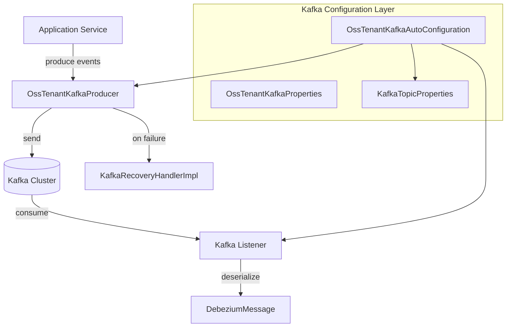
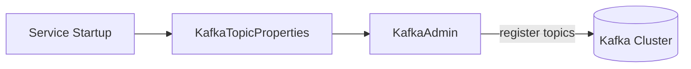
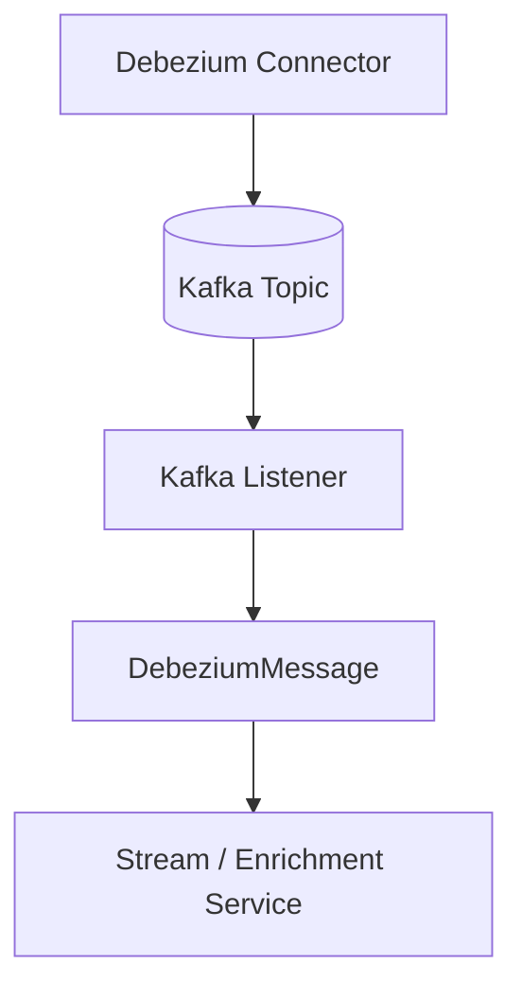

# Data Layer – Kafka

## Overview

The **data_layer_kafka** module provides the standardized Kafka integration layer for the OpenFrame / Flamingo platform. It is responsible for:

- Defining **tenant-aware Kafka configuration**
- Bootstrapping **producers, consumers, listeners, and admin clients**
- Managing **topic auto-creation** for inbound streams
- Providing **shared Kafka message models** (Debezium)
- Centralizing **error recovery and retry logging** for Kafka producers

This module is consumed by higher-level services such as the **stream service**, **client agents**, **management service**, and other event-driven components.

---

## Responsibilities

- Act as the **Kafka abstraction layer** for all OSS tenant services
- Enforce consistent Kafka configuration across services
- Support **Debezium-based CDC event processing**
- Enable safe, observable failure handling for Kafka publishing

---

## High-Level Architecture



---

## Core Configuration Components

### OssKafkaConfig

**Component**: `OssKafkaConfig`

- Enables Spring Kafka support
- Explicitly **disables Spring Boot's default KafkaAutoConfiguration**
- Ensures all Kafka wiring flows through OpenFrame-controlled configuration

This prevents configuration drift across services.

---

### OssTenantKafkaProperties

**Component**: `OssTenantKafkaProperties`

- Wraps Spring’s `KafkaProperties`
- Uses the prefix:

```text
spring.oss-tenant
```

- Acts as the **single source of truth** for Kafka bootstrap servers, producers, consumers, listeners, and templates
- Can be globally enabled or disabled

Used by all producer, consumer, admin, and listener factories.

---

### KafkaTopicProperties

**Component**: `KafkaTopicProperties`

- Defines **inbound Kafka topics** per tenant
- Supports **auto-creation** via Kafka Admin

Each topic can define:

- Topic name
- Number of partitions
- Replication factor

Example configuration structure:

```yaml
openframe:
  oss-tenant:
    kafka:
      topics:
        inbound:
          deviceEvents:
            name: device-events
            partitions: 3
            replicationFactor: 1
```

---

## Auto-Configuration Flow

### OssTenantKafkaAutoConfiguration

This is the **central bootstrap class** for Kafka in OpenFrame.

It conditionally activates when:

```text
spring.oss-tenant.kafka.enabled=true
```

### Beans Provided

- `ProducerFactory<String, Object>`
- `KafkaTemplate<String, Object>`
- `ConsumerFactory<Object, Object>`
- `ConcurrentKafkaListenerContainerFactory`
- `KafkaAdmin`
- `NewTopics`
- `OssTenantKafkaProducer`

---

## Topic Auto-Creation Lifecycle



- Topics are registered only if admin support is enabled
- Blank or undefined topic names are ignored
- Safe defaults are applied when not explicitly configured

---

## Messaging Standards

### KafkaHeader

**Component**: `KafkaHeader`

Defines shared Kafka message headers:

```text
message-type
```

Used by producers and consumers to identify payload semantics.

---

## Debezium Event Model

### DebeziumMessage

**Component**: `DebeziumMessage<T>`

This is a **generic CDC envelope** used for Debezium-based change streams.

Key sections:

- `before` – entity state before change
- `after` – entity state after change
- `op` – operation type (c, u, d)
- `ts_ms` – event timestamp
- `source` – database and connector metadata

### Data Flow



This model is heavily used by the **stream service** and downstream analytics pipelines.

---

## Producer Failure Handling

### KafkaRecoveryHandlerImpl

**Component**: `KafkaRecoveryHandlerImpl`

- Implements Kafka producer recovery logic
- Invoked when retries are exhausted
- Logs structured failure information including:
  - Topic
  - Key
  - Exception type
  - Exception message
  - Payload snapshot

This design ensures:

- No silent Kafka message loss
- Failures remain observable
- Recovery logic can be extended later (DLQ, replay, alerting)

---

## Integration with Other Modules

The Kafka data layer is a foundational dependency for:

- **stream_service_core** – event processing and enrichment
- **management_service_core** – Debezium connector initialization
- **client_service_core** – agent and heartbeat events
- **external_api_service_core** – asynchronous event publishing

These services rely on this module for **consistent Kafka behavior** without duplicating configuration logic.

---

## Design Principles

- ✅ Centralized Kafka configuration
- ✅ Tenant-aware isolation
- ✅ Safe defaults with explicit overrides
- ✅ Observable failure handling
- ✅ CDC-friendly data models

---

## Summary

The **data_layer_kafka** module standardizes how OpenFrame services interact with Kafka. By centralizing configuration, topic management, message models, and failure handling, it enables scalable, consistent, and observable event-driven architecture across the platform.
