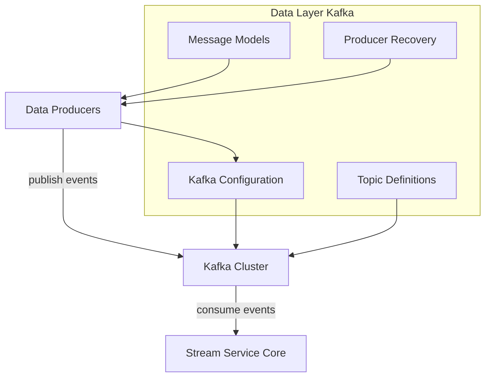
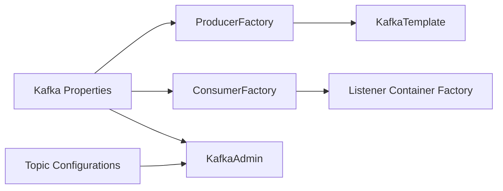
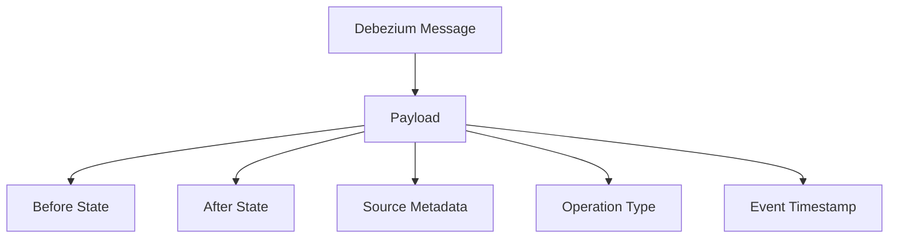
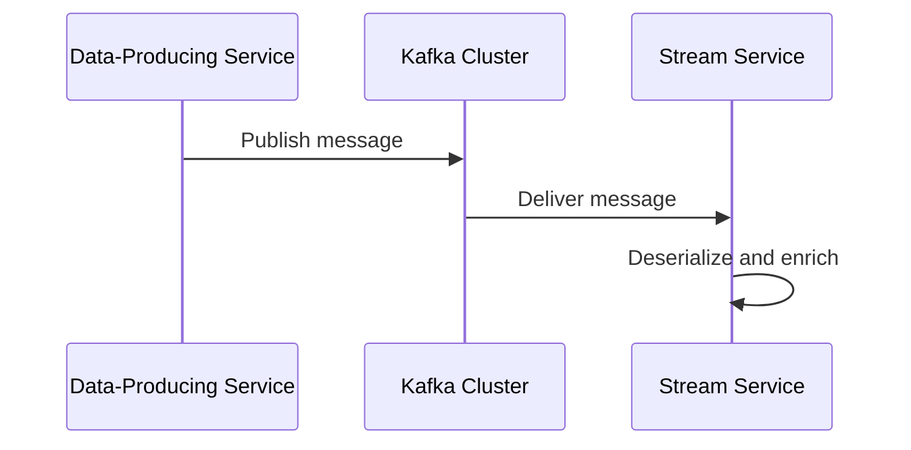

# Data Layer Kafka

## Overview

The **Data Layer Kafka** module provides the shared Kafka infrastructure used across the OpenFrame and Flamingo platform for reliable, scalable event streaming. It standardizes how Kafka is configured, how topics are defined and auto-created, how messages are serialized and deserialized, and how failures are handled.

This module is intentionally infrastructure-focused. It does **not** implement business logic or stream processing itself; instead, it supplies the foundational Kafka configuration and message models that are consumed by higher-level services such as stream processing, management, and data enrichment services.

At a high level, Data Layer Kafka is responsible for:
- Defining tenant-aware Kafka configuration and properties
- Bootstrapping Kafka producers, consumers, and admin clients
- Managing topic definitions and optional auto-creation
- Providing shared Kafka message models (for example, Debezium and machine events)
- Handling producer-side recovery and error logging

---

## Position in the Overall System

Data Layer Kafka sits between data-producing services (such as client, management, and data-layer services) and stream-processing services that consume and enrich events.

It works closely with:
- **Stream Service Core**, which consumes Kafka topics and performs enrichment and routing
- **Data Layer Core and Pinot**, which defines downstream analytical storage and query models
- **Management Service Core**, which initializes and monitors streaming-related infrastructure

The module is designed to be reusable across multiple services without duplicating Kafka setup logic.

---

## Architecture Overview

The following diagram shows how Data Layer Kafka fits into the broader event flow.

**Key idea:** Data Layer Kafka owns *how* Kafka is configured and interacted with, not *what* business logic is executed on the events.

---

## Core Components

### Kafka Configuration

#### KafkaTopicProperties

`KafkaTopicProperties` defines Kafka topic metadata using Spring Boot configuration properties.

**Responsibilities:**
- Expose inbound topic definitions via configuration
- Control topic auto-creation behavior
- Define partitions and replication factor per topic

**Key concepts:**
- Topics are configured under the `openframe.oss-tenant.kafka.topics` prefix
- Each topic uses a `TopicConfig` with:
  - Topic name
  - Number of partitions
  - Replication factor

This allows infrastructure teams to manage topic topology declaratively, without changing code.

---

#### OssKafkaConfig

`OssKafkaConfig` enables Kafka support while explicitly disabling Spring Boot’s default Kafka auto-configuration.

**Responsibilities:**
- Ensure full control over Kafka configuration
- Prevent conflicts with Spring’s default Kafka setup

This class acts as a guardrail, guaranteeing that only the custom OpenFrame Kafka configuration is active.

---

#### OssTenantKafkaProperties

`OssTenantKafkaProperties` is the central configuration holder for the tenant Kafka cluster.

**Responsibilities:**
- Wrap Spring’s standard `KafkaProperties`
- Enable or disable the tenant Kafka cluster
- Provide a single configuration entry point for producers, consumers, listeners, and admin clients

Because it delegates to standard Kafka properties, it supports the full understanding and flexibility of Spring Kafka while remaining tenant-aware.

---

#### OssTenantKafkaAutoConfiguration

`OssTenantKafkaAutoConfiguration` is the heart of the module. It wires together all Kafka infrastructure beans when Kafka is enabled.

**Responsibilities:**
- Create producer factories and Kafka templates
- Create consumer factories and listener container factories
- Configure acknowledgment modes, concurrency, and polling behavior
- Initialize Kafka admin clients
- Auto-create configured topics when enabled

**Bean lifecycle overview:**

This auto-configuration ensures that all Kafka-related infrastructure is consistently created across services.

---

### Kafka Headers

#### KafkaHeader

`KafkaHeader` defines shared Kafka header constants.

**Responsibilities:**
- Standardize header names used across producers and consumers

Currently defined headers include:
- `message-type` — used to distinguish logical message types within a topic

Centralizing header names avoids duplication and subtle mismatches across services.

---

### Message Models

#### MachinePinotMessage

`MachinePinotMessage` represents machine-related events sent to Kafka for downstream analytics and indexing.

**Responsibilities:**
- Carry normalized machine state data
- Support downstream ingestion into analytical systems such as Pinot

**Typical fields include:**
- Machine identifier
- Organization identifier
- Device and operating system metadata
- Status and associated tags

These messages are typically produced when machine, tag, or related entities change.

---

#### DebeziumMessage

`DebeziumMessage` is a generic wrapper for change data capture (CDC) events produced by Debezium.

**Responsibilities:**
- Represent before/after state of a database record
- Capture operation type (create, update, delete)
- Preserve source metadata such as database, table, and timestamp

**Conceptual structure:**

This abstraction allows consumers to process CDC events consistently, regardless of the underlying data source.

---

### Producer Recovery and Error Handling

#### KafkaRecoveryHandlerImpl

`KafkaRecoveryHandlerImpl` provides a default recovery mechanism for Kafka producer failures.

**Responsibilities:**
- Capture and log detailed error information when message publishing fails
- Record topic, key, exception details, and payload snapshot

**Design intent:**
- Favor observability and diagnosability over silent retries
- Allow future extensions such as dead-letter queues or external alerting

At present, the handler focuses on structured logging, making failures visible to operators and monitoring systems.

---

## Typical Data Flow

A simplified end-to-end flow using Data Layer Kafka looks like this:

Data Layer Kafka ensures that each step in this flow is consistently configured and observable.

---

## Design Principles

- **Centralized configuration**: Kafka setup is defined once and reused everywhere
- **Tenant awareness**: Configuration supports multi-tenant deployments
- **Strong typing**: Shared message models reduce serialization ambiguity
- **Operational safety**: Explicit recovery and logging for producer failures
- **Extensibility**: Designed to evolve with additional topics, headers, and recovery strategies

---

## Summary

The **Data Layer Kafka** module is the backbone of event-driven communication in the OpenFrame platform. By abstracting Kafka configuration, topic management, message modeling, and recovery into a single, reusable module, it enables other services to focus on business logic while relying on a robust and consistent streaming foundation.