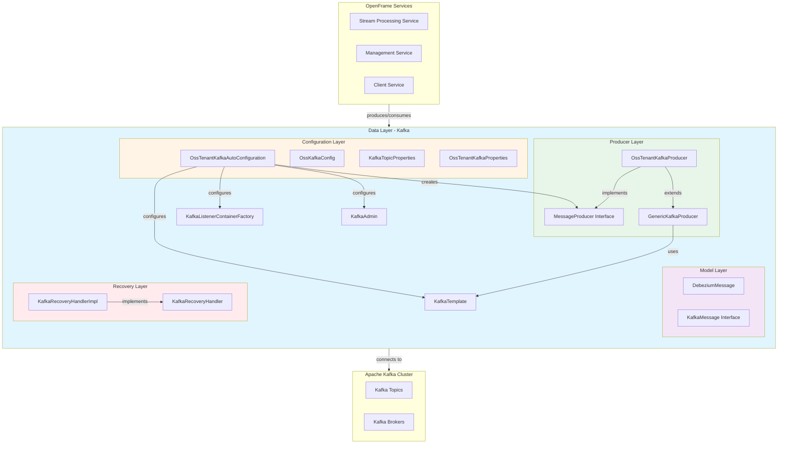
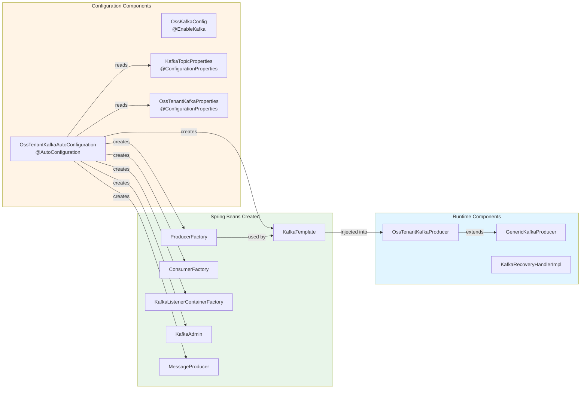
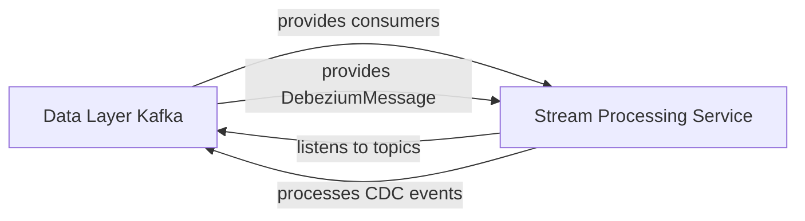
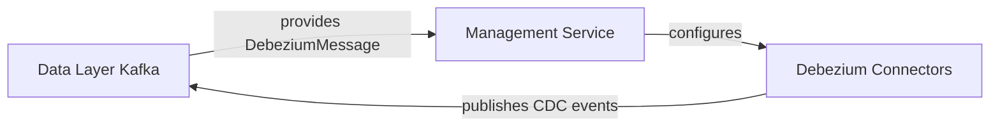
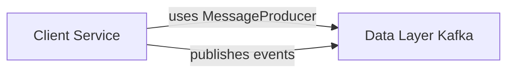
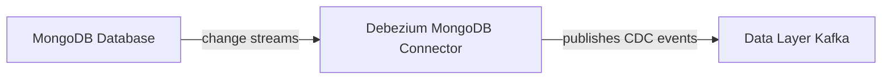

# Data Layer - Kafka Module

## Overview

The **data_layer_kafka** module provides a comprehensive Kafka integration layer for the OpenFrame platform, enabling reliable event-driven communication across microservices. This module abstracts Apache Kafka operations with Spring Boot auto-configuration, offering production-ready message producers, consumers, and CDC (Change Data Capture) support through Debezium integration.

### Purpose

- **Event-Driven Architecture**: Enable asynchronous communication between OpenFrame services
- **CDC Integration**: Process database change events from Debezium connectors
- **Reliable Messaging**: Provide fault-tolerant message production with retry mechanisms
- **Multi-Tenant Support**: Support OSS (Open Source Software) tenant-specific Kafka clusters
- **Auto-Configuration**: Simplify Kafka setup with Spring Boot conventions

### Key Features

- ✅ **Auto-configured Kafka Beans**: Producer, Consumer, Admin, and Listener factories
- ✅ **Debezium Message Models**: Type-safe CDC event processing
- ✅ **Retry & Recovery**: Built-in error handling and recovery mechanisms
- ✅ **Topic Management**: Automatic topic creation and configuration
- ✅ **Async & Sync Producers**: Support for both fire-and-forget and blocking sends
- ✅ **JSON Serialization**: Native JSON support for message payloads

---

## Architecture Overview

The module follows a layered architecture with clear separation of concerns:



### Component Relationships



---

## Core Components

### 1. Configuration Components

The configuration layer provides Spring Boot auto-configuration for Kafka infrastructure.

#### OssKafkaConfig

**Purpose**: Disables default Spring Kafka auto-configuration to allow custom configurations.

**Key Features**:
- Excludes `KafkaAutoConfiguration` to prevent conflicts
- Enables `@EnableKafka` for custom Kafka setup
- Serves as the entry point for Kafka configuration

**Location**: `com.openframe.kafka.config.OssKafkaConfig`

#### OssTenantKafkaAutoConfiguration

**Purpose**: Auto-configures all Kafka beans for the OSS tenant cluster.

**Key Features**:
- Creates `ProducerFactory` with JSON serialization
- Creates `ConsumerFactory` with JSON deserialization
- Configures `KafkaTemplate` for message production
- Sets up `KafkaListenerContainerFactory` for consumers
- Configures `KafkaAdmin` for topic management
- Auto-creates topics based on configuration

**Conditional Activation**: Enabled when `spring.oss-tenant.kafka.enabled=true`

**Location**: `com.openframe.kafka.config.OssTenantKafkaAutoConfiguration`

**Beans Created**:
- `ossTenantKafkaProducerFactory`: Factory for creating Kafka producers
- `ossTenantKafkaTemplate`: Template for sending messages
- `ossTenantKafkaConsumerFactory`: Factory for creating Kafka consumers
- `ossTenantKafkaListenerContainerFactory`: Factory for `@KafkaListener` containers
- `ossTenantKafkaProducer`: High-level message producer
- `ossTenantKafkaAdmin`: Admin client for topic management

**Configuration Properties**:
- Reads from `spring.oss-tenant.kafka.*` properties
- Supports all standard Spring Kafka properties
- Configurable ACK modes, concurrency, and timeouts

For detailed configuration options, see [Configuration Properties](#configuration-properties).

---

### 2. Producer Components

The producer layer provides high-level abstractions for sending messages to Kafka.

#### MessageProducer Interface

**Purpose**: Defines the contract for message production operations.

**Methods**:
```java
CompletableFuture<SendResult<String, Object>> sendAsyncMessage(
    String messageDestinationName, 
    KafkaMessage message, 
    String specificKey
);

void sendAndAwaitMessage(
    String messageDestinationName, 
    KafkaMessage message, 
    String specificKey
);
```

**Location**: `com.openframe.kafka.producer.MessageProducer`

#### OssTenantKafkaProducer

**Purpose**: Concrete implementation of `MessageProducer` for the OSS tenant cluster.

**Key Features**:
- Extends `GenericKafkaProducer` for common functionality
- Implements `MessageProducer` interface
- Delegates to `KafkaTemplate` for actual message sending

**Location**: `com.openframe.kafka.producer.OssTenantKafkaProducer`

#### GenericKafkaProducer

**Purpose**: Abstract base class providing common producer functionality.

**Key Features**:
- **Async Sending**: Non-blocking message production with `CompletableFuture`
- **Sync Sending**: Blocking message production with retry support
- **Error Classification**: Distinguishes fatal vs. transient errors
- **Logging**: Comprehensive logging for success and failure scenarios
- **Payload Truncation**: Limits log payload size to 500 characters
- **Key Redaction**: Redacts sensitive keys in logs

**Error Handling**:
- **Fatal Errors** (Non-retryable):
  - `RecordTooLargeException`
  - `AuthorizationException`
  - `SerializationException`
  - `InvalidTopicException`
  - `UnknownTopicOrPartitionException`
- **Transient Errors** (Retryable):
  - `TimeoutException`
  - `RetriableException`
  - Network errors

**Location**: `com.openframe.kafka.producer.GenericKafkaProducer`

For detailed producer usage patterns, see [Producer Usage Guide](#producer-usage-guide).

---

### 3. Model Components

The model layer defines data structures for Kafka messages.

#### DebeziumMessage

**Purpose**: Type-safe model for Debezium CDC (Change Data Capture) events.

**Structure**:
```java
DebeziumMessage<T>
├── payload: Payload<T>
    ├── before: T (state before change)
    ├── after: T (state after change)
    ├── source: Source (metadata)
    ├── operation: String (c/u/d/r)
    └── timestamp: Long
```

**Supported Operations**:
- `c`: Create (INSERT)
- `u`: Update (UPDATE)
- `d`: Delete (DELETE)
- `r`: Read (initial snapshot)

**Source Metadata**:
- `version`: Debezium connector version
- `connector`: Connector type (e.g., "mongodb", "postgresql")
- `name`: Connector name
- `database`: Source database name
- `collection`/`table`: Source collection/table name
- `timestamp`: Event timestamp

**Location**: `com.openframe.kafka.model.debezium.DebeziumMessage`

**Usage Example**:
```java
DebeziumMessage<Device> message = // received from Kafka
Payload<Device> payload = message.getPayload();

if ("c".equals(payload.getOperation())) {
    Device newDevice = payload.getAfter();
    // Handle device creation
} else if ("u".equals(payload.getOperation())) {
    Device oldDevice = payload.getBefore();
    Device newDevice = payload.getAfter();
    // Handle device update
}
```

#### KafkaMessage Interface

**Purpose**: Marker interface for all Kafka message types.

**Usage**: Implement this interface for custom message types to ensure type safety.

**Location**: `com.openframe.kafka.model.KafkaMessage`

For CDC integration patterns, see [Stream Processing Module](stream_processing.md).

---

### 4. Recovery Components

The recovery layer handles failed message production scenarios.

#### KafkaRecoveryHandler Interface

**Purpose**: Defines the contract for handling unrecoverable message failures.

**Method**:
```java
void enqueue(Throwable ex, String topic, String key, Object payload);
```

**Location**: `com.openframe.kafka.producer.retry.KafkaRecoveryHandler`

#### KafkaRecoveryHandlerImpl

**Purpose**: Default implementation that logs failed messages for manual intervention.

**Key Features**:
- Structured error logging with topic, key, and payload
- Includes full exception stack trace
- Truncates large payloads for log readability
- Designed for integration with external DLQ (Dead Letter Queue) systems

**Log Format**:
```text
Kafka RECOVER invoked: topic=device-events key=dev*** errorClass=TimeoutException 
errorMsg=Request timeout payload~={"deviceId":"123",...}
```

**Location**: `com.openframe.kafka.producer.retry.KafkaRecoveryHandlerImpl`

**Future Enhancements**:
- Integration with Dead Letter Queue topics
- Automatic retry scheduling
- Alerting and monitoring integration

---

## Configuration Properties

### OSS Tenant Kafka Configuration

Configure the OSS tenant Kafka cluster using `spring.oss-tenant.kafka.*` properties:

```yaml
spring:
  oss-tenant:
    kafka:
      enabled: true  # Enable OSS Kafka configuration
      bootstrap-servers: localhost:9092
      
      producer:
        key-serializer: org.apache.kafka.common.serialization.StringSerializer
        value-serializer: org.springframework.kafka.support.serializer.JsonSerializer
        acks: all  # Wait for all replicas
        retries: 3
        batch-size: 16384
        linger-ms: 10
        buffer-memory: 33554432
        
      consumer:
        key-deserializer: org.apache.kafka.common.serialization.StringDeserializer
        value-deserializer: org.springframework.kafka.support.serializer.JsonDeserializer
        group-id: openframe-consumer-group
        auto-offset-reset: earliest
        enable-auto-commit: false
        max-poll-records: 500
        
      listener:
        ack-mode: RECORD  # Commit after each record
        concurrency: 3  # Number of consumer threads
        poll-timeout: 3s
        idle-event-interval: 30s
        log-container-config: true
        
      template:
        default-topic: default-topic
        
      admin:
        enabled: true  # Enable topic auto-creation
```

### Topic Configuration

Configure topics for auto-creation using `openframe.oss-tenant.kafka.topics.*`:

```yaml
openframe:
  oss-tenant:
    kafka:
      topics:
        auto-create: true
        inbound:
          device-events:
            name: device-events
            partitions: 3
            replication-factor: 2
          
          machine-heartbeats:
            name: machine-heartbeats
            partitions: 5
            replication-factor: 2
          
          cdc-devices:
            name: dbserver1.openframe.devices
            partitions: 3
            replication-factor: 2
```

### Configuration Properties Classes

#### OssTenantKafkaProperties

**Prefix**: `spring.oss-tenant`

**Properties**:
- `enabled`: Enable OSS Kafka configuration (default: `true`)
- `kafka`: Nested `KafkaProperties` from Spring Boot

**Location**: `com.openframe.kafka.config.OssTenantKafkaProperties`

#### KafkaTopicProperties

**Prefix**: `openframe.oss-tenant.kafka.topics`

**Properties**:
- `auto-create`: Enable automatic topic creation (default: `true`)
- `inbound`: Map of topic configurations

**TopicConfig Properties**:
- `name`: Topic name
- `partitions`: Number of partitions (default: `1`)
- `replication-factor`: Replication factor (default: `1`)

**Location**: `com.openframe.kafka.config.KafkaTopicProperties`

---

## Integration with Other Modules

### Stream Processing Service

The [Stream Processing Module](stream_processing.md) is the primary consumer of this module:



**Key Integration Points**:
- **JsonKafkaListener**: Uses `ossTenantKafkaListenerContainerFactory`
- **DebeziumMessageHandler**: Processes `DebeziumMessage<T>` events
- **ActivityEnrichmentService**: Consumes device and machine events

See [Stream Processing Listeners](stream_processing_listeners.md) for details.

---

### Management Service

The [Management Service](management_service.md) uses Kafka for CDC management:



**Key Integration Points**:
- **DebeziumService**: Manages Debezium connectors
- **DebeziumHealthCheckScheduler**: Monitors connector health
- **CDC Topics**: Receives database change events

See [Management Service CDC Management](management_service_cdc_management.md) for details.

---

### Client Service

The [Client Service](client_service.md) produces events to Kafka:



**Key Integration Points**:
- **ClientConnectionListener**: Publishes connection events
- **MachineHeartbeatListener**: Publishes heartbeat events
- **InstalledAgentListener**: Publishes agent installation events

See [Client Service Event Listeners](client_service_event_listeners.md) for details.

---

### Data Layer MongoDB

The [Data Layer MongoDB](data_layer_mongo.md) integrates with Kafka through CDC:



**CDC Topics**:
- `dbserver1.openframe.devices`: Device collection changes
- `dbserver1.openframe.machines`: Machine collection changes
- `dbserver1.openframe.organizations`: Organization collection changes
- `dbserver1.openframe.users`: User collection changes

See [Data Layer MongoDB](data_layer_mongo.md) for document schemas.

---

## Producer Usage Guide

### Async Message Production (Fire-and-Forget)

Use async production for high-throughput scenarios where immediate confirmation is not required:

```java
@Service
public class DeviceEventService {
    
    @Autowired
    @Qualifier("ossTenantKafkaProducer")
    private MessageProducer kafkaProducer;
    
    public void publishDeviceEvent(DeviceEvent event) {
        CompletableFuture<SendResult<String, Object>> future = 
            kafkaProducer.sendAsyncMessage(
                "device-events",
                event,
                event.getDeviceId()
            );
        
        // Optional: Handle result
        future.whenComplete((result, ex) -> {
            if (ex != null) {
                log.error("Failed to publish device event", ex);
            } else {
                log.info("Published device event to partition {}", 
                    result.getRecordMetadata().partition());
            }
        });
    }
}
```

### Sync Message Production (Blocking)

Use sync production when you need immediate confirmation or want to leverage Spring Retry:

```java
@Service
public class CriticalEventService {
    
    @Autowired
    @Qualifier("ossTenantKafkaProducer")
    private MessageProducer kafkaProducer;
    
    @Retryable(
        value = TransientKafkaSendException.class,
        maxAttempts = 3,
        backoff = @Backoff(delay = 1000, multiplier = 2)
    )
    public void publishCriticalEvent(CriticalEvent event) {
        try {
            kafkaProducer.sendAndAwaitMessage(
                "critical-events",
                event,
                event.getEventId()
            );
            log.info("Successfully published critical event");
        } catch (NonRetryableKafkaException ex) {
            log.error("Fatal error publishing event", ex);
            throw ex;  // Don't retry
        }
    }
    
    @Recover
    public void recoverFromFailure(TransientKafkaSendException ex, CriticalEvent event) {
        log.error("Failed to publish event after retries", ex);
        // Handle recovery (e.g., save to database, alert)
    }
}
```

### Custom Message Types

Implement `KafkaMessage` for type safety:

```java
@Data
@Builder
public class DeviceEvent implements KafkaMessage {
    private String deviceId;
    private String eventType;
    private String tenantId;
    private Map<String, Object> payload;
    private Instant timestamp;
}
```

---

## Consumer Usage Guide

### Basic Kafka Listener

Use `@KafkaListener` with the configured container factory:

```java
@Service
@Slf4j
public class DeviceEventListener {
    
    @KafkaListener(
        topics = "device-events",
        groupId = "device-processor-group",
        containerFactory = "ossTenantKafkaListenerContainerFactory"
    )
    public void handleDeviceEvent(
        @Payload DeviceEvent event,
        @Header(KafkaHeaders.RECEIVED_KEY) String key,
        @Header(KafkaHeaders.RECEIVED_PARTITION) int partition,
        @Header(KafkaHeaders.OFFSET) long offset
    ) {
        log.info("Received device event: key={}, partition={}, offset={}", 
            key, partition, offset);
        
        // Process event
        processDeviceEvent(event);
    }
    
    private void processDeviceEvent(DeviceEvent event) {
        // Business logic
    }
}
```

### Debezium CDC Listener

Process CDC events with type-safe deserialization:

```java
@Service
@Slf4j
public class DeviceCdcListener {
    
    @KafkaListener(
        topics = "dbserver1.openframe.devices",
        groupId = "device-cdc-processor",
        containerFactory = "ossTenantKafkaListenerContainerFactory"
    )
    public void handleDeviceCdc(
        @Payload DebeziumMessage<Device> message
    ) {
        Payload<Device> payload = message.getPayload();
        String operation = payload.getOperation();
        
        switch (operation) {
            case "c" -> handleDeviceCreated(payload.getAfter());
            case "u" -> handleDeviceUpdated(payload.getBefore(), payload.getAfter());
            case "d" -> handleDeviceDeleted(payload.getBefore());
            case "r" -> handleDeviceSnapshot(payload.getAfter());
        }
    }
    
    private void handleDeviceCreated(Device device) {
        log.info("Device created: {}", device.getId());
        // Handle creation
    }
    
    private void handleDeviceUpdated(Device before, Device after) {
        log.info("Device updated: {}", after.getId());
        // Handle update
    }
    
    private void handleDeviceDeleted(Device device) {
        log.info("Device deleted: {}", device.getId());
        // Handle deletion
    }
    
    private void handleDeviceSnapshot(Device device) {
        log.info("Device snapshot: {}", device.getId());
        // Handle initial snapshot
    }
}
```

### Error Handling in Listeners

Implement error handling with `@KafkaListener` error handlers:

```java
@Service
@Slf4j
public class ResilientDeviceListener {
    
    @KafkaListener(
        topics = "device-events",
        groupId = "resilient-processor",
        containerFactory = "ossTenantKafkaListenerContainerFactory",
        errorHandler = "kafkaListenerErrorHandler"
    )
    public void handleDeviceEvent(@Payload DeviceEvent event) {
        // Process event (may throw exception)
        processEvent(event);
    }
    
    @Bean
    public KafkaListenerErrorHandler kafkaListenerErrorHandler() {
        return (message, exception) -> {
            log.error("Error processing message: {}", message.getPayload(), exception);
            
            // Decide whether to retry or skip
            if (exception instanceof RecoverableException) {
                throw exception;  // Retry
            } else {
                log.error("Skipping message due to non-recoverable error");
                return null;  // Skip
            }
        };
    }
}
```

---

## Monitoring and Observability

### Logging

The module provides comprehensive logging at various levels:

**Producer Logs**:
```text
INFO  - Kafka PRODUCE success: topic=device-events, key=dev***, partition=2, offset=12345
ERROR - Kafka PRODUCE timeout: topic=device-events, key=dev***, payload~={"deviceId":"123"...}
ERROR - Kafka PRODUCE record too large: topic=device-events, key=dev***, payloadSize=2048576
```

**Recovery Logs**:
```text
ERROR - Kafka RECOVER invoked: topic=device-events key=dev*** errorClass=TimeoutException 
        errorMsg=Request timeout payload~={"deviceId":"123",...}
```

### Metrics

Monitor Kafka operations using Spring Boot Actuator metrics:

**Producer Metrics**:
- `kafka.producer.record-send-total`: Total records sent
- `kafka.producer.record-error-total`: Total send errors
- `kafka.producer.record-retry-total`: Total retries
- `kafka.producer.request-latency-avg`: Average request latency

**Consumer Metrics**:
- `kafka.consumer.records-consumed-total`: Total records consumed
- `kafka.consumer.fetch-latency-avg`: Average fetch latency
- `kafka.consumer.commit-latency-avg`: Average commit latency

**Configuration**:
```yaml
management:
  endpoints:
    web:
      exposure:
        include: health,metrics,prometheus
  metrics:
    export:
      prometheus:
        enabled: true
```

### Health Checks

Monitor Kafka connectivity:

```yaml
management:
  health:
    kafka:
      enabled: true
```

**Health Endpoint**: `GET /actuator/health/kafka`

**Response**:
```json
{
  "status": "UP",
  "details": {
    "clusterId": "kafka-cluster-1",
    "nodes": 3
  }
}
```

---

## Best Practices

### 1. Message Key Selection

Choose appropriate message keys for partitioning:

✅ **Good Key Choices**:
- `deviceId`: Ensures all events for a device go to the same partition
- `tenantId`: Ensures tenant isolation
- `userId`: Ensures user event ordering

❌ **Poor Key Choices**:
- `timestamp`: Causes uneven partition distribution
- `null`: Loses ordering guarantees
- `random`: Defeats partition affinity

### 2. Error Handling Strategy

Classify errors appropriately:

```java
try {
    kafkaProducer.sendAndAwaitMessage(topic, message, key);
} catch (NonRetryableKafkaException ex) {
    // Fatal error - log and alert
    alerting.sendAlert("Kafka fatal error", ex);
    throw ex;
} catch (TransientKafkaSendException ex) {
    // Transient error - will be retried by Spring Retry
    log.warn("Transient Kafka error, will retry", ex);
    throw ex;
}
```

### 3. Payload Size Management

Keep message payloads reasonable:

✅ **Best Practices**:
- Limit payloads to < 1MB (Kafka default `max.request.size`)
- Use references for large data (e.g., S3 URLs)
- Compress large payloads if necessary

❌ **Anti-Patterns**:
- Sending multi-MB payloads
- Embedding binary data directly
- Sending entire documents when only IDs are needed

### 4. Consumer Group Management

Design consumer groups carefully:

✅ **Best Practices**:
- One consumer group per logical application
- Number of consumers ≤ number of partitions
- Use descriptive group IDs: `device-processor-group`

❌ **Anti-Patterns**:
- Sharing consumer groups across applications
- More consumers than partitions (idle consumers)
- Generic group IDs: `group1`, `consumer`

### 5. Topic Naming Conventions

Follow consistent naming patterns:

✅ **Recommended Pattern**: `<domain>-<entity>-<event-type>`
- `device-events`
- `machine-heartbeats`
- `user-registrations`

✅ **CDC Topics**: `<connector>.<database>.<collection>`
- `dbserver1.openframe.devices`
- `dbserver1.openframe.users`

### 6. Configuration Management

Use environment-specific configurations:

```yaml
# application-dev.yml
spring:
  oss-tenant:
    kafka:
      bootstrap-servers: localhost:9092

# application-prod.yml
spring:
  oss-tenant:
    kafka:
      bootstrap-servers: kafka-1:9092,kafka-2:9092,kafka-3:9092
      producer:
        acks: all
        retries: 5
```

---

## Troubleshooting

### Common Issues

#### 1. Topic Not Found

**Symptom**: `UnknownTopicOrPartitionException`

**Causes**:
- Topic auto-creation disabled
- Topic not configured in `KafkaTopicProperties`
- Kafka broker `auto.create.topics.enable=false`

**Solution**:
```yaml
openframe:
  oss-tenant:
    kafka:
      topics:
        auto-create: true
        inbound:
          my-topic:
            name: my-topic
            partitions: 3
            replication-factor: 2
```

#### 2. Serialization Errors

**Symptom**: `SerializationException`

**Causes**:
- Message doesn't implement `KafkaMessage`
- Circular references in object graph
- Non-serializable fields

**Solution**:
```java
@Data
@JsonIgnoreProperties(ignoreUnknown = true)
public class MyMessage implements KafkaMessage {
    private String id;
    
    @JsonIgnore
    private transient NonSerializableField field;
}
```

#### 3. Consumer Lag

**Symptom**: Consumers falling behind producers

**Causes**:
- Slow message processing
- Insufficient consumer concurrency
- Network issues

**Solution**:
```yaml
spring:
  oss-tenant:
    kafka:
      listener:
        concurrency: 5  # Increase consumer threads
      consumer:
        max-poll-records: 100  # Reduce batch size
```

#### 4. Connection Timeouts

**Symptom**: `TimeoutException` during send

**Causes**:
- Kafka brokers unreachable
- Network latency
- Broker overload

**Solution**:
```yaml
spring:
  oss-tenant:
    kafka:
      producer:
        request-timeout-ms: 30000
        delivery-timeout-ms: 120000
```

---

## Testing

### Unit Testing Producers

Use `EmbeddedKafka` for integration tests:

```java
@SpringBootTest
@EmbeddedKafka(
    partitions = 1,
    topics = {"test-topic"},
    brokerProperties = {
        "listeners=PLAINTEXT://localhost:9092",
        "port=9092"
    }
)
class KafkaProducerTest {
    
    @Autowired
    @Qualifier("ossTenantKafkaProducer")
    private MessageProducer kafkaProducer;
    
    @Autowired
    private KafkaTemplate<String, Object> kafkaTemplate;
    
    @Test
    void testAsyncMessageProduction() throws Exception {
        // Given
        DeviceEvent event = DeviceEvent.builder()
            .deviceId("device-123")
            .eventType("CONNECTED")
            .build();
        
        // When
        CompletableFuture<SendResult<String, Object>> future = 
            kafkaProducer.sendAsyncMessage("test-topic", event, "device-123");
        
        // Then
        SendResult<String, Object> result = future.get(5, TimeUnit.SECONDS);
        assertThat(result.getRecordMetadata().topic()).isEqualTo("test-topic");
    }
}
```

### Testing Consumers

Use `@KafkaListener` test utilities:

```java
@SpringBootTest
@EmbeddedKafka(topics = {"test-topic"})
class KafkaConsumerTest {
    
    @Autowired
    private KafkaTemplate<String, Object> kafkaTemplate;
    
    @Autowired
    private DeviceEventListener listener;
    
    @Test
    void testMessageConsumption() throws Exception {
        // Given
        DeviceEvent event = DeviceEvent.builder()
            .deviceId("device-123")
            .eventType("CONNECTED")
            .build();
        
        // When
        kafkaTemplate.send("test-topic", "device-123", event);
        
        // Then
        await().atMost(5, TimeUnit.SECONDS)
            .until(() -> listener.getProcessedEvents().size() == 1);
        
        assertThat(listener.getProcessedEvents().get(0).getDeviceId())
            .isEqualTo("device-123");
    }
}
```

---

## Migration Guide

### From Default Spring Kafka

If migrating from default Spring Kafka configuration:

**Before**:
```yaml
spring:
  kafka:
    bootstrap-servers: localhost:9092
```

**After**:
```yaml
spring:
  oss-tenant:
    kafka:
      enabled: true
      bootstrap-servers: localhost:9092
```

**Code Changes**:
```java
// Before
@Autowired
private KafkaTemplate<String, Object> kafkaTemplate;

// After
@Autowired
@Qualifier("ossTenantKafkaTemplate")
private KafkaTemplate<String, Object> kafkaTemplate;

// Or use MessageProducer
@Autowired
@Qualifier("ossTenantKafkaProducer")
private MessageProducer kafkaProducer;
```

---

## Related Documentation

- [Stream Processing Module](stream_processing.md) - Primary consumer of Kafka events
- [Stream Processing Listeners](stream_processing_listeners.md) - Kafka listener implementations
- [Management Service CDC Management](management_service_cdc_management.md) - Debezium integration
- [Client Service Event Listeners](client_service_event_listeners.md) - Event producers
- [Data Layer MongoDB](data_layer_mongo.md) - CDC source database

---

## Additional Resources

### Apache Kafka Documentation
- [Kafka Documentation](https://kafka.apache.org/documentation/)
- [Kafka Producer Configs](https://kafka.apache.org/documentation/#producerconfigs)
- [Kafka Consumer Configs](https://kafka.apache.org/documentation/#consumerconfigs)

### Spring Kafka Documentation
- [Spring for Apache Kafka](https://spring.io/projects/spring-kafka)
- [Spring Kafka Reference](https://docs.spring.io/spring-kafka/reference/html/)

### Debezium Documentation
- [Debezium Documentation](https://debezium.io/documentation/)
- [Debezium MongoDB Connector](https://debezium.io/documentation/reference/stable/connectors/mongodb.html)

---

## Support

For questions or issues related to the Kafka data layer:

- **Slack Community**: [OpenMSP Slack](https://join.slack.com/t/openmsp/shared_invite/zt-36bl7mx0h-3~U2nFH6nqHqoTPXMaHEHA)
- **Documentation**: [OpenFrame Documentation](https://www.flamingo.run/openframe)
- **Platform**: [Flamingo Platform](https://flamingo.run)

---

**Last Updated**: 2024  
**Module Version**: 1.0  
**Maintainer**: OpenFrame Team
