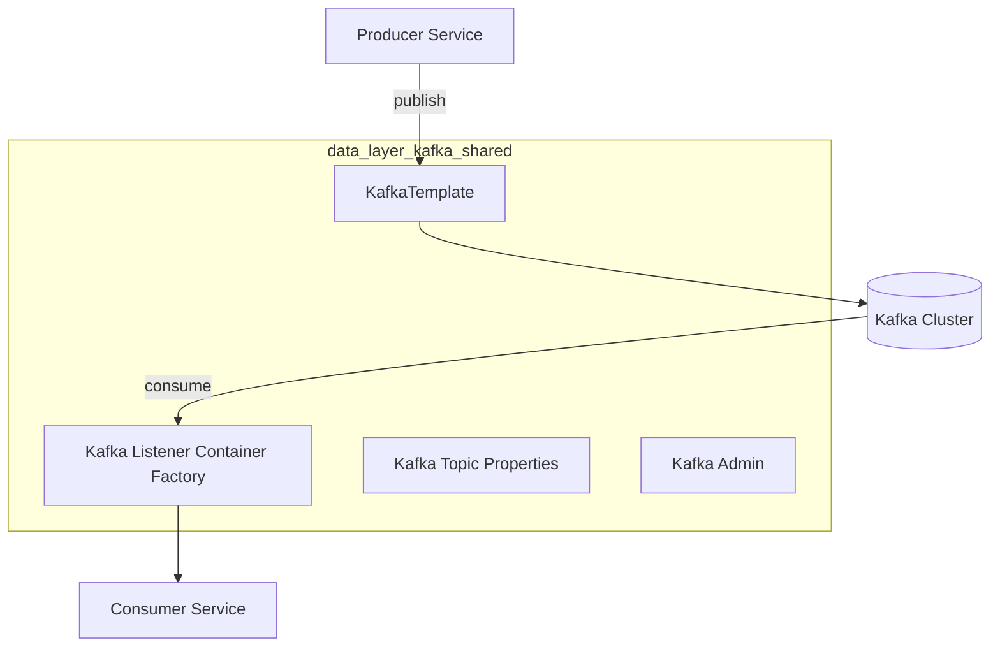
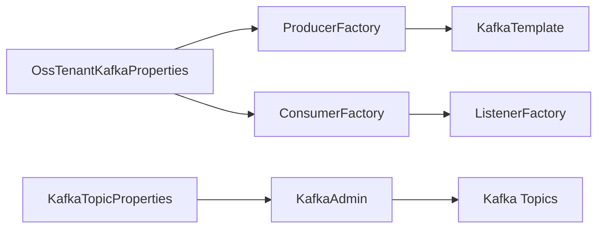

# data_layer_kafka_shared

This module provides the **shared Kafka infrastructure layer** for OpenFrame / Flamingo OSS services. It centralizes Kafka configuration, tenant-aware auto-configuration, topic management, shared message models, and producer recovery behavior. All services that publish to or consume from Kafka rely on this module for consistent, opinionated defaults.

The module is intentionally **infrastructure-focused**: it does not implement business listeners or stream processors. Those live in downstream services such as `stream_service_app_and_kafka_processing` and `stream_service_deserializers_and_handlers`, which depend on the abstractions and configuration defined here.

---

## Responsibilities

The `data_layer_kafka_shared` module is responsible for:

- Providing **tenant-aware Kafka auto-configuration** for OSS services
- Defining **standardized Kafka topic configuration** and auto-creation
- Exposing **producer, consumer, admin, and listener factories**
- Defining **shared Kafka message models** used across services
- Providing a **central recovery handler** for failed Kafka publish attempts
- Standardizing **Kafka headers** used for message classification

---

## High-Level Architecture



**Key idea:** application services only depend on Spring beans exposed by this module; Kafka wiring, topic creation, and defaults are handled centrally.

---

## Configuration Overview

### OSS Kafka Enablement

Kafka support is enabled per service via configuration properties:

```yaml
spring:
  oss-tenant:
    kafka:
      enabled: true
```

When enabled, `OssTenantKafkaAutoConfiguration` activates and registers all required Kafka beans.

---

## Core Components

### 1. KafkaTopicProperties

**Component:**
- `KafkaTopicProperties`
- `KafkaTopicProperties.TopicConfig`

**Purpose:**

Defines declarative configuration for Kafka topics, primarily used for **automatic topic creation** during application startup.

**Key features:**
- Supports multiple inbound topics
- Configurable partitions and replication factor
- Controlled via `openframe.oss-tenant.kafka.topics` prefix

**Conceptual structure:**

```text
openframe.oss-tenant.kafka.topics:
  inbound:
    device-events:
      name: device.events
      partitions: 3
      replicationFactor: 1
```

This configuration is consumed by Kafka Admin during startup to ensure required topics exist.

---

### 2. OssKafkaConfig

**Component:**
- `OssKafkaConfig`

**Purpose:**

Provides a clean Kafka baseline by:

- Explicitly enabling Kafka support
- Excluding Spring Boot’s default `KafkaAutoConfiguration`

This ensures that **only OpenFrame-defined Kafka configuration** is applied, avoiding accidental mismatches with default Spring behavior.

---

### 3. OssTenantKafkaProperties

**Component:**
- `OssTenantKafkaProperties`

**Purpose:**

Acts as the **root configuration holder** for the OSS Kafka cluster.

**Key characteristics:**
- Wraps Spring’s native `KafkaProperties`
- Uses the `spring.oss-tenant` prefix
- Allows full reuse of standard Kafka client configuration options

This design keeps the module aligned with upstream Spring Kafka features while maintaining a clear tenant-aware namespace.

---

### 4. OssTenantKafkaAutoConfiguration

**Component:**
- `OssTenantKafkaAutoConfiguration`

**Purpose:**

This is the **central auto-configuration class** that wires Kafka into OSS services.

**Beans provided:**

- ProducerFactory (JSON value serialization)
- KafkaTemplate
- ConsumerFactory (JSON value deserialization)
- ConcurrentKafkaListenerContainerFactory
- KafkaAdmin
- Auto-created Kafka topics
- Tenant-aware Kafka producer abstraction

**Activation conditions:**

- `spring.oss-tenant.kafka.enabled=true`

---

### Kafka Bean Relationships



---

### 5. KafkaHeader

**Component:**
- `KafkaHeader`

**Purpose:**

Defines shared Kafka header keys used across producers and consumers.

**Currently defined:**
- `message-type`

This enables downstream consumers (for example in stream processing services) to route or interpret messages without relying on topic naming alone.

---

### 6. Shared Kafka Message Models

#### MachinePinotMessage

**Component:**
- `MachinePinotMessage`

**Purpose:**

Represents **machine-related state changes** published to Kafka, typically used to feed analytical pipelines such as Pinot.

**Typical producers:**
- Mongo change listeners
- Stream enrichment services

**Fields include:**
- Machine identifier
- Organization identifier
- Device and OS metadata
- Status and tag information

This model is consumed by downstream stream processors and analytics ingestion pipelines.

---

#### DebeziumMessage

**Component:**
- `DebeziumMessage<T>`

**Purpose:**

Provides a **generic representation of Debezium CDC events**, preserving the original Debezium payload structure.

**Structure highlights:**
- `before` and `after` snapshots
- Source metadata (connector, database, table/collection)
- Operation type (`c`, `u`, `d`)
- Event timestamp

This model is shared across services handling database change events, especially within stream processing pipelines.

---

### 7. KafkaRecoveryHandlerImpl

**Component:**
- `KafkaRecoveryHandlerImpl`

**Purpose:**

Handles Kafka producer failures after retries are exhausted.

**Current behavior:**
- Logs structured error information
- Captures topic, key, payload summary, and exception

This implementation is intentionally simple and acts as a **central extension point** for:
- Dead-letter queues
- External alerting
- Persistent failure storage

Downstream services can replace or extend this behavior if stronger guarantees are required.

---

## Interaction With Other Modules

This module is **purely foundational** and is consumed by several other parts of the system:

- **Stream services** rely on its configuration and message models for Kafka ingestion and processing
- **Management services** trigger Kafka events using the provided producer abstractions
- **CDC pipelines** depend on the shared Debezium message structure

For Kafka consumers and processors, see:
- `stream_service_app_and_kafka_processing.md`
- `stream_service_deserializers_and_handlers.md`

---

## Design Principles

- **Centralized Kafka configuration** to avoid duplication
- **Spring-native integration** using auto-configuration and properties
- **Tenant-aware by default**
- **Schema-stable shared message models**
- **Safe defaults with extensibility hooks**

---

## Summary

The `data_layer_kafka_shared` module is the **Kafka backbone** of the OpenFrame OSS platform. It ensures that all services interact with Kafka in a consistent, predictable, and tenant-aware manner while keeping business logic and stream processing concerns cleanly separated.

Any service that needs Kafka should depend on this module rather than configuring Kafka directly.
