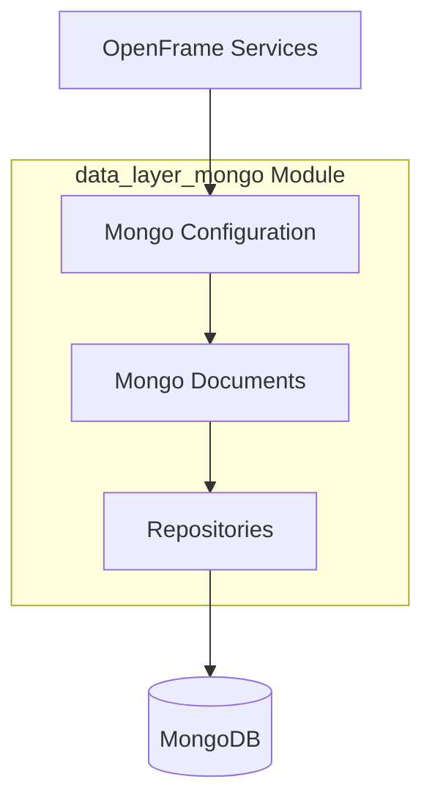
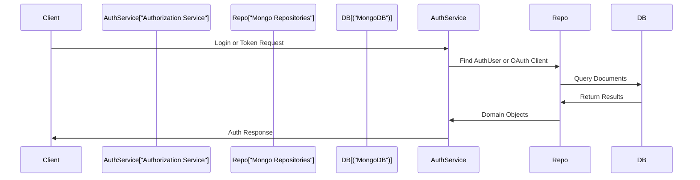

# data_layer_mongo

## Overview

The **data_layer_mongo** module provides MongoDB-based persistence for OpenFrame services. It encapsulates:

- Spring Data MongoDB configuration (blocking and reactive)
- Core MongoDB document models for users and OAuth
- Repository abstractions (blocking and reactive)
- Index initialization for performance-critical collections

This module is consumed by multiple services, most notably:
- Authorization Server (user auth, OAuth clients, tokens)
- API and Gateway services (user lookup, tenant resolution)

Its primary goal is to offer a **consistent, multi-tenant–aware MongoDB data layer** that works across both servlet and reactive Spring applications.

---

## High-Level Architecture

---

## Configuration Layer

### MongoConfig

**Component:** `MongoConfig`

Responsibilities:
- Enables Mongo repositories when MongoDB is enabled
- Separates blocking and reactive configurations
- Customizes MongoDB mapping behavior

Key behaviors:
- Conditional activation via `spring.data.mongodb.enabled`
- Enables auditing annotations (`@CreatedDate`, `@LastModifiedDate`)
- Replaces dots in map keys with `__dot__` to avoid MongoDB key conflicts

Reactive support:
- Activates reactive repositories automatically in reactive web applications

---

### MongoIndexConfig

**Component:** `MongoIndexConfig`

Responsibilities:
- Creates MongoDB indexes at application startup
- Ensures performant querying on event-heavy collections

Indexes created:
- Compound index on `application_events(userId, timestamp)`
- Compound index on `application_events(type, metadata.tags)`

This configuration centralizes index management instead of scattering index definitions across documents.

---

## Domain Documents

### User

**Component:** `User`

Base MongoDB document representing a platform user.

Key characteristics:
- Stored in the `users` collection
- Normalizes email to lowercase
- Supports auditing fields
- Designed for extension in specialized user models

Important fields:
- `email` (indexed)
- `roles`
- `status` (ACTIVE, etc.)
- `emailVerified`

---

### AuthUser

**Component:** `AuthUser`

Extends `User` to support **multi-tenant authentication**.

Additional capabilities:
- Tenant-scoped identity via `tenantId`
- Secure credential storage (`passwordHash`)
- External identity provider support

Indexing strategy:
- Compound unique index on `(tenantId, email)`
- Partial index ensures safety when `tenantId` exists

This model is central to the Authorization Server.

---

### MongoRegisteredClient

**Component:** `MongoRegisteredClient`

Represents an OAuth2/OIDC client registration.

Stored in:
- `oauth_registered_clients`

Key properties:
- Client credentials
- Grant types and scopes
- Redirect URIs
- PKCE and consent enforcement
- Token TTL configuration

Used directly by OAuth authorization flows.

---

### OAuthToken

**Component:** `OAuthToken`

Stores issued OAuth access and refresh tokens.

Stored in:
- `oauth_tokens`

Fields include:
- Access and refresh tokens
- Expiry timestamps
- Associated user and client
- Granted scopes

This enables token validation and refresh workflows.

---

## Repository Layer

### Base Repository Abstractions

#### BaseUserRepository

Defines **technology-agnostic** user lookup operations:
- Find by email
- Existence checks by email and status

Designed to be implemented by:
- Blocking Mongo repositories
- Reactive Mongo repositories

---

#### BaseTenantRepository

Defines common tenant lookup operations:
- Find tenant by domain
- Check tenant existence

This abstraction ensures consistency across persistence technologies.

---

### Reactive Repositories

#### ReactiveUserRepository

Reactive MongoDB repository for `User` documents.

Features:
- Fully non-blocking API using `Mono`
- Implements `BaseUserRepository`
- Enabled only in reactive web applications

Common use cases:
- Reactive API services
- Gateway and edge services

---

#### ReactiveOAuthClientRepository

Reactive repository for OAuth client entities.

Capabilities:
- Lookup by `clientId`
- Non-blocking OAuth client resolution

Used in reactive authorization flows.

---

### Blocking Repositories

#### OAuthTokenRepository

Blocking MongoDB repository for `OAuthToken`.

Provides:
- Lookup by access token
- Lookup by refresh token

Primarily used in token introspection and refresh flows.

---

## Data Flow Example

---

## Design Principles

- **Multi-tenancy first**: Tenant isolation is enforced at the data model and index level
- **Reactive + blocking parity**: Same domain concepts work across both paradigms
- **Centralized configuration**: Mongo behavior and indexing are managed in one place
- **Security-aware schemas**: OAuth and authentication data modeled explicitly

---

## Summary

The **data_layer_mongo** module is the backbone of OpenFrame’s MongoDB persistence strategy. It provides:

- Robust Spring Data MongoDB configuration
- Secure, multi-tenant user and OAuth schemas
- Clean repository abstractions for reactive and blocking services
- Performance-conscious indexing

This module allows higher-level services to focus on business logic while relying on a consistent, scalable MongoDB data layer.
