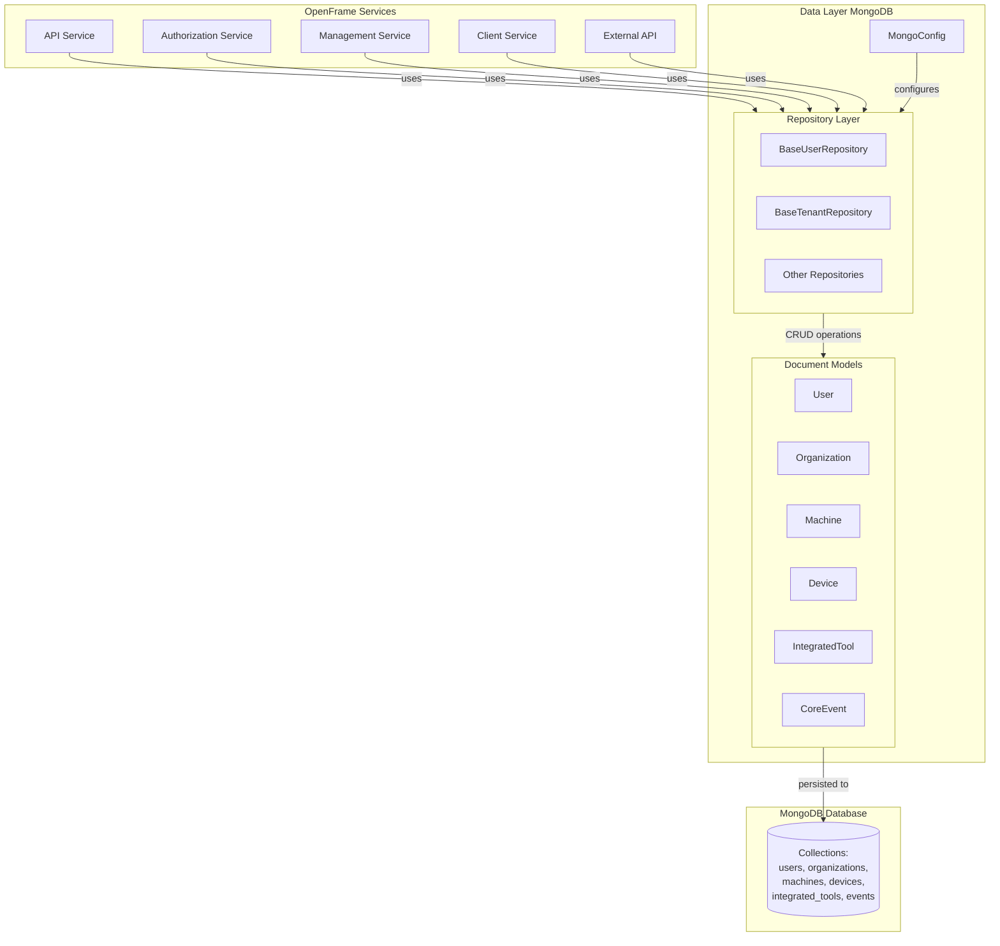
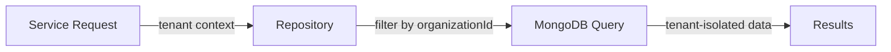
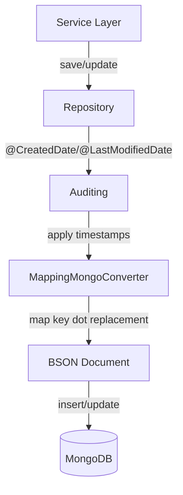
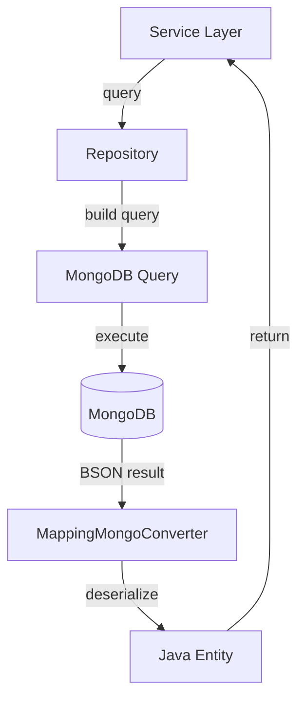
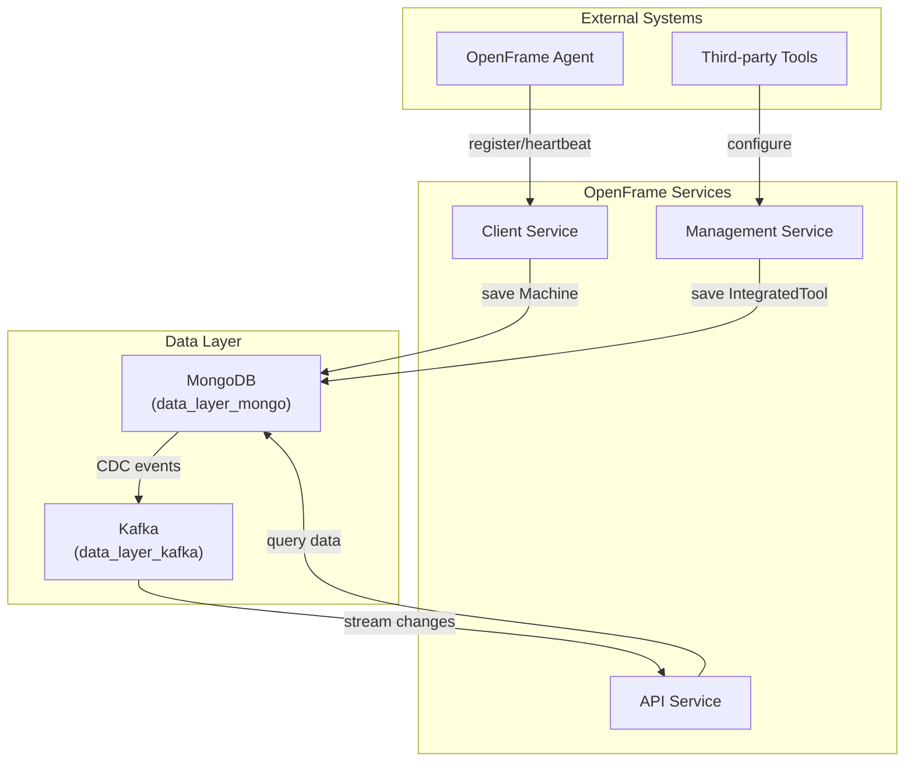

# Data Layer MongoDB Module

## Overview

The **data_layer_mongo** module is the primary data persistence layer for the OpenFrame platform, providing MongoDB-based storage for all core business entities. This module implements a comprehensive data access layer using Spring Data MongoDB, supporting both blocking and reactive programming models for flexible integration across different service architectures.

As part of the OpenFrame unified MSP platform, this module serves as the foundational data layer that enables:
- **Multi-tenant data isolation** for organizations and users
- **Device and machine management** for IT asset tracking
- **Event-driven architecture** support through event storage
- **Integrated tool configuration** persistence
- **Flexible repository patterns** supporting both synchronous and asynchronous operations

## Purpose

The data_layer_mongo module provides:

1. **Unified Data Model**: Consistent document schemas for all core business entities (Users, Organizations, Devices, Machines, Tools, Events)
2. **Repository Abstractions**: Technology-agnostic repository interfaces that support both blocking and reactive implementations
3. **MongoDB Configuration**: Auto-configuration for MongoDB with custom converters, auditing, and multi-tenancy support
4. **Data Access Layer**: Centralized data access patterns used by all OpenFrame services
5. **Schema Evolution**: Flexible document structures that support schema evolution without breaking changes

## Architecture Overview

The module follows a layered architecture pattern with clear separation of concerns:



## Module Structure

The data_layer_mongo module is organized into three primary sub-modules:

### 1. [Configuration](./data_layer_mongo_configuration.md)
Handles MongoDB setup, connection management, and Spring Data MongoDB configuration including:
- Blocking and reactive MongoDB repository enablement
- Custom converters for special data types
- Auditing configuration for automatic timestamp management
- Map key dot replacement for nested document handling

### 2. [Document Models](./data_layer_mongo_documents.md)
Defines the core business entity schemas stored in MongoDB:
- **User**: User accounts with roles, status, and authentication details
- **Organization**: Multi-tenant organization/company entities with business metadata
- **Machine**: Physical/virtual machines with security and compliance tracking
- **Device**: Logical devices linked to machines with health monitoring
- **IntegratedTool**: Third-party tool integrations with credentials and configuration
- **CoreEvent**: Event sourcing and audit trail storage

### 3. [Repository Layer](./data_layer_mongo_repositories.md)
Provides data access abstractions with technology-agnostic interfaces:
- Base repository interfaces supporting both blocking and reactive patterns
- Common query methods for users, tenants, and other entities
- Extensible design for service-specific repository implementations

## Key Features

### Multi-Tenancy Support

The module implements multi-tenancy at the data layer through:
- Organization-scoped data isolation via `organizationId` indexing
- Tenant-specific repository methods (`BaseTenantRepository`)
- Default organization support for single-tenant scenarios



### Dual Programming Model

Supports both blocking and reactive programming paradigms:

**Blocking (Traditional Spring Data)**:
```java
Optional<User> findByEmail(String email);
boolean existsByEmail(String email);
```

**Reactive (Spring WebFlux)**:
```java
Mono<User> findByEmail(String email);
Mono<Boolean> existsByEmail(String email);
```

This flexibility allows services to choose the appropriate model based on their requirements:
- **API Service**: Uses blocking repositories for REST endpoints
- **Gateway Service**: Uses reactive repositories for non-blocking request handling
- **Authorization Service**: Uses blocking repositories for OAuth flows

### Auditing and Timestamps

Automatic timestamp management through Spring Data MongoDB auditing:
- `@CreatedDate`: Automatically set on document creation
- `@LastModifiedDate`: Automatically updated on document modification
- Consistent across all document types

### Soft Delete Pattern

Organizations and other entities support soft deletion:
```java
private Boolean deleted = false;
private Instant deletedAt;

public boolean isDeleted() {
    return Boolean.TRUE.equals(deleted);
}
```

This allows data recovery and maintains referential integrity while hiding deleted entities from normal queries.

## Data Flow

### Write Operations



### Read Operations



## Integration with Other Modules

### Service Dependencies

The data_layer_mongo module is a foundational dependency for multiple services:

| Service | Usage | Document Types |
|---------|-------|----------------|
| **[API Service](./api_service.md)** | Primary data access for REST and GraphQL APIs | User, Organization, Device, Machine, Tool |
| **[Authorization Service](./authorization_service.md)** | User authentication and tenant management | User, Organization (as Tenant) |
| **[Management Service](./management_service.md)** | Tool configuration and CDC management | IntegratedTool, Organization |
| **[Client Service](./client_service.md)** | Device registration and heartbeat tracking | Machine, Device |
| **[External API](./external_api.md)** | External API data access | Device, Event, Organization, Tool |

### Cross-Module Data Flow



## Configuration

### Application Properties

Enable MongoDB repositories in your service's `application.yml`:

```yaml
spring:
  data:
    mongodb:
      enabled: true
      uri: ${MONGODB_URI:mongodb://localhost:27017/openframe}
      database: openframe
```

### Conditional Activation

The module uses conditional configuration to enable repositories only when MongoDB is configured:

```java
@ConditionalOnProperty(
    name = "spring.data.mongodb.enabled", 
    havingValue = "true", 
    matchIfMissing = false
)
```

This allows services to selectively enable MongoDB support without forcing all services to use it.

## Database Schema

### Collections Overview

| Collection | Document Type | Primary Index | Purpose |
|------------|---------------|---------------|---------|
| `users` | User | `email` | User accounts and authentication |
| `organizations` | Organization | `organizationId` | Multi-tenant organization data |
| `machines` | Machine | `machineId`, `organizationId` | Physical/virtual machine inventory |
| `devices` | Device | `machineId` | Logical device configurations |
| `integrated_tools` | IntegratedTool | `name`, `type` | Third-party tool integrations |
| `events` | CoreEvent | `type`, `timestamp` | Event sourcing and audit logs |

### Indexing Strategy

Key indexes for performance optimization:

**User Collection**:
- `email` (unique): Fast user lookup by email
- `status`: Filter active/inactive users

**Organization Collection**:
- `organizationId` (unique): Tenant identification
- `isDefault`: Quick default organization lookup
- `deleted`: Exclude soft-deleted organizations

**Machine Collection**:
- `machineId`: Primary machine identifier
- `organizationId`: Tenant data isolation
- `status`: Filter by device status
- `type`: Group by device type
- `osType`: Filter by operating system

## Best Practices

### 1. Use Base Repository Interfaces

Always extend base repository interfaces for consistency:

```java
public interface UserRepository extends MongoRepository<User, String>, 
                                        BaseUserRepository<Optional<User>, Boolean, String> {
    // Service-specific methods
}
```

### 2. Leverage Auditing

Use `@CreatedDate` and `@LastModifiedDate` instead of manual timestamp management:

```java
@CreatedDate
private Instant createdAt;

@LastModifiedDate
private Instant updatedAt;
```

### 3. Implement Soft Deletes

For entities that should be recoverable, use soft delete pattern:

```java
@Builder.Default
private Boolean deleted = false;
private Instant deletedAt;
```

### 4. Index Tenant Fields

Always index `organizationId` for multi-tenant queries:

```java
@Indexed
private String organizationId;
```

### 5. Normalize Email Addresses

Ensure email consistency by normalizing in setters:

```java
public void setEmail(String email) {
    this.email = email == null ? null : email.trim().toLowerCase(Locale.ROOT);
}
```

## Performance Considerations

### Query Optimization

1. **Use Indexed Fields**: Always query on indexed fields (`email`, `organizationId`, `machineId`)
2. **Projection**: Use Spring Data projections to fetch only required fields
3. **Pagination**: Implement pagination for large result sets
4. **Caching**: Consider caching frequently accessed entities (users, organizations)

### Connection Pooling

MongoDB connection pooling is managed by Spring Boot auto-configuration. Tune for your workload:

```yaml
spring:
  data:
    mongodb:
      uri: mongodb://localhost:27017/openframe?maxPoolSize=50&minPoolSize=10
```

### Write Concerns

For critical data, configure appropriate write concerns:

```yaml
spring:
  data:
    mongodb:
      uri: mongodb://localhost:27017/openframe?w=majority&journal=true
```

## Security Considerations

### Data Encryption

1. **At Rest**: Enable MongoDB encryption at rest for sensitive data
2. **In Transit**: Use TLS/SSL for MongoDB connections in production
3. **Credentials**: Store MongoDB credentials in secure vaults (e.g., HashiCorp Vault)

### Access Control

1. **Database Users**: Create service-specific MongoDB users with minimal privileges
2. **Network Isolation**: Restrict MongoDB access to service network only
3. **Audit Logging**: Enable MongoDB audit logging for compliance

### Sensitive Data

Sensitive fields should be encrypted before storage:
- User passwords (hashed, not stored in User document)
- Tool credentials (encrypted in `ToolCredentials`)
- API keys and tokens

## Monitoring and Observability

### Metrics to Track

1. **Connection Pool**: Active connections, wait time
2. **Query Performance**: Slow query logs, query execution time
3. **Document Size**: Monitor document growth over time
4. **Index Usage**: Ensure indexes are being utilized

### Health Checks

Implement MongoDB health checks in services:

```java
@Component
public class MongoHealthIndicator implements HealthIndicator {
    @Override
    public Health health() {
        // Check MongoDB connectivity
    }
}
```

## Migration and Evolution

### Schema Changes

MongoDB's flexible schema allows gradual migration:

1. **Add Fields**: New fields can be added without migration
2. **Rename Fields**: Use `@Field` annotation for backward compatibility
3. **Remove Fields**: Old fields are ignored if not mapped
4. **Data Migration**: Use Spring Data MongoDB migrations for complex changes

### Version Compatibility

The module maintains backward compatibility through:
- Optional fields with default values
- Graceful handling of missing fields
- Version-aware deserialization

## Troubleshooting

### Common Issues

**Issue**: `ConversionException` for nested maps with dots in keys

**Solution**: The module configures dot replacement automatically:
```java
converter.setMapKeyDotReplacement("__dot__");
```

**Issue**: Auditing timestamps not being set

**Solution**: Ensure `@EnableMongoAuditing` is active and entities use `@CreatedDate`/`@LastModifiedDate`

**Issue**: Reactive repositories not working

**Solution**: Verify reactive MongoDB is configured and service uses WebFlux:
```yaml
spring:
  webflux:
    enabled: true
```

## Related Documentation

- [Data Layer Core](./data_layer_core.md) - Cassandra and Pinot integration
- [Data Layer Kafka](./data_layer_kafka.md) - Kafka messaging and CDC
- [API Service](./api_service.md) - REST and GraphQL API implementation
- [Authorization Service](./authorization_service.md) - OAuth2 and authentication
- [Management Service](./management_service.md) - Tool and CDC management

## Additional Resources

- [Spring Data MongoDB Documentation](https://docs.spring.io/spring-data/mongodb/docs/current/reference/html/)
- [MongoDB Best Practices](https://www.mongodb.com/docs/manual/administration/production-notes/)
- [OpenFrame Architecture Overview](./architecture_overview.md)

---

**Questions or Issues?**  
For questions about the data_layer_mongo module, please reach out on the [OpenMSP Slack community](https://join.slack.com/t/openmsp/shared_invite/zt-36bl7mx0h-3~U2nFH6nqHqoTPXMaHEHA).
