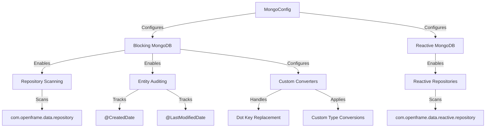
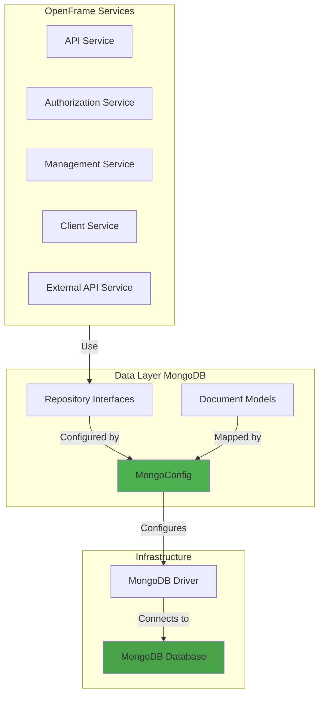
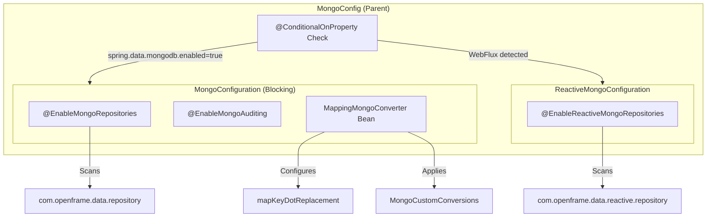
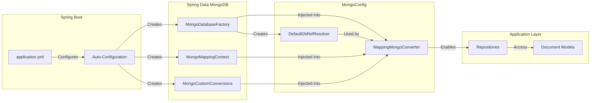
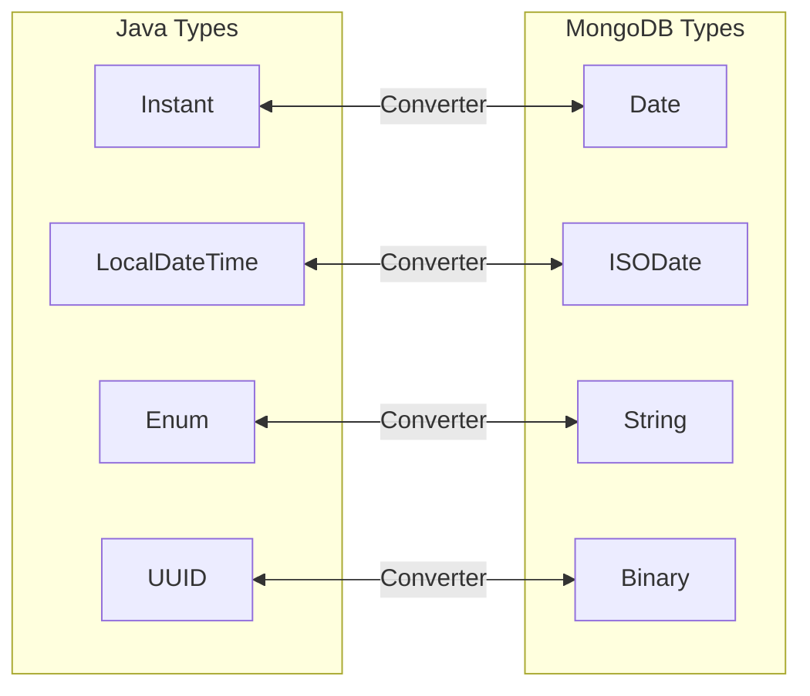
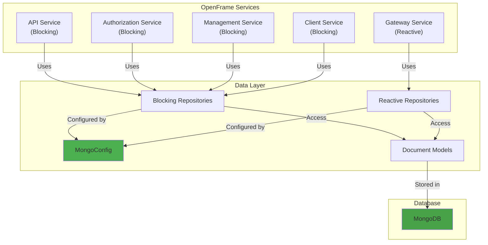
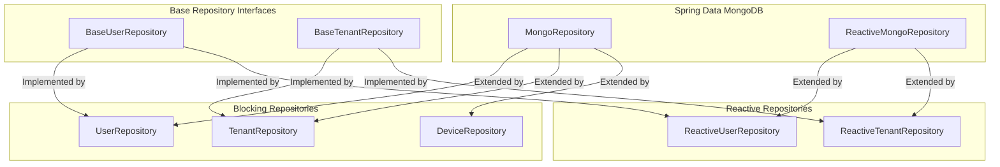
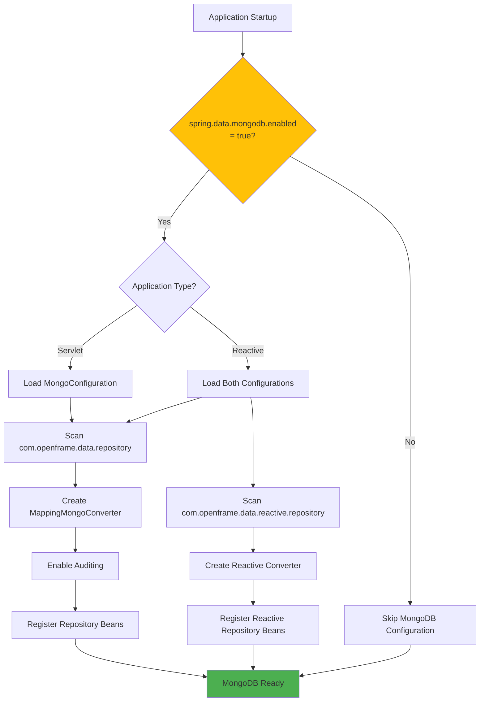

# Data Layer MongoDB Configuration

The **data_layer_mongo_configuration** module provides the foundational MongoDB configuration for the OpenFrame platform, enabling both blocking and reactive data access patterns across all services. This module configures Spring Data MongoDB with custom converters, auditing capabilities, and multi-tenancy support.

---

## Table of Contents

1. [Overview](#overview)
2. [Architecture](#architecture)
3. [Core Components](#core-components)
4. [Configuration Modes](#configuration-modes)
5. [Key Features](#key-features)
6. [Integration Points](#integration-points)
7. [Configuration Properties](#configuration-properties)
8. [Usage Examples](#usage-examples)
9. [Best Practices](#best-practices)
10. [Related Modules](#related-modules)

---

## Overview

### Purpose

The MongoDB configuration module serves as the central data access layer configuration for OpenFrame, providing:

- **Dual-Mode Support**: Both blocking (traditional) and reactive (WebFlux) MongoDB access
- **Auditing**: Automatic tracking of entity creation and modification timestamps
- **Custom Conversions**: Special handling for complex data types and field mappings
- **Dot Notation Support**: Safe handling of MongoDB field names containing dots
- **Repository Scanning**: Automatic discovery and registration of MongoDB repositories

### Key Responsibilities



---

## Architecture

### System Context



### Configuration Architecture



### Component Dependencies



---

## Core Components

### MongoConfig

The root configuration class that conditionally enables MongoDB support based on application properties.

**Location**: `com.openframe.data.config.MongoConfig`

**Annotations**:
- `@Configuration`: Marks this as a Spring configuration class

**Inner Classes**:
- `MongoConfiguration`: Blocking MongoDB configuration
- `ReactiveMongoConfiguration`: Reactive MongoDB configuration

---

### MongoConfiguration (Blocking)

Configures traditional blocking MongoDB repositories with auditing and custom conversion support.

**Key Annotations**:

```java
@Configuration
@ConditionalOnProperty(
    name = "spring.data.mongodb.enabled", 
    havingValue = "true", 
    matchIfMissing = false
)
@EnableMongoRepositories(basePackages = "com.openframe.data.repository")
@EnableMongoAuditing
```

**Conditional Activation**:
- Only activates when `spring.data.mongodb.enabled=true` in configuration
- Does NOT activate by default (`matchIfMissing = false`)

**Repository Scanning**:
- Scans `com.openframe.data.repository` package for repository interfaces
- Automatically creates implementations for repository methods

**Auditing Features**:
- Automatically populates `@CreatedDate` fields on entity creation
- Automatically updates `@LastModifiedDate` fields on entity modification
- Requires entities to have these annotations for tracking

---

### MappingMongoConverter Bean

Custom MongoDB converter configuration that handles special field mappings and type conversions.

**Bean Definition**:

```java
@Bean
public MappingMongoConverter mappingMongoConverter(
    MongoDatabaseFactory factory,
    MongoMappingContext context,
    MongoCustomConversions conversions
) {
    DbRefResolver dbRefResolver = new DefaultDbRefResolver(factory);
    MappingMongoConverter converter = new MappingMongoConverter(dbRefResolver, context);
    converter.setCustomConversions(conversions);
    converter.setMapKeyDotReplacement("__dot__");
    return converter;
}
```

**Key Features**:

1. **DbRef Resolution**: Handles MongoDB `@DBRef` annotations for document references
2. **Custom Conversions**: Applies custom type converters for complex data types
3. **Dot Key Replacement**: Replaces dots in map keys with `__dot__` to avoid MongoDB field name conflicts

**Dot Key Replacement Example**:

```java
// Java Map
Map<String, String> metadata = new HashMap<>();
metadata.put("server.hostname", "web01.example.com");
metadata.put("server.ip", "192.168.1.100");

// Stored in MongoDB as:
{
  "metadata": {
    "server__dot__hostname": "web01.example.com",
    "server__dot__ip": "192.168.1.100"
  }
}

// Retrieved back as original map with dots restored
```

---

### ReactiveMongoConfiguration

Configures reactive MongoDB repositories for WebFlux-based services.

**Key Annotations**:

```java
@Configuration
@ConditionalOnWebApplication(type = ConditionalOnWebApplication.Type.REACTIVE)
@EnableReactiveMongoRepositories(basePackages = "com.openframe.data.reactive.repository")
```

**Conditional Activation**:
- Only activates in reactive (WebFlux) application contexts
- Does NOT activate in traditional servlet-based applications

**Repository Scanning**:
- Scans `com.openframe.data.reactive.repository` package
- Creates reactive repository implementations returning `Mono<T>` and `Flux<T>`

---

## Configuration Modes

### Blocking Mode (Traditional)

**Use Case**: Traditional Spring MVC services with synchronous request handling

**Activation**:

```yaml
spring:
  data:
    mongodb:
      enabled: true
      uri: mongodb://localhost:27017/openframe
```

**Repository Example**:

```java
public interface UserRepository extends MongoRepository<User, String>, 
                                        BaseUserRepository<Optional<User>, Boolean, String> {
    Optional<User> findByEmail(String email);
    boolean existsByEmail(String email);
    List<User> findByOrganizationId(String organizationId);
}
```

**Service Usage**:

```java
@Service
public class UserService {
    @Autowired
    private UserRepository userRepository;
    
    public User getUserByEmail(String email) {
        return userRepository.findByEmail(email)
            .orElseThrow(() -> new UserNotFoundException(email));
    }
}
```

---

### Reactive Mode (WebFlux)

**Use Case**: Reactive services requiring non-blocking I/O (e.g., Gateway Service)

**Activation**:

```yaml
spring:
  data:
    mongodb:
      enabled: true
      uri: mongodb://localhost:27017/openframe
  webflux:
    enabled: true
```

**Repository Example**:

```java
public interface ReactiveUserRepository extends ReactiveMongoRepository<User, String>,
                                                BaseUserRepository<Mono<User>, Mono<Boolean>, String> {
    Mono<User> findByEmail(String email);
    Mono<Boolean> existsByEmail(String email);
    Flux<User> findByOrganizationId(String organizationId);
}
```

**Service Usage**:

```java
@Service
public class ReactiveUserService {
    @Autowired
    private ReactiveUserRepository userRepository;
    
    public Mono<User> getUserByEmail(String email) {
        return userRepository.findByEmail(email)
            .switchIfEmpty(Mono.error(new UserNotFoundException(email)));
    }
}
```

---

## Key Features

### 1. Automatic Auditing

Tracks entity lifecycle timestamps automatically.

**Entity Configuration**:

```java
@Data
@Document(collection = "users")
public class User {
    @Id
    private String id;
    
    private String email;
    private String name;
    
    @CreatedDate
    private Instant createdAt;
    
    @LastModifiedDate
    private Instant updatedAt;
}
```

**Behavior**:
- `createdAt` is set automatically on first save
- `updatedAt` is updated automatically on every save
- No manual timestamp management required

---

### 2. Custom Type Conversions

Handles complex data type mappings between Java and MongoDB.

**Common Conversions**:



**Example Custom Converter**:

```java
@ReadingConverter
public class InstantToDateConverter implements Converter<Instant, Date> {
    @Override
    public Date convert(Instant source) {
        return Date.from(source);
    }
}

@WritingConverter
public class DateToInstantConverter implements Converter<Date, Instant> {
    @Override
    public Instant convert(Date source) {
        return source.toInstant();
    }
}
```

---

### 3. DBRef Support

Handles document references for related entities.

**Example**:

```java
@Document(collection = "devices")
public class Device {
    @Id
    private String id;
    
    @DBRef
    private Machine machine;  // Reference to Machine document
    
    @DBRef
    private Organization organization;  // Reference to Organization document
}
```

**MongoDB Storage**:

```json
{
  "_id": "device123",
  "machine": {
    "$ref": "machines",
    "$id": "machine456"
  },
  "organization": {
    "$ref": "organizations",
    "$id": "org789"
  }
}
```

---

### 4. Dot Key Replacement

Safely handles map keys containing dots (which are invalid in MongoDB field names).

**Problem**:

```java
// This would fail in MongoDB without dot replacement
Map<String, String> config = new HashMap<>();
config.put("server.host", "localhost");  // Dot in key!
```

**Solution**:

```java
// Automatically converted by MappingMongoConverter
converter.setMapKeyDotReplacement("__dot__");

// Stored as:
{
  "config": {
    "server__dot__host": "localhost"
  }
}

// Retrieved as original map with dots restored
```

---

## Integration Points

### Service Integration



### Repository Hierarchy



---

## Configuration Properties

### Required Properties

```yaml
spring:
  data:
    mongodb:
      # Enable MongoDB configuration
      enabled: true
      
      # MongoDB connection URI
      uri: mongodb://localhost:27017/openframe
      
      # Alternative: Individual connection properties
      host: localhost
      port: 27017
      database: openframe
      username: openframe_user
      password: ${MONGO_PASSWORD}
      authentication-database: admin
```

### Optional Properties

```yaml
spring:
  data:
    mongodb:
      # Connection pool settings
      auto-index-creation: true
      
      # UUID representation
      uuid-representation: standard
      
      # Field naming strategy
      field-naming-strategy: org.springframework.data.mapping.model.SnakeCaseFieldNamingStrategy
```

### Replica Set Configuration

```yaml
spring:
  data:
    mongodb:
      uri: mongodb://host1:27017,host2:27017,host3:27017/openframe?replicaSet=rs0
      
      # Connection options
      connection-string-options:
        maxPoolSize: 50
        minPoolSize: 10
        maxIdleTimeMS: 60000
        connectTimeoutMS: 10000
        socketTimeoutMS: 30000
```

### SSL/TLS Configuration

```yaml
spring:
  data:
    mongodb:
      uri: mongodb://localhost:27017/openframe?ssl=true&sslInvalidHostNameAllowed=true
      
      # Or using properties
      ssl:
        enabled: true
        invalid-host-name-allowed: true
```

---

## Usage Examples

### Example 1: Basic Repository Usage

**Define Document**:

```java
@Data
@Document(collection = "organizations")
public class Organization {
    @Id
    private String id;
    
    private String name;
    private String domain;
    private OrganizationStatus status;
    
    @CreatedDate
    private Instant createdAt;
    
    @LastModifiedDate
    private Instant updatedAt;
}
```

**Define Repository**:

```java
public interface OrganizationRepository extends MongoRepository<Organization, String>,
                                                BaseTenantRepository<Optional<Organization>, Boolean, String> {
    Optional<Organization> findByDomain(String domain);
    boolean existsByDomain(String domain);
    List<Organization> findByStatus(OrganizationStatus status);
}
```

**Use in Service**:

```java
@Service
public class OrganizationService {
    @Autowired
    private OrganizationRepository organizationRepository;
    
    public Organization createOrganization(String name, String domain) {
        if (organizationRepository.existsByDomain(domain)) {
            throw new DomainAlreadyExistsException(domain);
        }
        
        Organization org = new Organization();
        org.setName(name);
        org.setDomain(domain);
        org.setStatus(OrganizationStatus.ACTIVE);
        
        return organizationRepository.save(org);  // Auditing fields set automatically
    }
    
    public Organization getByDomain(String domain) {
        return organizationRepository.findByDomain(domain)
            .orElseThrow(() -> new OrganizationNotFoundException(domain));
    }
}
```

---

### Example 2: Complex Queries

**Repository with Custom Queries**:

```java
public interface DeviceRepository extends MongoRepository<Device, String> {
    
    // Method name query
    List<Device> findByOrganizationIdAndStatus(String organizationId, DeviceStatus status);
    
    // Custom query with @Query annotation
    @Query("{ 'organizationId': ?0, 'lastCheckin': { $gte: ?1 } }")
    List<Device> findActiveDevicesSince(String organizationId, Instant since);
    
    // Aggregation query
    @Aggregation(pipeline = {
        "{ $match: { 'organizationId': ?0 } }",
        "{ $group: { _id: '$status', count: { $sum: 1 } } }"
    })
    List<DeviceStatusCount> countDevicesByStatus(String organizationId);
}
```

---

### Example 3: Reactive Repository Usage

**Reactive Repository**:

```java
public interface ReactiveDeviceRepository extends ReactiveMongoRepository<Device, String> {
    Flux<Device> findByOrganizationId(String organizationId);
    Mono<Device> findBySerialNumber(String serialNumber);
    Mono<Boolean> existsBySerialNumber(String serialNumber);
}
```

**Reactive Service**:

```java
@Service
public class ReactiveDeviceService {
    @Autowired
    private ReactiveDeviceRepository deviceRepository;
    
    public Flux<Device> getOrganizationDevices(String organizationId) {
        return deviceRepository.findByOrganizationId(organizationId)
            .filter(device -> device.getStatus() == DeviceStatus.ACTIVE);
    }
    
    public Mono<Device> registerDevice(Device device) {
        return deviceRepository.existsBySerialNumber(device.getSerialNumber())
            .flatMap(exists -> {
                if (exists) {
                    return Mono.error(new DeviceAlreadyExistsException(device.getSerialNumber()));
                }
                return deviceRepository.save(device);
            });
    }
}
```

---

### Example 4: Using DBRef for Relationships

**Documents with References**:

```java
@Document(collection = "machines")
public class Machine {
    @Id
    private String id;
    
    private String hostname;
    private String ipAddress;
    
    @DBRef
    private Organization organization;
}

@Document(collection = "devices")
public class Device {
    @Id
    private String id;
    
    private String serialNumber;
    
    @DBRef(lazy = true)  // Lazy loading
    private Machine machine;
    
    @DBRef
    private Organization organization;
}
```

**Repository Usage**:

```java
@Service
public class DeviceService {
    @Autowired
    private DeviceRepository deviceRepository;
    
    @Autowired
    private MachineRepository machineRepository;
    
    public Device createDevice(String serialNumber, String machineId, String organizationId) {
        Machine machine = machineRepository.findById(machineId)
            .orElseThrow(() -> new MachineNotFoundException(machineId));
        
        Organization org = organizationRepository.findById(organizationId)
            .orElseThrow(() -> new OrganizationNotFoundException(organizationId));
        
        Device device = new Device();
        device.setSerialNumber(serialNumber);
        device.setMachine(machine);  // DBRef stored
        device.setOrganization(org);  // DBRef stored
        
        return deviceRepository.save(device);
    }
}
```

---

## Best Practices

### 1. Repository Design

✅ **DO**: Use base repository interfaces for common patterns

```java
public interface UserRepository extends MongoRepository<User, String>,
                                        BaseUserRepository<Optional<User>, Boolean, String> {
    // Inherits common methods like findByEmail, existsByEmail
}
```

❌ **DON'T**: Duplicate common query methods across repositories

```java
// Avoid this - use base interface instead
public interface UserRepository extends MongoRepository<User, String> {
    Optional<User> findByEmail(String email);  // Duplicated across repos
}

public interface AdminRepository extends MongoRepository<Admin, String> {
    Optional<Admin> findByEmail(String email);  // Duplicated again
}
```

---

### 2. Auditing Configuration

✅ **DO**: Use auditing annotations for automatic timestamp management

```java
@Data
@Document(collection = "events")
public class Event {
    @Id
    private String id;
    
    @CreatedDate
    private Instant createdAt;  // Automatically set
    
    @LastModifiedDate
    private Instant updatedAt;  // Automatically updated
}
```

❌ **DON'T**: Manually manage timestamps

```java
// Avoid manual timestamp management
@Service
public class EventService {
    public Event createEvent(Event event) {
        event.setCreatedAt(Instant.now());  // Manual - error-prone
        event.setUpdatedAt(Instant.now());
        return eventRepository.save(event);
    }
}
```

---

### 3. Index Management

✅ **DO**: Define indexes on frequently queried fields

```java
@Document(collection = "devices")
@CompoundIndex(name = "org_status_idx", def = "{'organizationId': 1, 'status': 1}")
public class Device {
    @Id
    private String id;
    
    @Indexed
    private String serialNumber;
    
    private String organizationId;
    private DeviceStatus status;
}
```

❌ **DON'T**: Query without indexes on large collections

```java
// This will be slow without index on organizationId
List<Device> devices = deviceRepository.findByOrganizationId(orgId);
```

---

### 4. Connection Pool Configuration

✅ **DO**: Configure appropriate connection pool sizes for production

```yaml
spring:
  data:
    mongodb:
      uri: mongodb://localhost:27017/openframe?maxPoolSize=50&minPoolSize=10
```

❌ **DON'T**: Use default connection pool settings in production

```yaml
# Default settings may not handle production load
spring:
  data:
    mongodb:
      uri: mongodb://localhost:27017/openframe
```

---

### 5. Error Handling

✅ **DO**: Handle MongoDB-specific exceptions

```java
@Service
public class UserService {
    public User createUser(User user) {
        try {
            return userRepository.save(user);
        } catch (DuplicateKeyException e) {
            throw new UserAlreadyExistsException(user.getEmail());
        } catch (MongoException e) {
            log.error("MongoDB error creating user", e);
            throw new DatabaseException("Failed to create user", e);
        }
    }
}
```

❌ **DON'T**: Let MongoDB exceptions propagate to API layer

```java
// Avoid exposing internal exceptions
@RestController
public class UserController {
    @PostMapping("/users")
    public User createUser(@RequestBody User user) {
        return userRepository.save(user);  // May throw DuplicateKeyException
    }
}
```

---

### 6. Reactive vs Blocking

✅ **DO**: Use reactive repositories in reactive services

```java
// Gateway Service (Reactive)
@Service
public class ReactiveAuthService {
    @Autowired
    private ReactiveUserRepository userRepository;
    
    public Mono<User> authenticate(String email, String password) {
        return userRepository.findByEmail(email)
            .filter(user -> passwordEncoder.matches(password, user.getPassword()));
    }
}
```

❌ **DON'T**: Mix blocking and reactive patterns

```java
// Avoid blocking calls in reactive services
@Service
public class ReactiveAuthService {
    @Autowired
    private UserRepository blockingRepository;  // Wrong!
    
    public Mono<User> authenticate(String email, String password) {
        // This blocks the reactive thread!
        User user = blockingRepository.findByEmail(email).orElse(null);
        return Mono.justOrEmpty(user);
    }
}
```

---

## Related Modules

### Data Layer Modules

- **[data_layer_mongo_documents](data_layer_mongo_documents.md)**: MongoDB document models and entity definitions
- **[data_layer_mongo_repositories](data_layer_mongo_repositories.md)**: Repository interfaces and custom query implementations
- **[data_layer_core](data_layer_core.md)**: Core data layer configuration and multi-database support
- **[data_layer_kafka](data_layer_kafka.md)**: Kafka configuration for event streaming

### Service Modules

- **[api_service_configuration](api_service_configuration.md)**: API service configuration using MongoDB repositories
- **[authorization_service_configuration](authorization_service_configuration.md)**: Authorization service MongoDB integration
- **[management_service_configuration](management_service_configuration.md)**: Management service data access configuration
- **[client_service_registration_auth](client_service_registration_auth.md)**: Client service MongoDB usage for device registration

### Related Documentation

- **MongoDB Official Documentation**: https://docs.mongodb.com/
- **Spring Data MongoDB Reference**: https://docs.spring.io/spring-data/mongodb/docs/current/reference/html/
- **Reactive Programming Guide**: https://projectreactor.io/docs/core/release/reference/

---

## Configuration Flow



---

## Troubleshooting

### Common Issues

#### 1. MongoDB Not Connecting

**Symptom**: Application fails to start with connection errors

**Solution**:

```yaml
# Check connection string
spring:
  data:
    mongodb:
      uri: mongodb://localhost:27017/openframe
      
# Enable debug logging
logging:
  level:
    org.springframework.data.mongodb: DEBUG
```

#### 2. Repositories Not Found

**Symptom**: `NoSuchBeanDefinitionException` for repository

**Solution**:

```java
// Ensure repository is in correct package
package com.openframe.data.repository;  // Must be in this package

public interface UserRepository extends MongoRepository<User, String> {
    // ...
}
```

#### 3. Auditing Not Working

**Symptom**: `@CreatedDate` and `@LastModifiedDate` fields are null

**Solution**:

```yaml
# Ensure MongoDB is enabled
spring:
  data:
    mongodb:
      enabled: true  # Required for @EnableMongoAuditing
```

```java
// Ensure annotations are present
@Document(collection = "users")
public class User {
    @CreatedDate
    private Instant createdAt;  // Must have annotation
    
    @LastModifiedDate
    private Instant updatedAt;  // Must have annotation
}
```

#### 4. Dot Key Issues

**Symptom**: MongoDB errors with field names containing dots

**Solution**: The `MappingMongoConverter` automatically handles this with `mapKeyDotReplacement("__dot__")`. Ensure you're using the configured converter bean.

---

**For questions or issues, join the OpenMSP Slack community**: https://join.slack.com/t/openmsp/shared_invite/zt-36bl7mx0h-3~U2nFH6nqHqoTPXMaHEHA
