# Data Layer MongoDB Documents

## Overview

The **data_layer_mongo_documents** module defines the core MongoDB document models that represent the persistent data structures in the OpenFrame platform. These documents serve as the foundation for storing and managing devices, machines, organizations, users, integrated tools, and events across the entire system.

This module is part of the broader [data_layer_mongo](data_layer_mongo.md) layer and works in conjunction with:
- [data_layer_mongo_configuration](data_layer_mongo_configuration.md) - MongoDB connection and configuration
- [data_layer_mongo_repositories](data_layer_mongo_repositories.md) - Data access layer for CRUD operations

---

## Architecture Overview

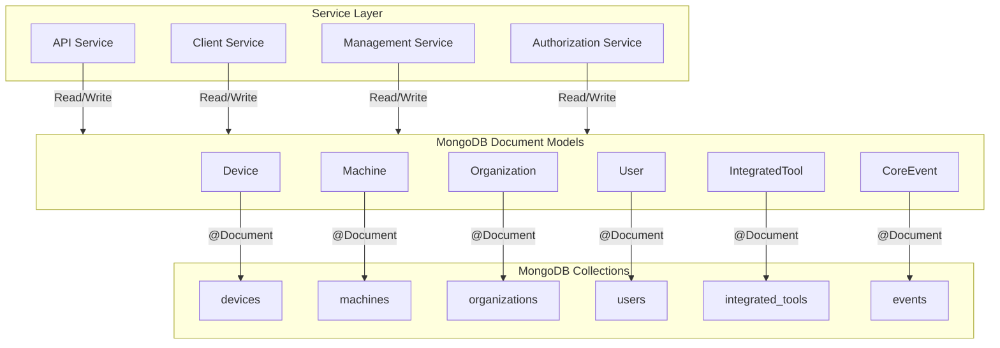

---

## Core Document Models

### 1. Device Document

**Purpose**: Represents physical or virtual devices managed by the platform, linked to Machine entities for authentication and detailed tracking.

**Collection**: `devices`

**Key Features**:
- Links to Machine entity via `machineId`
- Tracks device configuration and health metrics
- Supports multiple device types (Desktop, Laptop, Server, etc.)
- Monitors device status and last check-in time

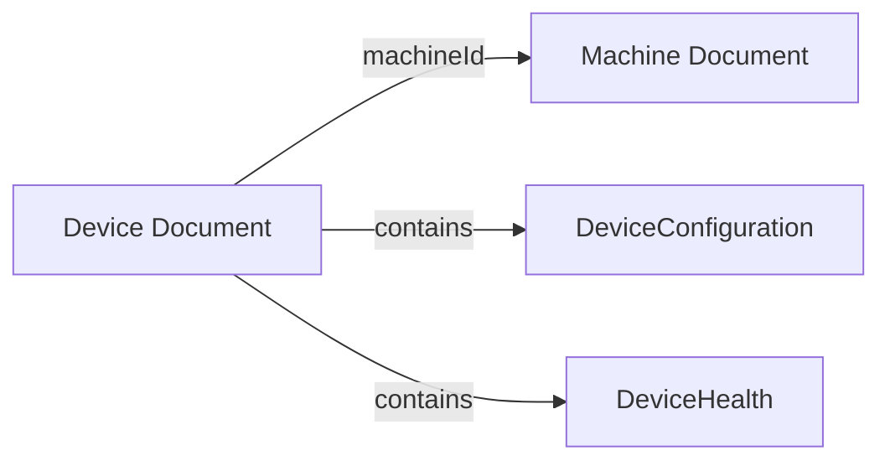

**Schema Structure**:

```java
@Document(collection = "devices")
public class Device {
    @Id
    private String id;                          // MongoDB ObjectId
    private String machineId;                   // Link to Machine entity
    private String serialNumber;                // Hardware serial number
    private String model;                       // Device model
    private String osVersion;                   // Operating system version
    private String status;                      // ACTIVE, OFFLINE, MAINTENANCE
    private DeviceType type;                    // DESKTOP, LAPTOP, SERVER, etc.
    private Instant lastCheckin;                // Last communication timestamp
    private DeviceConfiguration configuration;  // Device-specific configuration
    private DeviceHealth health;                // Health metrics
}
```

**Relationships**:
- **One-to-One** with Machine (via `machineId`)
- Referenced by client agents for device management
- Used by [api_service](api_service.md) for device queries

---

### 2. Machine Document

**Purpose**: Represents the core machine/endpoint entity with authentication credentials, security state, and compliance tracking. This is the primary entity for device authentication and management.

**Collection**: `machines`

**Key Features**:
- Primary authentication entity (used in OAuth flows)
- Comprehensive hardware and OS information
- Security and compliance state tracking
- Organization-scoped with multi-tenancy support
- Indexed fields for efficient querying

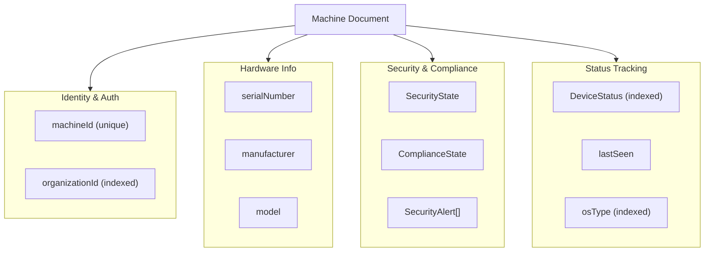

**Schema Structure**:

```java
@Document(collection = "machines")
public class Machine {
    @Id
    private String id;                                  // MongoDB ObjectId
    
    @NotBlank
    private String machineId;                           // Primary identifier (used in OAuth)
    
    // Network & Identity
    private String ip;                                  // IP address
    private String macAddress;                          // MAC address
    private String osUuid;                              // OS-level UUID
    private String agentVersion;                        // Installed agent version
    
    @Indexed
    private DeviceStatus status;                        // Device operational status
    private Instant lastSeen;                           // Last heartbeat timestamp
    
    @Indexed
    private String organizationId;                      // Multi-tenant organization link
    
    // Hardware Information
    private String hostname;                            // Network hostname
    private String displayName;                         // User-friendly name
    private String serialNumber;                        // Hardware serial
    private String manufacturer;                        // Hardware manufacturer
    private String model;                               // Hardware model
    
    // Operating System
    @Indexed
    private DeviceType type;                            // DESKTOP, LAPTOP, SERVER, etc.
    @Indexed
    private String osType;                              // Windows, Linux, macOS
    private String osVersion;                           // OS version string
    private String osBuild;                             // OS build number
    private String timezone;                            // Device timezone
    
    // Security & Compliance
    private SecurityState securityState;                // Security posture
    private ComplianceState complianceState;            // Compliance status
    private List<SecurityAlert> securityAlerts;         // Active security alerts
    private Instant lastSecurityScan;                   // Last security scan time
    private Instant lastComplianceScan;                 // Last compliance check time
    private List<ComplianceRequirement> complianceRequirements;  // Required compliance rules
    
    // Audit Timestamps
    @CreatedDate
    private Instant registeredAt;                       // Initial registration time
    
    @LastModifiedDate
    private Instant updatedAt;                          // Last update time
}
```

**Indexed Fields**:
- `status` - Fast status-based queries
- `organizationId` - Multi-tenant data isolation
- `type` - Device type filtering
- `osType` - OS-based filtering

**Relationships**:
- **Many-to-One** with Organization (via `organizationId`)
- **One-to-One** with Device (referenced by `machineId`)
- Used by [client_service](client_service.md) for agent registration
- Used by [authorization_service](authorization_service.md) for OAuth client authentication

---

### 3. Organization Document

**Purpose**: Represents companies or entities in the system, containing business information, contract details, and contact information. Supports multi-tenancy and soft deletion.

**Collection**: `organizations`

**Key Features**:
- Unique `organizationId` for tenant isolation
- Default organization flag for tenant setup
- Contract lifecycle management
- Soft delete capability
- Business metrics tracking (revenue, employees)

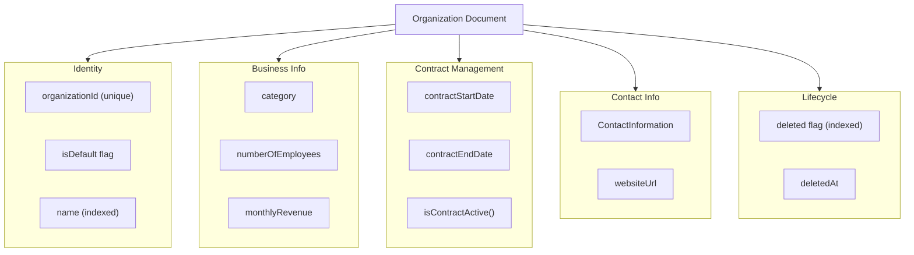

**Schema Structure**:

```java
@Document(collection = "organizations")
public class Organization {
    @Id
    private String id;                              // MongoDB ObjectId
    
    @Indexed
    private String name;                            // Organization name
    
    @NotBlank
    @Indexed(unique = true)
    private String organizationId;                  // Unique tenant identifier (UUID)
    
    @NotNull
    @Indexed
    @Builder.Default
    private Boolean isDefault = false;              // Default org for tenant
    
    // Business Information
    private String category;                        // Industry/business category
    private Integer numberOfEmployees;              // Employee count
    private String websiteUrl;                      // Company website
    private String notes;                           // Additional notes
    
    // Contact Information
    private ContactInformation contactInformation;  // Contacts and addresses
    
    // Financial Information
    private BigDecimal monthlyRevenue;              // Monthly revenue
    
    // Contract Management
    private LocalDate contractStartDate;            // Contract start
    private LocalDate contractEndDate;              // Contract end
    
    // Audit Timestamps
    @CreatedDate
    private Instant createdAt;
    
    @LastModifiedDate
    private Instant updatedAt;
    
    // Soft Delete
    @Indexed
    @Builder.Default
    private Boolean deleted = false;                // Soft delete flag
    private Instant deletedAt;                      // Deletion timestamp
    
    // Business Logic Methods
    public boolean isContractActive() {
        LocalDate now = LocalDate.now();
        return contractStartDate != null 
            && contractEndDate != null
            && !now.isBefore(contractStartDate) 
            && !now.isAfter(contractEndDate);
    }
    
    public boolean isDeleted() {
        return Boolean.TRUE.equals(deleted);
    }
}
```

**Indexed Fields**:
- `name` - Organization name lookups
- `organizationId` - Unique constraint for tenant isolation
- `isDefault` - Quick default organization queries
- `deleted` - Efficient soft-delete filtering

**Relationships**:
- **One-to-Many** with Machine (via `organizationId`)
- **One-to-Many** with User (implicit via tenant context)
- Used by [api_service](api_service.md) for organization management
- Used by [authorization_service](authorization_service.md) for tenant isolation

---

### 4. User Document

**Purpose**: Represents user accounts in the system with authentication, authorization, and profile information. Supports email verification and role-based access control.

**Collection**: `users`

**Key Features**:
- Email-based authentication
- Role-based access control (RBAC)
- Email verification tracking
- User status management
- Automatic email normalization (lowercase, trimmed)

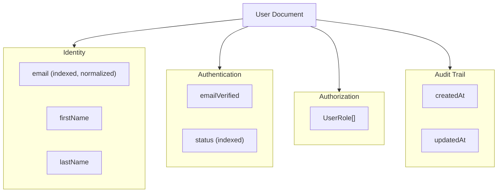

**Schema Structure**:

```java
@Document(collection = "users")
public class User {
    @Id
    private String id;                          // MongoDB ObjectId
    
    @Indexed
    private String email;                       // Email (normalized to lowercase)
    private String firstName;                   // First name
    private String lastName;                    // Last name
    
    @Builder.Default
    private List<UserRole> roles = new ArrayList<>();  // User roles for RBAC
    
    @Builder.Default
    private boolean emailVerified = false;      // Email verification status
    
    @Indexed
    @Builder.Default
    private UserStatus status = UserStatus.ACTIVE;  // User account status
    
    @CreatedDate
    private LocalDateTime createdAt;            // Account creation time
    
    @LastModifiedDate
    private LocalDateTime updatedAt;            // Last update time
    
    // Email normalization
    public void setEmail(String email) {
        this.email = email == null ? null : email.trim().toLowerCase(Locale.ROOT);
    }
}
```

**Indexed Fields**:
- `email` - Fast user lookups by email
- `status` - Filter active/inactive users

**Email Normalization**:
The `setEmail()` method automatically:
1. Trims whitespace
2. Converts to lowercase
3. Ensures consistent email storage

**Relationships**:
- **Many-to-One** with Organization (implicit via tenant context)
- Used by [authorization_service](authorization_service.md) for authentication
- Used by [api_service](api_service.md) for user management

---

### 5. IntegratedTool Document

**Purpose**: Represents third-party tools and integrations configured in the platform, including RMM tools, MDM solutions, and monitoring systems.

**Collection**: `integrated_tools`

**Key Features**:
- Multi-URL support for different tool endpoints
- Credential management
- Layer-based organization (UI categorization)
- Health check configuration
- Debezium CDC connector configuration

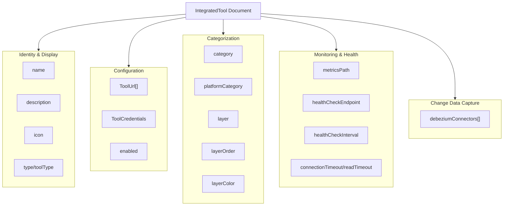

**Schema Structure**:

```java
@Document(collection = "integrated_tools")
public class IntegratedTool {
    @Id
    private String id;                              // MongoDB ObjectId
    
    // Identity & Display
    private String name;                            // Tool name
    private String description;                     // Tool description
    private String icon;                            // Icon identifier
    private List<ToolUrl> toolUrls;                 // Multiple endpoint URLs
    
    // Type & Category
    private String type;                            // Tool type
    private String toolType;                        // Specific tool type
    private String category;                        // General category
    private String platformCategory;                // Platform-specific category
    
    // Configuration
    private boolean enabled;                        // Enable/disable flag
    private ToolCredentials credentials;            // Authentication credentials
    
    // Layer Information (UI Organization)
    private String layer;                           // Layer name
    private Integer layerOrder;                     // Display order in layer
    private String layerColor;                      // Layer color code
    
    // Monitoring Configuration
    private String metricsPath;                     // Metrics endpoint path
    private String healthCheckEndpoint;             // Health check URL
    private Integer healthCheckInterval;            // Check interval (seconds)
    private Integer connectionTimeout;              // Connection timeout (ms)
    private Integer readTimeout;                    // Read timeout (ms)
    private String[] allowedEndpoints;              // Whitelisted endpoints
    
    // Change Data Capture
    private Object[] debeziumConnectors;            // Debezium connector configs
}
```

**Tool URL Structure**:
Each tool can have multiple URLs for different purposes (API, UI, webhooks, etc.)

**Relationships**:
- Used by [management_service](management_service.md) for tool lifecycle management
- Used by [api_service](api_service.md) for tool queries
- Referenced by CDC connectors in [stream_processing](stream_processing.md)

---

### 6. CoreEvent Document

**Purpose**: Represents system events for audit logging, event sourcing, and asynchronous processing tracking.

**Collection**: `events`

**Key Features**:
- Event type classification
- JSON payload storage
- Event status tracking
- User attribution
- Timestamp-based ordering

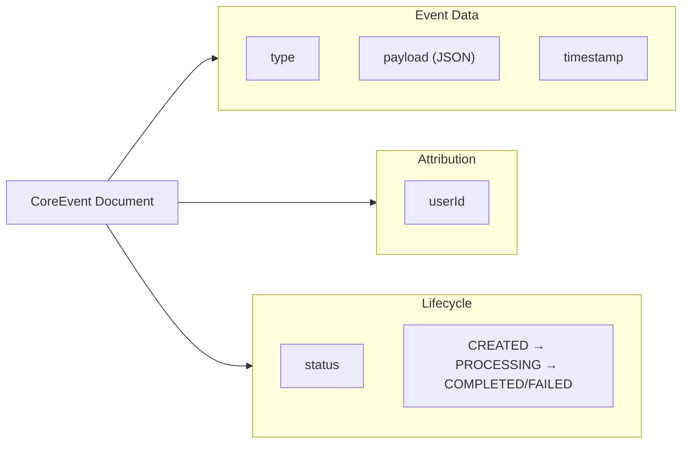

**Schema Structure**:

```java
@Document(collection = "events")
public class CoreEvent {
    @Id
    private String id;                      // MongoDB ObjectId
    
    private String type;                    // Event type identifier
    private String payload;                 // JSON payload
    private Instant timestamp;              // Event timestamp
    private String userId;                  // User who triggered event
    private EventStatus status;             // Event processing status
    
    public enum EventStatus {
        CREATED,                            // Event created
        PROCESSING,                         // Event being processed
        COMPLETED,                          // Event processed successfully
        FAILED                              // Event processing failed
    }
}
```

**Event Status Flow**:

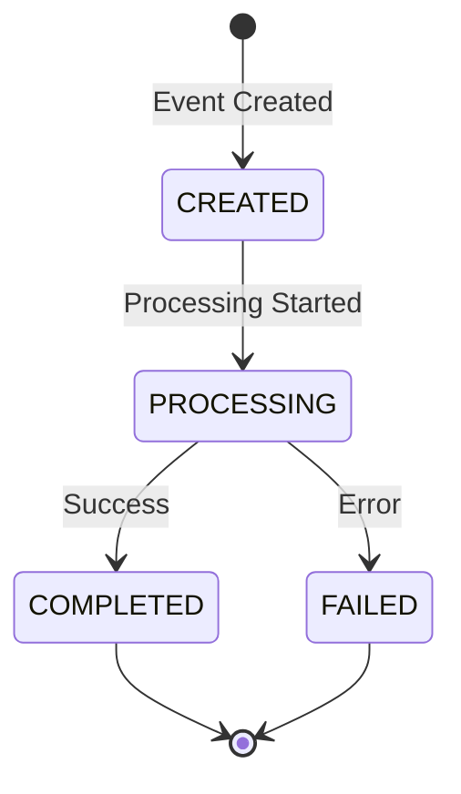

**Relationships**:
- Used by [stream_processing](stream_processing.md) for event processing
- Used by [api_service](api_service.md) for event queries
- Referenced by audit logging systems

---

## Document Relationships

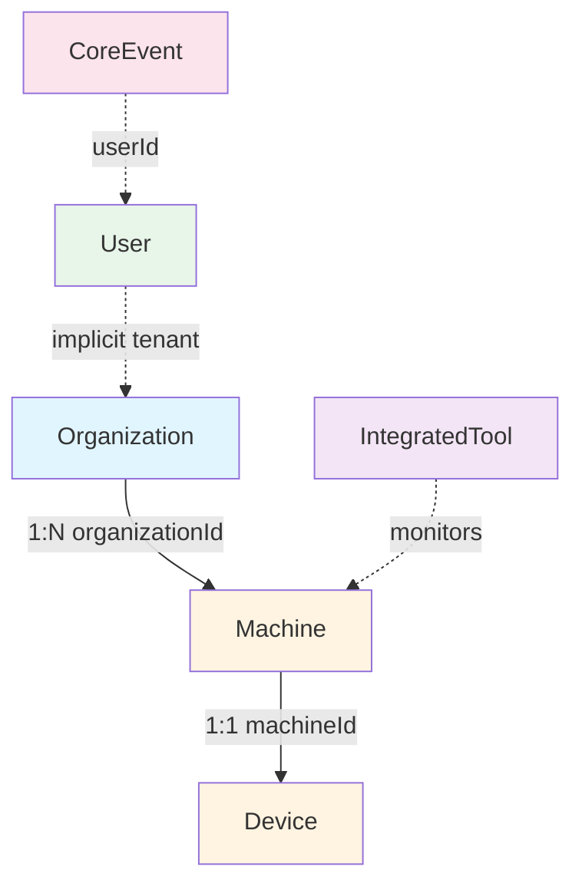

**Relationship Types**:
- **Solid lines**: Direct foreign key references
- **Dotted lines**: Implicit or logical relationships

---

## Data Flow Patterns

### 1. Device Registration Flow

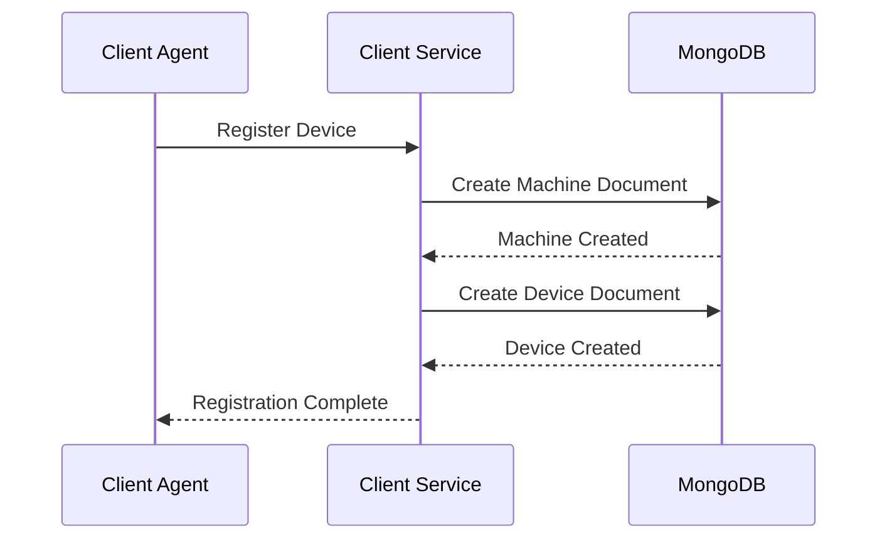

### 2. Organization Setup Flow

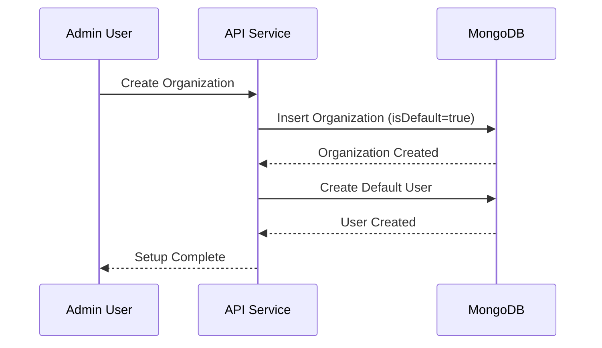

### 3. Tool Integration Flow

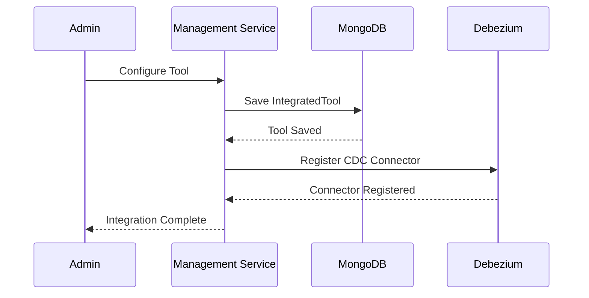

---

## Indexing Strategy

### Performance Indexes

| Document | Field | Type | Purpose |
|----------|-------|------|---------|
| **Machine** | `status` | Single | Fast status filtering |
| **Machine** | `organizationId` | Single | Multi-tenant isolation |
| **Machine** | `type` | Single | Device type queries |
| **Machine** | `osType` | Single | OS-based filtering |
| **Organization** | `name` | Single | Name lookups |
| **Organization** | `organizationId` | Unique | Tenant uniqueness |
| **Organization** | `isDefault` | Single | Default org queries |
| **Organization** | `deleted` | Single | Soft-delete filtering |
| **User** | `email` | Single | User authentication |
| **User** | `status` | Single | Active user queries |

### Compound Index Recommendations

For high-performance queries, consider these compound indexes:

```javascript
// Machine queries by organization and status
db.machines.createIndex({ organizationId: 1, status: 1 })

// Machine queries by organization and type
db.machines.createIndex({ organizationId: 1, type: 1 })

// User queries by status and email
db.users.createIndex({ status: 1, email: 1 })

// Event queries by type and timestamp
db.events.createIndex({ type: 1, timestamp: -1 })
```

---

## Validation Rules

### Machine Document Validation

```java
@NotBlank
private String machineId;  // Required, non-empty

@Indexed
private String organizationId;  // Required for multi-tenancy
```

### Organization Document Validation

```java
@NotBlank
@Indexed(unique = true)
private String organizationId;  // Required, unique

@NotNull
@Builder.Default
private Boolean isDefault = false;  // Required, defaults to false
```

### User Document Validation

```java
@Indexed
private String email;  // Required, automatically normalized

@Builder.Default
private UserStatus status = UserStatus.ACTIVE;  // Defaults to ACTIVE
```

---

## Audit Trail Support

### Automatic Timestamp Management

Documents use Spring Data MongoDB annotations for automatic timestamp management:

```java
@CreatedDate
private Instant createdAt;  // Set on document creation

@LastModifiedDate
private Instant updatedAt;  // Updated on every save
```

**Supported Documents**:
- Machine: `registeredAt`, `updatedAt`
- Organization: `createdAt`, `updatedAt`
- User: `createdAt`, `updatedAt`

### Manual Timestamp Tracking

Some documents track specific lifecycle events:

```java
// Organization soft delete
private Instant deletedAt;  // Set when deleted = true

// Machine security tracking
private Instant lastSecurityScan;
private Instant lastComplianceScan;

// Device heartbeat
private Instant lastCheckin;
```

---

## Multi-Tenancy Support

### Organization-Based Isolation

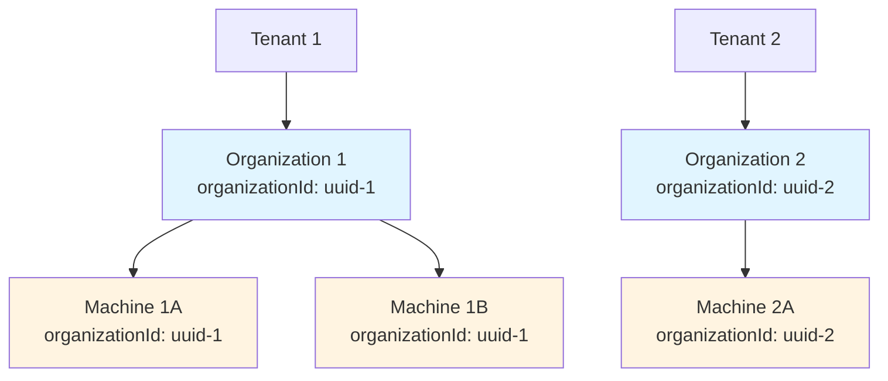

**Isolation Strategy**:
1. Each tenant has one or more Organizations
2. Organizations have unique `organizationId` (UUID)
3. Machines reference `organizationId` for data isolation
4. Queries filter by `organizationId` to enforce tenant boundaries

---

## Soft Delete Pattern

### Organization Soft Delete

Organizations support soft deletion to preserve historical data:

```java
@Indexed
@Builder.Default
private Boolean deleted = false;

private Instant deletedAt;

public boolean isDeleted() {
    return Boolean.TRUE.equals(deleted);
}
```

**Soft Delete Process**:

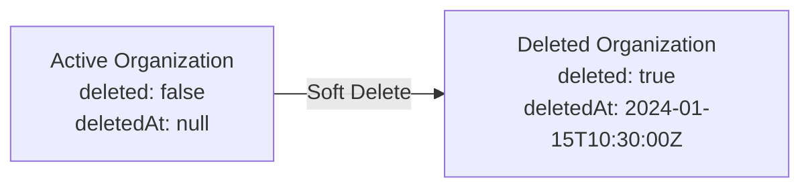

**Query Filtering**:

```java
// Exclude deleted organizations
Query query = new Query(Criteria.where("deleted").ne(true));

// Include only deleted organizations
Query query = new Query(Criteria.where("deleted").is(true));
```

---

## Security & Compliance Tracking

### Machine Security State

Machines track comprehensive security and compliance information:

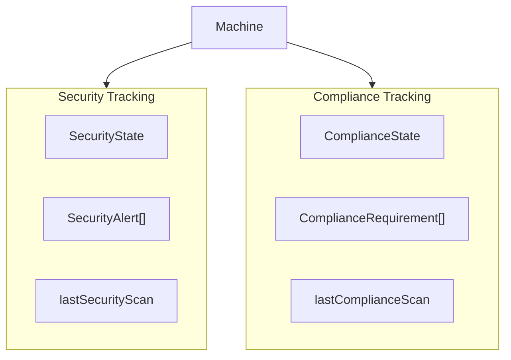

**Security Fields**:
- `securityState`: Overall security posture
- `securityAlerts`: Active security alerts
- `lastSecurityScan`: Last security scan timestamp

**Compliance Fields**:
- `complianceState`: Compliance status
- `complianceRequirements`: Required compliance rules
- `lastComplianceScan`: Last compliance check timestamp

---

## Integration Points

### Service Dependencies

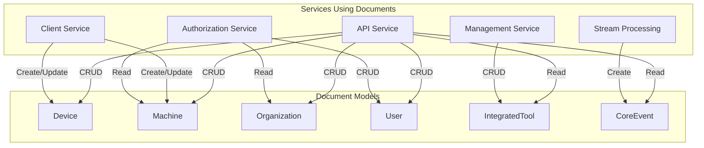

### Repository Layer

Documents are accessed through repositories defined in [data_layer_mongo_repositories](data_layer_mongo_repositories.md):

- `BaseUserRepository` - User CRUD operations
- `BaseTenantRepository` - Organization CRUD operations
- Custom repositories for Device, Machine, Tool, Event

---

## Configuration Requirements

### MongoDB Configuration

Documents require MongoDB configuration from [data_layer_mongo_configuration](data_layer_mongo_configuration.md):

```java
@EnableMongoRepositories(basePackages = "com.openframe.data.repository")
@EnableMongoAuditing  // Required for @CreatedDate, @LastModifiedDate
public class MongoConfig {
    // Configuration details in data_layer_mongo_configuration.md
}
```

### Required Features

1. **Auditing**: Enable `@EnableMongoAuditing` for timestamp management
2. **Repositories**: Enable `@EnableMongoRepositories` for repository scanning
3. **Indexes**: Ensure indexes are created on application startup

---

## Best Practices

### 1. Document Design

✅ **DO**:
- Use `@Indexed` on frequently queried fields
- Implement soft delete for critical entities
- Use `@NotBlank` and `@NotNull` for required fields
- Normalize email addresses in setters
- Use `Instant` for timestamps (UTC)

❌ **DON'T**:
- Store sensitive credentials in plain text
- Create deeply nested documents (>3 levels)
- Use mutable date types (use `Instant` instead)
- Forget to index `organizationId` for multi-tenant queries

### 2. Multi-Tenancy

✅ **DO**:
- Always filter by `organizationId` in queries
- Validate organization access in service layer
- Use unique `organizationId` (UUID) for each tenant
- Index `organizationId` on all tenant-scoped documents

❌ **DON'T**:
- Allow cross-tenant data access
- Hard-code organization IDs
- Skip organization validation

### 3. Indexing

✅ **DO**:
- Create compound indexes for common query patterns
- Monitor index usage with MongoDB profiler
- Use unique indexes for natural keys (`organizationId`, `email`)
- Index soft-delete flags (`deleted`)

❌ **DON'T**:
- Over-index (impacts write performance)
- Create redundant indexes
- Forget to index foreign key fields

### 4. Validation

✅ **DO**:
- Use Bean Validation annotations (`@NotBlank`, `@NotNull`)
- Implement custom validation in setters (e.g., email normalization)
- Validate business rules in service layer
- Use enums for fixed value sets (`EventStatus`, `DeviceType`)

❌ **DON'T**:
- Rely solely on database constraints
- Skip input validation
- Allow invalid state transitions

---

## Common Patterns

### 1. Email Normalization

```java
public void setEmail(String email) {
    this.email = email == null ? null : email.trim().toLowerCase(Locale.ROOT);
}
```

**Benefits**:
- Consistent email storage
- Case-insensitive lookups
- Prevents duplicate accounts with different casing

### 2. Soft Delete Check

```java
public boolean isDeleted() {
    return Boolean.TRUE.equals(deleted);
}
```

**Benefits**:
- Null-safe deletion check
- Explicit boolean comparison
- Prevents NPE on null values

### 3. Contract Validation

```java
public boolean isContractActive() {
    LocalDate now = LocalDate.now();
    return contractStartDate != null 
        && contractEndDate != null
        && !now.isBefore(contractStartDate) 
        && !now.isAfter(contractEndDate);
}
```

**Benefits**:
- Business logic encapsulation
- Reusable validation
- Clear contract status determination

---

## Migration Considerations

### Schema Evolution

When evolving document schemas:

1. **Add Optional Fields**: New fields should be nullable or have defaults
2. **Deprecate Gracefully**: Mark old fields as `@Deprecated` before removal
3. **Data Migration**: Use MongoDB migration scripts for data transformation
4. **Backward Compatibility**: Ensure old documents can be read with new schema

### Example Migration

```java
// Old schema
private String status;  // String-based status

// New schema
@Indexed
private DeviceStatus status;  // Enum-based status

// Migration script (MongoDB)
db.machines.updateMany(
    { status: "ACTIVE" },
    { $set: { status: "ACTIVE" } }  // Convert to enum value
)
```

---

## Monitoring & Observability

### Key Metrics

Monitor these document-level metrics:

1. **Document Counts**:
   - Total machines per organization
   - Active vs. inactive devices
   - Deleted organizations

2. **Query Performance**:
   - Index hit ratio
   - Slow query logs
   - Query execution time

3. **Data Growth**:
   - Document size trends
   - Collection growth rate
   - Index size

### Health Checks

```java
// Example health check
public boolean isDatabaseHealthy() {
    long machineCount = machineRepository.count();
    long orgCount = organizationRepository.count();
    return machineCount >= 0 && orgCount >= 0;
}
```

---

## Troubleshooting

### Common Issues

#### Issue 1: Duplicate Email Addresses

**Symptom**: Multiple users with same email (different casing)

**Solution**: Ensure email normalization in setter:

```java
public void setEmail(String email) {
    this.email = email == null ? null : email.trim().toLowerCase(Locale.ROOT);
}
```

#### Issue 2: Slow Organization Queries

**Symptom**: Slow queries filtering by `organizationId`

**Solution**: Create index on `organizationId`:

```javascript
db.machines.createIndex({ organizationId: 1 })
```

#### Issue 3: Deleted Organizations Appearing in Results

**Symptom**: Soft-deleted organizations returned in queries

**Solution**: Filter by `deleted` flag:

```java
Query query = new Query(Criteria.where("deleted").ne(true));
```

#### Issue 4: Missing Timestamps

**Symptom**: `createdAt` or `updatedAt` fields are null

**Solution**: Enable MongoDB auditing:

```java
@EnableMongoAuditing
public class MongoConfig {
    // Configuration
}
```

---

## Related Documentation

- [data_layer_mongo](data_layer_mongo.md) - Parent module overview
- [data_layer_mongo_configuration](data_layer_mongo_configuration.md) - MongoDB configuration
- [data_layer_mongo_repositories](data_layer_mongo_repositories.md) - Repository layer
- [api_service](api_service.md) - REST API using these documents
- [client_service](client_service.md) - Client agent registration
- [authorization_service](authorization_service.md) - Authentication and authorization
- [management_service](management_service.md) - Tool management

---

## Additional Resources

### MongoDB Documentation
- [MongoDB Manual](https://docs.mongodb.com/manual/)
- [Spring Data MongoDB Reference](https://docs.spring.io/spring-data/mongodb/docs/current/reference/html/)
- [MongoDB Indexing Best Practices](https://docs.mongodb.com/manual/indexes/)

### OpenFrame Resources
- **Community**: [OpenMSP Slack](https://www.openmsp.ai/)
- **Platform**: [Flamingo](https://flamingo.run)
- **OpenFrame**: [OpenFrame.ai](https://openframe.ai)

---

**Questions or Issues?**  
Join our community on [OpenMSP Slack](https://join.slack.com/t/openmsp/shared_invite/zt-36bl7mx0h-3~U2nFH6nqHqoTPXMaHEHA) for support and discussions.
