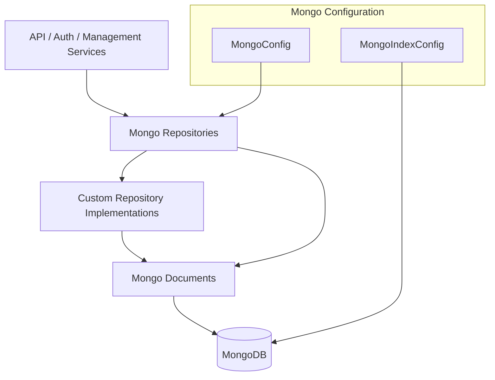
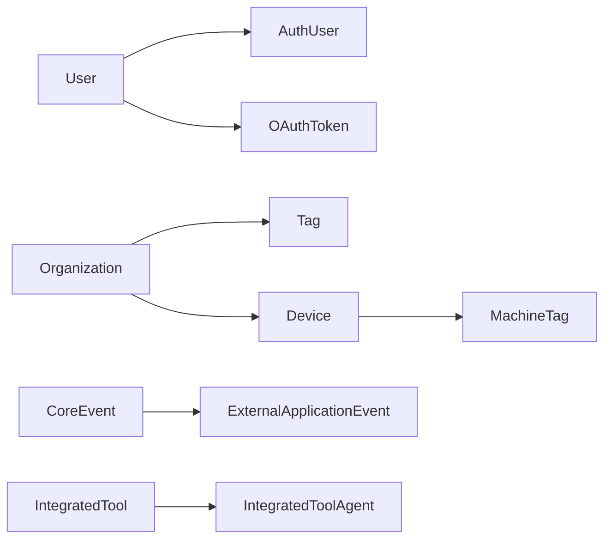
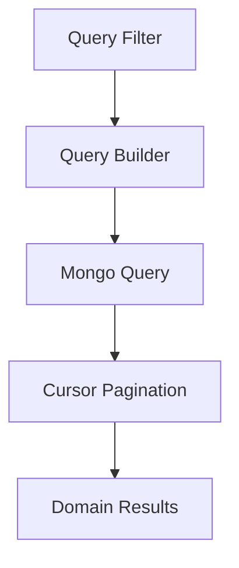

# Data Layer – Mongo Documents and Repositories

This module provides the **MongoDB-backed persistence layer** for OpenFrame. It defines:

- MongoDB configuration and index management
- Domain documents mapped to Mongo collections
- Blocking and reactive repositories
- Custom repository implementations for filtering, searching, and cursor-based pagination

It is consumed by API services, authorization services, management services, and stream processors that require durable, queryable state.

---

## Purpose and Responsibilities

The `data_layer_mongo_documents_and_repos` module is responsible for:

- Defining **canonical MongoDB document schemas** for core domains (users, organizations, devices, events, OAuth, tools)
- Providing **Spring Data repositories** (blocking and reactive)
- Encapsulating **complex MongoDB queries** in custom repositories
- Enforcing **indexes and constraints** at the database level
- Supporting **multi-tenant and SSO-aware persistence**

This module intentionally contains **no business logic**. It is a pure data-access layer.

---

## Architecture Overview

---

## Configuration Layer

### MongoConfig

**Core components**:
- `MongoConfig`
- `MongoConfiguration`
- `ReactiveMongoConfiguration`

Responsibilities:

- Enables Mongo repositories when `spring.data.mongodb.enabled=true`
- Registers a custom `MappingMongoConverter`
- Supports both **servlet (blocking)** and **reactive** applications
- Replaces dots in map keys with `__dot__` to ensure MongoDB compatibility

This configuration is automatically activated by Spring Boot auto-configuration.

---

### MongoIndexConfig

**Core component**:
- `MongoIndexConfig`

Responsibilities:

- Creates indexes at application startup
- Optimizes high-volume event queries

Defined indexes:

- `application_events(userId ASC, timestamp DESC)`
- `application_events(type ASC, metadata.tags ASC)`

These indexes are critical for analytics, audit logs, and filtering performance.

---

## Document Model Overview

The module defines MongoDB documents grouped by domain.

---

## Core Domain Documents

### User and Authentication Documents

#### User

Represents a platform user.

Key characteristics:

- Email normalized to lowercase
- Role-based authorization
- Status-based lifecycle (`ACTIVE`, etc.)
- Audited with creation and modification timestamps

Used by:
- API services
- Authorization server
- Management services

---

#### AuthUser

Extends `User` for **multi-tenant authentication**.

Additional fields:

- `tenantId` (compound indexed with email)
- Password hash (for local auth)
- External provider identifiers
- Last login timestamp

Supports:
- Domain-based tenancy
- Local and SSO authentication models

---

### Organization Documents

#### Organization

Represents a customer organization.

Key features:

- Immutable `organizationId`
- Soft-delete support
- Contract lifecycle tracking
- Business metadata (employees, revenue, category)

Frequently queried using filtering and cursor pagination.

---

#### OrganizationQueryFilter

Encapsulates organization filtering criteria:

- Category
- Employee count range
- Active contract status

Used exclusively by custom repositories to build MongoDB queries.

---

### Device and Tagging Documents

#### Device

Represents a managed endpoint.

Fields include:

- Hardware identifiers
- Operating system details
- Health and configuration state
- Last check-in timestamp

---

#### MachineTag

Joins machines and tags.

Characteristics:

- Enforced uniqueness on `(machineId, tagId)`
- Tracks tagging metadata (who, when)

---

#### Tag

Defines organizationally-scoped tags.

Used for:

- Device grouping
- Filtering and automation

---

### Event Documents

#### CoreEvent

Represents an internal system event.

Fields:

- Event type
- Payload (serialized)
- Status lifecycle (`CREATED`, `PROCESSING`, etc.)

---

#### ExternalApplicationEvent

Stores events originating from external systems.

Includes:

- Source metadata
- Versioning
- Arbitrary tag maps

Optimized for querying by type and tags.

---

#### EventQueryFilter

Encapsulates event query constraints:

- User IDs
- Event types
- Date ranges

Used by analytics and audit APIs.

---

### OAuth and SSO Documents

#### MongoRegisteredClient

Mongo-backed OAuth client definition.

Supports:

- PKCE enforcement
- Token TTL configuration
- Consent and scope management

Consumed by the authorization server.

---

#### OAuthToken

Stores issued OAuth tokens.

Includes:

- Access and refresh tokens
- Expiration timestamps
- Client association

---

#### SSOPerTenantConfig

Tenant-scoped SSO configuration.

Extends base SSO configuration with:

- Tenant linkage
- Audited timestamps

---

### Tool and Agent Documents

#### IntegratedToolAgent

Defines how an agent for an integrated tool is installed and executed.

Includes:

- Versioning rules
- Download assets
- Command arguments
- Update permissions

---

#### ToolAgentAsset and LocalFilenameConfiguration

Describe downloadable artifacts and platform-specific filenames.

Used by:
- Agent installers
- Tool lifecycle management

---

## Repository Layer

### Base Repository Interfaces

The module defines **technology-agnostic base interfaces** reused across blocking and reactive repositories:

- `BaseUserRepository`
- `BaseTenantRepository`
- `BaseApiKeyRepository`
- `BaseIntegratedToolRepository`

These abstractions ensure:

- Consistent method contracts
- Easy migration between reactive and non-reactive stacks

---

### Reactive Repositories

Reactive repositories are enabled only in reactive web applications.

Examples:

- `ReactiveUserRepository`
- `ReactiveOAuthClientRepository`

They return `Mono` or `Flux` types and are used by:

- Gateway services
- Reactive authorization flows

---

### Blocking Repositories

Blocking repositories extend `MongoRepository` and are used by:

- API services
- Management services
- Authorization server

Examples:

- `TenantRepository`
- `OAuthTokenRepository`
- `ExternalApplicationEventRepository`

---

## Custom Repository Implementations

Custom repositories encapsulate **complex MongoDB queries** that cannot be expressed via method naming.

### Notable Implementations

- `CustomOrganizationRepositoryImpl`
- `CustomEventRepositoryImpl`
- `CustomMachineRepositoryImpl`
- `CustomIntegratedToolRepositoryImpl`

Common features:

- Cursor-based pagination using ObjectId
- Search with regex
- Sort field validation
- Database-level filtering for performance

---

## Integration with Other Modules

This module is consumed by:

- API service (REST and GraphQL)
- Authorization server (OAuth, SSO)
- Management service (initializers, schedulers)
- Stream service (event persistence and enrichment)

It also complements:

- `data_layer_redis_cache` for ephemeral state
- `data_layer_kafka_shared` for event streaming
- `data_layer_cassandra_pinot_and_shared_models` for analytics

---

## Design Principles

- **Separation of concerns**: no business logic
- **Schema-first**: documents define canonical data shapes
- **Performance-aware**: indexes and custom queries
- **Reactive-ready**: dual repository model
- **Multi-tenant by design**

---

## Summary

The `data_layer_mongo_documents_and_repos` module is the **foundation of OpenFrame persistence**. It provides a clean, optimized, and extensible MongoDB abstraction layer that enables higher-level services to focus on orchestration, workflows, and user-facing functionality without leaking database complexity.
