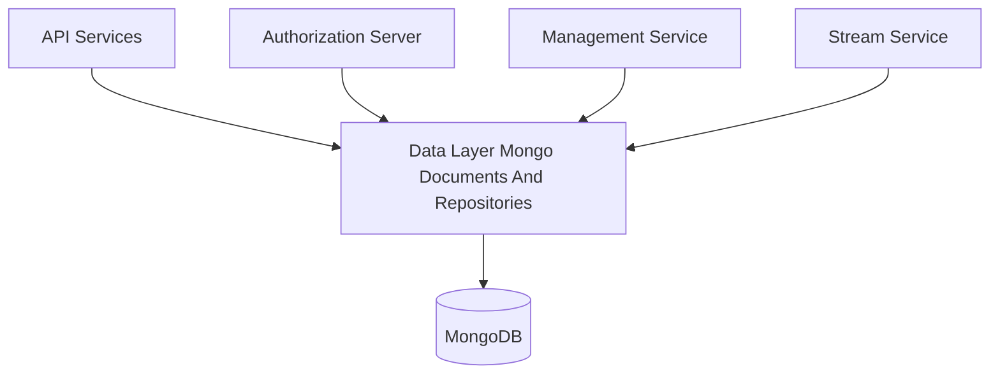
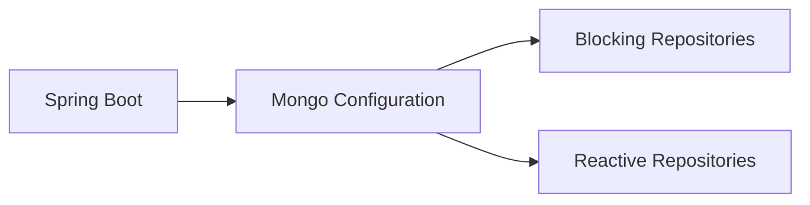
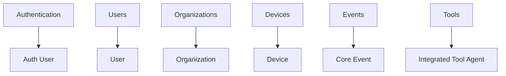
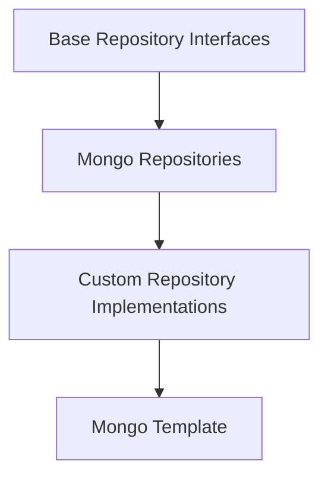
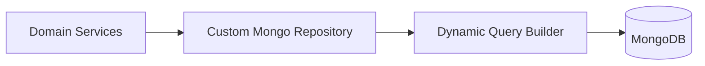

# Data Layer Mongo Documents And Repositories

## Overview

The **Data Layer Mongo Documents And Repositories** module provides the MongoDB-backed persistence foundation for the OpenFrame platform. It defines:

- MongoDB configuration for both blocking and reactive runtimes
- Strongly-typed Mongo documents representing core domain entities
- Repository abstractions and custom implementations for advanced querying
- Index definitions optimized for high-volume, multi-tenant workloads

This module is consumed by API services, authorization services, management services, and stream processors as the primary source of truth for operational and configuration data.

---

## Responsibilities

- Configure MongoDB serialization, auditing, and repository scanning
- Define document schemas for authentication, users, organizations, devices, tools, events, and OAuth
- Provide reusable repository interfaces shared across servlet and reactive stacks
- Implement custom Mongo queries (filtering, search, cursor-based pagination)
- Enforce indexing strategies for performance and data integrity

---

## Position in the System Architecture

The Data Layer Mongo Documents And Repositories module sits at the persistence layer and is shared across multiple services.

---

## Configuration Layer

### Mongo Configuration

Mongo configuration is split to support both servlet-based and reactive applications.

- **Mongo Configuration**
  - Enabled conditionally via `spring.data.mongodb.enabled`
  - Enables Mongo repositories and auditing
  - Customizes `MappingMongoConverter` to:
    - Support custom conversions
    - Replace dots in map keys with `__dot__`

- **Reactive Mongo Configuration**
  - Activated only for reactive web applications
  - Enables reactive Mongo repositories

### Mongo Index Configuration

Indexes are created at application startup to guarantee query performance.

Examples:
- Compound index on application events for `(userId, timestamp)`
- Tag-based indexes for fast event filtering

This approach ensures indexes are always present without manual database setup.

---

## Document Model Overview

Documents are grouped by domain responsibility.

### Authentication and Users

- **User**
  - Base user document
  - Email normalization and auditing fields

- **Auth User**
  - Extends User with tenant-aware authentication data
  - Supports local and external identity providers
  - Enforced uniqueness on `(tenantId, email)`

### Organizations

- **Organization**
  - Represents a customer or business entity
  - Supports soft deletes and contract lifecycle
  - Optimized for filtering by category, size, and contract state

- **Contact Person**
  - Embedded document for organization contacts

### Devices and Tags

- **Device**
  - Physical or virtual machine representation
  - Health, configuration, and lifecycle state

- **Machine Tag**
  - Many-to-many association between machines and tags
  - Enforced uniqueness via compound indexes

- **Alerts and Security Alerts**
  - Embedded documents describing device issues and security findings

### Events

- **Core Event**
  - Internal platform events with lifecycle status

- **External Application Event**
  - Events ingested from third-party systems
  - Flexible metadata and tagging model

- **Event Query Filter**
  - Portable filter object used by custom repositories

### OAuth and SSO

- **Mongo Registered Client**
  - OAuth client configuration stored in MongoDB

- **OAuth Token**
  - Access and refresh token persistence

- **SSO Per Tenant Config**
  - Tenant-scoped SSO configuration
  - Extends shared SSO settings

### Tools and Agents

- **Tag**
  - Organization-scoped tagging for tools and devices

- **Integrated Tool Agent**
  - Describes deployable agents and versions
  - Supports assets, downloads, and lifecycle controls

- **Tool Agent Asset** and **Local Filename Configuration**
  - Define how binaries are distributed and executed

---

## Repository Architecture

Repositories are split into base interfaces and Mongo-specific implementations.

### Base Repository Interfaces

These interfaces define contracts shared between blocking and reactive implementations:

- Base User Repository
- Base Tenant Repository
- Base API Key Repository
- Base Integrated Tool Repository

This abstraction allows consistent service logic regardless of execution model.

### Standard Mongo Repositories

- OAuth Token Repository
- External Application Event Repository
- Tenant Repository

These rely on Spring Data Mongo auto-generated queries.

### Custom Repository Implementations

Custom implementations use `MongoTemplate` to support:

- Dynamic filtering
- Full-text search via regex
- Cursor-based pagination using ObjectId
- Safe sortable field validation

Key implementations:

- Custom Organization Repository
- Custom Event Repository
- Custom Integrated Tool Repository
- Custom Machine Repository

---

## Reactive Support

Reactive repositories are provided for non-blocking services:

- Reactive User Repository
- Reactive OAuth Client Repository

These repositories:
- Mirror blocking repository behavior
- Implement the same base interfaces
- Enable seamless use with WebFlux-based services

---

## Performance and Data Integrity

This module enforces best practices for MongoDB usage:

- Compound and unique indexes for tenant safety
- Cursor-based pagination for large datasets
- Server-side filtering to reduce memory pressure
- Soft-delete patterns for auditability

---

## Summary

The **Data Layer Mongo Documents And Repositories** module is the backbone of OpenFrame persistence. By combining clear document models, shared repository contracts, and optimized MongoDB querying, it enables scalable, multi-tenant data access across the entire platform while remaining flexible enough to support both blocking and reactive services.
