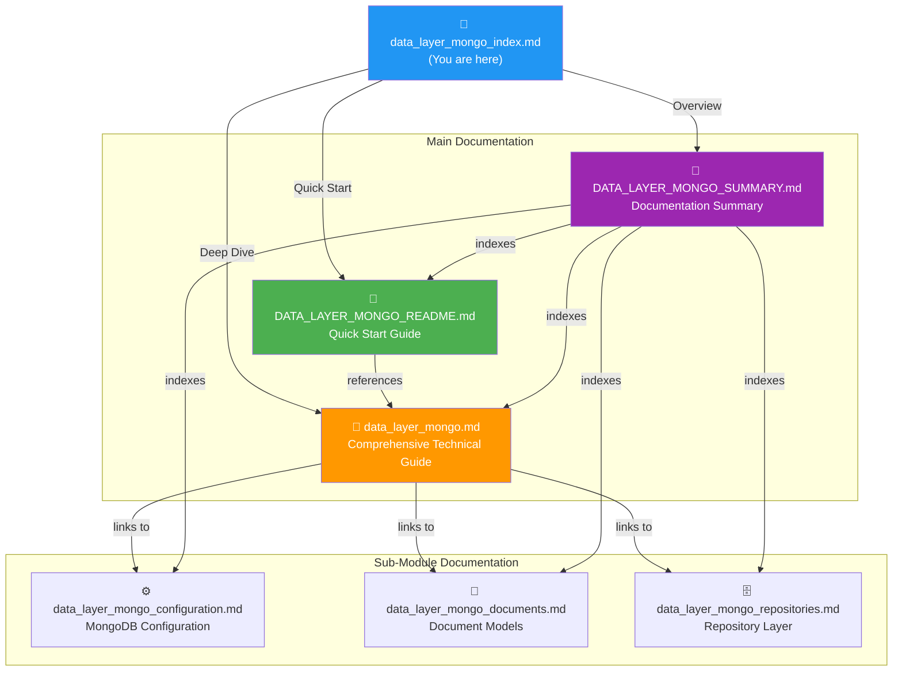
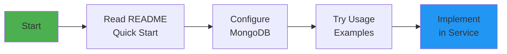
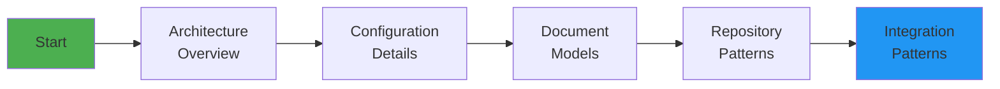
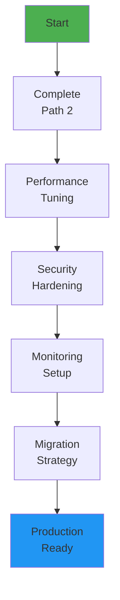

# Data Layer MongoDB - Documentation Index

## 📚 Complete Documentation Guide

Welcome to the **data_layer_mongo** module documentation. This index provides a comprehensive overview of all available documentation and helps you navigate to the right resource based on your needs.

---

## 🎯 Choose Your Path

### 🚀 I want to get started quickly
**→ Start here**: [DATA_LAYER_MONGO_README.md](./DATA_LAYER_MONGO_README.md)

Perfect for developers who want to:
- Set up MongoDB quickly
- See working code examples
- Understand basic usage patterns
- Get up and running in 30 minutes

### 🏗️ I need to understand the architecture
**→ Start here**: [data_layer_mongo.md](./data_layer_mongo.md)

Ideal for architects and senior developers who need:
- Complete system architecture
- Integration patterns
- Performance considerations
- Security best practices
- Migration strategies

### 📖 I need a quick reference
**→ Start here**: [DATA_LAYER_MONGO_SUMMARY.md](./DATA_LAYER_MONGO_SUMMARY.md)

Best for experienced developers who want:
- Quick navigation to specific topics
- Documentation structure overview
- Learning path recommendations
- Quick reference guide

---

## 📁 Documentation Structure



---

## 📖 Documentation Files

### Main Documentation

| File | Purpose | Length | Audience |
|------|---------|--------|----------|
| **[DATA_LAYER_MONGO_README.md](./DATA_LAYER_MONGO_README.md)** | Quick start guide with examples | ~800 lines | All developers |
| **[data_layer_mongo.md](./data_layer_mongo.md)** | Comprehensive technical documentation | ~600 lines | Architects, Senior Devs |
| **[DATA_LAYER_MONGO_SUMMARY.md](./DATA_LAYER_MONGO_SUMMARY.md)** | Documentation overview and navigation | ~400 lines | All users |

### Sub-Module Documentation

| File | Focus | Length | Topics Covered |
|------|-------|--------|----------------|
| **[data_layer_mongo_configuration.md](./data_layer_mongo_configuration.md)** | MongoDB setup and configuration | ~1200 lines | MongoConfig, Blocking/Reactive modes, Auditing, Converters |
| **[data_layer_mongo_documents.md](./data_layer_mongo_documents.md)** | Document model schemas | ~1000 lines | User, Organization, Machine, Device, Tool, Event |
| **[data_layer_mongo_repositories.md](./data_layer_mongo_repositories.md)** | Data access layer | ~900 lines | Base interfaces, Blocking/Reactive repositories, Custom queries |

---

## 🎓 Learning Paths

### Path 1: Quick Implementation (30-60 minutes)

Perfect for developers who need to implement basic MongoDB operations quickly.



**Steps**:
1. 📘 Read [Quick Start](./DATA_LAYER_MONGO_README.md#quick-start) (10 min)
2. ⚙️ [Configure MongoDB](./DATA_LAYER_MONGO_README.md#configuration) (10 min)
3. 💡 Review [Usage Examples](./DATA_LAYER_MONGO_README.md#usage-examples) (20 min)
4. 🚀 Implement in your service (30 min)

### Path 2: Complete Understanding (2-4 hours)

For developers and architects who need comprehensive knowledge.



**Steps**:
1. 🏗️ [Architecture Overview](./data_layer_mongo.md#architecture-overview) (30 min)
2. ⚙️ [Configuration Deep Dive](./data_layer_mongo_configuration.md) (45 min)
3. 📄 [Document Models](./data_layer_mongo_documents.md) (60 min)
4. 🗄️ [Repository Layer](./data_layer_mongo_repositories.md) (45 min)
5. 🔗 [Integration Patterns](./data_layer_mongo.md#integration-with-other-modules) (30 min)

### Path 3: Production Deployment (4-8 hours)

For teams preparing for production deployment.



**Steps**:
1. ✅ Complete Path 2 (4 hours)
2. ⚡ [Performance Optimization](./data_layer_mongo.md#performance-considerations) (60 min)
3. 🔒 [Security Best Practices](./data_layer_mongo.md#security-considerations) (60 min)
4. 📊 [Monitoring Setup](./data_layer_mongo.md#monitoring-and-observability) (45 min)
5. 🔄 [Migration Planning](./data_layer_mongo.md#migration-and-evolution) (45 min)
6. 🐛 [Troubleshooting Guide](./data_layer_mongo.md#troubleshooting) (30 min)

---

## 🔍 Find Documentation By Topic

### Configuration & Setup

| Topic | Documentation | Section |
|-------|---------------|---------|
| MongoDB connection setup | [README](./DATA_LAYER_MONGO_README.md#configuration) | Configuration |
| Blocking vs Reactive | [Configuration](./data_layer_mongo_configuration.md#configuration-modes) | Configuration Modes |
| Auditing setup | [Configuration](./data_layer_mongo_configuration.md#auditing-configuration) | Key Features |
| Custom converters | [Configuration](./data_layer_mongo_configuration.md#custom-converters) | Core Components |
| Conditional activation | [Main Guide](./data_layer_mongo.md#configuration) | Configuration |

### Data Models

| Topic | Documentation | Section |
|-------|---------------|---------|
| User document | [Documents](./data_layer_mongo_documents.md#user-document) | Core Documents |
| Organization (multi-tenancy) | [Documents](./data_layer_mongo_documents.md#organization-document) | Core Documents |
| Machine inventory | [Documents](./data_layer_mongo_documents.md#machine-document) | Core Documents |
| Device management | [Documents](./data_layer_mongo_documents.md#device-document) | Core Documents |
| Tool integrations | [Documents](./data_layer_mongo_documents.md#integratedtool-document) | Core Documents |
| Event sourcing | [Documents](./data_layer_mongo_documents.md#coreevent-document) | Core Documents |

### Repository Patterns

| Topic | Documentation | Section |
|-------|---------------|---------|
| Base repository interfaces | [Repositories](./data_layer_mongo_repositories.md#base-repository-interfaces) | Architecture |
| Blocking repositories | [Repositories](./data_layer_mongo_repositories.md#blocking-repositories) | Implementation |
| Reactive repositories | [Repositories](./data_layer_mongo_repositories.md#reactive-repositories) | Implementation |
| Custom queries | [Repositories](./data_layer_mongo_repositories.md#custom-query-methods) | Advanced Usage |
| Multi-tenant queries | [Main Guide](./data_layer_mongo.md#multi-tenancy-support) | Key Features |

### Integration & Usage

| Topic | Documentation | Section |
|-------|---------------|---------|
| Service integration | [Main Guide](./data_layer_mongo.md#integration-with-other-modules) | Integration |
| Usage examples | [README](./DATA_LAYER_MONGO_README.md#usage-examples) | Usage Examples |
| Best practices | [README](./DATA_LAYER_MONGO_README.md#best-practices) | Best Practices |
| Code patterns | [Documents](./data_layer_mongo_documents.md#usage-patterns) | Usage Patterns |

### Operations & Maintenance

| Topic | Documentation | Section |
|-------|---------------|---------|
| Performance tuning | [Main Guide](./data_layer_mongo.md#performance-considerations) | Performance |
| Security hardening | [Main Guide](./data_layer_mongo.md#security-considerations) | Security |
| Monitoring setup | [Main Guide](./data_layer_mongo.md#monitoring-and-observability) | Monitoring |
| Troubleshooting | [README](./DATA_LAYER_MONGO_README.md#troubleshooting) | Troubleshooting |
| Migration strategies | [Main Guide](./data_layer_mongo.md#migration-and-evolution) | Migration |

---

## 🎯 Quick Reference

### Essential Code Snippets

#### Configuration
```yaml
spring:
  data:
    mongodb:
      enabled: true
      uri: mongodb://localhost:27017/openframe
      database: openframe
```

**Documentation**: [Configuration Guide](./data_layer_mongo_configuration.md#configuration-properties)

#### Repository Usage
```java
@Autowired
private UserRepository userRepository;

Optional<User> user = userRepository.findByEmail("user@example.com");
```

**Documentation**: [Usage Examples](./DATA_LAYER_MONGO_README.md#usage-examples)

#### Document Creation
```java
User user = User.builder()
    .email("user@example.com")
    .firstName("John")
    .lastName("Doe")
    .status(UserStatus.ACTIVE)
    .build();
```

**Documentation**: [Document Models](./data_layer_mongo_documents.md#user-document)

---

## 🔗 Related Documentation

### Other Data Layer Modules

- **[data_layer_kafka](./data_layer_kafka.md)** - Kafka event streaming and CDC
- **[data_layer_core](./data_layer_core.md)** - Cassandra and Pinot analytics

### Services Using This Module

- **[api_service](./api_service.md)** - REST and GraphQL API
- **[authorization_service](./authorization_service.md)** - OAuth2 authentication
- **[management_service](./management_service.md)** - Tool and CDC management
- **[client_service](./client_service.md)** - Device registration and tracking

---

## 📊 Documentation Statistics

| Metric | Value |
|--------|-------|
| Total Documentation Files | 6 |
| Total Lines of Documentation | ~5,000 |
| Code Examples | 100+ |
| Mermaid Diagrams | 30+ |
| Cross-References | 50+ |

---

## 🤝 Contributing to Documentation

### Found an Issue?

1. Check existing documentation for answers
2. Search the [OpenMSP Slack community](https://join.slack.com/t/openmsp/shared_invite/zt-36bl7mx0h-3~U2nFH6nqHqoTPXMaHEHA)
3. Report issues or suggest improvements on Slack

### Want to Improve Documentation?

1. Join the [OpenMSP Slack community](https://join.slack.com/t/openmsp/shared_invite/zt-36bl7mx0h-3~U2nFH6nqHqoTPXMaHEHA)
2. Discuss your proposed changes
3. Follow the documentation style guide
4. Submit your improvements

---

## 📞 Support & Community

### Get Help

- **Slack Community**: [OpenMSP Slack](https://join.slack.com/t/openmsp/shared_invite/zt-36bl7mx0h-3~U2nFH6nqHqoTPXMaHEHA)
- **OpenFrame Website**: [https://openframe.ai](https://openframe.ai)
- **Flamingo Platform**: [https://flamingo.run](https://flamingo.run)

### External Resources

- [Spring Data MongoDB Docs](https://docs.spring.io/spring-data/mongodb/docs/current/reference/html/)
- [MongoDB Best Practices](https://www.mongodb.com/docs/manual/administration/production-notes/)
- [Reactive Programming Guide](https://projectreactor.io/docs/core/release/reference/)

---

## 🗺️ Documentation Roadmap

### Current Version: 1.0

**Completed**:
- ✅ Main documentation files
- ✅ Sub-module documentation
- ✅ Quick start guide
- ✅ Architecture diagrams
- ✅ Code examples
- ✅ Best practices

**Planned**:
- 📋 Video tutorials
- 📋 Interactive examples
- 📋 Performance benchmarks
- 📋 Migration guides from other databases

---

## 📝 Document Versions

| Document | Version | Last Updated |
|----------|---------|--------------|
| DATA_LAYER_MONGO_README.md | 1.0 | 2024 |
| data_layer_mongo.md | 1.0 | 2024 |
| DATA_LAYER_MONGO_SUMMARY.md | 1.0 | 2024 |
| data_layer_mongo_configuration.md | 1.0 | 2024 |
| data_layer_mongo_documents.md | 1.0 | 2024 |
| data_layer_mongo_repositories.md | 1.0 | 2024 |

---

**Happy Learning! 📚**

Built with ❤️ by the Flamingo team | [OpenFrame](https://openframe.ai) | [Flamingo](https://flamingo.run)
