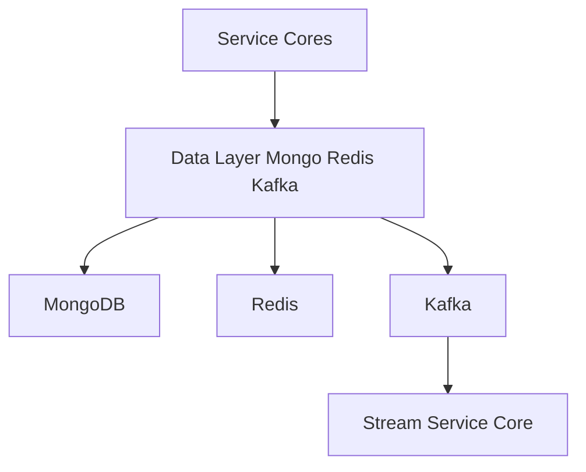
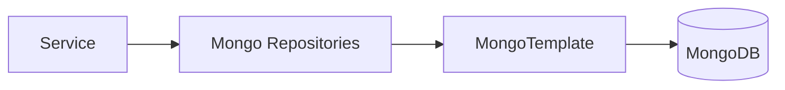
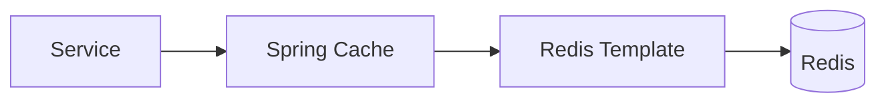
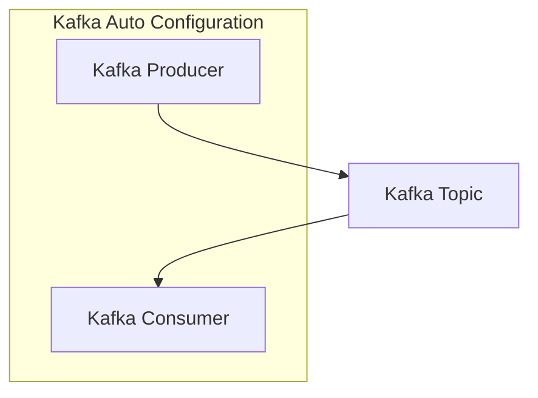

# Data Layer Mongo Redis Kafka

## Overview

The **Data Layer Mongo Redis Kafka** module provides the foundational persistence, caching, and streaming infrastructure for the OpenFrame platform. It standardizes how services interact with **MongoDB** for durable data storage, **Redis** for low-latency caching, and **Kafka** for event-driven and streaming workloads.

This module is intentionally framework-level: it does not implement business logic itself, but instead supplies **schemas, repositories, configurations, and message models** that are reused by higher-level services such as API Service Core, Authorization Service Core, Management Service Core, and Stream Service Core.

At a high level, the Data Layer Mongo Redis Kafka module:

- Defines **MongoDB documents and repositories** for core domain entities
- Configures **Kafka producers, consumers, topics, and message models** for streaming data
- Provides **Redis cache and template configuration** with tenant-aware keying
- Supports both **blocking and reactive** data access patterns

---

## Position in the Platform Architecture

The Data Layer Mongo Redis Kafka module sits beneath all service cores and acts as the shared data backbone.

**Key relationships:**

- API, Authorization, Management, Gateway, and Client services depend on Mongo repositories and Redis caching
- Stream Service Core consumes Kafka topics and Debezium-style change events
- Kafka acts as the bridge between operational data changes and analytics / stream processing

---

## Core Responsibilities

### 1. MongoDB Data Persistence

MongoDB is the system of record for:

- Users, authentication, and authorization data
- Organizations and tenants
- Devices, machines, tools, and agents
- Events and external application activity

The module provides:

- Strongly-typed **document models**
- **Indexes** and query optimization
- **Custom repositories** for cursor-based pagination and filtering
- Both **blocking** and **reactive** repository abstractions

### 2. Redis Caching

Redis is used for:

- Application-level caching via Spring Cache
- Low-latency lookup of frequently accessed data
- Tenant-aware cache isolation

The module ensures:

- Consistent serialization
- Safe defaults (TTL, null handling)
- Compatibility with both reactive and non-reactive stacks

### 3. Kafka Event Streaming

Kafka is used for:

- Domain events and change-data-capture pipelines
- Integration with Debezium
- Feeding the Stream Service Core and analytics systems

The module provides:

- Opinionated Kafka auto-configuration
- Topic definition and auto-creation
- Standardized message headers and payload models
- Error handling and recovery hooks

---

## MongoDB Layer

### Configuration

MongoDB configuration is split between blocking and reactive contexts:

- **MongoConfig** enables repositories and auditing
- **MongoIndexConfig** creates runtime indexes for frequently queried collections

Key behaviors:

- Dot replacement in map keys to avoid MongoDB limitations
- Conditional activation based on application type and properties

---

### Core Documents

Representative document categories include:

- **User and Auth**: User, AuthUser, OAuthToken, MongoRegisteredClient
- **Organization and Tenant**: Organization, SSOPerTenantConfig
- **Devices and Tools**: Device, MachineTag, Tag, IntegratedToolAgent, ToolAgentAsset
- **Events**: CoreEvent, ExternalApplicationEvent

These documents:

- Use indexed fields for performance
- Support soft deletes where applicable
- Are designed for multi-tenant usage

---

### Repositories and Query Extensions

The Data Layer Mongo Redis Kafka module defines a clear separation between:

- **Base repositories** (technology-agnostic interfaces)
- **Blocking Mongo repositories**
- **Reactive Mongo repositories**
- **Custom repository implementations** for advanced querying

Common features include:

- Cursor-based pagination using Mongo ObjectId
- Server-side filtering and sorting
- Safe handling of invalid cursors

This pattern allows service cores to switch between reactive and blocking execution models without duplicating query logic.

---

## Redis Layer

### Redis Configuration

Redis support is enabled conditionally and includes:

- **RedisConfig** for templates and repositories
- **CacheConfig** for Spring Cache integration

Key characteristics:

- Tenant-aware cache key prefixes
- JSON serialization for values
- String-based keys for predictability
- Default TTL of 6 hours

This ensures cached data is isolated per tenant and safe to share across services.

---

## Kafka Layer

### Kafka Configuration Model

Kafka is configured as a **dedicated OSS tenant cluster** using:

- **OssKafkaConfig** to disable default Spring Kafka auto-configuration
- **OssTenantKafkaProperties** as the single source of Kafka settings
- **KafkaTopicProperties** for declarative topic definitions

Topic configuration supports:

- Automatic creation
- Custom partitions and replication factors
- Explicit inbound topic registration

---

### Kafka Auto-Configuration

When enabled, the module automatically creates:

- ProducerFactory and KafkaTemplate
- ConsumerFactory and ListenerContainerFactory
- KafkaAdmin and NewTopics
- A standardized Kafka producer abstraction

This approach guarantees consistent Kafka behavior across all services.

---

### Message Models

The module defines shared message contracts, including:

- **DebeziumMessage** for CDC-style events
- **MachinePinotMessage** for machine and tag changes
- **KafkaHeader** constants for message metadata

These models ensure:

- Compatibility between producers and consumers
- Clear separation between before and after state
- Extensibility for analytics and enrichment pipelines

---

### Error Handling and Recovery

Kafka producer failures are handled via:

- **KafkaRecoveryHandlerImpl**

Current behavior:

- Logs structured error details
- Preserves payload context
- Provides an extension point for future dead-letter or retry strategies

---

## Interaction with Other Modules

The Data Layer Mongo Redis Kafka module is consumed by:

- API Service Core for CRUD operations and queries
- Authorization Service Core for OAuth and tenant data
- Management Service Core for lifecycle management and initialization
- Stream Service Core for Kafka consumption and enrichment

Rather than duplicating data logic, those modules build on the abstractions defined here.

---

## Design Principles

- **Single source of truth** for data schemas and repositories
- **Multi-tenant by design** across Mongo, Redis, and Kafka
- **Reactive-first compatibility** without forcing reactive usage
- **Operational safety** through indexing, cursor pagination, and conditional configuration

---

## Summary

The **Data Layer Mongo Redis Kafka** module is the backbone of the OpenFrame platform. It ensures that all services interact with data stores and streams in a consistent, scalable, and tenant-safe way. By centralizing persistence, caching, and messaging concerns, it enables higher-level services to focus on business logic while relying on a proven and reusable data foundation.