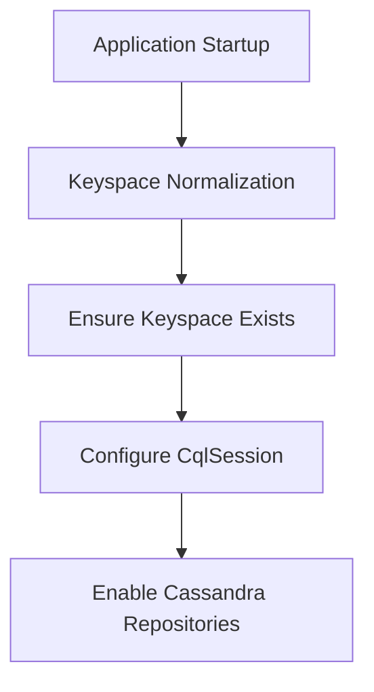
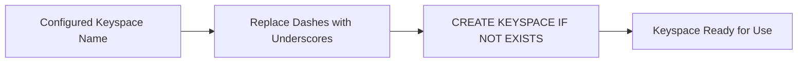
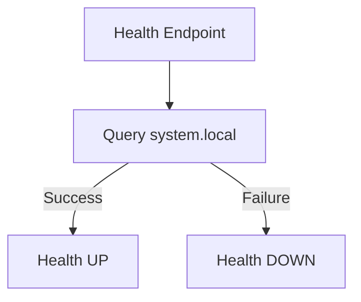

# Cassandra

## Overview

The **Cassandra** module provides Apache Cassandra integration for the OpenFrame data layer. It is responsible for:

- Bootstrapping and configuring Cassandra connectivity
- Normalizing tenant-specific keyspace names to Cassandra-safe formats
- Ensuring keyspaces exist before application startup
- Exposing health checks for operational monitoring

This module is part of the broader **data layer** and is designed to work alongside MongoDB, Redis, Kafka, and Pinot without overlapping responsibilities.

---

## Responsibilities and Scope

The Cassandra module focuses strictly on **infrastructure-level concerns**:

- Connection and session configuration via Spring Data Cassandra
- Automatic keyspace creation with configurable replication
- Safe handling of multi-tenant keyspace naming
- Runtime health verification for observability

It intentionally does **not**:

- Contain domain repositories or business logic
- Manage schema migrations beyond basic creation
- Handle query-level optimizations or data modeling

---

## Core Components

### CassandraConfig

**Purpose**: Central Spring configuration for Cassandra integration.

**Key responsibilities**:

- Enables Cassandra repositories under the data layer
- Creates and configures the `CqlSession` used by Spring Data
- Ensures the configured keyspace exists before connecting
- Applies driver-level options such as:
  - Local datacenter awareness
  - Contact points and port configuration
  - Server-side timestamp generation

**Key behaviors**:

- Activated only when Cassandra is explicitly enabled via configuration
- Uses `CREATE_IF_NOT_EXISTS` schema action to avoid destructive changes
- Logs detailed startup information for troubleshooting

---

### CassandraKeyspaceNormalizer

**Purpose**: Ensures Cassandra keyspace names are valid when derived from tenant identifiers.

**Problem addressed**:

- Cassandra keyspace names may only contain alphanumeric characters and underscores
- Tenant identifiers may include dashes

**Solution**:

- Intercepts application startup early
- Rewrites the configured keyspace name by replacing dashes with underscores
- Injects the normalized value back into the Spring environment

**Design notes**:

- Implemented as an `ApplicationContextInitializer`
- Runs after configuration properties are loaded, ensuring compatibility with centralized configuration services

---

### CassandraHealthIndicator

**Purpose**: Provides runtime health visibility for Cassandra.

**How it works**:

- Executes a lightweight query against Cassandra system metadata
- Reports:
  - **UP** when Cassandra is reachable and responsive
  - **DOWN** when connectivity or query execution fails

This health indicator integrates with Spring Boot Actuator and is used by service orchestration and monitoring systems.

---

## Configuration Flow

The following diagram illustrates how Cassandra is initialized during application startup:

---

## Keyspace Lifecycle

Keyspace management follows a safe, idempotent flow:

---

## Health Check Flow

---

## Integration Within the Platform

Within the OpenFrame platform:

- Cassandra serves as a **scalable, distributed storage option** for data sets that benefit from wide-column modeling
- It complements:
  - MongoDB for document-oriented storage
  - Redis for caching and ephemeral state
  - Kafka for streaming
  - Pinot for analytical queries

The Cassandra module is intentionally isolated so that services can enable or disable it independently based on deployment needs.

---

## Operational Considerations

- **Multi-tenancy**: Each tenant may map to a distinct keyspace, normalized automatically
- **Startup safety**: Keyspace creation is non-destructive and idempotent
- **Observability**: Health indicators provide immediate feedback on Cassandra availability
- **Configuration-driven**: All behavior is controlled through standard Spring configuration properties

---

## Summary

The **Cassandra** module provides a clean, reliable foundation for integrating Apache Cassandra into the OpenFrame ecosystem. By handling configuration, validation, and health monitoring centrally, it allows higher-level services to depend on Cassandra safely without embedding infrastructure concerns into business logic.