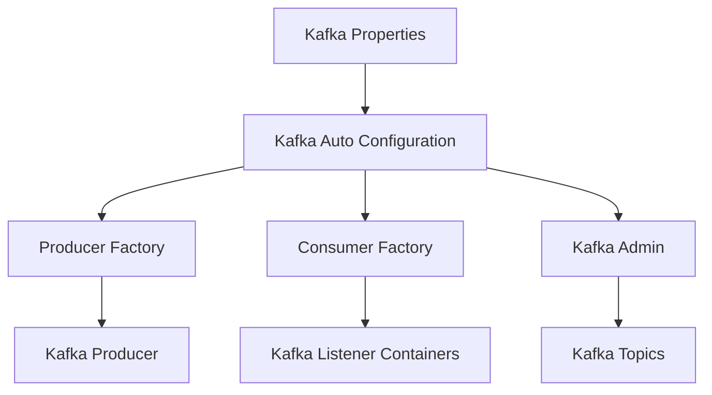
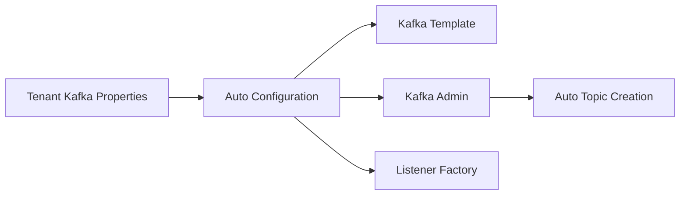
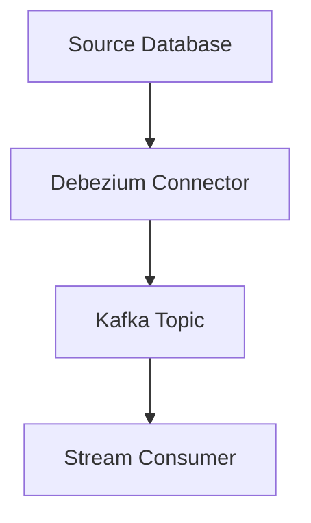
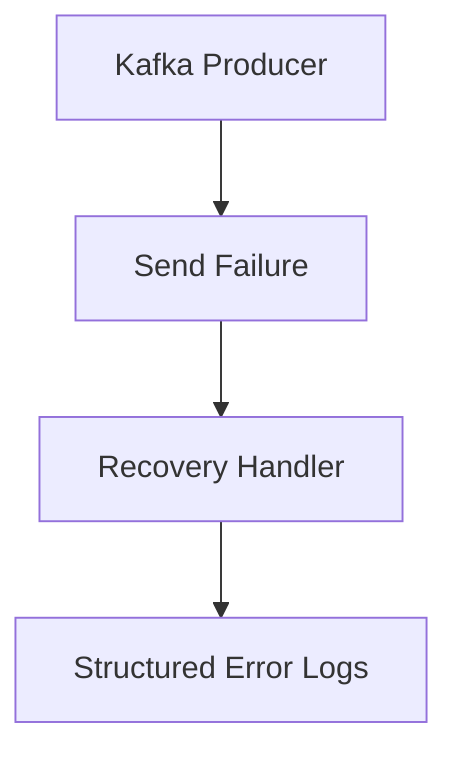

# Kafka

## Overview

Kafka is the event streaming backbone of the OpenFrame data layer. It provides a standardized, multi-tenant–aware Kafka configuration used across the platform to publish, consume, and administrate event streams. This module is responsible for:

- Centralized Kafka configuration for the OSS tenant cluster
- Declarative topic definition and optional auto-creation
- Consistent producer and consumer setup
- Standardized message models for downstream analytics and streaming pipelines
- Failure visibility and recovery hooks for Kafka producers

Kafka is primarily consumed by stream-processing services, data enrichment pipelines, and change-data-capture (CDC) workflows (for example, Debezium-based connectors).

---

## Responsibilities

The Kafka module focuses on infrastructure and contracts rather than business logic. Its responsibilities include:

- **Cluster Configuration**: Define and enable a dedicated OSS tenant Kafka cluster
- **Topic Management**: Declare inbound topics with partitions and replication factors
- **Producer and Consumer Factories**: Provide preconfigured Spring Kafka factories
- **Message Contracts**: Define shared Kafka message schemas used across services
- **Operational Safety**: Log and surface producer failures via recovery handlers

---

## High-Level Architecture

---

## Core Configuration Components

### Kafka Topic Properties

**Component:** `KafkaTopicProperties`

This component defines declarative topic configuration using Spring configuration properties.

**Key capabilities:**
- Enable or disable automatic topic creation
- Define inbound topics by logical key
- Configure partitions and replication factors per topic

Conceptually, each inbound topic entry maps to a real Kafka topic definition managed by the Kafka Admin client.

---

### OSS Kafka Configuration

**Component:** `OssKafkaConfig`

This configuration explicitly disables Spring Boot’s default Kafka auto-configuration and enables Kafka support. This ensures that only OpenFrame’s custom Kafka setup is applied.

**Key behavior:**
- Prevents accidental usage of default Kafka settings
- Enforces a single, controlled Kafka configuration path

---

### OSS Tenant Kafka Properties

**Component:** `OssTenantKafkaProperties`

This component wraps Spring’s native `KafkaProperties` and exposes them under a tenant-specific prefix.

**Key behavior:**
- Enables or disables the OSS tenant Kafka cluster
- Reuses all standard Kafka producer, consumer, listener, and admin properties
- Acts as the single source of truth for Kafka connection details

---

### OSS Tenant Kafka Auto-Configuration

**Component:** `OssTenantKafkaAutoConfiguration`

This is the central wiring point of the Kafka module. When enabled, it registers all required Kafka beans.

**Beans provided:**
- Producer factory with JSON serialization
- Kafka template with optional default topic
- Consumer factory with JSON deserialization
- Concurrent Kafka listener container factory
- Kafka admin client
- Declarative topic registration
- Tenant-scoped Kafka producer abstraction

---

## Message Models

### Machine Pinot Message

**Component:** `MachinePinotMessage`

This message represents normalized machine state changes that are published to Kafka and later consumed by analytics systems such as Pinot.

**Typical use cases:**
- Device inventory updates
- Machine tag changes
- State or status transitions

**Key fields:**
- Machine identifier
- Organization identifier
- Device and operating system metadata
- Current status and associated tags

---

### Debezium Message

**Component:** `DebeziumMessage`

This is a generic envelope for Debezium CDC events. It mirrors the Debezium payload structure and is used to deserialize change events emitted from source databases.

**Key characteristics:**
- Supports before and after state
- Includes source metadata (connector, database, table or collection)
- Encodes operation type and event timestamp

---

## Kafka Headers

**Component:** `KafkaHeader`

This component defines shared Kafka header keys used across producers and consumers.

**Currently defined:**
- Message type header for event classification

Centralizing headers ensures consistency and avoids hard-coded string duplication across services.

---

## Producer Recovery and Error Handling

### Kafka Recovery Handler

**Component:** `KafkaRecoveryHandlerImpl`

This component provides a recovery hook for Kafka producer failures. Instead of silently failing, it logs a structured error record containing:

- Topic name
- Message key
- Error class and message
- Serialized payload preview
- Full exception stack trace

This approach prioritizes observability and operational debugging while leaving room for future extensions such as dead-letter topics or external alerting.

---

## How Kafka Fits into the Platform

Within OpenFrame, Kafka acts as the asynchronous integration layer between:

- Data persistence layers and stream processors
- Change data capture pipelines and analytics systems
- Internal services that require eventual consistency

Kafka enables scalable, decoupled communication while maintaining strong typing and consistent configuration across all services.

---

## Summary

The Kafka module provides a robust, opinionated foundation for event streaming in OpenFrame. By centralizing configuration, enforcing consistent message contracts, and exposing safe defaults, it allows service teams to focus on business logic while relying on a stable and observable Kafka infrastructure.
