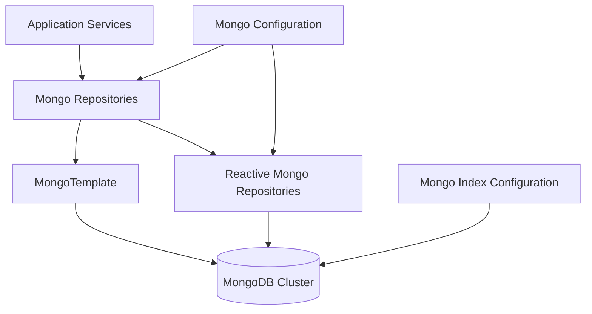
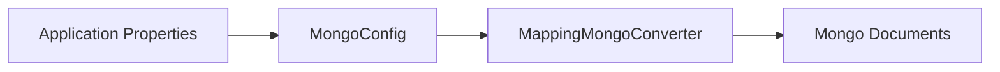
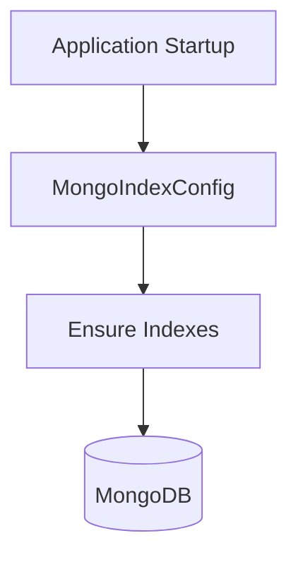
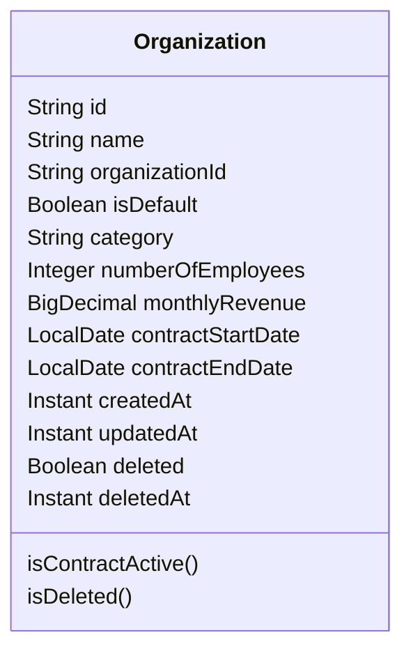
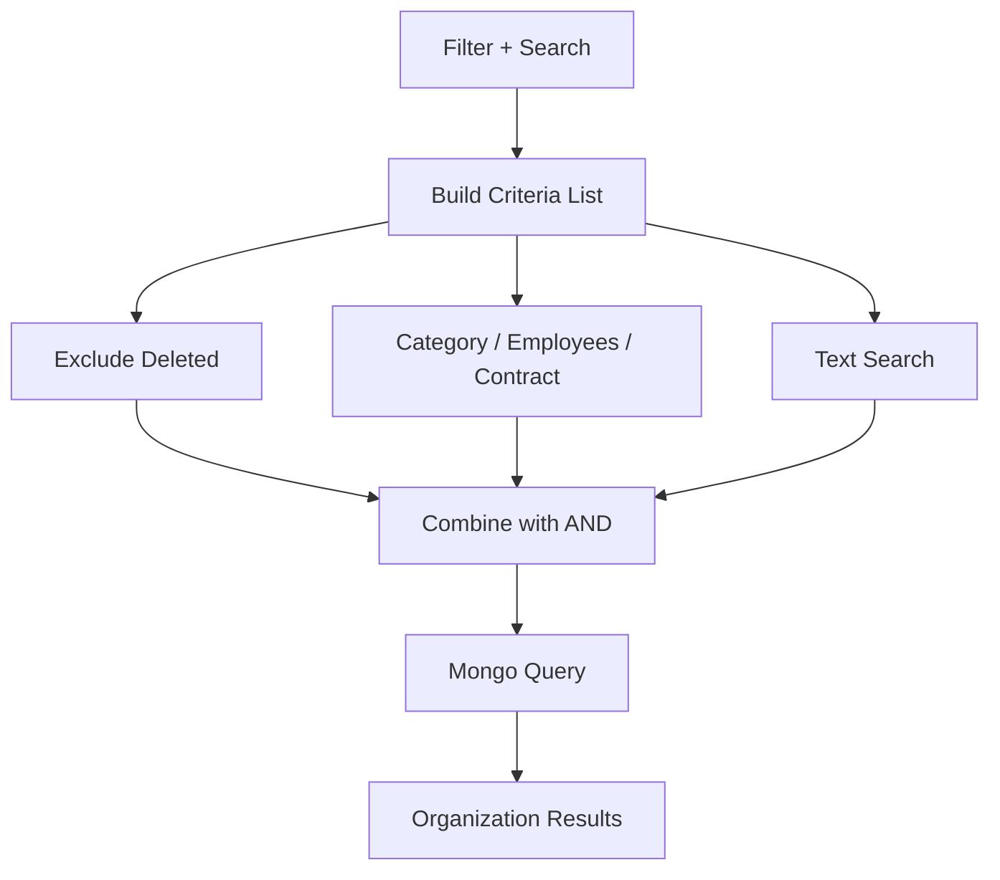

# Mongo

## Overview

The **Mongo** module provides the primary document-oriented persistence layer for the OpenFrame platform. It is responsible for storing, indexing, and querying core domain entities such as organizations, users, OAuth clients, events, devices, and tools using MongoDB. This module is designed to support both **blocking** and **reactive** access patterns and integrates tightly with Spring Data MongoDB.

Mongo acts as the system of record for mutable, operational data that requires flexible schemas, rich querying, and fast iteration across multi-tenant environments.

---

## Responsibilities

The Mongo module is responsible for:

- MongoDB configuration for both imperative and reactive applications
- Automatic auditing of persisted documents
- Centralized MongoDB index management
- Definition of MongoDB document models
- Custom repository implementations for complex queries
- Cursor-based pagination and server-side filtering
- Enforcing soft-delete and multi-tenant query constraints

---

## High-Level Architecture

---

## Configuration Layer

### MongoConfig

The `MongoConfig` class is the entry point for MongoDB integration. It conditionally enables MongoDB support based on runtime environment and application type.

Key characteristics:

- **Conditional activation** via `spring.data.mongodb.enabled=true`
- Enables Spring Data Mongo repositories under the data layer
- Enables Mongo auditing annotations
- Customizes MongoDB mapping behavior

Key customization:

- Replaces dots in map keys with a safe token to avoid MongoDB restrictions
- Applies custom type conversions consistently across documents

### Reactive Mongo Configuration

For reactive web applications, the Mongo module enables reactive repositories automatically. This allows non-blocking access patterns in services such as streaming APIs and high-throughput endpoints.

---

## Index Management

### MongoIndexConfig

The Mongo module centralizes index creation to ensure consistent performance characteristics across environments.

At application startup, the index configuration:

- Ensures compound indexes exist for frequently queried collections
- Avoids manual index management per service
- Keeps query performance predictable at scale

Example strategy:

- Compound indexes on event collections for user and time-based queries
- Tag-based indexes for metadata filtering

---

## Document Model

### Organization

The `Organization` document represents a business entity within a tenant. It is a core domain object used across API, authorization, and management services.

Key features:

- Stored in the `organizations` collection
- Supports soft deletion
- Tracks creation and modification timestamps automatically
- Includes business metadata such as revenue, contract dates, and employee counts

Important fields:

- `organizationId`: Immutable, unique business identifier
- `isDefault`: Marks the default organization for a tenant
- `deleted`: Soft-delete flag used by all queries

Domain logic embedded in the document:

- Contract activity checks based on date range
- Safe handling of soft-deleted entities

---

## Repository Layer

### Custom Organization Repository

The Mongo module uses custom repository implementations where advanced filtering and pagination logic is required.

`CustomOrganizationRepositoryImpl` provides:

- Server-side filtering using MongoDB criteria
- Case-insensitive text search across multiple fields
- Contract state filtering (active vs inactive)
- Cursor-based pagination using MongoDB ObjectId
- Safe sorting with a predefined allowlist of sortable fields

#### Query Construction Flow

#### Cursor Pagination Strategy

- Uses the internal MongoDB `_id` field as a stable cursor
- Supports forward pagination with deterministic ordering
- Applies secondary sorting on `_id` to avoid duplicates

This approach ensures:

- Consistent pagination under concurrent writes
- Efficient queries without large offsets
- Compatibility with GraphQL and REST pagination models

---

## Interaction With Other Layers

The Mongo module underpins multiple higher-level services:

- API services rely on Mongo for CRUD and search operations
- Authorization services persist OAuth clients and tokens in Mongo
- Management services use Mongo for configuration and metadata
- Stream processors enrich events using Mongo-backed reference data

Mongo focuses exclusively on **operational data**, while analytical and time-series workloads are handled by other data stores in the platform.

---

## Design Considerations

- **Soft Deletes by Default**: All queries explicitly exclude soft-deleted documents
- **Index-First Design**: Query patterns are backed by defined indexes
- **Schema Flexibility**: Mongo documents evolve without breaking migrations
- **Multi-Tenant Safety**: Query filters are designed to be tenant-aware
- **Reactive Compatibility**: Supports both blocking and non-blocking access patterns

---

## When to Use Mongo

Mongo is the preferred datastore when:

- The data model evolves frequently
- Queries require flexible filtering and text search
- Strong consistency is required for operational workflows
- Data is tenant-scoped and mutable

For analytics, large-scale aggregations, or time-series reporting, other data stores in the platform are used instead.

---

## Summary

The **Mongo** module is a foundational component of the OpenFrame data layer. It provides a robust, scalable, and flexible persistence mechanism that supports core business entities and workflows across the platform. By combining strong configuration, disciplined indexing, and custom repositories, it enables high-performance access patterns while remaining adaptable to evolving product requirements.
