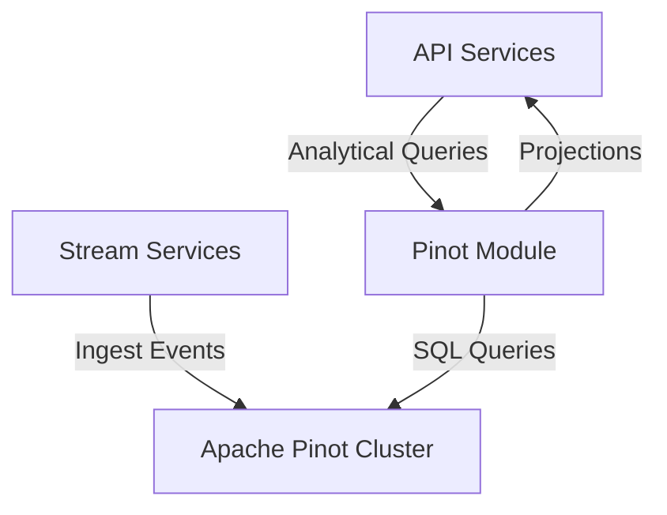
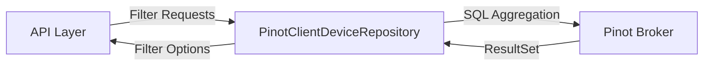
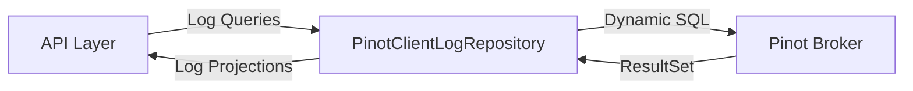
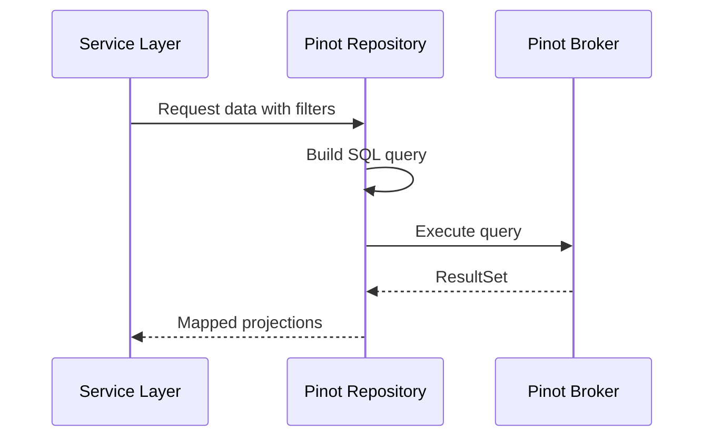

# Pinot

## Overview

Pinot is the analytical query module within the OpenFrame data layer responsible for **high‑performance, low‑latency querying of large‑scale event and device datasets**. It integrates **Apache Pinot** as a real‑time OLAP datastore to support interactive filtering, aggregation, and search use cases across the platform, especially for **devices**, **logs**, and **events**.

Pinot is optimized for:
- Fast, user‑driven filtering (faceted search)
- Time‑range queries over high‑volume event data
- Aggregations used by dashboards and UI filters
- Read‑heavy workloads with predictable query patterns

This module is consumed by API services and external APIs to power user‑facing features such as device inventories, log exploration, and analytics views.

---

## Responsibilities

Pinot provides:

- **Connection management** to Apache Pinot brokers and controllers
- **Repository abstractions** for querying device and log datasets
- **Dynamic query construction** for filtering, sorting, pagination, and search
- **Projection‑based reads** to minimize payload size and improve performance
- **Fault isolation** through Pinot‑specific exception handling

It is intentionally **read‑only** and does not manage data ingestion directly.

---

## Position in the System Architecture

Pinot sits in the **data access layer**, downstream from streaming and ingestion systems and upstream from API services.

---

## Core Components

### PinotConfig

**Purpose**

`PinotConfig` is a Spring configuration class that initializes connections to Apache Pinot.

**Key Responsibilities**
- Reads Pinot connection settings from application configuration
- Creates reusable broker and controller connections
- Exposes connections as Spring beans

**Key Properties**
- `pinot.broker.url`
- `pinot.controller.url`

**Behavior**
- Broker connection is used for query execution
- Controller connection is available for administrative operations

---

### PinotClientDeviceRepository

**Purpose**

Provides analytical queries over the **devices Pinot table**, primarily for building UI filters and counts.

**Key Capabilities**
- Retrieve filter options with counts for:
  - Device status
  - Device type
  - Operating system
  - Organization
  - Tags
- Compute total device counts under complex filter combinations

**Design Highlights**
- Dynamically builds SQL `WHERE` clauses based on provided filters
- Excludes deleted devices by default
- Uses `GROUP BY` aggregations for filter option counts
- Returns results as ordered maps for predictable UI rendering

**Error Handling**
- All execution failures are wrapped in `PinotQueryException`

---

### PinotClientLogRepository

**Purpose**

Provides advanced querying capabilities over the **logs Pinot table**, optimized for log exploration and analytics.

**Key Capabilities**
- Time‑range log retrieval
- Full‑text relevance search
- Cursor‑based pagination
- Server‑side sorting with validation
- Distinct filter option discovery
- Organization option discovery with projections

**Query Features**
- Supports sortable columns with validation
- Enforces a stable primary key for pagination
- Uses projection objects to avoid full entity hydration

**Returned Models**
- Log projections for list views
- Organization options for filters
- Distinct scalar values for UI dropdowns

---

## Query Construction and Execution

Pinot queries are constructed dynamically to balance flexibility with performance.

### Common Query Patterns
- **Date range filtering** using indexed timestamp columns
- **IN‑list filtering** for multi‑select UI controls
- **Cursor‑based pagination** for stable scrolling
- **Aggregation queries** for filter option counts

### Execution Flow

---

## Configuration

Pinot relies on externalized configuration for environment flexibility.

**Required Settings**
- Pinot broker URL
- Pinot controller URL

**Optional Settings**
- Device table name (default: `devices`)
- Log table name (default: `logs`)

These values allow the same codebase to operate across multiple environments and Pinot clusters.

---

## Performance Considerations

- Queries are projection‑based to reduce network and memory overhead
- Aggregations are pushed down to Pinot whenever possible
- Sorting is explicitly validated to prevent expensive or unsafe queries
- Result sets are streamed and mapped row‑by‑row

---

## Error Handling Strategy

- All Pinot execution errors are captured and rethrown as domain‑specific exceptions
- Detailed query logging is enabled at debug level
- Failures are isolated to the data access layer

This ensures upstream services receive consistent error semantics.

---

## Summary

Pinot is a critical analytics component in OpenFrame, enabling fast, scalable, and flexible access to operational data. By encapsulating Apache Pinot access behind focused repositories and configuration, it provides a clean and performant interface for higher‑level services while remaining isolated from ingestion and stream processing concerns.
