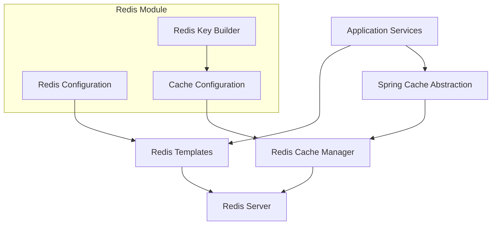
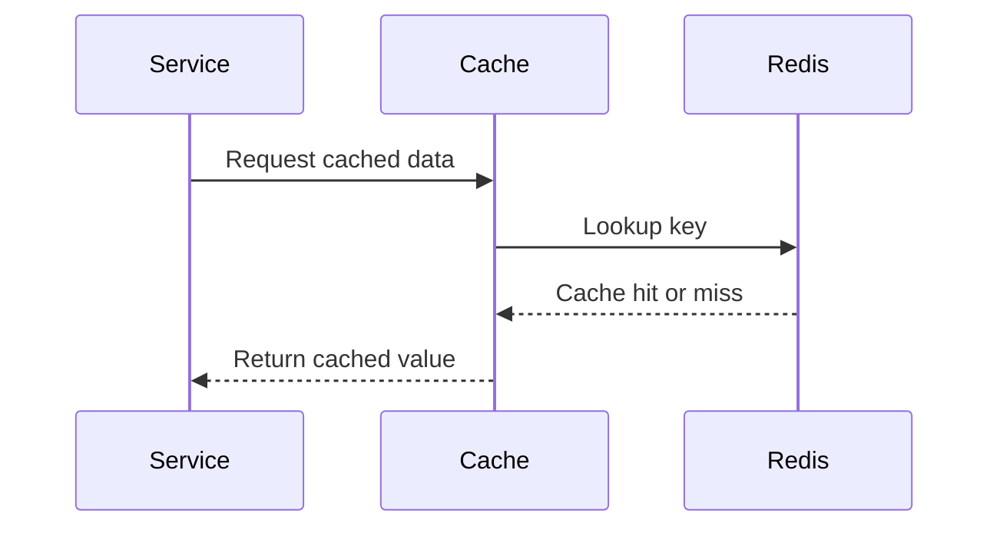

# Redis

## Overview

The Redis module provides a unified, tenant-aware caching and key–value storage layer for the OpenFrame platform. It is built on **Spring Data Redis** and integrates tightly with Spring Cache abstraction, enabling consistent caching behavior across synchronous and reactive services.

Redis in OpenFrame is primarily used for:

- Cross-service caching of frequently accessed data
- Tenant-aware cache isolation
- Reactive and non-reactive Redis access patterns
- Consistent Redis key construction across the platform

The module is conditionally enabled and can be safely excluded from deployments where Redis is not available.

---

## Core Responsibilities

The Redis module is responsible for:

- Configuring Redis connectivity and templates
- Enabling Spring Cache with Redis as the backing store
- Enforcing tenant-aware cache key prefixes
- Providing both blocking and reactive Redis APIs
- Standardizing serialization for Redis keys and values

---

## Architecture Overview

The Redis module sits inside the shared data layer and is consumed by multiple backend services such as API, Gateway, Authorization, Management, and Stream services.



---

## Core Components

### CacheConfig

**Purpose**

CacheConfig enables and configures Spring Cache support backed by Redis. It defines a default `CacheManager` that enforces consistent TTLs, serialization, and tenant-aware key prefixes.

**Key Characteristics**

- Enabled only when Redis is explicitly turned on
- Uses Redis as the Spring Cache backend
- Applies a default TTL of 6 hours
- Disables caching of null values
- Serializes:
  - Keys as strings
  - Values as JSON
- Ensures all cache entries are tenant-scoped

**Tenant-Aware Cache Keys**

Cache keys follow this structure:

```text
<prefix>:<cacheName>::<key>
```

The prefix is generated centrally to guarantee isolation between tenants and environments.

---

### RedisConfig

**Purpose**

RedisConfig defines the low-level Redis beans used throughout the platform. It supports both blocking and reactive programming models.

**Provided Beans**

- `RedisTemplate<String, String>` for synchronous access
- `ReactiveStringRedisTemplate` for reactive string operations
- `ReactiveRedisTemplate<String, String>` for reactive structured access

**Serialization Strategy**

All templates use string-based serialization for:

- Keys
- Values
- Hash keys
- Hash values

This simplifies debugging and ensures interoperability across services.

**Repository Support**

Redis repositories are enabled under a dedicated package, allowing Spring Data repositories to be introduced where needed.

---

### OpenframeRedisKeyConfiguration

**Purpose**

This configuration provides a centralized `OpenframeRedisKeyBuilder`, which is responsible for generating consistent Redis key prefixes.

**Key Responsibilities**

- Loads Redis-related properties
- Builds tenant-aware key prefixes
- Ensures a single key-generation strategy across all services

By enforcing a single key builder, the platform avoids key collisions and maintains predictable Redis structures.

---

## Data Flow Example

The following diagram illustrates a typical cache interaction using Redis in OpenFrame.



---

## Configuration and Enablement

Redis is **disabled by default** and only activated when explicitly configured.

**Activation Condition**

Redis-related beans are created only when:

```text
spring.redis.enabled = true
```

This allows the platform to run in environments without Redis while keeping the same codebase.

---

## Role Within the Data Layer

Within the broader data layer, Redis complements other storage technologies:

- Acts as a fast-access cache in front of persistent stores
- Reduces load on MongoDB, Cassandra, and Pinot
- Improves latency for read-heavy operations
- Supports both synchronous APIs and reactive pipelines

Redis is not used as a system of record, but as an acceleration and coordination layer.

---

## Operational Considerations

- **TTL Management**: Default TTL is applied globally; cache-specific overrides can be added if needed
- **Serialization Stability**: JSON serialization ensures forward compatibility
- **Tenant Isolation**: All cache keys are tenant-prefixed by default
- **Scalability**: Redis can be scaled independently from application services

---

## Summary

The Redis module provides a robust, tenant-safe, and flexible caching foundation for OpenFrame. By standardizing configuration, serialization, and key construction, it enables consistent Redis usage across all services while remaining optional and environment-aware.

This module is a critical performance optimization layer that integrates seamlessly with Spring and the rest of the OpenFrame data ecosystem.
