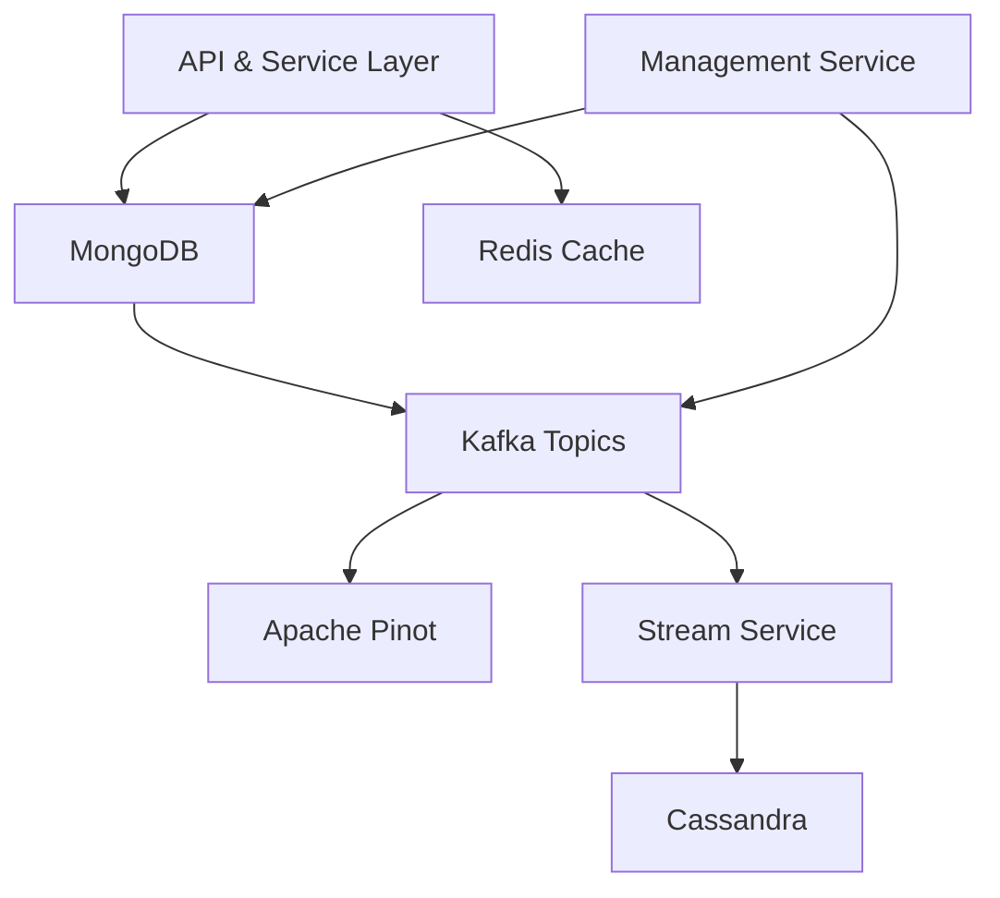

# Data Layer Mongo Redis Kafka Pinot Cassandra

## Overview
The Data Layer Mongo Redis Kafka Pinot Cassandra module provides the unified persistence, caching, streaming, and analytics foundation for the OpenFrame platform. It abstracts multiple storage and messaging technologies behind consistent Spring-based configurations, repositories, and services, enabling other modules to store, query, stream, and analyze data in a tenant-aware and scalable manner.

This module is consumed by API services, stream processors, management services, and authorization components to ensure reliable data access across the stack.

## Technologies Covered
- **MongoDB**: Primary transactional and document storage
- **Redis**: Distributed cache and ephemeral state
- **Kafka**: Event streaming and change propagation
- **Apache Pinot**: Real-time analytics and filtering
- **Cassandra**: High-throughput, scalable persistence for time-series and operational data

## High-Level Architecture

## Responsibilities
- Centralized configuration for all data backends
- Strongly typed domain documents and repositories
- Tenant-aware caching and key strategies
- Event-driven data propagation via Kafka
- Real-time analytics via Pinot
- Scalable persistence with Cassandra

## Sub-Modules

The Data Layer Mongo Redis Kafka Pinot Cassandra module is composed of several focused sub-modules. Each sub-module has its own detailed documentation:

- [Kafka Data Layer](DataLayerMongoRedisKafkaPinotCassandra/Kafka/Kafka.md)
- [Mongo Data Layer](DataLayerMongoRedisKafkaPinotCassandra/Mongo/Mongo.md)
- [Redis Data Layer](DataLayerMongoRedisKafkaPinotCassandra/Redis/Redis.md)
- [Cassandra Data Layer](DataLayerMongoRedisKafkaPinotCassandra/Cassandra/Cassandra.md)
- [Pinot Data Layer](DataLayerMongoRedisKafkaPinotCassandra/Pinot/Pinot.md)

## How It Fits Into the Platform

This module underpins nearly every other backend module:
- **API Service Core** relies on MongoDB repositories and Redis caching
- **Stream Service Core** consumes Kafka events and persists to Cassandra and Pinot
- **Management Service Core** initializes schemas, topics, and analytics tables
- **Authorization Server Core** uses MongoDB for OAuth and tenant data

By centralizing data concerns here, OpenFrame ensures consistency, scalability, and observability across all services.
