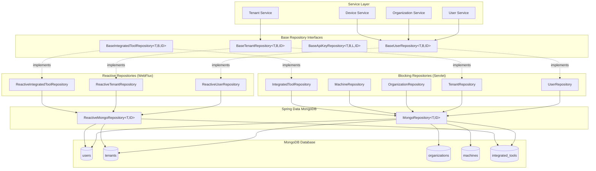
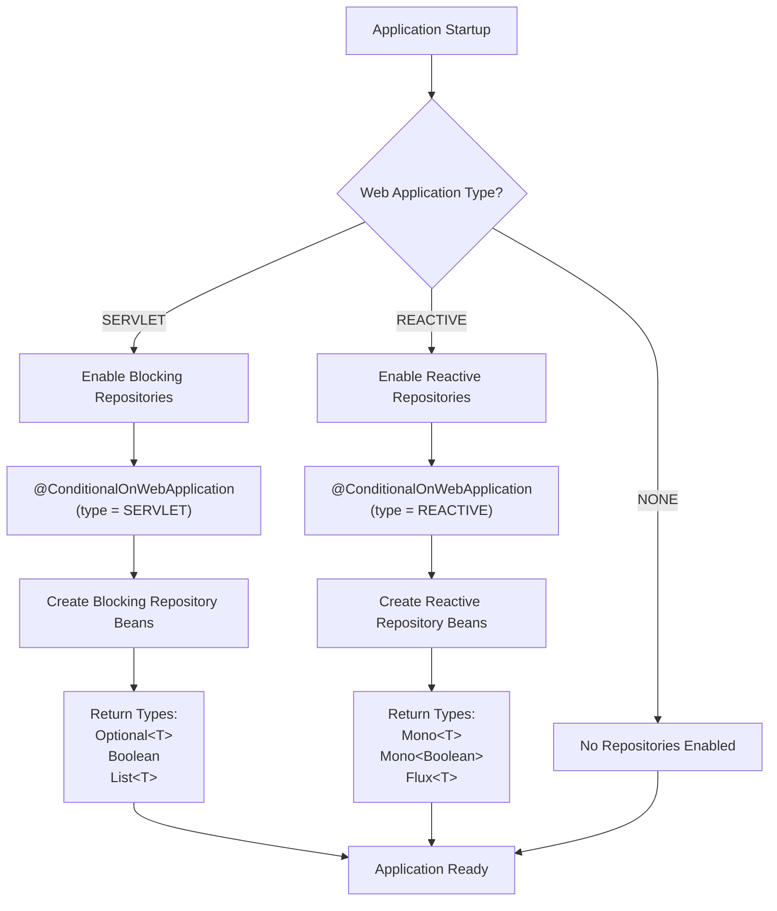
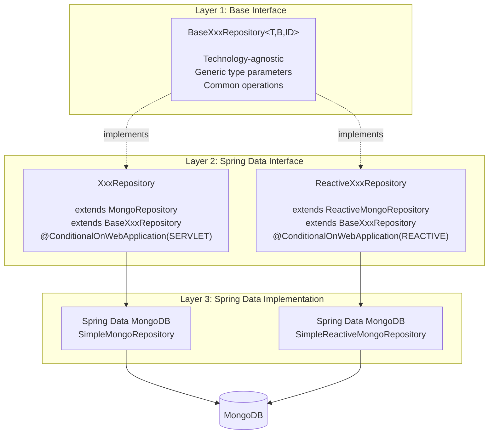
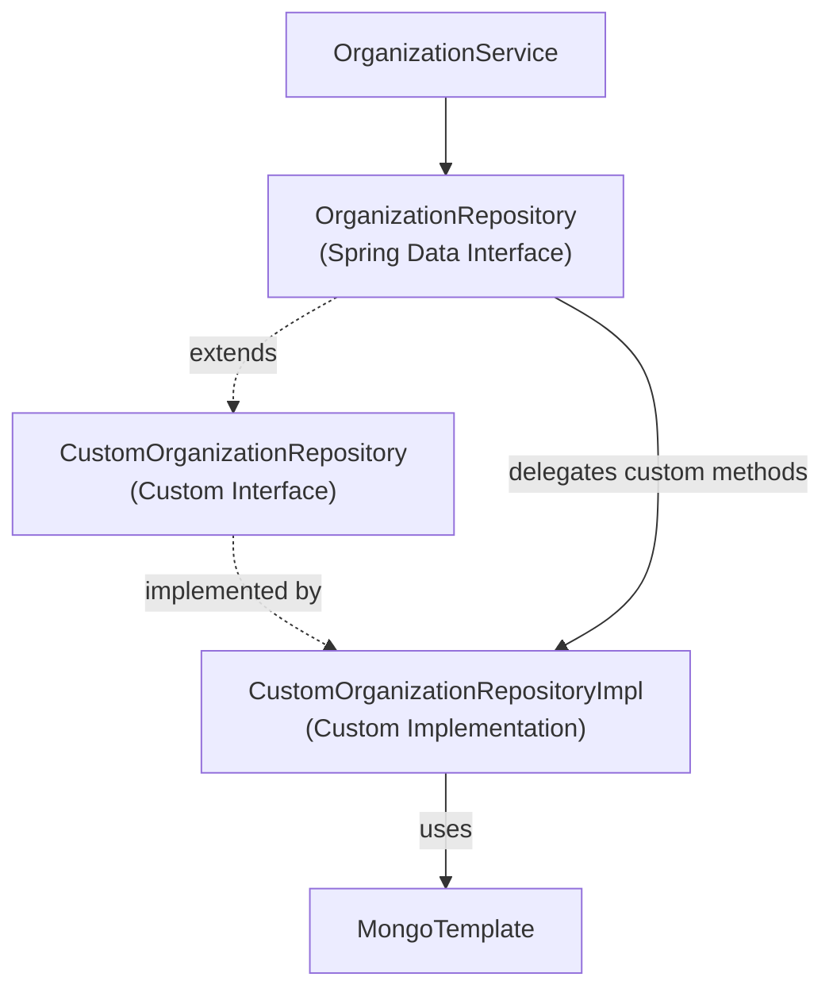
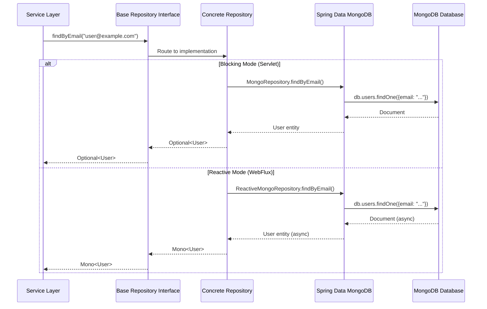
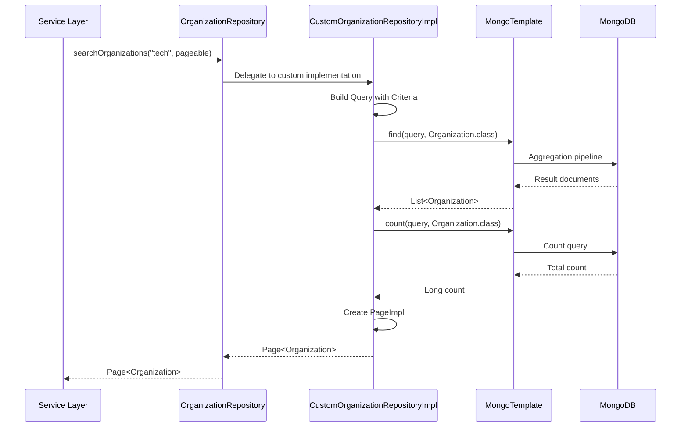
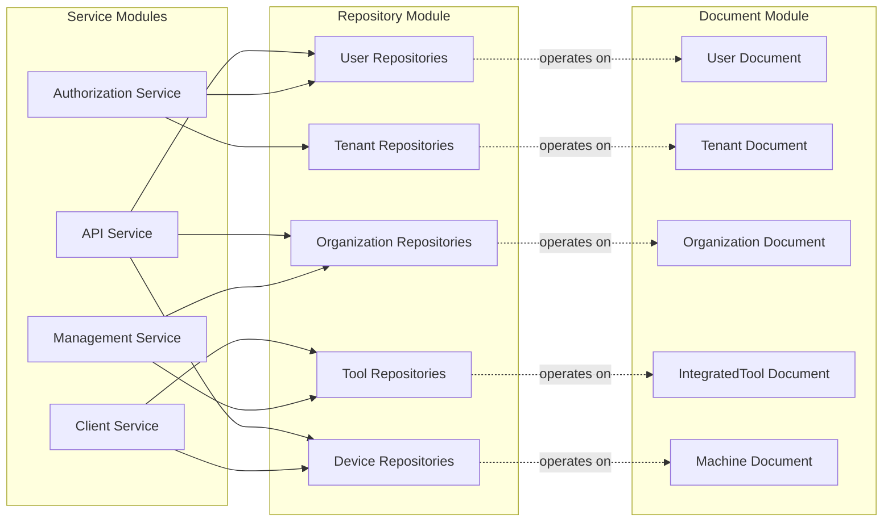

# Data Layer MongoDB Repositories Module

## Overview

The **data_layer_mongo_repositories** module provides a comprehensive repository abstraction layer for MongoDB data access in the OpenFrame platform. It implements a dual-mode architecture supporting both **blocking (servlet-based)** and **reactive (WebFlux-based)** repository patterns through technology-agnostic base interfaces and concrete Spring Data MongoDB implementations.

This module is part of the broader [data_layer_mongo](data_layer_mongo.md) system and works in conjunction with [data_layer_mongo_documents](data_layer_mongo_documents.md) to provide complete MongoDB persistence capabilities.

### Key Features

- **Dual-Mode Support**: Seamless switching between blocking and reactive repositories based on application type
- **Technology-Agnostic Interfaces**: Base repository contracts that abstract away implementation details
- **Type-Safe Generics**: Parameterized interfaces supporting different return types (Optional/Mono, Boolean/Mono<Boolean>)
- **Conditional Activation**: Automatic repository selection based on Spring Boot web application type
- **Domain-Driven Design**: Repositories organized by business domain (user, tenant, organization, device, tool, etc.)
- **Custom Query Support**: Extension points for complex queries beyond Spring Data conventions
- **Multi-Tenant Ready**: Built-in support for tenant-scoped data access patterns

---

## Architecture

### High-Level Repository Architecture



### Repository Type Selection Flow



---

## Core Components

### 1. BaseUserRepository

**Purpose**: Technology-agnostic interface defining common user repository operations.

**Type Parameters**:
- `T`: Return type wrapper (`Optional<User>` for blocking, `Mono<User>` for reactive)
- `B`: Boolean return type (`Boolean` for blocking, `Mono<Boolean>` for reactive)
- `ID`: ID type (String)

**Key Operations**:

```java
public interface BaseUserRepository<T, B, ID> {
    T findByEmail(String email);
    B existsByEmail(String email);
    B existsByEmailAndStatus(String email, UserStatus status);
}
```

**Implementations**:
- **UserRepository** (Blocking): Servlet-based applications
- **ReactiveUserRepository** (Reactive): WebFlux-based applications

**Usage Pattern**:

```java
// Blocking (Servlet)
@Service
public class UserService {
    @Autowired
    private UserRepository userRepository; // Injected as BaseUserRepository
    
    public Optional<User> findUserByEmail(String email) {
        return userRepository.findByEmail(email);
    }
    
    public boolean userExists(String email) {
        return userRepository.existsByEmail(email);
    }
}

// Reactive (WebFlux)
@Service
public class ReactiveUserService {
    @Autowired
    private ReactiveUserRepository userRepository;
    
    public Mono<User> findUserByEmail(String email) {
        return userRepository.findByEmail(email);
    }
    
    public Mono<Boolean> userExists(String email) {
        return userRepository.existsByEmail(email);
    }
}
```

---

### 2. BaseTenantRepository

**Purpose**: Technology-agnostic interface for tenant repository operations supporting multi-tenancy.

**Type Parameters**:
- `T`: Return type wrapper (`Optional<Tenant>` for blocking, `Mono<Tenant>` for reactive)
- `B`: Boolean return type (`Boolean` for blocking, `Mono<Boolean>` for reactive)
- `ID`: ID type (String)

**Key Operations**:

```java
public interface BaseTenantRepository<T, B, ID> {
    T findByDomain(String domain);
    B existsByDomain(String domain);
}
```

**Implementations**:
- **TenantRepository** (Blocking): Extends `MongoRepository<Tenant, String>`
- **ReactiveTenantRepository** (Reactive): Extends `ReactiveMongoRepository<Tenant, String>`

**Domain Resolution Pattern**:

```java
@Service
public class TenantResolutionService {
    @Autowired
    private BaseTenantRepository<?, ?, String> tenantRepository;
    
    public Optional<Tenant> resolveTenantFromDomain(String domain) {
        // Works with both blocking and reactive implementations
        return (Optional<Tenant>) tenantRepository.findByDomain(domain);
    }
}
```

---

## Repository Categories

### User Management Repositories

| Repository | Purpose | Key Methods | Document |
|------------|---------|-------------|----------|
| **UserRepository** | User CRUD operations | `findByEmail()`, `existsByEmailAndStatus()` | [User](data_layer_mongo_documents.md#user) |
| **InvitationRepository** | User invitation management | `findByToken()`, `findByEmailAndStatus()` | Invitation |
| **AuthUserRepository** | Authentication-specific user queries | `findByEmailAndStatus()` | User |

### Tenant & Organization Repositories

| Repository | Purpose | Key Methods | Document |
|------------|---------|-------------|----------|
| **TenantRepository** | Tenant management | `findByDomain()`, `existsByDomain()`, `count()` | [Tenant](data_layer_mongo_documents.md#tenant) |
| **OrganizationRepository** | Organization CRUD | `findByOrganizationId()`, `findByIsDefaultTrue()` | [Organization](data_layer_mongo_documents.md#organization) |
| **CustomOrganizationRepository** | Complex organization queries | Custom aggregations and projections | Organization |

### Device & Machine Repositories

| Repository | Purpose | Key Methods | Document |
|------------|---------|-------------|----------|
| **MachineRepository** | Device/machine management | `findByMachineId()`, `findByType()`, `existsByOrganizationId()` | [Machine](data_layer_mongo_documents.md#machine) |
| **CustomMachineRepository** | Advanced machine queries | Custom search and filtering | Machine |
| **MachineTagRepository** | Machine tagging system | Tag-based queries | MachineTag |

### Tool Integration Repositories

| Repository | Purpose | Key Methods | Document |
|------------|---------|-------------|----------|
| **IntegratedToolRepository** | Tool integration management | `findByType()` | [IntegratedTool](data_layer_mongo_documents.md#integratedtool) |
| **CustomIntegratedToolRepository** | Complex tool queries | Custom tool searches | IntegratedTool |
| **ToolConnectionRepository** | Tool connection tracking | Connection status queries | ToolConnection |
| **IntegratedToolAgentRepository** | Tool agent management | Agent-specific queries | IntegratedToolAgent |

### OAuth & Security Repositories

| Repository | Purpose | Key Methods | Document |
|------------|---------|-------------|----------|
| **OAuthClientRepository** | OAuth client management | `findByClientId()` | OAuthClient |
| **OAuthTokenRepository** | OAuth token storage | `findByAccessToken()`, `findByRefreshToken()` | OAuthToken |
| **MongoOAuth2AuthorizationRepository** | OAuth2 authorization | Spring Security OAuth2 integration | OAuth2Authorization |
| **RegisteredClientMongoRepository** | Registered client management | `findByClientId()` | RegisteredClient |

### API Key Repositories

| Repository | Purpose | Key Methods | Document |
|------------|---------|-------------|----------|
| **ApiKeyRepository** | API key management | `findByIdAndUserId()`, `findByUserId()` | ApiKey |
| **ApiKeyStatsMongoRepository** | API key usage statistics | Stats tracking and aggregation | ApiKeyStats |

### Event & Logging Repositories

| Repository | Purpose | Key Methods | Document |
|------------|---------|-------------|----------|
| **EventRepository** | Event storage | `findByEventType()`, `findByTimestampBetween()` | [CoreEvent](data_layer_mongo_documents.md#coreevent) |
| **CustomEventRepository** | Complex event queries | Custom event aggregations | CoreEvent |
| **ExternalApplicationEventRepository** | External app events | External event tracking | ExternalApplicationEvent |

### Configuration Repositories

| Repository | Purpose | Key Methods | Document |
|------------|---------|-------------|----------|
| **SSOConfigRepository** | SSO configuration | `findByProvider()` | SSOConfig |
| **SSOPerTenantConfigRepository** | Tenant-specific SSO | `findByTenantId()` | SSOPerTenantConfig |
| **TenantKeyRepository** | Tenant cryptographic keys | `findByTenantId()` | TenantKey |
| **OpenFrameClientConfigurationRepository** | Client configuration | Configuration management | ClientConfiguration |

### Agent & Version Repositories

| Repository | Purpose | Key Methods | Document |
|------------|---------|-------------|----------|
| **AgentRegistrationSecretRepository** | Agent registration secrets | `findBySecret()` | AgentRegistrationSecret |
| **InstalledAgentRepository** | Installed agent tracking | `findByMachineId()` | InstalledAgent |
| **ReleaseVersionRepository** | Version management | `findByVersion()`, `findLatest()` | ReleaseVersion |

---

## Repository Pattern Implementation

### Base Interface Pattern

The module uses a three-layer abstraction pattern:



### Generic Type Parameter Strategy

**Problem**: How to support both blocking and reactive return types with a single interface?

**Solution**: Use generic type parameters for return types:

```java
// Base interface with generic return types
public interface BaseUserRepository<T, B, ID> {
    T findByEmail(String email);           // T = Optional<User> or Mono<User>
    B existsByEmail(String email);         // B = Boolean or Mono<Boolean>
}

// Blocking implementation
@Repository
@ConditionalOnWebApplication(type = ConditionalOnWebApplication.Type.SERVLET)
public interface UserRepository 
    extends MongoRepository<User, String>, 
            BaseUserRepository<Optional<User>, Boolean, String> {
    
    @Override
    Optional<User> findByEmail(String email);
    
    @Override
    Boolean existsByEmail(String email);
}

// Reactive implementation
@Repository
@ConditionalOnWebApplication(type = ConditionalOnWebApplication.Type.REACTIVE)
public interface ReactiveUserRepository 
    extends ReactiveMongoRepository<User, String>, 
            BaseUserRepository<Mono<User>, Mono<Boolean>, String> {
    
    @Override
    Mono<User> findByEmail(String email);
    
    @Override
    Mono<Boolean> existsByEmail(String email);
}
```

### Conditional Repository Activation

Repositories are conditionally enabled based on the Spring Boot web application type:

```java
// Blocking repositories - enabled for servlet applications
@Repository
@ConditionalOnWebApplication(type = ConditionalOnWebApplication.Type.SERVLET)
public interface UserRepository extends MongoRepository<User, String> {
    // Blocking operations
}

// Reactive repositories - enabled for reactive applications
@Repository
@ConditionalOnWebApplication(type = ConditionalOnWebApplication.Type.REACTIVE)
public interface ReactiveUserRepository extends ReactiveMongoRepository<User, String> {
    // Reactive operations
}
```

**Configuration in MongoConfig**:

```java
@Configuration
public class MongoConfig {
    
    // Blocking repository configuration
    @Configuration
    @ConditionalOnProperty(name = "spring.data.mongodb.enabled", 
                          havingValue = "true", 
                          matchIfMissing = false)
    @EnableMongoRepositories(basePackages = "com.openframe.data.repository")
    @EnableMongoAuditing
    public static class MongoConfiguration {
        // Blocking repository beans
    }
    
    // Reactive repository configuration
    @Configuration
    @ConditionalOnWebApplication(type = ConditionalOnWebApplication.Type.REACTIVE)
    @EnableReactiveMongoRepositories(basePackages = "com.openframe.data.reactive.repository")
    public static class ReactiveMongoConfiguration {
        // Reactive repository beans
    }
}
```

---

## Custom Repository Extensions

For complex queries beyond Spring Data conventions, the module supports custom repository implementations:

### Custom Repository Pattern



**Example: Custom Organization Repository**

```java
// 1. Define custom interface
public interface CustomOrganizationRepository {
    List<Organization> findActiveOrganizationsWithRevenue(BigDecimal minRevenue);
    Page<Organization> searchOrganizations(String searchTerm, Pageable pageable);
}

// 2. Implement custom logic
@Component
public class CustomOrganizationRepositoryImpl implements CustomOrganizationRepository {
    
    @Autowired
    private MongoTemplate mongoTemplate;
    
    @Override
    public List<Organization> findActiveOrganizationsWithRevenue(BigDecimal minRevenue) {
        Query query = new Query();
        query.addCriteria(Criteria.where("deleted").is(false)
            .and("monthlyRevenue").gte(minRevenue));
        return mongoTemplate.find(query, Organization.class);
    }
    
    @Override
    public Page<Organization> searchOrganizations(String searchTerm, Pageable pageable) {
        Query query = new Query();
        query.addCriteria(new Criteria().orOperator(
            Criteria.where("name").regex(searchTerm, "i"),
            Criteria.where("category").regex(searchTerm, "i")
        ));
        query.with(pageable);
        
        List<Organization> results = mongoTemplate.find(query, Organization.class);
        long count = mongoTemplate.count(query, Organization.class);
        
        return new PageImpl<>(results, pageable, count);
    }
}

// 3. Extend in main repository
@Repository
public interface OrganizationRepository 
    extends MongoRepository<Organization, String>, 
            CustomOrganizationRepository {
    
    // Spring Data methods
    Optional<Organization> findByOrganizationId(String organizationId);
    
    // Custom methods available through extension
}
```

---

## Data Flow Patterns

### Query Execution Flow



### Custom Query Execution Flow



---

## Integration with Other Modules

### Service Layer Integration



**Related Modules**:
- [data_layer_mongo_documents](data_layer_mongo_documents.md) - Document entity definitions
- [data_layer_mongo_configuration](data_layer_mongo_configuration.md) - MongoDB configuration
- [api_service](api_service.md) - Primary consumer of repositories
- [authorization_service](authorization_service.md) - Uses user and tenant repositories
- [management_service](management_service.md) - Uses tool and organization repositories

---

## Repository Usage Examples

### Basic CRUD Operations

```java
@Service
public class UserManagementService {
    
    @Autowired
    private UserRepository userRepository;
    
    // Create
    public User createUser(User user) {
        return userRepository.save(user);
    }
    
    // Read
    public Optional<User> getUserById(String id) {
        return userRepository.findById(id);
    }
    
    public Optional<User> getUserByEmail(String email) {
        return userRepository.findByEmail(email);
    }
    
    // Update
    public User updateUser(User user) {
        return userRepository.save(user);
    }
    
    // Delete
    public void deleteUser(String id) {
        userRepository.deleteById(id);
    }
    
    // Exists check
    public boolean userExists(String email) {
        return userRepository.existsByEmail(email);
    }
    
    // Status check
    public boolean isActiveUser(String email) {
        return userRepository.existsByEmailAndStatus(email, UserStatus.ACTIVE);
    }
}
```

### Reactive Repository Usage

```java
@Service
public class ReactiveUserManagementService {
    
    @Autowired
    private ReactiveUserRepository userRepository;
    
    // Create
    public Mono<User> createUser(User user) {
        return userRepository.save(user);
    }
    
    // Read
    public Mono<User> getUserById(String id) {
        return userRepository.findById(id);
    }
    
    public Mono<User> getUserByEmail(String email) {
        return userRepository.findByEmail(email);
    }
    
    // Update
    public Mono<User> updateUser(User user) {
        return userRepository.save(user);
    }
    
    // Delete
    public Mono<Void> deleteUser(String id) {
        return userRepository.deleteById(id);
    }
    
    // Exists check
    public Mono<Boolean> userExists(String email) {
        return userRepository.existsByEmail(email);
    }
    
    // Status check with reactive composition
    public Mono<Boolean> isActiveUser(String email) {
        return userRepository.existsByEmailAndStatus(email, UserStatus.ACTIVE);
    }
    
    // Reactive pipeline example
    public Mono<User> findOrCreateUser(String email) {
        return userRepository.findByEmail(email)
            .switchIfEmpty(Mono.defer(() -> {
                User newUser = User.builder()
                    .email(email)
                    .status(UserStatus.ACTIVE)
                    .build();
                return userRepository.save(newUser);
            }));
    }
}
```

### Multi-Tenant Query Pattern

```java
@Service
public class TenantAwareOrganizationService {
    
    @Autowired
    private OrganizationRepository organizationRepository;
    
    @Autowired
    private TenantRepository tenantRepository;
    
    public Optional<Organization> getDefaultOrganization(String tenantDomain) {
        // Resolve tenant
        Optional<Tenant> tenant = tenantRepository.findByDomain(tenantDomain);
        
        if (tenant.isEmpty()) {
            return Optional.empty();
        }
        
        // Get default organization for tenant
        return organizationRepository.findByIsDefaultTrue();
    }
    
    public List<Organization> getOrganizationsByIds(Set<String> organizationIds) {
        return organizationRepository.findByOrganizationIdIn(organizationIds);
    }
}
```

### Custom Query with Pagination

```java
@Service
public class OrganizationSearchService {
    
    @Autowired
    private OrganizationRepository organizationRepository;
    
    public Page<Organization> searchOrganizations(
            String searchTerm, 
            int page, 
            int size) {
        
        Pageable pageable = PageRequest.of(page, size, 
            Sort.by("name").ascending());
        
        // Uses custom repository implementation
        return organizationRepository.searchOrganizations(searchTerm, pageable);
    }
    
    public List<Organization> findHighRevenueOrganizations(BigDecimal minRevenue) {
        // Uses custom repository implementation
        return organizationRepository.findActiveOrganizationsWithRevenue(minRevenue);
    }
}
```

### Batch Operations

```java
@Service
public class DeviceBatchService {
    
    @Autowired
    private MachineRepository machineRepository;
    
    public List<Machine> getActiveDevicesByIds(Collection<String> machineIds) {
        return machineRepository.findByMachineIdInAndStatus(
            machineIds, 
            DeviceStatus.ACTIVE
        );
    }
    
    public void updateDeviceStatuses(List<Machine> machines) {
        // Batch save
        machineRepository.saveAll(machines);
    }
    
    public boolean organizationHasDevices(String organizationId) {
        return machineRepository.existsByOrganizationId(organizationId);
    }
}
```

---

## Configuration

### Repository Scanning Configuration

Repositories are automatically discovered through component scanning configured in `MongoConfig`:

```java
@Configuration
public class MongoConfig {
    
    // Blocking repositories
    @EnableMongoRepositories(basePackages = "com.openframe.data.repository")
    public static class MongoConfiguration {
        // Configuration
    }
    
    // Reactive repositories
    @EnableReactiveMongoRepositories(basePackages = "com.openframe.data.reactive.repository")
    public static class ReactiveMongoConfiguration {
        // Configuration
    }
}
```

### Application Properties

```yaml
# Enable MongoDB repositories
spring:
  data:
    mongodb:
      enabled: true
      uri: mongodb://localhost:27017/openframe
      database: openframe
      
# Auditing configuration (for @CreatedDate, @LastModifiedDate)
spring:
  data:
    mongodb:
      auditing:
        enabled: true
```

---

## Best Practices

### 1. Use Base Interfaces for Service Dependencies

✅ **DO**: Depend on base interfaces for flexibility

```java
@Service
public class UserService {
    private final BaseUserRepository<?, ?, String> userRepository;
    
    public UserService(BaseUserRepository<?, ?, String> userRepository) {
        this.userRepository = userRepository;
    }
}
```

❌ **DON'T**: Depend on concrete implementations

```java
@Service
public class UserService {
    private final UserRepository userRepository; // Tightly coupled to blocking
}
```

### 2. Leverage Spring Data Query Methods

✅ **DO**: Use Spring Data naming conventions

```java
public interface UserRepository extends MongoRepository<User, String> {
    Optional<User> findByEmail(String email);
    List<User> findByStatus(UserStatus status);
    boolean existsByEmailAndStatus(String email, UserStatus status);
}
```

❌ **DON'T**: Write custom implementations for simple queries

```java
// Unnecessary custom implementation
public List<User> findActiveUsers() {
    Query query = new Query(Criteria.where("status").is(UserStatus.ACTIVE));
    return mongoTemplate.find(query, User.class);
}
```

### 3. Use Custom Repositories for Complex Queries

✅ **DO**: Implement custom repositories for complex logic

```java
public interface CustomOrganizationRepository {
    Page<Organization> searchWithFilters(OrganizationSearchCriteria criteria, Pageable pageable);
}

@Component
public class CustomOrganizationRepositoryImpl implements CustomOrganizationRepository {
    @Autowired
    private MongoTemplate mongoTemplate;
    
    @Override
    public Page<Organization> searchWithFilters(
            OrganizationSearchCriteria criteria, 
            Pageable pageable) {
        // Complex aggregation logic
    }
}
```

### 4. Handle Optional Results Properly

✅ **DO**: Use Optional API correctly

```java
public User getUserOrThrow(String email) {
    return userRepository.findByEmail(email)
        .orElseThrow(() -> new UserNotFoundException(email));
}

public User getUserOrDefault(String email) {
    return userRepository.findByEmail(email)
        .orElseGet(() -> createDefaultUser(email));
}
```

❌ **DON'T**: Use `get()` without checking

```java
public User getUser(String email) {
    return userRepository.findByEmail(email).get(); // May throw NoSuchElementException
}
```

### 5. Use Reactive Operators for Composition

✅ **DO**: Compose reactive operations

```java
public Mono<UserProfile> getUserProfile(String email) {
    return userRepository.findByEmail(email)
        .flatMap(user -> organizationRepository.findById(user.getOrganizationId())
            .map(org -> new UserProfile(user, org)))
        .switchIfEmpty(Mono.error(new UserNotFoundException(email)));
}
```

### 6. Implement Soft Deletes

✅ **DO**: Use soft delete flags

```java
public interface OrganizationRepository extends MongoRepository<Organization, String> {
    // Find only non-deleted organizations
    List<Organization> findByDeletedFalse();
    
    // Find including deleted
    List<Organization> findAll();
}

@Service
public class OrganizationService {
    public void softDelete(String id) {
        organizationRepository.findById(id).ifPresent(org -> {
            org.setDeleted(true);
            org.setDeletedAt(Instant.now());
            organizationRepository.save(org);
        });
    }
}
```

---

## Testing

### Unit Testing Repositories

```java
@DataMongoTest
@Import(MongoConfig.class)
class UserRepositoryTest {
    
    @Autowired
    private UserRepository userRepository;
    
    @Test
    void testFindByEmail() {
        // Given
        User user = User.builder()
            .email("test@example.com")
            .firstName("Test")
            .lastName("User")
            .status(UserStatus.ACTIVE)
            .build();
        userRepository.save(user);
        
        // When
        Optional<User> found = userRepository.findByEmail("test@example.com");
        
        // Then
        assertThat(found).isPresent();
        assertThat(found.get().getEmail()).isEqualTo("test@example.com");
    }
    
    @Test
    void testExistsByEmailAndStatus() {
        // Given
        User user = User.builder()
            .email("active@example.com")
            .status(UserStatus.ACTIVE)
            .build();
        userRepository.save(user);
        
        // When
        boolean exists = userRepository.existsByEmailAndStatus(
            "active@example.com", 
            UserStatus.ACTIVE
        );
        
        // Then
        assertThat(exists).isTrue();
    }
}
```

### Testing Reactive Repositories

```java
@DataMongoTest
@Import(MongoConfig.ReactiveMongoConfiguration.class)
class ReactiveUserRepositoryTest {
    
    @Autowired
    private ReactiveUserRepository userRepository;
    
    @Test
    void testFindByEmail() {
        // Given
        User user = User.builder()
            .email("test@example.com")
            .firstName("Test")
            .lastName("User")
            .status(UserStatus.ACTIVE)
            .build();
        
        // When
        Mono<User> result = userRepository.save(user)
            .then(userRepository.findByEmail("test@example.com"));
        
        // Then
        StepVerifier.create(result)
            .assertNext(found -> {
                assertThat(found.getEmail()).isEqualTo("test@example.com");
                assertThat(found.getStatus()).isEqualTo(UserStatus.ACTIVE);
            })
            .verifyComplete();
    }
    
    @Test
    void testExistsByEmail() {
        // Given
        User user = User.builder()
            .email("exists@example.com")
            .build();
        
        // When
        Mono<Boolean> result = userRepository.save(user)
            .then(userRepository.existsByEmail("exists@example.com"));
        
        // Then
        StepVerifier.create(result)
            .expectNext(true)
            .verifyComplete();
    }
}
```

### Testing Custom Repositories

```java
@DataMongoTest
@Import({MongoConfig.class, CustomOrganizationRepositoryImpl.class})
class CustomOrganizationRepositoryTest {
    
    @Autowired
    private OrganizationRepository organizationRepository;
    
    @Test
    void testSearchOrganizations() {
        // Given
        Organization org1 = Organization.builder()
            .name("Tech Corp")
            .category("Technology")
            .deleted(false)
            .build();
        Organization org2 = Organization.builder()
            .name("Finance Inc")
            .category("Finance")
            .deleted(false)
            .build();
        organizationRepository.saveAll(Arrays.asList(org1, org2));
        
        // When
        Pageable pageable = PageRequest.of(0, 10);
        Page<Organization> results = organizationRepository.searchOrganizations(
            "tech", 
            pageable
        );
        
        // Then
        assertThat(results.getContent()).hasSize(1);
        assertThat(results.getContent().get(0).getName()).isEqualTo("Tech Corp");
    }
}
```

---

## Performance Considerations

### Indexing Strategy

Ensure proper indexes are defined on frequently queried fields:

```java
@Document(collection = "users")
public class User {
    @Id
    private String id;
    
    @Indexed  // Single field index
    private String email;
    
    @Indexed  // Index for status queries
    private UserStatus status;
    
    // Compound index defined at class level
    @CompoundIndex(name = "email_status_idx", def = "{'email': 1, 'status': 1}")
}
```

### Query Optimization

```java
// ✅ Good: Use projections for large documents
public interface UserRepository extends MongoRepository<User, String> {
    interface EmailProjection {
        String getEmail();
        String getFirstName();
    }
    
    List<EmailProjection> findAllProjectedBy();
}

// ✅ Good: Use pagination for large result sets
Page<Organization> findAll(Pageable pageable);

// ❌ Avoid: Loading all documents without pagination
List<Organization> findAll(); // Can cause memory issues
```

### Batch Operations

```java
// ✅ Good: Batch save
List<User> users = createUsers();
userRepository.saveAll(users);

// ❌ Avoid: Individual saves in loop
for (User user : users) {
    userRepository.save(user); // Multiple database calls
}
```

---

## Troubleshooting

### Common Issues

#### 1. Repository Not Found

**Symptom**: `NoSuchBeanDefinitionException` for repository

**Solution**: Verify repository scanning configuration

```java
@EnableMongoRepositories(basePackages = "com.openframe.data.repository")
```

#### 2. Wrong Repository Type Activated

**Symptom**: Blocking repository activated in reactive application

**Solution**: Check `@ConditionalOnWebApplication` annotations

```java
// Ensure correct type
@ConditionalOnWebApplication(type = ConditionalOnWebApplication.Type.REACTIVE)
```

#### 3. Query Method Not Working

**Symptom**: Query method returns empty results

**Solution**: Verify method naming follows Spring Data conventions

```java
// ✅ Correct
Optional<User> findByEmail(String email);

// ❌ Incorrect
Optional<User> getByEmail(String email); // 'get' is not a valid keyword
```

#### 4. Custom Repository Not Injected

**Symptom**: Custom repository methods not available

**Solution**: Ensure custom implementation follows naming convention

```java
// Interface: CustomOrganizationRepository
// Implementation: CustomOrganizationRepositoryImpl (must end with 'Impl')
```

---

## Security Considerations

### 1. Input Validation

Always validate input before querying:

```java
public Optional<User> findUserByEmail(String email) {
    if (email == null || !EmailValidator.isValid(email)) {
        throw new IllegalArgumentException("Invalid email");
    }
    return userRepository.findByEmail(email);
}
```

### 2. Tenant Isolation

Ensure queries are scoped to the current tenant:

```java
@Service
public class TenantAwareService {
    
    @Autowired
    private TenantContext tenantContext;
    
    @Autowired
    private OrganizationRepository organizationRepository;
    
    public List<Organization> getOrganizations() {
        String tenantId = tenantContext.getCurrentTenantId();
        // Ensure query is tenant-scoped
        return organizationRepository.findByTenantId(tenantId);
    }
}
```

### 3. Sensitive Data Handling

Avoid logging sensitive data from repositories:

```java
// ❌ Don't log sensitive data
log.info("User found: {}", user); // May contain sensitive fields

// ✅ Log only necessary information
log.info("User found with ID: {}", user.getId());
```

---

## Migration Guide

### From Blocking to Reactive

**Step 1**: Update repository dependencies

```java
// Before
@Autowired
private UserRepository userRepository;

// After
@Autowired
private ReactiveUserRepository userRepository;
```

**Step 2**: Update return types

```java
// Before
public Optional<User> getUser(String email) {
    return userRepository.findByEmail(email);
}

// After
public Mono<User> getUser(String email) {
    return userRepository.findByEmail(email);
}
```

**Step 3**: Update service logic

```java
// Before
public User processUser(String email) {
    Optional<User> user = userRepository.findByEmail(email);
    if (user.isPresent()) {
        return updateUser(user.get());
    }
    throw new UserNotFoundException(email);
}

// After
public Mono<User> processUser(String email) {
    return userRepository.findByEmail(email)
        .flatMap(this::updateUser)
        .switchIfEmpty(Mono.error(new UserNotFoundException(email)));
}
```

---

## Summary

The **data_layer_mongo_repositories** module provides a robust, flexible repository abstraction layer that:

- ✅ Supports both blocking and reactive programming models
- ✅ Provides technology-agnostic base interfaces for service layer decoupling
- ✅ Enables conditional repository activation based on application type
- ✅ Supports custom query implementations for complex operations
- ✅ Integrates seamlessly with Spring Data MongoDB
- ✅ Follows domain-driven design principles with organized repository categories
- ✅ Provides comprehensive CRUD operations and specialized queries

This module is essential for data access in the OpenFrame platform, serving as the bridge between the service layer and MongoDB persistence.

---

## Related Documentation

- [Data Layer MongoDB](data_layer_mongo.md) - Parent module overview
- [Data Layer MongoDB Documents](data_layer_mongo_documents.md) - Document entity definitions
- [Data Layer MongoDB Configuration](data_layer_mongo_configuration.md) - MongoDB setup
- [API Service](api_service.md) - Primary repository consumer
- [Authorization Service](authorization_service.md) - Authentication data access
- [Management Service](management_service.md) - Tool and configuration management

---

**For questions or issues, join the OpenMSP Slack community**: https://www.openmsp.ai/
