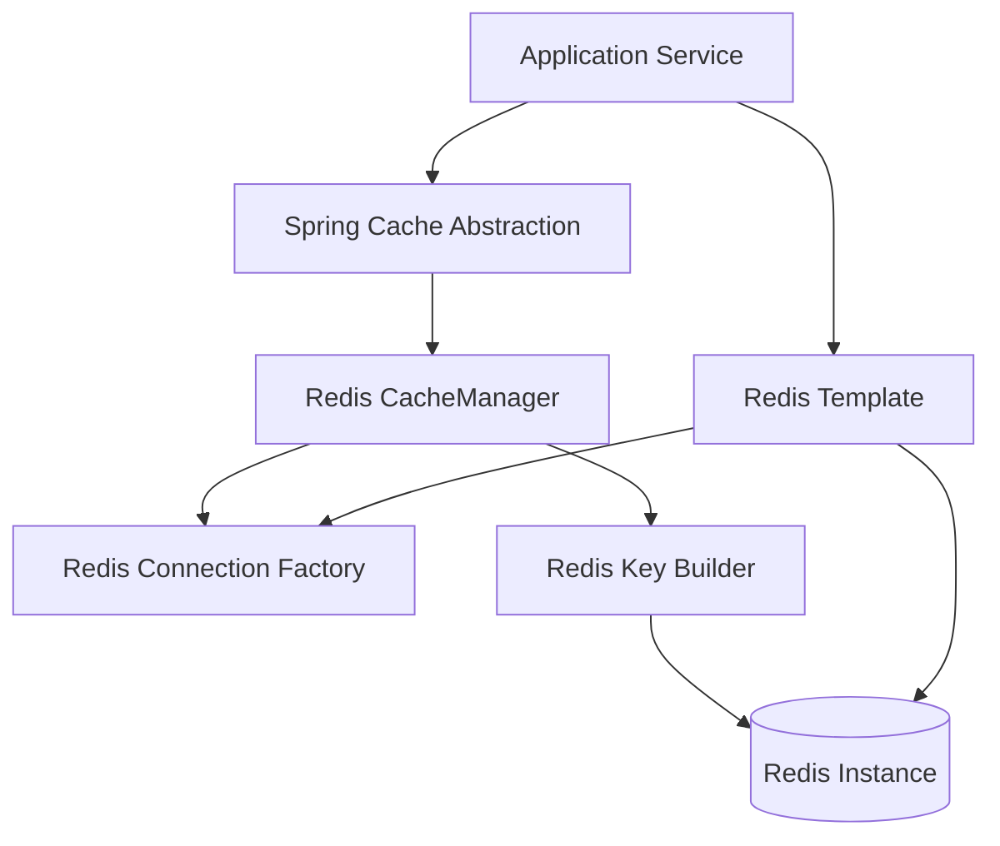
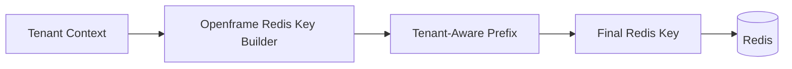

# data_layer_redis

## Overview

The **data_layer_redis** module provides Redis-based infrastructure for the OpenFrame platform. It standardizes how Redis is configured, how cache managers are created, and how Redis keys are generated in a **tenant-aware** and **consistent** manner across all services.

This module is intentionally lightweight and opinionated:

- It does **not** contain business logic
- It exposes **Spring Boot auto-configuration** for Redis and caching
- It ensures **multi-tenant safety** through deterministic Redis key prefixes

The module is consumed by multiple services across the OpenFrame stack (API services, authorization server, gateway, management services) whenever Redis-backed caching or key-value access is required.

---

## Responsibilities

The data_layer_redis module is responsible for:

- Enabling Redis conditionally via configuration
- Providing synchronous and reactive Redis templates
- Configuring Spring Cache abstraction backed by Redis
- Enforcing tenant-aware Redis key construction
- Centralizing Redis key naming conventions

It does **not**:

- Define Redis repositories with domain-specific logic
- Implement cache eviction policies beyond defaults
- Manage Redis lifecycle or clustering

---

## High-Level Architecture



---

## Module Components

### 1. CacheConfig

**Component**  
`deps.openframe-oss-lib.openframe-data-redis.src.main.java.com.openframe.data.config.CacheConfig.CacheConfig`

**Purpose**  
Configures Spring’s `CacheManager` implementation using Redis as the backing store.

**Key Characteristics**

- Enabled only when `spring.redis.enabled=true`
- Activates Spring caching via `@EnableCaching`
- Uses `RedisCacheManager`
- Enforces tenant-aware cache key prefixes
- Applies sensible defaults for cache behavior

**Default Cache Behavior**

- Entry TTL: **6 hours**
- Null values are **not cached**
- Keys are serialized as strings
- Values are serialized as JSON

**Tenant-Aware Cache Keys**

All cache keys are prefixed automatically using the Redis key builder:

```text
<prefix>:<cacheName>::<key>
```

This ensures cache isolation between tenants even when cache names are shared across services.

---

### 2. RedisConfig

**Component**  
`deps.openframe-oss-lib.openframe-data-redis.src.main.java.com.openframe.data.config.RedisConfig.RedisConfig`

**Purpose**  
Provides standard Redis templates for both blocking and reactive access patterns.

**Activation Conditions**

- Enabled only when `spring.redis.enabled=true`
- Automatically skipped when Redis is disabled

**Provided Beans**

| Bean Type | Description |
|---------|-------------|
| `RedisTemplate<String, String>` | Synchronous Redis access |
| `ReactiveStringRedisTemplate` | Reactive string-based access |
| `ReactiveRedisTemplate<String, String>` | Fully reactive Redis access with explicit serializers |

**Serialization Strategy**

- Keys: `StringRedisSerializer`
- Values: `StringRedisSerializer`
- Hash keys and values: `StringRedisSerializer`

This ensures interoperability and predictability across services written in different styles (blocking vs reactive).

---

### 3. OpenframeRedisKeyConfiguration

**Component**  
`deps.openframe-oss-lib.openframe-data-redis.src.main.java.com.openframe.data.redis.OpenframeRedisKeyConfiguration.OpenframeRedisKeyConfiguration`

**Purpose**  
Registers and configures the Redis key builder responsible for consistent key naming.

**Responsibilities**

- Enables Redis-specific configuration properties
- Creates a singleton `OpenframeRedisKeyBuilder`
- Ensures a single source of truth for Redis key formats

The key builder is consumed by:

- Cache configuration (for cache key prefixes)
- Any service that needs deterministic Redis key generation

---

## Redis Key Strategy

A core design goal of this module is **multi-tenant safety**.



**Key Design Principles**

- Every Redis key is tenant-aware by default
- Key formats are centralized and enforced
- Services never construct raw Redis keys manually

This approach prevents:

- Cross-tenant cache leakage
- Key collisions across services
- Inconsistent naming conventions

---

## Interaction With Other Modules

The data_layer_redis module is a **foundational dependency** and is used implicitly by:

- API services that rely on caching
- Authorization services storing temporary state
- Gateway services performing rate-limiting or token caching
- Management and background services needing fast lookups

Rather than duplicating Redis configuration in each service, this module ensures:

- Uniform configuration
- Predictable behavior
- Centralized maintenance

---

## Configuration Expectations

This module expects Redis to be explicitly enabled:

```text
spring.redis.enabled=true
```

If Redis is disabled:

- No Redis beans are created
- No cache manager is registered
- Services fall back to non-cached execution paths

This makes Redis an **optional but strongly recommended** infrastructure component.

---

## Summary

The **data_layer_redis** module provides:

- ✅ Centralized Redis configuration
- ✅ Spring Cache integration backed by Redis
- ✅ Reactive and blocking Redis templates
- ✅ Tenant-safe Redis key management
- ✅ Clean separation from business logic

It acts as the **Redis foundation layer** for the OpenFrame platform, enabling scalable, safe, and consistent caching and key-value access across all services.
