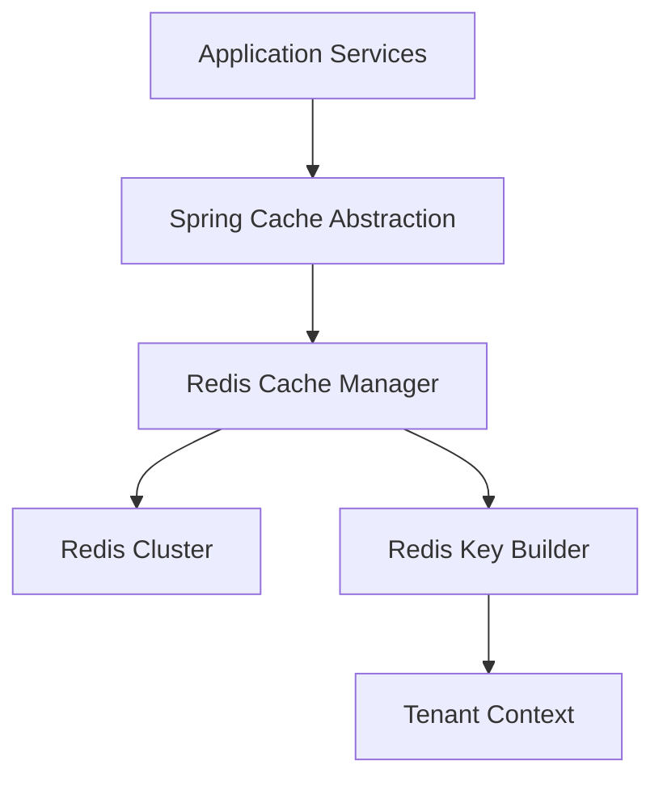
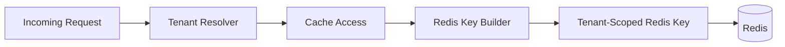

# Data Layer Redis Cache

## Overview

The **Data Layer Redis Cache** module provides Redis-based caching and key management infrastructure for the OpenFrame platform. It integrates Spring Cache abstraction with Redis, enforces tenant-aware cache key generation, and exposes both blocking and reactive Redis templates for use across services.

This module is part of the **data layer** and complements persistent storage (MongoDB, Cassandra, Pinot) by accelerating read-heavy operations such as:

- Frequently accessed domain lookups
- Authorization and configuration metadata
- API and GraphQL resolver caching
- Cross-service shared state with controlled TTLs

The module is **conditionally enabled** and only activates when Redis support is explicitly turned on via configuration.

---

## Responsibilities

The Data Layer Redis Cache module is responsible for:

- Configuring Redis-backed Spring Cache support
- Providing a default `CacheManager` with sensible TTLs and serializers
- Enforcing **tenant-aware cache key prefixes**
- Exposing standard and reactive Redis templates
- Centralizing Redis key construction logic

It does **not** implement business caching logic itself. Instead, it provides the infrastructure used by higher-level modules such as API services, authorization services, and gateway components.

---

## High-Level Architecture



**Key points:**
- All cache access goes through Spring's cache abstraction
- Redis acts as a shared, distributed cache
- Cache keys are always namespaced per tenant

---

## Core Components

### Cache Configuration

**Component:** `CacheConfig`

This configuration enables Spring caching and defines the default `CacheManager` backed by Redis.

**Key behaviors:**

- Enabled only when `spring.redis.enabled=true`
- Sets a **default TTL of 6 hours** for all caches
- Disables caching of `null` values
- Uses string serialization for keys
- Uses JSON serialization for values
- Applies a **tenant-aware prefix** to every cache

**Cache key format:**

```text
<prefix>:<tenantId>:<cacheName>::<cacheKey>
```

This ensures:
- No cross-tenant cache leakage
- Predictable key structure for debugging and observability

---

### Redis Template Configuration

**Component:** `RedisConfig`

This configuration provides both blocking and reactive Redis clients for direct Redis access when Spring Cache is not sufficient.

**Provided beans:**

- `RedisTemplate<String, String>`
- `ReactiveStringRedisTemplate`
- `ReactiveRedisTemplate<String, String>`

**Characteristics:**

- Enabled only when Redis is explicitly configured
- Uses string serializers for keys and values
- Supports reactive, non-blocking data access patterns
- Enables Redis repositories under the data layer

These templates are typically used for:
- Lightweight key-value storage
- Pub/Sub or ephemeral state
- Reactive pipelines in WebFlux-based services

---

### Redis Key Builder Configuration

**Component:** `OpenframeRedisKeyConfiguration`

This configuration registers the central Redis key builder used across the platform.

**Responsibilities:**

- Builds consistent Redis key prefixes
- Incorporates tenant context automatically
- Centralizes key naming conventions

The key builder is injected into caching and Redis-access components to ensure all keys follow the same structure.

---

## Tenant-Aware Caching Model

Multi-tenancy is a core concern of the OpenFrame platform. This module enforces tenant isolation at the cache level.



**Result:**
- The same cache name and key used by different tenants never collide
- Tenant boundaries are preserved even in shared Redis clusters

---

## Configuration and Enablement

The Data Layer Redis Cache module is **opt-in**.

To enable it, Redis must be configured and explicitly activated:

```yaml
spring:
  redis:
    enabled: true
```

If Redis is disabled:
- No Redis beans are created
- No CacheManager is registered
- The platform falls back to non-cached execution paths

This makes Redis optional and safe for development or minimal deployments.

---

## Interaction With Other Modules

The Data Layer Redis Cache module is consumed by multiple layers of the system:

- **API services** use caching for domain lookups and GraphQL resolvers
- **Authorization services** cache keys, tokens, and tenant metadata
- **Gateway services** cache routing and security-related data
- **Management services** use Redis for coordination and transient state

Rather than coupling directly, these modules rely on Spring abstractions and the shared Redis key builder provided here.

---

## Design Considerations

- **Safety by default**: Tenant isolation is enforced automatically
- **Consistency**: Centralized serializers and key structure
- **Flexibility**: Supports both imperative and reactive programming models
- **Operational clarity**: Predictable TTLs and key naming

---

## Summary

The **Data Layer Redis Cache** module provides the foundational Redis infrastructure for OpenFrame:

- Redis-backed Spring Cache integration
- Tenant-aware cache key generation
- Blocking and reactive Redis access
- Conditional activation for flexible deployments

It plays a critical role in improving performance, scalability, and isolation across the platform without leaking business logic into the data layer.